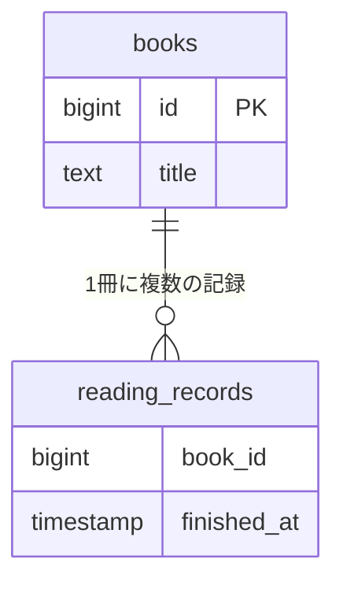
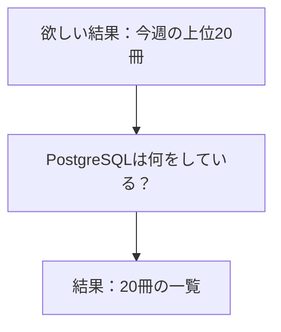

## この章で分かること

読書記録サービスの「今週よく読まれた本」は、20冊を返すまでに約4.6秒かかりました。SQLの意味は読めても、どの処理に時間がかかったかはまだ分かりません。本と読了記録の関係、ランキングの条件、計測した範囲を整理し、改善案を選ぶために何を調べる必要があるかを考えます。この問いを持って、観察の道具と内部の仕組みを学び始めます。

## はじめに：本を探すサイトを作ったら

友だちと、読んだ本を記録するサイトを作ったとします。本を探し、読み終わったら記録を残します。しばらくすると、こんな要望が届きました。

「みんなが今週読んだ本を知りたい！」

それなら、読了記録を本ごとに数えて、多い順に20冊並べればよさそうです。ところが、データを増やして試すと、結果が返るまで数秒待つようになりました。

この本は、その理由を一緒に調べる本です。特別な数学の知識はいりません。まずは少数のカードを並べたり、数えたりするところから始めます。SQLも、出てきた場所で読み方を説明します。

:::message
サービスの場面は架空です。約4.6秒という値は、過去にサンプルデータで測ったSQLの経過時間です。実際のサイトで起きた障害や、画面全体の表示時間ではありません。
:::

## 「本」と「読んだ記録」は違う

たとえば、本の一覧に次の2冊があるとします。

| 本の番号 | 題名 |
| --- | --- |
| 1 | 星の図鑑 |
| 2 | 海の図鑑 |

一方、読了記録には「どの本を、いつ読み終えたか」を書きます。

| 本の番号 | 読み終えた日 |
| --- | --- |
| 1 | 9月14日 |
| 2 | 9月15日 |
| 1 | 9月16日 |

本は2冊ですが、記録は3件です。星の図鑑は2件、海の図鑑は1件あります。この例では、読んだ**人数**ではなく、読了**記録の件数**を数えます。再読を別の記録として残せば、それも1件です。

この関係を図にすると、次のようになります。箱はデータを入れる表、線は「どの本の記録か」という対応を表します。



`books`は本の一覧、`reading_records`は読了記録です。`book_id`を使って、本の番号`id`と対応させます。この実験では外部キー制約は付けませんが、生成する記録の番号は必ず本の一覧に存在するようにします。

## 20冊を返すまで、約4.6秒

同じランキングを、小さいデータと大きいデータで調べた記録があります。

| 比較するもの | 小さいデータ | 大きいデータ |
| --- | ---: | ---: |
| 本 | 1,000冊 | 100万冊 |
| 読了記録 | 2万件 | 2,000万件 |
| 返す本 | 20冊 | 20冊 |
| SQLの経過時間・3回の中央値 | 2.140 ms | 4,553.647 ms |

`ms`はミリ秒です。1,000ミリ秒が1秒なので、右の値は約4.6秒です。

**返すのは同じ20冊。それでも、調べるデータが増えると待ち時間が大きく変わりました。**

ここで一度、予想してみてください。20冊を決めるためには、何件の記録を調べる必要があるでしょう。最初の20件だけでしょうか。それとも、もっと必要でしょうか。

:::details この数値を測った条件
2026年9月21日、Apple M1 Pro・32GiBメモリ、HomebrewのPostgreSQL 18.3で計測しました。本と記録は一時テーブルで、索引は本の主キーだけです。`work_mem=64MB`、並列実行とJITは無効にしました。

大きいデータの対象週には4,999,999件の記録がありました。psqlの`\timing`による3回の経過時間は4,630.241、4,553.647、4,531.875ミリ秒です。キャッシュを空にした測定ではありません。

元のSQLとログはリポジトリの`_drafts/sql-data-structures/experiments/weekly-ranking.sql`および`results/weekly-ranking-*-pg18.3-20260921.txt`にあります。

後続章は通常テーブルを使います。この値を、新しい実験の改善前の数値として直接比較しないでください。同じ環境で改めて測ります。
:::

## SQLには「欲しい結果」を書く

ランキングのSQLは次のとおりです。いまは一文字ずつ覚えなくて大丈夫です。

### このSQLを試すには

環境とデータの準備は[第1章](01-explain-basics)で行います。まだ準備していなければ、ここではSQLを読むだけで進めてください。

準備済みなら、実験用リポジトリ `postgresql-structures-lab` のディレクトリで、**ターミナルに**次のコマンドを入力します。

```bash
docker compose exec db psql -X -U postgres -d reading_map
```

`reading_map=#` と表示されたら、Docker内のPostgreSQLに接続できています。**ここからはpsqlに**、次の`SELECT`から`LIMIT 20;`までを入力してください。最後の`;`まで入力すると実行されます。`reading_map=#`自体は入力しません。

第1章の小さなデータでも試せますが、先ほどの約4.6秒を測ったデータ量とは異なります。

```sql
SELECT b.id, b.title, count(*) AS read_count
FROM books AS b
JOIN reading_records AS r ON r.book_id = b.id
WHERE r.finished_at >= timestamp '2026-09-14'
  AND r.finished_at < timestamp '2026-09-21'
GROUP BY b.id, b.title
ORDER BY read_count DESC, b.id ASC
LIMIT 20;
```

第1章で用意する本1,000冊・読了記録2万件のデータで実行すると、次の20行が返ってきます。

```text
 id |     title     | read_count
----+---------------+------------
  4 | 実験用の本 4  |          6
  8 | 実験用の本 8  |          6
 12 | 実験用の本 12 |          6
 15 | 実験用の本 15 |          6
 19 | 実験用の本 19 |          6
 23 | 実験用の本 23 |          6
 27 | 実験用の本 27 |          6
 30 | 実験用の本 30 |          6
 34 | 実験用の本 34 |          6
 38 | 実験用の本 38 |          6
 41 | 実験用の本 41 |          6
 42 | 実験用の本 42 |          6
 45 | 実験用の本 45 |          6
 49 | 実験用の本 49 |          6
 53 | 実験用の本 53 |          6
 64 | 実験用の本 64 |          6
 68 | 実験用の本 68 |          6
 91 | 実験用の本 91 |          6
 95 | 実験用の本 95 |          6
 99 | 実験用の本 99 |          6
(20 rows)
```

`read_count`は、指定した週の読了記録の件数です。今回は表示された20冊がすべて6件なので、同数のときの指定である`b.id ASC`に従って、本の番号が小さい順に並んでいます。

この表から、どの20冊が選ばれたかは分かります。でも、その20冊を選ぶために何件調べたのかは、まだ分かりません。

psqlを終了してターミナルに戻るときは、`\q`を入力します。

言葉にすると、次の依頼です。

1. 9月14日0時以上、9月21日0時未満の記録を対象にする。
2. 同じ本の記録を数え、題名と一緒に返す。
3. 件数の多い順に並べ、同数なら本の番号が小さい順にする。
4. 上位20冊を返す。

対象週を固定したのは、いつ試しても同じデータを調べるためです。これはSQLが要求する結果の説明で、DB内部が必ずこの順番で処理するという意味ではありません。

## 案は出る。でも、選ぶ根拠がない

「20冊を10冊に減らせば？」

「インデックスという目録を作ると速いらしいよ」

「前もって数えておけば、表示は速そう」

どれも試す価値はありそうです。ただし、返す冊数を減らしても、数える記録が減るとは限りません。前もって数えるなら、新しい記録をいつ反映するかも決める必要があります。

ネットやAIに聞くと改善案は手に入ります。では、その案がこのサービスに合うと、どう確かめればよいでしょうか。

次の図では、SQLを受け取ってから結果を返すまでの処理を一つの箱にまとめています。後の章で、この処理を詳しく調べます。



`EXPLAIN`を使うと、PostgreSQLが選んだ処理手順を確認できます。その出力と実験結果を比べながら、検索、メモリの使い方、並べ替え、集計の仕組みを学びます。

## この本での学び方

最初は、図のカードを自分で動かすつもりで予想してください。次にSQLを試し、予想と違ったところを探します。最後に条件を一つ変え、同じ考えが通用するか確かめます。

予想と結果が違ったら、どの前提が違っていたのかを調べます。条件を変えて試すことで、説明できる範囲を少しずつ広げられます。

**この時点の自分なら、ランキングの何を直したいか。** 一つ書き残して、第1章へ進みましょう。最後の章で、根拠とともに選び直します。
