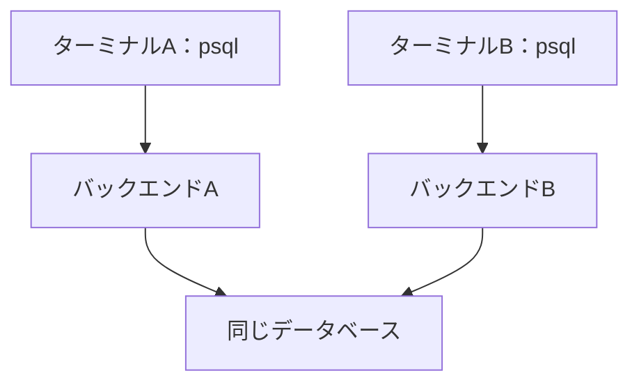
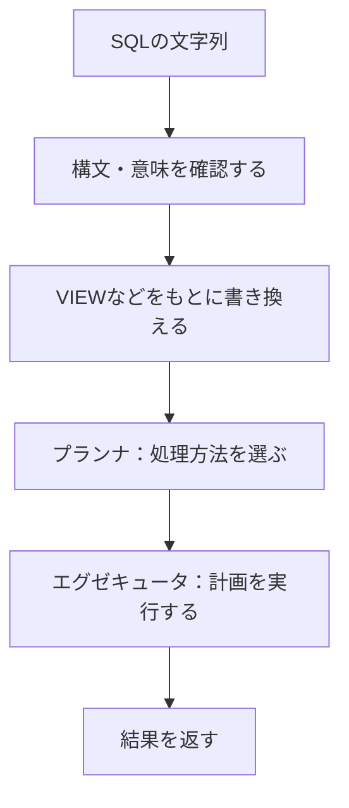
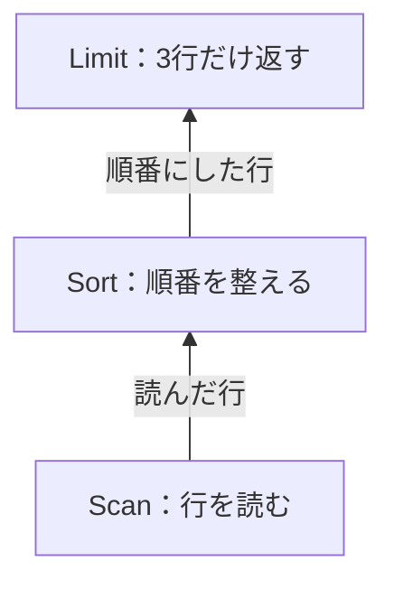
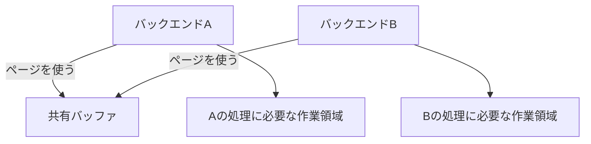

## この章で分かること

SQLはクライアントから送られ、接続を担当するバックエンドで解析・計画・実行へ進みます。二つの接続とPIDを観察して処理の担当を確かめ、実行計画の木が行を返す様子を小さな模型で追います。プロセスごとの仕事と共有する領域を区別し、メモリやファイルをどこに位置付ければよいかを理解します。

## はじめに：SQLは誰に届く？

psqlにSQLを入力すると、結果が返ってきます。でも、psql自身が本の表を探しているわけではありません。

psqlは、入力されたSQLをPostgreSQLのサーバへ送ります。SQLを受け取ってデータを処理するのはサーバ側です。この関係で、要求を送る側を**クライアント**と呼びます。Webサイトでは、サイトのプログラムがDBのクライアントになります。

前章と同じpsqlで、次を実行してください。

```sql
SELECT pg_backend_pid();
```

```text
 pg_backend_pid
----------------
            952
(1 row)
```

この実行例では`952`でした。以降、この接続を「接続A」と呼びます。PIDは接続するたびに変わることがあるので、同じ番号が出なくても問題ありません。

表示される整数は、接続を処理しているプロセスの番号です。**プロセスとは、実行中のプログラムをOSが管理する単位**です。同じプログラムから複数のプロセスが動くこともあり、OSはそれぞれを番号で識別します。

## 二つの接続を開く

別のターミナルを開き、もう一度接続します。

```bash
docker compose exec db psql -X -U postgres -d reading_map
```

こちらを「接続B」とします。接続Aは開いたままにして、接続Bのpsqlで同じSQLを実行してください。

```sql
SELECT pg_backend_pid();
```

```text
 pg_backend_pid
----------------
          22521
(1 row)
```

接続Aは`952`、接続Bは`22521`でした。同じコマンドで同じDBに接続していますが、SQLを処理するプロセスの番号は別になっています。

通常の接続では、接続ごとにSQLを処理するプロセスが作られます。これを**バックエンドプロセス**と呼びます。



二つのバックエンドプロセスが、同じDBに接続しています。接続を増やしても、DBの複製は作られません。[公式のアーキテクチャ解説](https://www.postgresql.org/docs/18/tutorial-arch.html)でも、この接続とプロセスの関係が説明されています。

接続中のバックエンドの状態も確認できます。接続Aでは何も実行せずに待ち、接続Bで次のSQLを実行します。

```sql
SELECT pid, state, query
FROM pg_stat_activity
WHERE datname = current_database();
```

```text
  pid  | state  |                query
-------+--------+-------------------------------------
 22521 | active | SELECT pid, state, query           +
       |        | FROM pg_stat_activity              +
       |        | WHERE datname = current_database();
   952 | idle   | SELECT pg_backend_pid();
(2 rows)
```

さっき確認した二つの番号が並びました。`22521`は、いまこの一覧を調べている接続Bです。SQLを実行中なので`active`になっています。一方、接続Aの`952`は、次の命令を待っているので`idle`です。接続が切れたわけではありません。

接続Aの`query`に`SELECT pg_backend_pid();`が残っているのは、それが最後に実行したSQLだからです。このSQLをずっと実行し続けている、という意味ではありません。接続Bの出力にある`+`は、SQLの文字列が次の行へ続くことを示すpsqlの表示です。

ほかにも接続していれば、表示される行は増えます。また、このSQLでは表示順を指定していないため、自分の結果ではPIDを見て接続を対応させてください。

`pid`が番号、`state`が状態、`query`が現在または直近のSQLです。見える情報は権限によって変わります。本の実験用ユーザーでは一覧を観察できます。

## 文字列が手順になるまで

SQLは、最初は文字の列です。その文字をいきなり実行するのではなく、意味を確認し、結果を作る手順にします。

次の矢印は、SQLを処理する段階の順序です。



文法を確認する段階では、括弧や単語の並びを調べます。意味を確認する段階では、指定された表や列が存在するかなどを調べます。

プランナは、索引を使う方法や表を順に読む方法を比較し、実行計画を作る処理です。一方、エグゼキュータは、その計画に従って行を読み、条件を判定し、結果を返す処理です。

第1章の`Planning Time`は計画作成、`Execution Time`は実行の観察につながります。ただし、この二つを足せば画面の待ち時間を全部説明できるわけではありません。通信や結果の表示にも時間がかかります。

## 計画の木を動かしてみよう

次のSQLを、まず実行せずに観察します。

```sql
EXPLAIN
SELECT id, title FROM books ORDER BY title LIMIT 3;
```

```text
                              QUERY PLAN
----------------------------------------------------------------------
 Limit  (cost=30.92..30.93 rows=3 width=27)
   ->  Sort  (cost=30.92..33.42 rows=1000 width=27)
         Sort Key: title
         ->  Seq Scan on books  (cost=0.00..18.00 rows=1000 width=27)
(4 rows)
```

本1,000冊、題名用の索引がない状態での出力です。下から見ると、`Seq Scan`で表を読み、`Sort`で題名順に並べ、`Limit`で3行に絞る計画になっています。`Sort Key: title`は、並べ替えに使う列が`title`だという意味です。

`Seq Scan`の見積もりは`rows=1000`、`Limit`は`rows=3`です。返す予定は3行でも、読む予定の行は1,000行あります。今回は`EXPLAIN`だけなので、ここに実際の行数や実行時間は表示されていません。

行が上へ渡る向きを、矢印で表すとこうなります。



一方、行を要求する向きは逆です。LimitはSortから次の行を取得し、Sortはその下の処理から必要な行を取得します。

Limitが3行だけ返す場合でも、Sortが調べる行は3行とは限りません。小さい順に3個選ぶなら、まだ読んでいない場所にもっと小さい値があるかもしれません。詳しくは第7・8章で確かめます。

## プロセス間で共有するメモリと、処理ごとの作業領域

複数のプロセスが同じデータを読む場合、そのデータをメモリ上で共有できれば、プロセスごとに読み込み直す必要を減らせます。一方、並べ替えの途中結果など、個々の処理で使う領域も必要です。

PostgreSQLでは、表などのページを共有する場所の一つが**共有バッファ**です。ソートやハッシュの処理では、別に作業用のメモリも使います。



これは役割を分けた模型です。実際には並列ワーカーが手伝う計画や、共有する作業領域もあります。「一つのSQLは、いつでも一つのプロセスだけで処理する」とまでは覚えないでください。

接続を処理するほかに、ページの書き出しやデータの保守を行うプロセスも動いています。checkpointer、WAL writer、autovacuumなどの役割は、第11章で更新処理と合わせて説明します。

## 自分の言葉で説明する

二つのpsql接続は、別の担当プロセスを持ちながら、同じ表を使っています。「接続が別」と「データが別」は違います。

二つの接続で同じ本を読む図を紙に描いてください。クライアント、バックエンド、共有バッファを置けたら十分です。

次章では、共有バッファに読み込む**ページ**とは何かを説明します。表の行と、ファイル上の保存場所を対応させてみましょう。
