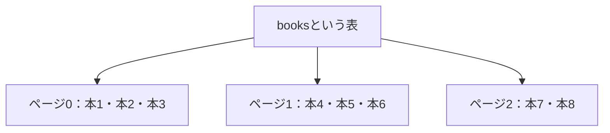
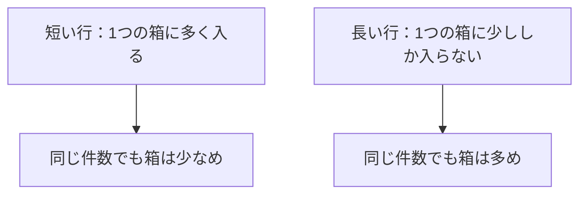
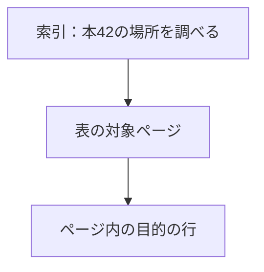

## この章で分かること

SQLの表は、物理的にはファイルやページに保存されています。表のサイズや行の位置を観察し、行数・ページ数・バイト数を別々の量として捉えます。索引から表を参照する関係や、長い値を保存する仕組みの入口にも触れます。同じ件数でも読み込み量が違う理由を説明するための土台を作る章です。

## はじめに：1冊は、1個のファイル？

本の一覧に1,000冊あるとき、コンピュータの中には1,000個の小さなファイルがあるのでしょうか。

まずは、前章で使ったDBのpsqlで調べてみます。ここからの出力は、本1,000冊を入れた実験環境での例です。

### 表の保存先を調べる

```sql
SELECT pg_relation_filepath('books');
```

```text
 pg_relation_filepath
----------------------
 base/16384/16385
(1 row)
```

`books`という表名に対して、`base/16384/16385`というパスが返ってきました。これはPostgreSQLのデータディレクトリを基準にした相対パスです。今回ならDocker内のDBサーバ側の場所で、手元のパソコンに同じパスがあるという意味ではありません。

パスに含まれる番号は環境によって異なります。ここでは、SQLで扱っている表に、実際の保存先があることを確認してください。

### 表の大きさを調べる

```sql
SELECT pg_size_pretty(pg_relation_size('books')) AS table_size,
       pg_size_pretty(pg_total_relation_size('books')) AS total_size;
```

```text
 table_size | total_size
------------+------------
 64 kB      | 136 kB
(1 row)
```

同じ`books`を調べていますが、二つの値は違います。

- `table_size`の64 kB：`pg_relation_size`で調べた、表本体の主な格納領域の大きさ。
- `total_size`の136 kB：`pg_total_relation_size`で調べた、索引や補助的な領域、TOASTがあればそれも含めた全体の大きさ。

`pg_size_pretty`は、バイト数をkBなどの読みやすい単位にして表示する関数です。差の72 kBがすべて索引というわけではありません。二つの関数では、数えている領域が違います。

### 1ページの大きさを調べる

```sql
SHOW block_size;
```

```text
 block_size
------------
 8192
```

`block_size`は1ページの大きさで、単位はバイトです。この環境では8,192バイト、つまり8 kBでした。先ほどの表本体は64 kBなので、**64 ÷ 8 = 8ページ**分の大きさです。ここでのkBは1,024バイトとして計算します。

本は1,000冊ありますが、表本体の大きさは8ページ分です。1冊につき1ページという保存の仕方ではなさそうですね。なお、これは保存領域の大きさから求めたページ数で、SQLが実行時にページへアクセスした回数ではありません。

## 行を、ページという箱に入れる

表のデータは、ページという一定の大きさの領域に分けて保存されます。行を読むときも、その行を含むページが読み込みの単位になります。

ここでは説明のため、1ページに3行入る小さな模型を使います。実際に何行入るかは、行の大きさなどで変わります。



本5を読みたいなら、その本が入ったページ1が必要です。同じページに本4と本6も入っているので、「欲しいのは1行」と「扱うデータの単位」は一致しません。

実際のページには、行そのもののほか、行の位置を管理する情報や空き領域もあります。ページを机の引き出しにたとえるなら、中身だけでなく、どこに何を入れたかという仕切りの情報も必要です。

## 行の場所を見てみる

各行の場所の手掛かりとして、`ctid`を表示できます。

```sql
SELECT id, ctid, title
FROM books ORDER BY id LIMIT 8;
```

```text
 id | ctid  |    title
----+-------+--------------
  1 | (0,1) | 実験用の本 1
  2 | (0,2) | 実験用の本 2
  3 | (0,3) | 実験用の本 3
  4 | (0,4) | 実験用の本 4
  5 | (0,5) | 実験用の本 5
  6 | (0,6) | 実験用の本 6
  7 | (0,7) | 実験用の本 7
  8 | (0,8) | 実験用の本 8
(8 rows)
```


`ctid`は`(0,1)`のような形です。左はページの番号、右はページ内の行を指す項目の番号です。「0ページ目の1番の項目」と読めます。

今回の8行は、左側がすべて`0`です。つまり、本1から本8までが同じページに入っています。右側は`1`から`8`まで変わるので、同じページの中でも、それぞれ別の位置を指していると分かります。

先ほどの図は「1ページに3行」という模型でしたが、この出力では少なくとも8行が同じページに入っています。`LIMIT 8`で先頭の8行だけを表示しているため、ページ0に全部で何行入っているかは、この結果だけでは分かりません。

ただし、これは本の番号`id`とは別物です。

| 値 | 何に答える？ | 更新でどうなる？ |
| --- | --- | --- |
| `id` | どの本か | 本の識別に使う |
| `ctid` | この行バージョンはどこか | 更新などで変わりうる |

本を識別する値と、行が保存されている位置を区別します。アプリで本を指定するときは、`ctid`ではなく主キーを使います。更新した行の話は第11章で戻ってきます。

## 1,000行なら、大きさも同じ？

次は小さな実験専用の表を作ります。トランザクションという「ひとまとまりの作業」の中で試し、最後に取り消します。

`repeat('a', 10)`は、aを10回並べた文字です。今回は10文字の行と200文字の行を、それぞれ1,000行作ります。実行する前に、必要なページ数がどちらで多くなるか予想してください。

```sql
BEGIN;
CREATE TABLE size_short AS
SELECT n AS id, repeat('a', 10) AS note
FROM generate_series(1, 1000) AS n;
CREATE TABLE size_long AS
SELECT n AS id, repeat('a', 200) AS note
FROM generate_series(1, 1000) AS n;
SELECT pg_relation_size('size_short') AS short_bytes,
       pg_relation_size('size_long') AS long_bytes;
ROLLBACK;
```

今回の実行結果です。

```text
BEGIN
SELECT 1000
SELECT 1000
 short_bytes | long_bytes
-------------+------------
       65536 |     262144
(1 row)

ROLLBACK
```

二つの`SELECT 1000`は、それぞれの`CREATE TABLE ... AS SELECT`で1,000行の表を作ったことを表すメッセージです。続く表には、作った表本体の大きさがバイト数で表示されています。

先ほど確認した1ページ8,192バイトで割ってみます。

| 表 | 文字列の長さ | 行数 | 表本体の大きさ | ページ数 |
| --- | ---: | ---: | ---: | ---: |
| `size_short` | 10文字 | 1,000行 | 65,536バイト | 8ページ |
| `size_long` | 200文字 | 1,000行 | 262,144バイト | 32ページ |

**同じ1,000行でも、今回は必要なページ数が4倍になりました。** 長い行は1ページに入る数が少なくなるので、より多くのページが必要です。行には文字列以外の列や管理情報もあるため、文字数の比率がそのままページ数の比率になるわけではありません。

最後の`ROLLBACK`で、この実験中の表の作成も取り消しています。`size_short`と`size_long`は残らず、元の`books`にも変更は加えていません。

この違いを模型で表すと、次のようになります。



実験で見るべきなのは、特定のバイト数への一致ではありません。**件数をそろえても、保存する量は同じとは限らない**という関係です。

さらに長い値では、圧縮したり、別の保存領域へ置いたりすることがあります。長い値の圧縮や別領域への保存を行う仕組みを、TOASTと呼びます。そのため、文字を10倍にしたら表本体のサイズも必ず10倍、とは予想できません。[物理ストレージの公式解説](https://www.postgresql.org/docs/18/storage.html)から詳しくたどれます。

## 索引は、本体とは別の目録

第1章で見た索引も、保存領域を持ちます。番号と行の場所を結び付ける目録だと考えてください。



索引が本の全文をいつも抱えているわけではありません。何を索引に持たせるかによって、表を読む必要も変わります。まずは「索引と表は別」「行の読み込みにもページが関わる」の二つを押さえましょう。

## 確かめる問い

100万行の表が二つあります。一方は番号だけ、もう一方は長い紹介文も持っています。両方の全件読み込みに、同じ量のデータを読むと決めてよいでしょうか。

:::details 考え方
行数が同じでも、行の大きさや保存方法が違えばページ数が違います。まず実際のサイズを確かめます。件数だけから読み込み量を決めません。
:::

次章では、このページを使うとき、毎回ストレージまで取りに行く必要があるのかを調べます。
