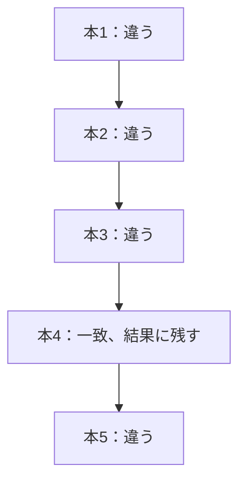
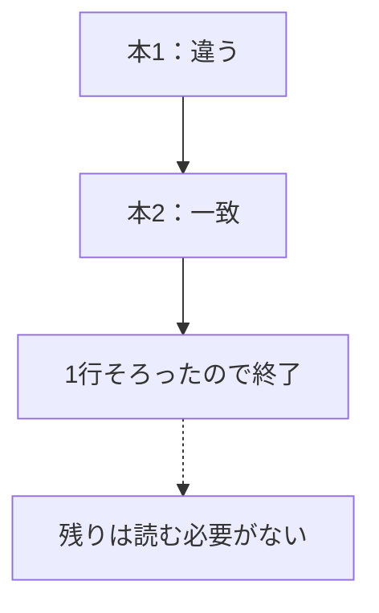
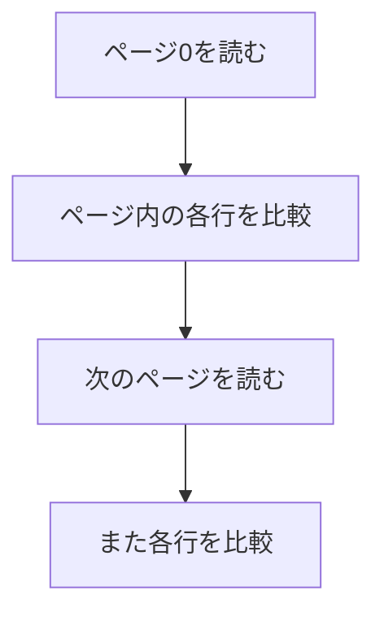

## この章で分かること

本が増えたとき、1冊を探す仕事はどれだけ増えるのでしょうか。検索条件を固定してデータ量を増やし、返した行・除外した行・ページアクセスを比べます。LIMITによる途中終了や、見つからない場合も試します。線形探索の仕事量を具体例から理解し、「少数の結果なら軽い」という判断を自分で確かめられるようになります。

## はじめに：本が1,000倍に増えたら

1,000冊から1冊を探す実験はできました。では、100万冊になったら何が増えるでしょうか。

最初に、三つを別々に予想してください。

1. 結果として返る行数。
2. 条件を比べる行数。
3. 実行時間。

同じ1冊を探すので、結果は変わらないはずです。でも、それだけでは残り二つは決まりません。

## 比較する条件をそろえる

ここからは、まず一つのプロセスで基本の形を観察します。psqlで次を設定します。再接続したら設定し直してください。

```sql
SET max_parallel_workers_per_gather = 0;
SET jit = off;
SET work_mem = '4MB';
```

並列実行は複数のプロセスで処理を分担する仕組みです。JITは、実行時に処理の一部を機械語へ変換する仕組みです。今回は比較を読みやすくするために無効にします。本番でも無効にすべき、という意味ではありません。

### 1,000冊での結果を記録する

まず今の件数を確認します。

```sql
SELECT count(*) FROM books;
```

```text
 count
-------
  1000
(1 row)
```

題名検索も、同じ接続で実行します。

```sql
EXPLAIN (ANALYZE, BUFFERS)
SELECT id, title FROM books WHERE title = '実験用の本 42';
```

```text
Seq Scan on books  (cost=0.00..20.50 rows=1 width=27) (actual time=0.016..0.052 rows=1.00 loops=1)
  Filter: (title = '実験用の本 42'::text)
  Rows Removed by Filter: 999
  Buffers: shared hit=8
Planning Time: 0.053 ms
Execution Time: 0.064 ms
```

この実行では、1行を返し、999行を除外しました。`loops=1`なので、合わせて1,000行に条件を当てています。`shared hit`は8、実行時間は0.064 msでした。

これを本を増やす前の記録にします。次の検索でも返すのは同じ1行ですが、除外する行数とページへのアクセスはどう変わるでしょうか。時間の数字だけでなく、そこも比べてみてください。

### 10万冊、100万冊へ増やす

続いて10万冊まで増やします。

```sql
INSERT INTO books
SELECT n, '実験用の本 ' || n
FROM generate_series(1001, 100000) AS n
ON CONFLICT (id) DO NOTHING;
ANALYZE books;
```

`ON CONFLICT`は、すでに同じ番号があれば追加しない指定です。同じ検索を測ったら、次に100万冊まで増やして、もう一度測ります。

```sql
INSERT INTO books
SELECT n, '実験用の本 ' || n
FROM generate_series(100001, 1000000) AS n
ON CONFLICT (id) DO NOTHING;
ANALYZE books;
```

この段階では、題名用の索引はまだありません。`Seq Scan`が選ばれた場合に、返した行・除外した行・BUFFERSを比べてください。別の方法なら、その方法を記録してから理由を考えます。

## 順番に調べる場合の比較回数

説明用に5冊へ縮めます。本4を探していても、同じ題名が後ろにもあるかもしれないので、条件に合う行を全部求める検索では最後まで調べます。



5冊なら5冊分、1,000冊なら1,000冊分の確認が必要です。このような、一つずつたどる探し方を**線形探索**と呼びます。

件数を`n`と置くと、仕事の増え方を`O(n)`と書きます。「オーダー・エヌ」と読みます。難しい計算の式というより、**件数が増えたら、仕事もそれに応じて増える**という増え方の名前です。

ただし、件数が100倍なら秒数も必ず100倍、とは言えません。第4章のキャッシュや、計測時の負荷も時間に関わるからです。仕事量と時間は、関係しますが同じ値ではありません。

## 見つかったら止まってよいなら？

今度は、同じ題名が複数あっても1行だけでよいとします。

```sql
EXPLAIN (ANALYZE, BUFFERS)
SELECT id, title FROM books
WHERE title = '実験用の本 42'
LIMIT 1;
```

`LIMIT 1`は「最大1行でよい」という依頼です。目的の行を見つければ、上のLimitがそれ以上要求しなくて済む場合があります。



これは早く見つかった場合の模型です。目的の行が後ろにあれば、そこまで調べます。存在しなければ、最後まで調べて初めて「ない」と分かります。

`'実験用の本 999999'`と`'存在しない本'`でも試してください。ただし、SQLに`ORDER BY`がなければ行の順序は保証されません。主キーの小さい順に必ず読む、とは覚えないでください。

## 行の数だけでなく、ページを見る

たくさんの行を比べるには、その行を含むページにも触れます。



ここで第3章の「ページ」、第4章の「hit/read」が役に立ちます。100万行の検索がメモリ内で済んでも、100万行の条件を比べる仕事まで消えるわけではありません。

同じ本を`WHERE id = 42`でも探し、索引を使う計画と比べましょう。比べる軸は「速かった」だけでなく、どの方法で、どれだけの範囲に触れたかです。

## 結果件数と、調べる行数の違い

上位20冊を返すランキングも、結果が20だから仕事が20件分とは限りません。必要な答えを確定するまでに、どこまで調べるかが重要です。

「LIMITを付けたので、大きな表でも大丈夫」という提案には、**見つからない場合と、遅く見つかる場合も確かめよう**と返せます。

次章では、途中を一つずつ確認せず、探す範囲を狭める索引の仕組みを見ます。
