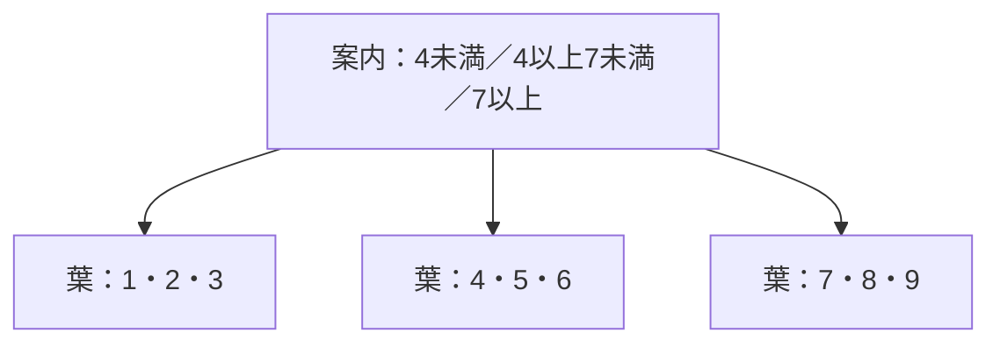
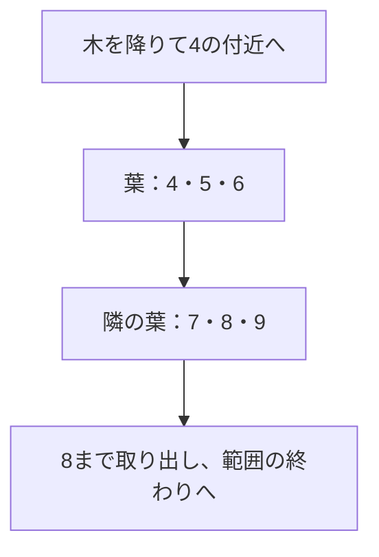
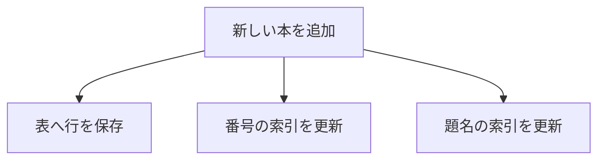

## この章で分かること

索引自体も多くのページを持つのに、B-treeは目的の場所を少ない段数で絞り込みます。小さな木を手でたどり、実際の索引の高さやページアクセスと対応させます。一点検索から範囲検索へ条件を広げ、表の行を取り出す仕事と索引を維持する仕事も考えます。索引の効果を、使ったかどうかだけでなく減らした仕事から説明する章です。

## はじめに：目録も大きいのに、どう探す？

本が100万冊になりました。題名を順番に比べると、多くの行を読む必要があります。一方、番号検索は索引という目録を使えました。

でも、索引にも100万冊分の情報があるはずです。索引を先頭から全部読んでいたら、あまり助けにならなそうです。

そこで使うのが、**範囲を分けながら進む木構造**です。PostgreSQLの標準的な索引では、B-treeという仕組みが使われます。

## 範囲を分ける案内板

まずは、番号1〜9の小さな模型です。上の箱にある境界の番号を見て、進む先を選びます。実際の索引はもっと多くの項目を一つのページに持ちます。



番号8なら、どこへ進みますか。1、2、3、4……と全冊を確かめる必要はありません。最初の案内で「7以上」の枝へ進めます。

一番上を**根**、途中の案内を**内部の節**、行の場所へつながる末端を**葉**と呼びます。根は一つですが、枝分かれするため、少ない段数で多くの情報を分けられます。

## 段数は、冊数と同じ速さでは増えない

仮に一つの案内が100個の行き先を持つなら、2段の案内で100×100、3段なら100×100×100の範囲を分けられます。これは増え方をつかむための模型で、実際の索引の分岐数を測った値ではありません。

本が増えても、毎回案内の段を一つ足す必要はありません。この「掛け算で分けた範囲を逆にたどる」増え方が、`O(log n)`という見方につながります。

`log`を初めて見ても、まずは**100万件だから100万回案内を読むわけではない**と理解できれば十分です。表から取り出す行が大量なら、その分の仕事は別に必要です。

## 題名にも索引を作る

第5章の100万冊をそのまま使います。索引を作る前に、題名検索を記録してください。

```sql
EXPLAIN (ANALYZE, BUFFERS)
SELECT id, title FROM books WHERE title = '実験用の本 42';
```

続いて題名用の索引を作ります。

```sql
CREATE INDEX books_title_idx ON books (title);
ANALYZE books;
EXPLAIN (ANALYZE, BUFFERS)
SELECT id, title FROM books WHERE title = '実験用の本 42';
```

`Index Scan`など、索引を使う方法になったでしょうか。前後の計画とBUFFERSを比べます。時間だけでなく、全体を調べる仕事がどう変わったかを見てください。

索引の大きさも測れます。

```sql
SELECT pg_size_pretty(pg_relation_size('books_title_idx'));
```

これが、速く探すために別に保存した情報の大きさです。

## 一点を探した後に、たくさん読む場合

「8だけ」ではなく「4以上8以下」を欲しいとします。



最初の位置を少ないページアクセスで見つけても、範囲内の項目は順に読む必要があります。さらに題名などが必要なら、索引から表の行も参照します。

```sql
EXPLAIN (ANALYZE, BUFFERS)
SELECT id, title FROM books WHERE id BETWEEN 400000 AND 400010;

EXPLAIN (ANALYZE, BUFFERS)
SELECT id, title FROM books WHERE id BETWEEN 1 AND 900000;
```

後者は表の大部分が必要です。索引があるのに逐次走査になる場合もあります。「索引を使わなかったから失敗」と決めず、必要な量を見ます。選ぶ理由は第10章で扱います。

## 行の追加・更新に伴う索引の変更

本を1冊増やすなら、表だけでなく目録にも書き足す必要があります。題名を変更するなら、題名の索引にも対応が必要です。



索引のページがいっぱいなら、分割などの調整も必要になります。毎回分割するわけではありませんが、索引は無料の近道ではないのです。

読み込みの利益、保存容量、追加や更新の負担を一緒に考えます。仕組みをさらに調べる入口は[PostgreSQLの索引の説明](https://www.postgresql.org/docs/18/indexes.html)です。

## 確かめる問い

「1件検索が速くなったので、90万件を取り出すSQLも同じ倍率で速くなる」と言ってよいでしょうか。

:::details 考え方
木で場所を絞る仕事と、その後に多くの行を取り出す仕事は別です。対象範囲を変え、計画とアクセス量を測って確かめます。
:::

題名の索引は後の章でも使うので残します。次は、読了記録を新しい順に並べる仕事へ進みましょう。
