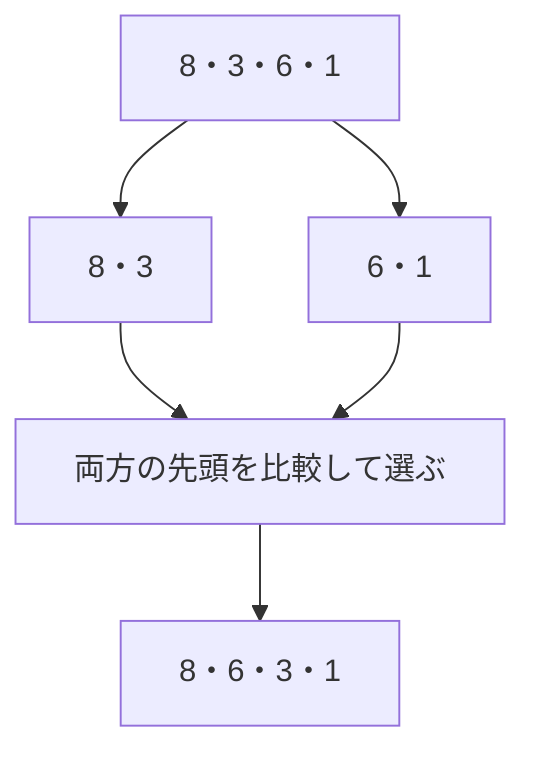
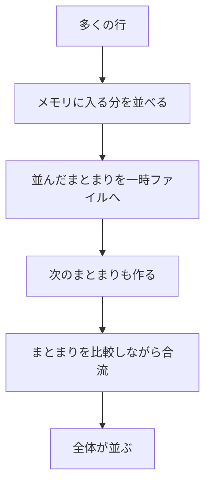

## この章で分かること

読了記録を新しい順に並べるために、どんな仕事が必要でしょうか。少数の値の比較から始めて、実行計画のSortと対応させます。件数とwork_memを別々に変え、メモリ内での処理と一時ファイルを使う処理を観察します。作業メモリをプロセスの地図へ戻し、並べ替えが遅いときに何を確認すべきかを整理します。

## はじめに：新しい読了記録を上にしたい

今度は「最近読み終えた記録の一覧」を作ります。記録が入っている順と、日時の新しい順は同じとは限りません。

新しい順に返す依頼は、こう書きます。

```sql
SELECT book_id, finished_at
FROM reading_records
ORDER BY finished_at DESC, book_id ASC;
```

`DESC`は大きい値から、`ASC`は小さい値からです。日時が同じ場合は本の番号順にします。

## 大きさを比べて順序を作る

説明用に、日時を数字へ置き換えます。数字が大きいほど新しいとします。8、3、6、1を新しい順にしたいなら、8、6、3、1です。

どうやって並べるか、手元で4枚のカードを動かしてみてください。

次は、二つの小さな並びを作って合流する模型です。PostgreSQLのメモリ内ソートをそのまま再現したものではなく、比較して順序を作る仕事の説明です。



行を一度ずつ読むだけでなく、値を比べ、置く順序を決める仕事があります。比較ソートの代表的な増え方は`O(n log n)`です。件数が増えると、読む仕事に加えて、順序を整える仕事も増えます。

## 大きめの記録を用意する

第5章までで本は100万冊になっています。ここでは、読了記録を**200万件**で作り直します。序章の2,000万件より小さく、手元で試しやすい規模です。このSQLは実験用の読了記録を置き換えるので、本の実験用DBで実行してください。

```sql
TRUNCATE reading_records;
INSERT INTO reading_records
SELECT ((n::bigint * 7919) % 1000000) + 1,
       timestamp '2026-08-24'
         + ((n::bigint * 104729) % 2419200) * interval '1 second'
FROM generate_series(1, 2000000) AS n;
ANALYZE reading_records;
SELECT count(*) FROM reading_records;
```

`TRUNCATE`は表の中の行を空にします。実際のサービスの記録では行わず、このサンプルだけを対象にします。後続章もこの200万件を使います。

## Sortを観察する

全行を画面へ流すと、表示や転送も混ざります。ここでは実行計画を通して処理を観察します。

```sql
SET max_parallel_workers_per_gather = 0;
SET jit = off;
SET work_mem = '64MB';
EXPLAIN (ANALYZE, BUFFERS)
SELECT book_id, finished_at
FROM reading_records
WHERE finished_at >= timestamp '2026-09-14'
  AND finished_at < timestamp '2026-09-21'
ORDER BY finished_at DESC, book_id ASC;
```

`Sort`の近くで、次の項目を探します。

| 項目 | 調べること |
| --- | --- |
| `Sort Key` | 何を基準に並べたか |
| `Sort Method` | どの方法を使ったか |
| `Memory`や`Disk` | 作業で使った量 |
| 子の`actual rows` | 何行を受け取ったか |

親の実行時間には子を動かす時間も含まれます。全ノードの時間を足して合計にしないでください。まずは「どの段で何行を受け取り、どんな方法を使ったか」を読むことに集中します。

## 作業用メモリに収まらないとき

100枚のカードを並べたいのに、机には10枚しか置けないとします。

少しずつ並べて別の場所へ置き、最後に合流させれば、大きな並びを作れます。DBでも、作業用メモリに収まらない場合は、途中結果を一時ファイルへ置く方法があります。



実際のソートでも、使えるメモリを少なくして比べてみます。

```sql
SET work_mem = '64kB';
```

同じ`EXPLAIN (ANALYZE, BUFFERS)`をもう一度実行します。`external merge`や`Disk`、`temp read/written`が現れたか比べてください。結果は環境とデータで確認します。時間が何倍になるかを先に決めません。

今回の200万件のサンプルを使った確認では、対象週の入力は499,998行でした。次は実測した出力の抜粋です。

| work_mem | Sort Methodの出力 | 作業量の表示 |
| --- | --- | --- |
| 64MB | `quicksort` | `Memory: 27913kB` |
| 64kB | `external merge` | `Disk: 12784kB` |

2026年9月22日、DockerのPostgreSQL 18.6、並列実行とJITは無効です。MemoryとDiskは別の場所・形式の量なので、この二つを引き算して節約量とはしません。**方法と置き場所が変わった**ことを読み取ります。

`shared`は表や索引のページに関わる値、`temp`は今回のような一時ファイルに関わる値です。第4章の二つの置き場所が、ここで別々の数字になります。

## メモリを増やせば、いつも解決？

一つの処理で一時ファイルを減らせても、多くの人が同時に同じ作業をすると、必要なメモリは増えます。一つのSQLに複数のソートがある場合もあります。

そのため、`work_mem`を「DB全体でここまで」とは読めません。また、並べ替え以外に時間がかかっているなら、ソート用のメモリを増やしても、その処理は減りません。

実験後は、後続章の基準へ戻します。

```sql
SET work_mem = '4MB';
```

課題です。Sortがすでにメモリ内で済んでいる場合、「一時ファイルをなくすためにwork_memを増やす」という説明は成り立つでしょうか。実際の出力を根拠に考えてください。

次章では、そもそも全部を並べる必要があるのかを問い直します。欲しいのが上位20件だけなら、別の工夫がありそうです。
