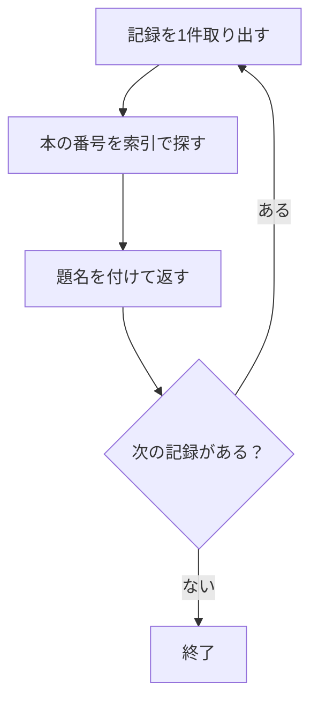
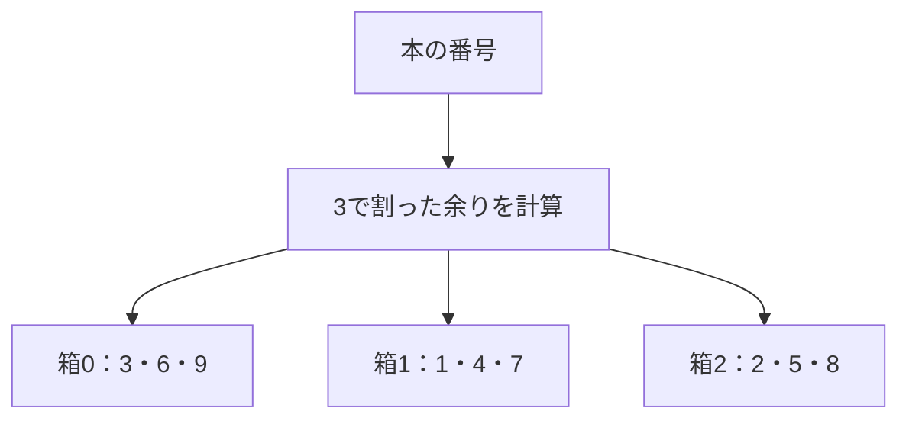
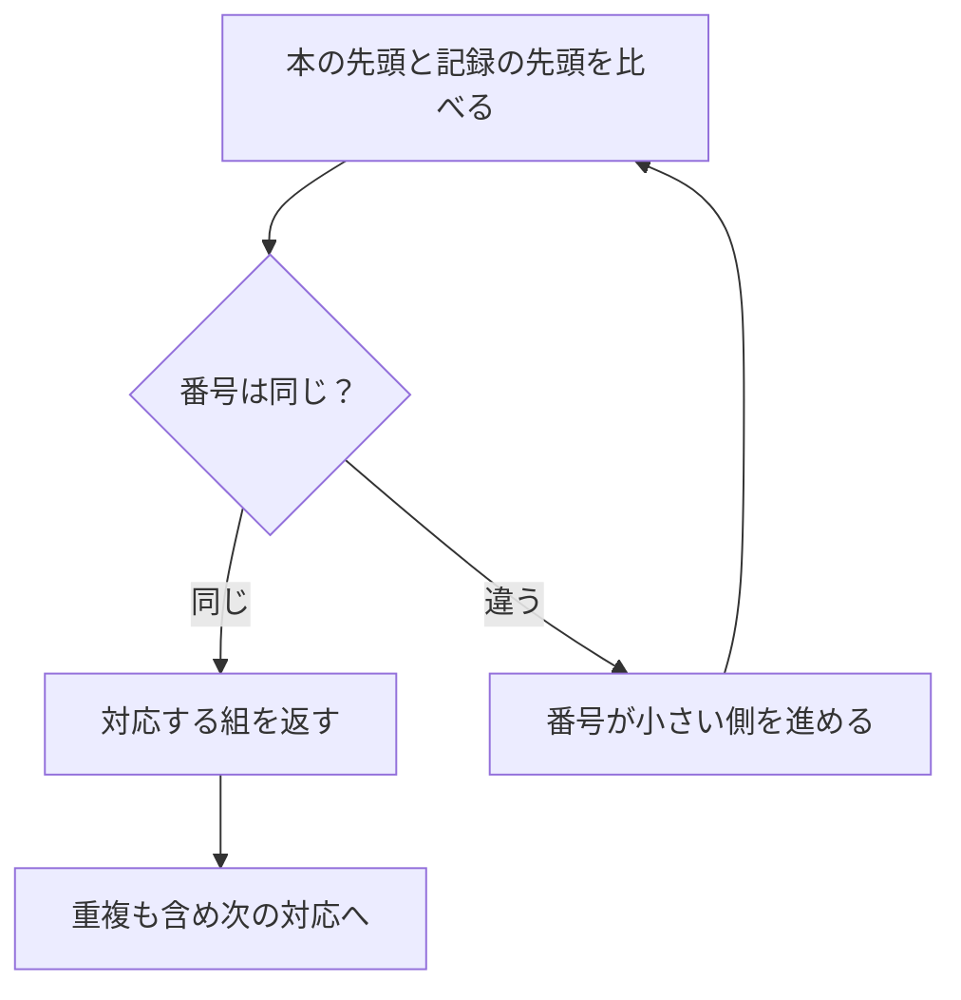

## この章で分かること

読了記録に題名を付け、本ごとに読了記録を数える処理を学びます。少数の行を繰り返し探す方法から始め、大量の行をハッシュ表で照合する方法、並んだ入力を合流させる方法へ広げます。集約では入力行数とグループ数を区別し、メモリとの関係も観察します。結合や集計の前に行を減らす案を、意味と仕事量の両面から考える章です。

## はじめに：番号だけでは、何の本か分からない

読了記録には`book_id`がありますが、題名はありません。一覧に題名を出すには、本の表と対応させます。この対応付けが**結合、JOIN**です。

まずは3件の記録で考えます。

| 記録の本番号 | 本の一覧で探す番号 | 付ける題名 |
| --- | --- | --- |
| 2 | 2 | 海の図鑑 |
| 1 | 1 | 星の図鑑 |
| 2 | 2 | 海の図鑑 |

同じ本を2回読んだ記録があるので、海の図鑑も結果に2回登場します。JOINは、同じ番号を一つにまとめる処理ではありません。

## 20件なら、一つずつ探す

第8章の索引を使い、最近の20件に題名を付けます。

```sql
EXPLAIN (ANALYZE, BUFFERS)
SELECT r.book_id, b.title, r.finished_at
FROM (
  SELECT book_id, finished_at FROM reading_records
  ORDER BY finished_at DESC, book_id ASC LIMIT 20
) AS r
JOIN books AS b ON b.id = r.book_id
ORDER BY r.finished_at DESC, r.book_id ASC;
```

括弧の内側で20件を選び、その各記録に本の題名を付けています。本の主キーは一意なので、一つの記録から同じ番号の本が何冊も見つかることはありません。

一つずつ探す方法を模型にします。



このような繰り返しが`Nested Loop`です。外側で記録を取り出し、内側で本を探します。内側に効率のよい索引があり、外側が少なければ合理的な方法です。名前だけで「遅い結合」と決めないでください。

計画に`loops=20`があれば、その処理を20回実行しています。`actual rows`や`actual time`は、複数回実行では1回当たりの平均として表示されます。1回1行を20回返せば、全体では20行です。親子の時間をすべて足すと、子の処理時間を二重に数えることになるため、単純には合計できません。

## 何十万回も探すなら？

対象を1週間の全記録に広げます。

```sql
EXPLAIN (ANALYZE, BUFFERS)
SELECT r.book_id, b.title
FROM reading_records AS r
JOIN books AS b ON b.id = r.book_id
WHERE r.finished_at >= timestamp '2026-09-14'
  AND r.finished_at < timestamp '2026-09-21';
```

何十万回も別々に本を探す代わりに、先に照合用の表を作る方法があります。これが`Hash Join`です。

**ハッシュ**は、キーから置き場所を決めるための値を計算する仕組みです。模型として、本の番号を3で割った余りで箱を分けます。



記録の番号が8なら箱2を見ます。ただし箱2には2や5もあります。**同じ箱に入ることと、番号が等しいことは別**なので、最後はキーを比較します。異なるキーが同じ場所に対応することを衝突と呼びます。

実際のハッシュ関数は「3で割る」より複雑ですが、置き場所を絞って照合する考え方は同じです。準備する表のサイズと、探す回数の両方を考えます。

## すでに並んでいるなら、合流できる

本の番号が昇順の二つの列を考えます。

- 本：1、2、3、4
- 記録：1、1、3、4

先頭同士を比較して、小さい側を進めれば対応を探せます。これが`Merge Join`につながります。



この模型では本の番号は一意です。両側に重複がある一般の結合では、一致する組み合わせをすべて返す必要があります。

方法を見るために、実験の間だけ候補を制限してみます。

```sql
BEGIN;
SET LOCAL enable_hashjoin = off;
SET LOCAL enable_nestloop = off;
EXPLAIN (ANALYZE, BUFFERS)
SELECT b.id, r.finished_at
FROM books AS b JOIN reading_records AS r ON r.book_id = b.id
WHERE b.id <= 100;
ROLLBACK;
```

Merge Joinが現れたら、入力をどこで並べたかも見てください。結合そのものの処理量が少なくても、入力を並べ替える処理が追加される場合があります。これは仕組みを観察する実験で、本番の方法を固定する勧めではありません。

## 数えるときは、グループごとにメモする

ランキングでは本ごとの件数が必要です。記録が2、1、2、3、2なら、数える途中のメモは次のようになります。

| 読んだ記録 | 1の数 | 2の数 | 3の数 |
| --- | ---: | ---: | ---: |
| 2 | 0 | 1 | 0 |
| 1 | 1 | 1 | 0 |
| 2 | 1 | 2 | 0 |
| 3 | 1 | 2 | 1 |
| 2 | 1 | 3 | 1 |

入力は5件、最後のグループは3個です。ハッシュ表を使って本ごとのカウンタを探すのが`HashAggregate`につながります。

```sql
EXPLAIN (ANALYZE, BUFFERS)
SELECT book_id, count(*) AS read_count
FROM reading_records GROUP BY book_id;
```

別の集約方法が選ばれる場合もあります。`GroupAggregate`とSortが見えたら、並んだ同じキーをまとめる形だと考え、ハッシュ方式と区別してください。

## ハッシュ表がメモリに収まらないとき

グループの数が多ければ、メモも多くなります。ハッシュ処理のメモリ予算は`work_mem`だけでなく、`hash_mem_multiplier`にも関係します。

```sql
SHOW work_mem;
SHOW hash_mem_multiplier;
```

Hash Joinでは`Batches`、集約では方式に応じたメモリやディスクの表示を観察します。小さなメモリへ変更して比較するなら、`BEGIN`と`SET LOCAL work_mem = '64kB'`で囲み、同じSQLを実行して`ROLLBACK`します。一時ファイルが増えたかを確かめましょう。

## ランキングの仕事を減らす案

題名をすべての記録へ付けてから数える代わりに、本の番号だけで数え、上位20冊を決めてから題名を付けられないでしょうか。

その案には、結合する行を減らせる可能性があります。ただし、題名で絞り込む条件があるなら、題名を見る前に上位を決めてよいとは限りません。

課題は、**順序を変えても同じ答えになる条件を一つ挙げること**です。主キーが一意、記録の番号に対応する本が存在する、といった約束が手掛かりになります。

次章では、これらの方法からPostgreSQLが何を根拠に選んでいるのかを調べます。
