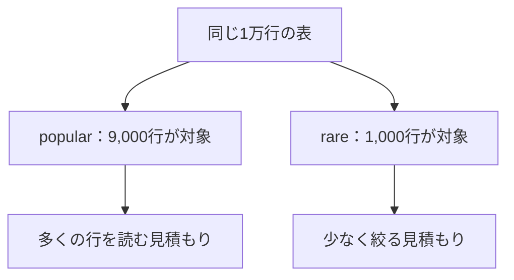
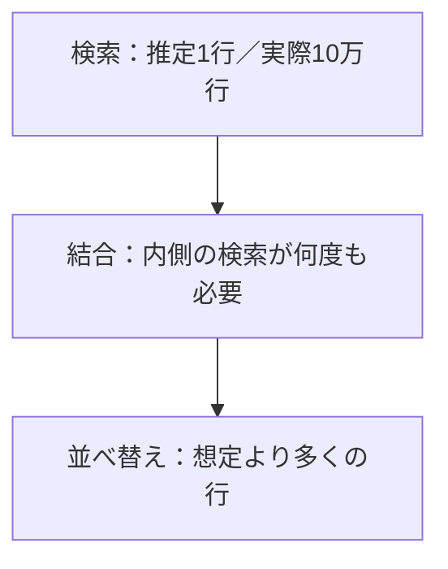

## この章で分かること

PostgreSQLは実行前に行数や仕事量を見積もり、処理方法を選びます。条件の広さやデータの偏りを変え、統計情報・推定行数・実際の計画を対応させます。costを実時間と区別し、推定のずれが後続の処理へ及ぼす影響を考えます。期待と違う計画を見たとき、何を確かめてから改善を試すかを組み立てる章です。

## はじめに：索引があるのに使わない？

索引を作っても、広い範囲を取り出すと逐次走査が選ばれることがあります。PostgreSQLは、どうやって方法を決めたのでしょうか。

すべての候補を実行して比較すると、結果を得るまでに余計な時間がかかります。そこでプランナは、実行前に行数や処理量を見積もって候補を比較します。

たとえば、文化祭で飲み物を仕入れる場面を考えてください。来場者が50人か5,000人かによって、用意する数や運び方は変わります。実行計画でも、扱う件数の予想が方法の選択に関わります。

## 同じ「1種類」でも、件数は違う

偏りのある小さな実験表を作ります。ランキング用の表とは別で、最後に取り消します。

```sql
BEGIN;
CREATE TABLE stats_demo AS
SELECT n AS id,
       CASE WHEN n <= 9000 THEN 'popular' ELSE 'rare' END AS category
FROM generate_series(1, 10000) AS n;
CREATE INDEX stats_demo_category_idx ON stats_demo (category);
ANALYZE stats_demo;
EXPLAIN (ANALYZE, BUFFERS)
SELECT * FROM stats_demo WHERE category = 'popular';
EXPLAIN (ANALYZE, BUFFERS)
SELECT * FROM stats_demo WHERE category = 'rare';
```

`popular`は9,000行、`rare`は1,000行です。「どちらも1種類を探す」ことと、「同じ行数を探す」ことは違います。計画の`rows`と`actual rows`を比べてください。

対象になる割合を**選択率**と呼びます。この例なら90%と10%です。



## 全行を毎回数えず、特徴を持っておく

`ANALYZE`は値の分布などを調べ、統計情報を作ります。統計情報は、表の特徴をまとめたメモです。

同じトランザクションの中で確認します。

```sql
SELECT attname, n_distinct, most_common_vals, most_common_freqs,
       histogram_bounds
FROM pg_stats
WHERE schemaname = current_schema() AND tablename = 'stats_demo';
```

| 項目 | ざっくり何を表す？ |
| --- | --- |
| `n_distinct` | 値の種類数の見積もり。負の値は行数に対する割合を表す |
| `most_common_vals` | よく現れる値 |
| `most_common_freqs` | その値が現れる割合 |
| `histogram_bounds` | 残りの値の分布を区切る境界 |

すべての列で、すべての項目が埋まるわけではありません。統計は標本に基づくため、完全な件数表でもありません。[行数見積もりの公式例](https://www.postgresql.org/docs/18/row-estimation-examples.html)には、この情報がどう使われるかが示されています。

## 古いメモで計画を立てたら

特徴が変わったのにメモが古いままだと、見積もりがずれるかもしれません。先ほどの表で、多くの値を変更してみます。

```sql
UPDATE stats_demo SET category = 'rare' WHERE id <= 8000;
EXPLAIN (ANALYZE, BUFFERS)
SELECT * FROM stats_demo WHERE category = 'rare';
ANALYZE stats_demo;
EXPLAIN (ANALYZE, BUFFERS)
SELECT * FROM stats_demo WHERE category = 'rare';
ROLLBACK;
```

`rare`は9,000行へ増えます。統計更新前後で、推定と実測の差がどう変わったかを見てください。今回は未コミットの実験表を自分の接続で使い、最後に取り消しています。

通常の表ではautovacuumが自動的に統計を更新することもあるので、実験した条件を残す必要があります。

## 小さな見積もりの違いが、後ろへ届く

入力を1行と見積もった処理に、実際には10万行が渡ると、後続の処理量も見積もりを上回ることがあります。



これは仕組みを示す模型です。すべての遅いSQLがこの形とは限りません。推定が近くても、そもそもの処理量が多い場合もあります。

計画を読むときは、最後の時間だけでなく、下の方から「予想と実際が大きく離れた場所」を探します。`loops`が複数なら、平均と合計をそろえて比較します。

## costは秒数の予言ではない

第1章の`cost`は、候補を同じ基準で比較するための値でした。ページを読む回数や、行の条件を比較する回数に、処理ごとの重みを付けて見積もります。

二つの数字のうち、前は最初の行を返すまでの見積もり、後ろは全部返すまでの見積もりです。上位少数だけなら、全部終える仕事だけでなく、早く結果を出し始められるかも関わります。

`cost=100`を100ミリ秒と読むことはできません。実時間との違いを直接引き算するより、まず推定行数と実際の行数を比べます。

## さらに難しい見積もり

「都道府県が東京都」と「市区町村が新宿区」は、無関係な条件ではありません。このような列どうしの関係があると、一つずつの統計だけでは見積もりが難しくなります。複数列の関係を扱う拡張統計は、この先の学びです。

また、繰り返しの結果を再利用する`Memoize`や、複数のプロセスで分担する並列計画もあります。ここまでの基本形に、再利用や分担が加わると考えると読み始められます。

課題です。「索引を使わないから、設定で無理に使わせよう」という案を受け取ったら、何を先に確認しますか。

:::details 考え方
実際に必要な行数、推定とのずれ、選ばれた方法の仕事、別の方法の実測を比べます。計画の名前だけで優劣を決めません。
:::

次章は、更新した行がどの読み手から見えるのか、という別の事情を学びます。
