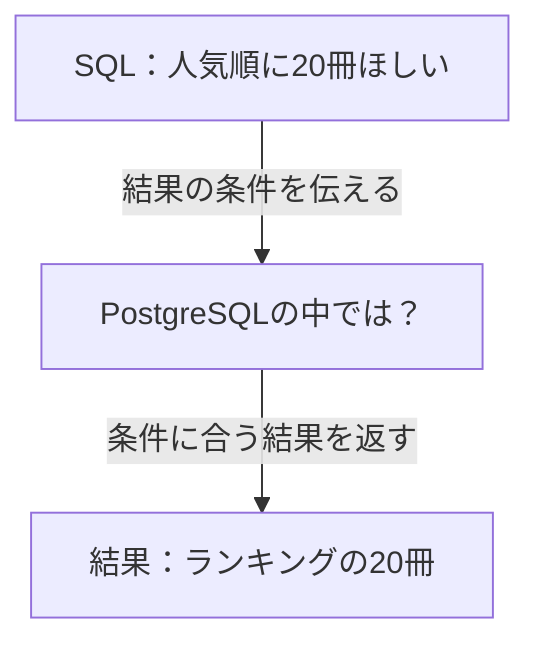

## はじめに

`SELECT` でデータを取り出す。`ORDER BY` で並べる。必要な件数だけ欲しければ `LIMIT` を付ける。

普段の開発で書いているSQLです。けれど、結果が返ってくるまでにデータベースが何をしているか、と聞かれると、少し言葉に詰まるかもしれません。

この本では、一つの読書記録サイトを育てながら、いつものSQLの向こう側をたどります。登場人物と一緒に予想し、手元でSQLを動かし、その結果を説明するためにデータ構造やアルゴリズムを学んでいきます。

最初の困りごとは、たった20冊を表示するランキング画面で起きました。

:::message
サービスと会話は架空です。以下の件数とSQLの処理時間は、サンプルデータを使って実際に計測した値です。画面全体の応答時間や本番障害の記録ではありません。
:::

## 20冊を返すSQLが、本を増やしたら遅くなった

自分が読んだ本を記録するために作ったサイトを、友人にも使ってもらうことにした。

本を探して「読みたい」に入れる。読み終わったら感想を残す。開発している二人は、届いた要望を見ながら少しずつ機能を増やしていた。

「次に読む本を探したいから、人気ランキングが欲しい」

そこで、人気の本を上位20冊表示する画面を作ることにした。人気スコアは夜間の処理で計算済みだから、画面では高い順に取り出せばよい。

```sql
SELECT id, title, popularity_score
FROM ranking_books
ORDER BY popularity_score DESC, id ASC
LIMIT 20;
```

`ranking_books` には本の番号、タイトル、計算済みの人気スコアが入っている。同点なら `id` が小さい本を先にする。`id` の主キーはあるが、**人気順のインデックスはまだない。**

開発用の1,000冊では、すぐに結果が返ってきた。では、100万冊を扱うようになったら？ 二人は、本の件数を増やして同じSQLの時間を比べることにした。

次の表は、この条件でサンプルデータを作り、同じSELECTをそれぞれ5回実行した結果です。

| 本の件数 | 返ってきた件数 | 処理時間の中央値 | 5回の範囲 |
| --- | --- | --- | --- |
| 1,000冊 | 20冊 | 0.136 ms | 0.120〜0.216 ms |
| 1,000,000冊 | 20冊 | 73.166 ms（約0.073秒） | 67.907〜74.413 ms |

「返ってくるのは同じ20冊なのに、時間はこんなに変わるんだ」

「`LIMIT 20` を付けていれば、本が増えても仕事はあまり増えないと思ってた」

今回の約0.073秒だけを見て、利用者が待てないほど遅いとは言えません。ただ、**少量のデータで動いたことを根拠に、データが増えても大丈夫とは判断できない**結果になりました。

もっと本が増えたらどうなるのか。このSQLを頻繁に実行しても大丈夫なのか。利用が広がる前に確かめたいのに、二人には処理時間が伸びた理由を説明できなかった。

:::details 計測条件と生の時間
2026年9月21日、Apple M1 Pro・メモリ32GiBのローカル環境で、PostgreSQL 18.3（Homebrew）を使用しました。

- データは一時テーブルに生成した架空の本。列は `id`、`title`、`popularity_score` の三つ。
- インデックスは `id` の主キーのみ。人気スコアと同点時の順序に合うインデックスはありません。
- `work_mem = 64MB`、並列実行とJITは無効。処理を観察しやすくするための実験用設定です。
- データ生成・`ANALYZE`・件数確認後、同じ接続でSELECTを5回連続実行しています。キャッシュを空にした測定や、同時アクセスの負荷試験ではありません。
- 時間は `psql` の `\timing` で計ったクライアント側の経過時間です。`EXPLAIN ANALYZE` の `Execution Time` や画面の応答時間とは区別します。

| 実行 | 1,000冊 | 1,000,000冊 |
| --- | --- | --- |
| 1回目 | 0.203 ms | 71.167 ms |
| 2回目 | 0.136 ms | 67.907 ms |
| 3回目 | 0.120 ms | 74.413 ms |
| 4回目 | 0.131 ms | 73.166 ms |
| 5回目 | 0.216 ms | 73.439 ms |

この数字は今回の環境とデータでの値です。「100万件なら必ずこの時間になる」という基準ではありません。再現用SQLと生ログは原稿リポジトリの `_drafts/sql-data-structures/experiments/` に保存しています。
:::

## 時間は測れた。でも、直し方が分からない

「返す本を10冊に減らしたら？」

「それで調べる本も半分になるのかな。表示が減るだけかもしれない」

「インデックスを追加するのは？」

「どの列に？ いま、どうやって20冊を選んでいるかも分かってないよね」

案は出てくる。でも、どれから試すかを選ぶ根拠がない。仮に速くなっても、何が減ったから速くなったのかを説明できそうになかった。

ここで一度、あなたも考えてみてください。まだ人気順のインデックスがないとしたら、自分ならどうやって上位20冊を選ぶでしょうか。

**最後に調べた一冊が、いちばん人気だったら？**

全部の本を見る必要があるでしょうか。見るとしたら、全部を順位順に並べる必要もあるでしょうか。

二人が知りたいことも、そこだった。画面に出るのは20冊。その20冊を決めるまでの仕事は、SQLの実行時間だけでは分からない。

## SQLに書いたことと、まだ見えていないこと

先ほどのSQLには「どの列を、どの順番で、何件返してほしいか」を書きました。では、その結果をどう作るのでしょう。

次の図の中央が、この本で少しずつ見ていく部分です。矢印は、SQLを渡して結果を受け取る流れを表しています。



「かかった時間は分かった。次は、中で何をしているかを見たい」

調べていくと、PostgreSQLには **`EXPLAIN`** というコマンドがあると分かった。SQLをどんな手順で処理する予定なのかを、「実行計画」として見せてくれる。さらに `EXPLAIN ANALYZE` では、実際に実行したときの行数や時間も観察できる。

「これなら、20冊を返す前に何をしているか、確かめられそう」

ただ、実行計画を見るのは二人とも初めてだ。出力を眺めるだけで終わらないように、まずは簡単なSQLで、どこに何が書かれているのかを調べることにした。

**困っていることから観察する場所を決め、仕組みを学んで、改善を試す。** この本では、その過程を一緒にたどっていきます。

## このサービスで、これから出会うこと

ランキングだけでなく、本を探したり、感想を表示したりする機能でも、SQLの裏側を知りたくなる場面が出てきます。

| サービスで作りたいもの | 一緒に考える問い | つながる学び |
| --- | --- | --- |
| 本を探す検索機能 | 本が増えたとき、探す仕事をどう減らせる？ | 全件探索・木構造・インデックス |
| 人気の本のランキング | 全部を並べることと、上位だけを選ぶことは同じ？ | ソート・ヒープ・上位k件 |
| 本と感想を組み合わせた一覧 | 二つのデータを、どんな手順で組み合わせる？ | ループ・ハッシュ・JOIN |

木構造やハッシュという言葉を、いま説明できなくても大丈夫です。「この仕事には、どんな仕組みがあると助かるだろう」と考えたところで出会えるように進めます。

## この本の読み方

各章では、まずサービス開発の中で困りごとに出会います。解説へ進む前に、自分ならどうするかを少しだけ考えてみてください。

次に、SQLを動かして予想と結果を比べます。データの量や条件を一つ変えると、何が変わるのか。図で構造や動きを追いながら、その理由を考えます。

予想が外れても、その違いが次の問いになります。仕組みが分かったら、改善案を試して、どんな条件で使える考え方なのかを振り返りましょう。

文章だけでは追いにくいところは図解し、テーブル同士の関係はER図、データの流れやアルゴリズムの動きは具体例で示します。図とSQLを見比べながら読み進められる本にしていきます。

:::message
**この本で身につけたいこと**：SQLの動きについて仮説を立て、実験で確かめ、改善前後の違いを理由とともに説明できること。
:::

### 読み始める前に

想定しているのは、普段の開発でSQLを書いているけれど、データベース内部やコンピュータサイエンスを体系的には学んでこなかった人です。`SELECT`・`WHERE`・`ORDER BY`・`LIMIT` の基本が分かれば読み始められます。

舞台のサービスと会話は架空です。実験にはサンプルデータを使い、実測した結果と仕組みを説明するための模型を区別して示します。

手元で試すための環境構築は、次の第1章で案内します。Webアプリケーションを一式作る必要はありません。まずはPostgreSQLを起動し、SQLを入力できるところから始めます。

## 次の章へ：SQLの動きを観察する道具を手に入れる

ランキングを直すために、まず知りたいのは「PostgreSQLは、どんな手順で本を取り出しているのか」です。

第1章では、実験環境を準備し、並べ替えのない簡単なSQLから `EXPLAIN` と `EXPLAIN ANALYZE` を使ってみます。予定していた処理と、実際の処理をどう見比べるのか。出力の中で、まずどこを見ればよいのかを確かめます。

その道具を使いながら、本を探す仕組み、並べる仕組みへと進み、後の「並べる」の章でランキングの問題に戻ります。先ほど考えた「自分なら20冊をどう選ぶか」という予想を、そこで実際の動きと比べてみましょう。
