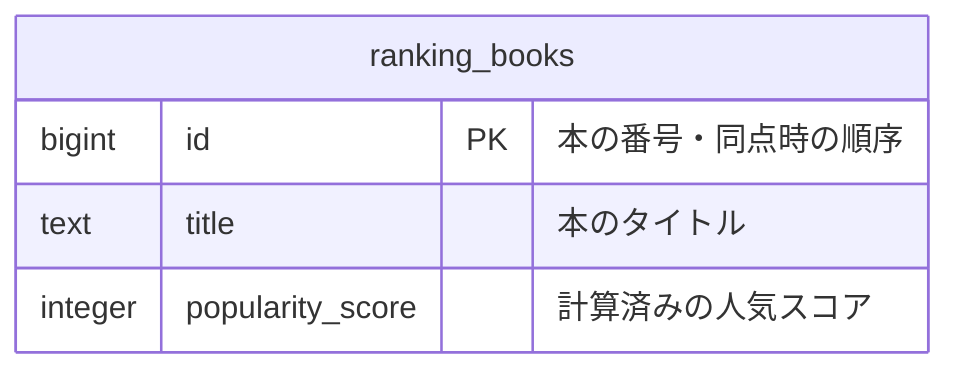
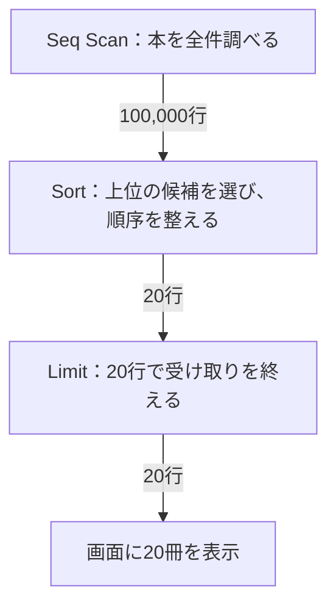
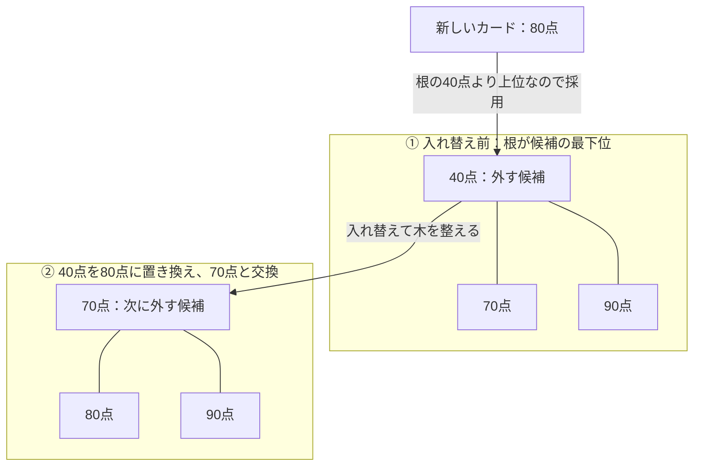
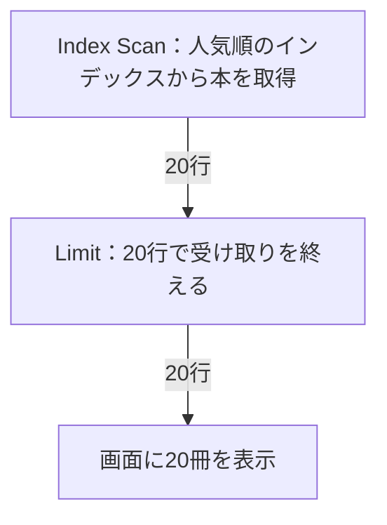

:::message
読書体験を確かめるための短い試作です。架空の読書記録サイトを舞台にしています。文章・図解・SQLを行き来しながら、「続きが気になるか」「自分でも予想したくなるか」を検討しています。
:::

## はじめに

普段書いているSQLが、データベースの中でどう動いているか。結果は正しく返ってくるのに、その手順までは説明できないことがあります。

この章では、読書記録サイトに人気ランキングを作る場面から、SQLの向こう側をのぞきます。まず自分ならどう処理するかを予想して、PostgreSQLで確かめ、結果を説明するためにデータ構造を学んでいきます。

対象は、`SELECT`・`ORDER BY`・`LIMIT` を使ったことのある人です。実行計画やヒープについての予備知識は必要ありません。登場人物と一緒に、必要になったところで見ていきましょう。

### この章で考えること

- 上位20冊を返すために、何冊を調べる必要があるのか。
- 全部を調べることと、全部を並べることは同じなのか。
- 本の探し方を変えると、データベースの仕事はどう変わるのか。

:::message
**この章のゴール**：ランキングのSQLを題材に、「返す件数」と「結果を作るための仕事」を分けて説明できるようになること。
:::

## 今回の舞台と、実験するデータ

舞台は、本を探し、読みたい本を保存し、読了したら感想を残せる小さな読書記録サイトです。二人の開発者が友人に使ってもらいながら、機能を増やしています。

今回は、その中の「人気の本を20冊表示する」機能だけを作ります。人気スコアは夜間に計算済みとして、ランキングを取り出す処理に集中します。

実験に使うのは、次の三つの列を持つ `ranking_books` テーブルです。



この章で使うテーブルは一つだけです。図の `PK` は主キーを表し、本を一意に識別します。スコアは大きいほど人気、同点なら `id` が小さい本を上位にします。利用者や読書記録との関連は、この実験にはまだ登場しません。

実際の利用者の記録ではなく、架空の本を10万冊生成します。まず人気順のインデックスがない状態を観察し、後から追加して比べます。

## 実験環境の準備

### PostgreSQLに接続する

手元で動かす場合は、Dockerがインストール・起動済みの環境を用意してください。Webアプリケーションを作る必要はなく、PostgreSQLと、SQLを入力する `psql` だけで進められます。

[PostgreSQL公式Dockerイメージ](https://hub.docker.com/_/postgres/)を使って、実験用のDBを起動します。以下はターミナルで実行してください。

```bash
docker run --name zenn-ranking-lab \
  -e POSTGRES_PASSWORD=ranking-local-example \
  -e POSTGRES_DB=ranking_lab \
  -d postgres:18
```

起動が終わったかを確認します。

```bash
docker exec zenn-ranking-lab pg_isready -U postgres -d ranking_lab
```

`accepting connections` と表示されたら接続できます。まだなら少し待って、同じ確認コマンドを実行してください。

```bash
docker exec -it zenn-ranking-lab psql -X -U postgres -d ranking_lab
```

`ranking_lab=#` というプロンプトが出れば準備完了です。以降のSQLは、この画面に貼り付けて実行します。

本文の数値はPostgreSQL 18.3で取得した既存ログを使っています。上の `postgres:18` は18系の更新版を取得するため、細かな数値や計画は本文と異なる場合があります。

### 本を10万冊用意する

ここからはSQLです。一時テーブルを作り、架空の書名とスコアを入れます。

```sql
BEGIN;
SET LOCAL max_parallel_workers_per_gather = 0;
SET LOCAL work_mem = '64MB';
SET LOCAL jit = off;
CREATE TEMP TABLE ranking_books (
  id bigint PRIMARY KEY,
  title text NOT NULL,
  popularity_score integer NOT NULL
) ON COMMIT DROP;
INSERT INTO ranking_books
SELECT n, '実験用の本 ' || n, ((n * 7919) % 10000)::integer
FROM generate_series(1, 100000) AS n;
ANALYZE ranking_books;
```

`ANALYZE` は、データの件数や分布などの統計情報を更新するコマンドです。PostgreSQLが処理の手順を考えるための材料を用意しています。

並列処理とJITは無効、`work_mem` は64MBに揃えています。今回は処理の違いを見やすくするための実験用設定です。

まず、データが入ったことを確認しましょう。

```sql
SELECT count(*) FROM ranking_books;
```

`100000` が返れば準備完了です。**一時テーブルを使っているので、ここから実験の終わりまで同じ接続を使ってください。** 途中で接続を閉じた場合は、接続してこの「本を10万冊用意する」のSQLからやり直せます。

それでは、二人がランキングを実装するところから始めましょう。

## 「20冊だけ」なら大丈夫？

「次に読む本を探したいから、人気ランキングが欲しい」

友人にも使ってもらい始めた読書記録サイトに、リクエストが届いた。開発している二人は、まず上位20冊を表示することにした。

人気スコアは夜間の処理で計算している。画面を開くときにするのは、その順番に本を取り出すことだけだ。

```sql
SELECT id, title, popularity_score
FROM ranking_books
ORDER BY popularity_score DESC, id ASC
LIMIT 20;
```

同点なら `id` が小さい本を先にする。

「いまは登録されている本も少ないけど、10万冊になっても大丈夫かな」

「20冊しか返さないし……。いや、20冊を選ぶまでに何冊見るんだろう」

二人とも、画面に出す冊数しか考えていなかった。

## 最後の一冊が、いちばん人気だったら

ここで、少し予想してみてほしい。まだ人気順のインデックスはない。

**10万冊から上位20冊を選ぶなら、どんな手順にするだろう？**

- 全部を人気順に並べて、先頭の20冊を取る。
- 全部を調べるけれど、途中で候補を絞っていく。
- 全部を調べる前に、20冊を決める。

一つ選ぶだけでなく、「残りの本を見なくても順位を決められるか」を考えてから先へ進んでほしい。


## 返した20冊と、調べた10万冊

SQLの先頭に `EXPLAIN (ANALYZE, TIMING OFF)` を付けると、実際に実行して、各処理が返した行数などを観察できる。

```sql
EXPLAIN (ANALYZE, TIMING OFF)
SELECT id, title, popularity_score
FROM ranking_books
ORDER BY popularity_score DESC, id ASC
LIMIT 20;
```

既存の実験ログ（PostgreSQL 18.3）から、見る場所だけを抜き出すとこうなった。コストなどは省略している。

```text
Limit (actual rows=20.00 loops=1)
  -> Sort (actual rows=20.00 loops=1)
       Sort Method: top-N heapsort  Memory: 27kB
       -> Seq Scan on ranking_books (actual rows=100000.00 loops=1)
```

下の `Seq Scan` は10万行を上の処理へ渡し、最後の `Limit` は20行を返している。今回は絞り込みがないので、全件をたどっていることが分かる。

実行計画の字下げを、**行が渡される向き**に描き直してみよう。上のログでは下から上へ読んだ流れを、図では上から下へ並べている。



注目したいのは、**Sortに入る行数と、出ていく行数が違うこと**。矢印は行の流れを示していて、各処理がメモリに保持する件数を表しているわけではない。

「やっぱり全部見るんだ。最後の一冊が一位かもしれないもんね」

「じゃあ、全部を並べ替えたのかな。この `top-N` って何だろう」

同じ実験で `LIMIT 20` だけを外すと、`Sort Method` は `quicksort`、Sortのメモリは8,533kBだった。20冊に絞った方は27kB。**調べた冊数は同じなのに、並べ方が変わっている。**

この数字はその実験での値で、環境やデータによって変わる。まず見たいのは、時間の大小よりも処理の違いだ。

## 20枚を残すなら、誰を追い出す？

本の情報が、カードになって一枚ずつ届くとする。手元に残せる候補は20枚。

21枚目が届いた。候補に入れるかを決めるには、手元のどのカードと比べればいいだろう？

いちばん人気の本ではない。**いま残している候補の中で、いちばん順位が低い本**だ。

新しい本がそれより上位なら入れ替える。下位なら捨てる。同点では `id` の小さい方を上位とする。

「でも、入れ替えるたびに、次に追い出す本を探さないと」

ここで役立つのが、**ヒープ**というデータ構造だ。候補の中で最下位の要素を根に置くようにすれば、入れ替えのたびに候補全部を並べ直さず、木の一部を整えることで次の最下位を取り出せる。

20枚だと図が大きくなるので、**上位3枚を残す模型**で一回の入れ替えを見てみよう。数字は人気スコアで、今回は同点がないものとする。

いまの候補は40点・70点・90点。新しく80点のカードが届いたら、根にある40点を外す。そこへ80点を置くと、子の70点より大きくなるため、80点と70点を交換する。



木の線は親子関係、矢印は今回の操作を表す。親のスコアが子以下になる形を保つことで、根を見るだけで候補の最下位が分かる。**木全体が表示順に並んでいるわけではない**ので、最後に残った候補をランキングの順序に整える。

`top-N heapsort` という名前が、さっき考えた「候補を残しながら全件を見る」方法につながった。

:::message
20枚のカードは原理を考える模型です。PostgreSQLが最初から厳密に20行だけを保持するという意味ではありません。また、このヒープは、テーブルの格納先を指す「ヒープ」とは別のものです。
:::

「全部を見る必要があることと、全部を並べる必要があることは、別なんだね」

## そもそも人気順に探せたら？

「人気順の目録があれば、最初の20冊で終われないかな」

二人は、順序を合わせたインデックスでも確かめることにした。

```sql
CREATE INDEX ranking_books_score_idx
ON ranking_books (popularity_score DESC, id ASC);
```

先ほどと同じ `EXPLAIN` をもう一度実行する。既存の実験では `Sort` がなくなり、`Index Scan` が返したのは20行だった。

必要な順序に合うインデックスがあれば、残りをすべて走査せずに上位の行を取得できる場合がある。[PostgreSQLの公式説明](https://www.postgresql.org/docs/18/indexes-ordering.html)にも、この組み合わせが紹介されている。

今回のインデックス追加後の計画も、行の流れで見ると短くなる。



最初の図にあった `Sort` がなくなった。今回の条件では、必要な20行を取り出したところで止まれている。これは「20回だけディスクを読む」という意味ではなく、Scanが返した行数の話だ。

画面に表示されるのは同じ20冊でも、裏側の手順は変えられる。

「ランキングはこれでいけそう。次は、自分がまだ読んでいない本だけ出せる？」

人気順の先頭20冊が、全部読んだ本だったら。この目録でも、20冊見ただけでは終われそうにない。

次にSQLを書くときには、**返してほしい件数と、それを選ぶために調べる件数**を分けて考えてみよう。

## 実験の後片付け

同じ `psql` の画面で、実験を取り消して接続を閉じます。

```sql
ROLLBACK;
```

続けて `\q` を入力するとターミナルに戻ります。実験用のコンテナとその匿名ボリュームが不要になったら、削除します。

```bash
docker stop zenn-ranking-lab
docker rm -v zenn-ranking-lab
```

<!-- 編集メモ：構成レビューを優先した試作。ヒープは候補3件の模型で図解。比較回数の説明・更新コストの検証は、読書体験を確認した後で検討する。数値は既存のPostgreSQL 18.3の実験ログを参照し、今回の再実測ではない。 -->
