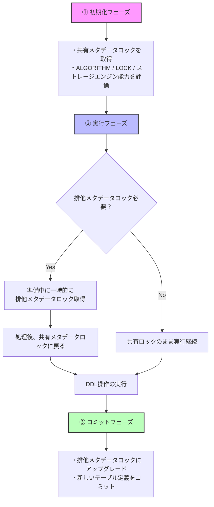

最近は、お仕事の隙間時間にもっぱら NOT NULL 制約を入れていく活動をしていました。

その活動がひと段落したので、今回はその取り組みと、取り組んだ際に学んだMySQLのオンラインDDLについて紹介したいと思います。 

## 環境
- MySQL 8.0.32 
- トランザクション分離レベル: REPEATABLE READ
```sql
mysql> select @@version;
+-----------+
| @@version |
+-----------+
| 8.0.32    |
+-----------+
1 row in set (0.00 sec)

mysql> SELECT @@GLOBAL.transaction_isolation, @@transaction_isolation;
+--------------------------------+-------------------------+
| @@GLOBAL.transaction_isolation | @@transaction_isolation |
+--------------------------------+-------------------------+
| REPEATABLE-READ      | REPEATABLE-READ         |
+--------------------------------+-------------------------+
1 row in set (0.00 sec)
```

## 簡単に出てくる用語の紹介
この記事の中でしれっと出てきそうな英単語について。
いずれも3つのアルファベットで似ており、慣れるまで混乱しがちなので、事前に簡単な説明を記しておきます。


| 略称  | 正式名| 説明| 主なコマンド例     |
|-------|--|--|--|
| DDL   | Data Definition Language       | **テーブルやデータベースの定義を変更する**ための操作    | `CREATE`, `ALTER`, `DROP`, `RENAME`, `TRUNCATE` |
| DML   | Data Manipulation Language     | **データの中身を操作する**ためのコマンド。行の追加・更新・削除など     | `SELECT`, `INSERT`, `UPDATE`, `DELETE`       |
| DCL   | Data Control Language          | **アクセス権限の管理や制御**を行う操作       | `GRANT`, `REVOKE`   |
| MDL   | Metadata Lock (※非公式分類)   | **テーブルの定義に対するロック**。DDLやDMLの裏で自動的に使われる内部処理 | 明示的なSQLはなし。`SELECT`, `ALTER` など実行時に内部で発生 |


## ALTER TABLEの種類とALGORITHM
ALTER TABLEを実行するといっても、どんなALTER TABLEを実行するかによって、微妙に挙動は異なります。
MySQLの公式ドキュメントには、どのALTER TABLEの場合、どんな挙動になるかを表としてまとめてくれています。
例えば、今回やっていたのは、NOT NULL制約の追加なので、表で言うと「カラムのNOT NULL化」の行です。

*MySQL 8.0 生成されたカラム操作のオンライン DDL サポート*
https://dev.mysql.com/doc/refman/8.0/ja/innodb-online-ddl-operations.html#online-ddl-generated-column-operations

カラムの NOT NULL 化は
- インスタント: いいえ
- インプレース: はい

となっています。
このインスタント、インプレースはMySQLのALTER TABLE時に利用されるアルゴリズムの種類です。COPY, INPLACE, INSTANTの3種類があります。


ざっくり特徴の違いで言うと
- COPY: 遅い。長いロックかかるから気をつけたい。
- INPLACE: このケースが多い。同時 DML は許可されているけど、排他メタデータロックはかかるので注意
- INSTANT: 早い。排他メタデータロックも行われない。

です。

表にまとめると、以下のような違いがあります。


| 特徴      | COPY| INPLACE      | INSTANT  |
| ------------------------ | ------ | --------- | --------- |
| **テーブル操作** | 新しいテーブルを作成し、データを行ごとにコピー  | 既存のテーブル上で直接変更を適用        | データディクショナリ内のメタデータのみを変更|
| **テーブル再構築** | 必要  | 原則不要       | 不要     |
| **処理速度** | 遅い  | 中程度       | 非常に速い         |
| **DMLへの影響** | 大きい (操作中、同時DMLは許可されない)       | 比較的小さい (操作の準備・実行フェーズで短時間の排他的メタデータロックが発生する場合があるが、同時DMLはサポートされている) | 非常に小さい (排他的メタデータロックは行われず、テーブルデータは影響を受けないため、同時DMLが許可される)         |
| **排他的メタデータロック** | 操作期間中、テーブル全体に排他的ロック          | 操作の準備・実行フェーズで短時間取得される場合がある   | 準備および実行中に取得されない     |
| **主な用途** | テーブル構造を大きく変更する場合 (データ型変更、文字セット変更など)       | 多くの一般的なALTER TABLE操作 (カラムの追加・削除、インデックスの追加など、再構築が不要な場合)   | カラムの追加 (末尾のみ)、カラム名の変更など、メタデータのみの変更で済む操作      |

参考: 
https://dev.mysql.com/doc/refman/8.0/ja/alter-table.html#alter-table-performance

ちなみに、ALGORIHTM を省略すると、INSTANT->INPLACE->COPYの順で、サポートされているものを使うようになります。


### LOCKの種類
NOT NULL化するに当たって ALGORITHM以外にもLOCKの種類を選択できます。

```sql
ALTER TABLE tbl_name MODIFY COLUMN column_name data_type NOT NULL, ALGORITHM=INPLACE, LOCK=NONE;
```

| LOCKオプション     | 読み取り (SELECT) | 書き込み (INSERT/UPDATE/DELETE) |
|--------|-------|---|
| `LOCK=NONE`        | ✅ 実行可能        | ✅ 実行可能       |
| `LOCK=SHARED`      | ✅ 実行可能        | ⏳ ブロックされる | 
| `LOCK=EXCLUSIVE`   | ⏳ ブロックされる   | ⏳ ブロックされる | 


## メタデータロックとは？
今まででの説明で「メタデータロック」と言う単語が出てきました。
ここで、メタデータとは何か、メタデータロックとは何か、おさらいしておきます。

### メタデータとは？
簡単に説明すると、**テーブルの構造や定義**のことです。

| 分類 | 内容  | 具体的な例 | 操作例   |
|----|---|--|--|
| **メタデータ** | テーブルの構造や定義   | - `users` テーブルの `name VARCHAR(255) NOT NULL` 定義<br>- `PRIMARY KEY(id)`<br>- `created_at` に `DEFAULT CURRENT_TIMESTAMP`<br>- `age` カラムの `INT` 型 | - `ALTER TABLE`<br>- `CREATE INDEX`<br>- `DROP COLUMN` |
| **データ(正確な名称ではない)**     | 実際の中身（レコード） | - `id: 1, name: 'ゆうこ', age: 29`<br>- `id: 2, name: 'タカシ', age: 33` | - `SELECT`<br>- `INSERT`<br>- `UPDATE`<br>- `DELETE` |

つまり、**メタデータロック**は、**メタデータであるテーブルの定義に対するロック**ということになります。
メタデータロックは、テーブルの「定義」をロックするため、スキーマ変更中に他のトランザクションが定義を変更できないようにしています。

### 共有ロックと排他ロックのおさらい
アプリケーション開発の際のSELECTやINSERT時には、データの生合成を保つために、行ロックなどを取ることがあると思います。
そのロックには共有ロック、排他ロックがあります。
主な違いは、他のトランザクションからのSELECTを許可するかどうかといったところです。

| ロック種類   | DML | 他のトランザクションの読み取り | 他のトランザクションの書き込み |
|------------|----------------|----------------|-----|
| **共有ロック (S Lock)** | `SELECT ... FOR SHARE`        | 許可        | ブロック    |
| **排他ロック (X Lock)** |`SELECT ... FOR UPDATE`        | ブロック    | ブロック    | 

## 共有メタデータロック/排他メタデータロック

メタデータにも、上で書いた
「共有ロック」と似たような概念で「共有メタデータロック」
「排他ロック」と似たような概念で「排他メタデータロック」
が存在します。

共有メタデータロックは、SELECT時などにも取得されています。
排他メタデータロックが取得されている間は、共有メタデータロックも実行できません。
つまり、共有メタデータロックを取得するSELECTが実行できなかったりします。

詳しい違いは以下の表にまとめます。

| ロック種類      | 主な目的          | どのような時に取得されるか？    | 他のトランザクションのメタデータ読み取り | 他のトランザクションのメタデータ書き込み | 他のトランザクションのデータ読み書き |
|--|-------|-----------------|-----|-----|-----|
| **共有メタデータロック** | メタデータの同時参照を許可し、変更を防止する | - `SELECT` 文の実行<br>- `EXPLAIN` プランの取得など、その他、テーブルのメタデータを読み取る操作 | 許可      | ブロック  | 許可      |
| **排他メタデータロック** | メタデータへの排他的なアクセスを保証する   | - `ALTER TABLE` 文の実行など- その他、テーブルのメタデータを変更する操作(必ずではない) | ブロック  | ブロック  | ブロック  |


## ALTER TABLE実行時の3ステップ
これまでで、ALTER TABLE実行時に、ALGORITHMが選択され、場合によってメタデータロックが発生すること、そのメタデータロックには共有メタデータロック/排他メタデータロックがあることまでわかりました。

続いては、より具体的にALTER TABLEが走った時にどんなことが行われているか、流れを見ていきます。
ALTER TABLEの実行は大きく3ステップで実行されています。
1. **初期化**: ALOGORITHMの決定(共有メタデータロックを取得する)
2. **実行**: テーブルのコピーなどの実行(**実行直後は排他メタデータロックを取得。解放後共有メタデータロックになる**)
3. **コミット**: DDLコミット(**実行直後は排他メタデータロックを取得**し、コミットする)

の3ステップです。



参考
https://dev.mysql.com/doc/refman/8.0/ja/innodb-online-ddl-performance.html#innodb-online-ddl-metadata-locks

この3ステップを理解するとで、ALTER TABLEを実行するときに注意すべき点がわかってきます。

## ALTER TABLE実行時の注意点
上記で紹介した3ステップの実行前、実行中に別のセッションでトランザクションが発生する場合、注意する点があります。

### 注意1: `t1テーブルへのALTER TABLE`実行前に 別のセッションでt1テーブルへのDMLが走って共有メタデータロックが取得されている場合

ALTER TABLEでは、Phase1(初期化)からPhase2(実行)に移った直後、排他メタデータロックが取得されます。
しかしこの時、あるセッションで長いトランザクションが張られている場合、DDLのセッションでは、排他メタデータロックの取得を待つことになります。
すると、また別のDMLを実行するセッションでは、共有メタデータロックを取得するために、DDLによる排他メタデータロックの解放を待つことになり、SELECTすら詰まってしまいます。

図にすると以下のようになります。


- セッション1:DML実行
    - ALTER TABLE実行前にt1テーブルにトランザクションが張られる
    - 同時に共有メタデータロック取得
- セッション2: ALTER TABLE実行
    - 共有メタデータロック取得
    - 共有メタデータロックを排他メタデータロックに昇格させたいが、セッション1のトランザクションの終了を待つ
- セッション3: DML実行
    - 共有メタデータロックを取得したいが、セッション2の排他メタデータロックが解放されるのを待つ

という状態になります。

つまり、オンラインDDLでも、ALTER TABLEしたいテーブルに長いトランザクションが実行されていると、他のDMLが詰まる恐れがあるので注意が必要です。

### 注意2: `t1テーブルへのALTER TABLE`実行中(DDLコミット前)に 別のセッションでt1でDMLが走って共有メタデータロックが取得されている場合

先ほどの注意1と似ています。
ALTER TABLEのPhase2(実行)の直後だけではなく、Phase3(コミット)の直後にも排他メタデータロックを取得します。
Phase3で排他メタデータロックを取得する前に、長いトランザクションが走っていると、やはり後続のDMLも詰まることになります。

図にすると以下です。


### 注意3: セッションAでトランザクションが走るがt2テーブルのDMLしかない→セッション2でt1テーブルのDDL走る→セッションAのトランザクションでt2テーブルのDMLが実行された場合

トランザクション分離レベル: `REPEATABLE READ`のときの注意ポイントです。
少しややこしいですが、図にすると以下のような形です。


1. セッションAでトランザクションが張られるが、t2テーブルへのDMLだった
2. セッション2でALTER TABLEしたいテーブルはt1テーブルなので、排他メタデータロックも取得できたので、DDL実行し、コミット
3. セッションAのトランザクション内でt1テーブルへのDMLが走った
4. t1テーブルの定義は、1のトランザクションのタイミングのテーブル定義と異なっている
5. `Table definition has changed, please retry transaction` エラーが発生

ということです。
トランザクション開始時点で、スナップショットを取得しています。
DML実行のタイミングに、そのスナップショットのテーブル定義と異なっていると、`Table definition has changed, please retry transaction`エラーが発生してしまいます。

以上3つの注意ポイントを紹介しました。
いずれも長いトランザクションが起因することが多いので、実行前に長いトランザクションが存在しないか注意すると良いです。


## 終わりに
長いオンラインDDLの説明を終えました。
私もNOT NULL制約を入れていく際にエラーが怖く、オンラインDDLについて調べました。
NOT NULL制約の追加は、数千万レコードのテーブルもありましたが問題なく終わりました。
続いて外部キー制約も貼っていきたいと思っています。

ちなみに外部キー制約の追加は、`SELECT @@foreign_key_checks;`が `0`のときは `ALGORITHM=INPLACE`になりますが、`1`の時には `ALGORITHM=COPY` になってしまいます。。
また色々調べてMySQLについて詳しくなれたらなと。
