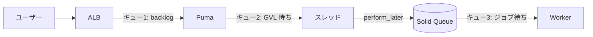

<!--
記事執筆の方針メモ（公開前に削除）
- 元ネタ: Nate Berkopec "All About Queueing In Rails Applications" (Kaigi on Rails 2022)
  - https://kaigionrails.org/2022/talks/nateberkopec/
  - https://speakerdeck.com/nateberkopec/kaigi-on-rails
- 構成スタイル: 理論 + 自社実装の対応表
- 想定読者: Rails 8 / Solid Queue 利用者
- 文字数目標: 5,000〜8,000 字
- プラン: ~/.claude/plans/https-kaigionrails-org-2022-talks-natebe-tidy-mango.md
-->

## はじめに

<!-- リード文: 1〜2 段落。「ダッシュボードは緑なのにユーザーが遅いと感じる」現象の話から入り、本記事のスコープ (Nate Berkopec の Kaigi on Rails 2022 の体系を Solid Queue 環境で実装した話) に繋げる -->

### この記事で扱うこと

<!-- 箇条書き 3〜5 行で「3 つのキュー (Puma / GVL / Solid Queue) を Custom Metrics で並べて監視できる状態を作る」までを宣言 -->

### 想定読者

<!-- 1 段落。Rails 8 + Solid Queue を運用している、もしくはこれから乗り換える人。Sidekiq 利用者でも基本的な考え方は同じであることを補足 -->

### この記事で得られるもの

<!-- 箇条書き 3 行程度。実装パターン / 既存ダッシュボードに何を足すか / Nate の主張のうち本プロジェクトで未達だった項目とその埋め方 -->

## キューイングの基本: 総時間 = キュー時間 + サービス時間

<!-- リード文: 1 段落。Nate が冒頭で示す「総時間 = キュー時間 + サービス時間」の式と、リーン製造の比喩 -->

### 「待ち時間」と「処理時間」を分けて考える

<!-- 本文: 2〜3 段落。なぜ平均レスポンスタイムだけ見ていると遅延の原因を取り違えるのか。 サービス時間 (= 処理時間) を最適化しても、キュー時間が支配的なら効果が出ない -->

### Rails アプリには 3 つのキューがある

<!-- 本文: 1 段落で 3 つを紹介。それぞれの章 (キュー 1 / キュー 2 / キュー 3) への伏線として、(a) Solid Queue のジョブキュー、(b) Puma の Web リクエストキュー (backlog)、(c) GVL の スレッドプール待機 を一文ずつ -->



<!-- 図の下に 1 段落: 「これら 3 つはすべて『何かを待っている状態』であり、計測対象として等価に扱える」という主張に繋げる。次章 (キュー 1: ジョブキュー) への引き -->

### 「キュー時間」は計測しないと見えない

<!-- 本文: 1〜2 段落。サービス時間は New Relic / Datadog のデフォルトで見えるが、キュー時間は明示的に計測しないとダッシュボードに出てこない。これが Nate の中心メッセージ「ダッシュボードは緑なのにユーザーが遅いと感じる」の正体 -->


## キュー 1: ジョブキュー（Solid Queue）

<!-- リード文: 1 段落。Solid Queue / Sidekiq に関わらず、ジョブキューが「何かを待っている」最も分かりやすい例。ここから計測の話に入る -->

### 理論: ドメイン別キュー分割と SLA

<!-- 本文: 2〜3 段落。Nate の主張 (a) キューはドメインで分けろ (b) 各キューに SLA を設定しろ (c) 予測 latency = 処理レート × キュー内ジョブ数。invoices / mailers のような例を紹介 -->

### 実装: 2 つのキューに分ける

<!-- 本文: 2 段落。「即応性が必要な処理」と「I/O 待ちが長い処理」を別キューにする。後者はスレッド数を多めに配分しても GVL を解放するので並列度が稼げる (GVL 章への伏線) -->

```yaml
# config/queue.yml
default: &default
  dispatchers:
    - polling_interval: 5
      batch_size: 500
  workers:
    # 即応性が必要な処理 (通知系、招待メール、軽い DB 操作)
    - queues: "default"
      threads: 3
      processes: <%= ENV.fetch("JOB_CONCURRENCY", 1) %>
      polling_interval: 5
    # I/O 待ちが長い処理 (外部 API 連携、AI 系)
    # スレッドを多めに配分しても GVL が解放されるので有効に働く
    - queues: "external_api"
      threads: 5
      processes: <%= ENV.fetch("EXTERNAL_API_JOB_CONCURRENCY", 1) %>
      polling_interval: 5
```

<!-- 本文: 1 段落。キューの選び方は「SLA がどれくらい違うか」と「I/O 待ちが支配的か CPU bound か」の 2 軸。組織やドメインの数だけ無闇に増やすと運用負荷が上がる -->

### 実装: OldestWaitSeconds でキュー時間を見る

<!-- 本文: 2 段落。Sidekiq Pro / Enterprise には `Sidekiq::Queue#latency` があるが、Solid Queue には公式 latency API がまだ無い。`SolidQueue::ReadyExecution` の最古 `created_at` から待機秒数を算出することで等価な計測ができる -->

```ruby
# app/services/metrics/solid_queue_collector.rb の抜粋
def oldest_wait_metrics
  SolidQueue::ReadyExecution
    .group(:queue_name)
    .minimum(:created_at)
    .each_with_object({}) do |(queue, created_at), acc|
      acc["Custom/SolidQueue/Queues/#{queue}/OldestWaitSeconds"] =
        (Time.current - created_at).to_i
    end
end
```

<!-- 本文: 1 段落。送り先は NewRelic Custom Metrics の Custom/SolidQueue/Queues/<queue>/OldestWaitSeconds。30 秒ごとに採取し、NRQL 側でアラート閾値を持つ設計 (コードに閾値を持たない理由は次章で詳述) -->

### Sidekiq 利用者向けの対応

<!-- 本文: 1 段落。Sidekiq なら `Sidekiq::Queue.new("ai").latency` で同じ値が取れる。本記事の主張は queue engine に依存しない -->

```ruby
# Sidekiq の場合は公式 API があるので 1 行で取れる
Sidekiq::Queue.new("external_api").latency
```

## キュー 2: Web リクエストキュー（Puma）

<!--
書く要素:
- 理論パート:
  - X-Request-Start ヘッダーでリクエスト開始 → 処理開始の差分を計測
  - 最低 4 child process / 複数ポッド推奨
- 自社実装の対応:
  - PoolCapacity / Backlog / BusyThreads を NewRelic Custom Metrics へ
  - 「コードに閾値を持たない、NRQL に委譲する」設計判断
  - X-Request-Start は現状未実装 → 章 6 の TODO へ繰り入れ
- コードスニペット 3: puma_collector.rb の metrics ハッシュ
- コードスニペット 4: NewRelic NRQL のアラート例
- 図 2 (Mermaid): PoolCapacity = 0 → ALB unhealthy → ECS kill のドミノ
-->

### 理論: X-Request-Start と最低 4 child process

### 実装: PoolCapacity を計測して NRQL でアラートする

```ruby
# TODO: app/services/metrics/puma_collector.rb の metrics ハッシュを引用
```

```sql
-- TODO: PoolCapacity が 5 分連続 0 のアラート NRQL
```

## キュー 3: GVL（スレッドプール）

<!--
書く要素:
- 理論パート:
  - GVL ロック解放条件: プロセス終了 / I/O 操作 / 100ms ごとの割り込み
  - 推奨スレッド数: Web 5 / Sidekiq 10
  - サービス時間はスレッド数に応じて上昇するトレードオフ
- 自社実装の対応:
  - ai キュー 5 threads が成立する理由（OpenAI は I/O bound → GVL を解放する）
  - default 3 threads は CPU bound 混在を考慮
- 補足: Puma 6+ の wait_for_less_busy_worker
-->

### GVL とは何を待っているのか

### I/O bound なら threads は増やせる: ai キューの事例

## 3 つを並べて見る価値

<!--
書く要素:
- PumaCollector と SolidQueueCollector を同じダッシュボードに並べる意図
- 「詰まりがアプリ側かジョブ側か」の切り分け
- 図 3 (Mermaid): 4 象限の切り分け表
  - PoolCapacity 低 × OldestWaitSeconds 低 → 正常
  - PoolCapacity 0 × OldestWaitSeconds 低 → Web 側の問題
  - PoolCapacity 正常 × OldestWaitSeconds 高 → Worker 不足
  - PoolCapacity 0 × OldestWaitSeconds 高 → 全体スケール不足
-->

## やってよかった TODO チェックリスト

<!--
書く要素:
- Nate のチェックリスト 8 項目を Solid Queue 文脈に翻訳
- 本記事の自社プロジェクトでまだ未達の項目を正直に列挙
  - 未達 1: X-Request-Start による Web キュー時間の計測（ALB / Reverse Proxy 側で付与する必要あり）
  - 未達 2: Puma cluster mode（現状 single mode、複数ポッドで代替している前提）
  - 未達 3: latency ベースの ECS auto scaling
- 読者が明日から取り組める 3 つの最小アクション
-->

- [ ] SLA でキュー配置を決める
- [ ] キュー別の latency を計測する（OldestWaitSeconds など）
- [ ] キュー SLA に基づくアラートを構築する
- [ ] Web リクエストキュー時間を計測する（X-Request-Start）
- [ ] PoolCapacity / Backlog を計測する
- [ ] スレッド数を Web 5 / ジョブ 10 を基準に検討する
- [ ] latency ベースのオートスケーリングを構築する
- [ ] Puma を最新版に保つ

## まとめ

<!--
書く要素:
- 3 つのキュー視点を持つと、Rails のパフォーマンス問題は分割して考えられるようになる
- 計測 → 切り分け → スケール戦略、の順で取り組む
- 本記事の実装はこのプロジェクト固有の選択であり、Sidekiq 利用者でも同じ視点は使える
-->

## 参考資料

- [All About Queueing In Rails Applications - Kaigi on Rails 2022 (Nate Berkopec)](https://kaigionrails.org/2022/talks/nateberkopec/)
- [Speaker Deck: Kaigi on Rails (Nate Berkopec)](https://speakerdeck.com/nateberkopec/kaigi-on-rails)
- [Sidekiq と Solid Queue の機能比較 - Techouse Developers Blog](https://developers.techouse.com/entry/kaigionrails-sidekiq-solidqueue)
- [Solid Queue のパフォーマンス特性に関する検証と考察 - DeNA Engineering](https://engineering.dena.com/blog/2026/04/solid-queue/)
- [Autoscale Your Solid Queue Workers The Right Way - Judoscale](https://judoscale.com/ruby/solid-queue-autoscaling)
- [rails/solid_queue#501 Long queue monitoring and alerting](https://github.com/rails/solid_queue/issues/501)
