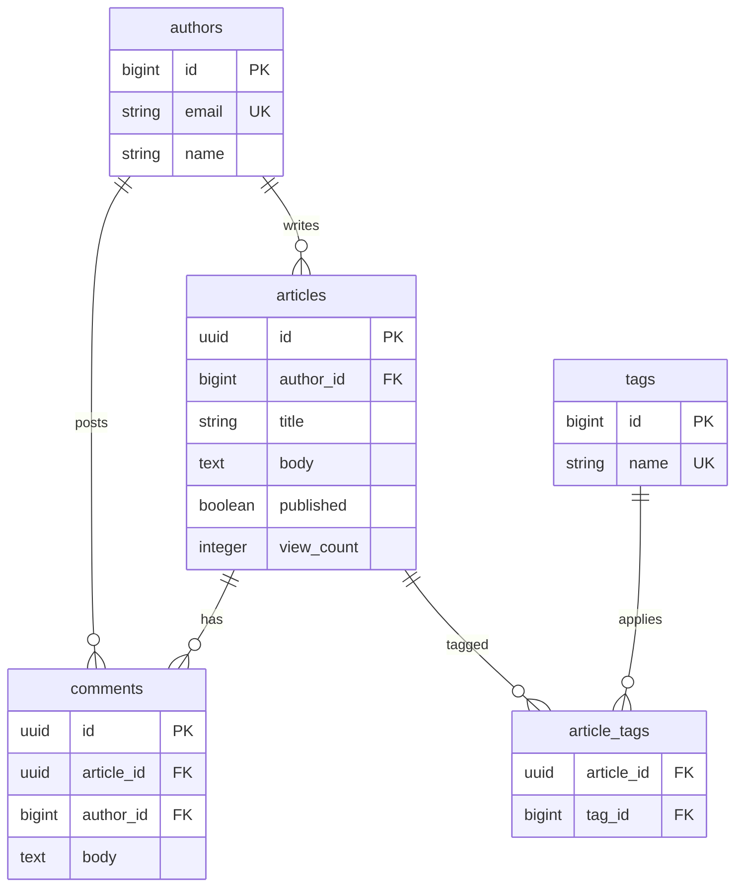

## この章で答える問い

- `EXPLAIN` というコマンドは何のためにあるのか？
- 最初の 1 行 `EXPLAIN SELECT * FROM articles;` の出力を、**一字一句**読み切れるか？
- 出力に出てくる `cost=0.00..12181.00` の数字は、いったいどうやって決まっているのか？

:::message
**この章のゴール**: EXPLAIN を「画面に出てきた呪文」から「自分で手計算で再現できる出力」に変える。
:::

## 主役クエリ

```sql
EXPLAIN SELECT * FROM articles;
```

WHERE も JOIN も無い、もっともシンプルな SELECT。これに `EXPLAIN` を付けた 1 行の出力を、5 つの数字に分解して、最後はコスト `12181.00` を**手計算で再現**するところまでやります。

---

## はじめに

<!--
TODO(human): この章の「つかみ」を 3〜5 行で本人の言葉で書く。
ヒント:
- 自分が EXPLAIN を読めなくて困った瞬間
- なぜ「完全把握」を目指したいか
- 読者にどんな状態になってほしいか
を本人の声で語る一段落。
ここをエージェントに書かせると、本全体がのっぺりした技術解説書になってしまう。
-->

---

## 1.1 EXPLAIN とは何か

EXPLAIN は、**SQL を実行する前に「PostgreSQL のプランナがどう実行するつもりか」を教えてくれる**コマンドです。

普段、SELECT を投げると PostgreSQL の中では大まかに次の 3 段階が走ります。

1. **パース** ─ SQL の文字列を構文解析する
2. **プラン** ─ どのテーブルをどう読み、どう結合するかを決める
3. **実行** ─ 決まった手順でデータを取り出す

`EXPLAIN` は **(2) で止めて、計画書だけを返してくれる**コマンドです。

ここで大事なのは、**`EXPLAIN` は SQL を実行しない**ということ。5 億行のテーブルに対して `EXPLAIN SELECT * FROM big_table;` を打っても、ディスクからデータは 1 行も読まれません（出力に出てくる `rows=5億` はあくまで**推定値**で、実行結果ではない）。本番 DB でも安心して打てます。ただし次章で扱う `EXPLAIN ANALYZE` は別物で、**実際にクエリが実行される**ので注意。

旅に出る前に地図を広げて「この道を通る予定だよ」と確認するイメージ。実際に歩き出してはいないので、足は疲れない。


---

## 1.2 環境の準備

本書のサンプル環境は以下のリポジトリにあります。アプリケーション層（Web フレームワーク等）は含まれていません。**PostgreSQL の Docker 環境とサンプルデータ、そして本書の章別クエリ集だけ**の軽量リポジトリです。読者はクエリを `psql` に流し込むだけで、本書と同じ実機実験ができます。

- リポジトリ: [`zenn-explain-analyze-sample`](https://github.com/hatsu38/zenn-explain-analyze-sample)
- 構成: **PostgreSQL 17 (Docker)** ─ ホスト port **5433** で公開
- データ規模: authors 2,000 / articles 100,000 / comments 1,000,000 / tags 200 / article_tags 約 60 万
- 章別クエリ集が `queries/ch01-*.sql` 〜 `queries/ch12-*.sql` に同梱

テーブル構成は以下の通りです。記事（articles）と著者（authors）、コメント（comments）、タグ（tags）が中心で、記事とタグは中間テーブル `article_tags` で多対多になっています。



```bash
git clone https://github.com/hatsu38/zenn-explain-analyze-sample.git
cd zenn-explain-analyze-sample
docker compose up -d
```

これだけです。**PostgreSQL 17 が起動し、初回起動時に `init/01-schema.sql` と `init/02-seed.sql` が自動実行**されて、スキーマ作成と約 170 万行のサンプルデータ投入まで走ります。データ投入は環境にもよりますが数十秒〜数分。

完了したかを確認するには:

```bash
docker compose logs db | tail
```

`02-seed.sql` の末尾に投入結果のサマリ表示があるので、

```
 table_name  | row_count
-------------+-----------
 article_tags| ...
 articles    |    100000
 authors     |       2000
 comments    |    1000000
 tags        |        200
```

のような出力が見えれば完了。

psql で接続するにはコンテナ経由で:

```bash
docker compose exec db psql -U postgres -d explain_sandbox
```

:::message
**章別クエリ集**: 本書 13 章ぶんのクエリは `queries/` ディレクトリに `ch01-*.sql` 〜 `ch12-*.sql` で同梱されています。本文を読みながら該当章のクエリを `psql` に流し込めば、本書と同じ実機実験を再現できます。
:::

統計情報を最新化しておきましょう（プランナの推定値が古くなっていると、本書の例と数字がズレます）。

```sql
ANALYZE;
```

---

## 1.3 最初の 1 行を打つ

いよいよ最初の EXPLAIN です。

```sql
EXPLAIN SELECT * FROM articles;
```

出力（サンプルアプリでの実測）:

```sql
EXPLAIN SELECT * FROM articles;
                            QUERY PLAN                            
------------------------------------------------------------------
 Seq Scan on articles  (cost=0.00..12181.00 rows=100000 width=852)
(1 row)
```

たった 1 行。でもこの 1 行に **5 つの情報** が詰まっています。

---

## 1.4 1 行を分解する

| 部分 | 意味 |
| --- | --- |
| `Seq Scan` | **ノードの種類**: Sequential Scan（テーブルを先頭から順に読む） |
| `on articles` | **対象テーブル**: articles |
| `cost=0.00..12181.00` | **プランナのコスト推定**（`スタートアップ..トータル`） |
| `rows=100000` | **このノードから返ると予想される行数** |
| `width=852` | **1 行あたりのバイト数の推定値** |

順番に見ていきます。

### Seq Scan（連続読み）

「Seq Scan = シーケンシャルスキャン = テーブルを先頭から末尾まで連続して読む」という、最もシンプルな読み方です。index を使わず、テーブルの全データページを物理的に上から順に舐めていきます。

WHERE 句がないので、絞り込みもありません。**100,000 行を全部読む**ことになります。


ここで重要なのは「index がないから Seq Scan」ではなく、**WHERE が無いので「絞り込む対象がそもそもない」→ 結局 11,181 ページ全部を読むなら一本道で読む方が速い**、というプランナの判断です。WHERE を付けたときに index が使われるかどうかは第 3 章で扱います。

### cost=0.00..12181.00 ─ 2 つの数字の意味

ここが最初の山場です。`cost=A..B` の意味:

- **A = スタートアップコスト**: 最初の 1 行を返すまでに必要なコスト
- **B = トータルコスト**: 全行を返し切るまでに必要なコスト

Seq Scan は「先頭ページを読んで、そこにある最初の行を返すだけ」で 1 行目を返せるので、スタートアップコスト = `0.00`。
全 100,000 行を読み切る作業量がトータルコスト = `12181.00`。

:::message alert
**よくある誤解**: この `12181` は**秒でもミリ秒でもない**。PostgreSQL 独自の相対単位で、「1 ページの連続読みに必要な作業量」を 1.0 と置いた、ただの数字です。実時間を知りたければ次章の `EXPLAIN ANALYZE` を使います。
:::

### rows=100000 ─ プランナの「予想」

ここで返る行数の**推定値**です。実行されていないので「推定」しかありません。
プランナはこれを `pg_class.reltuples`（テーブルの推定行数）から拾っています。

参考: https://www.postgresql.jp/document/17/html/catalog-pg-class.html

```sql
SELECT reltuples::bigint, relname FROM pg_class WHERE relname = 'articles';
```

```sql
 reltuples | relname  
-----------+----------
    100000 | articles
(1 row)
```

WHERE が無い Seq Scan なので、`reltuples` がそのまま `rows` になります。WHERE が付くと、ヒストグラムや MCV を使って絞り込まれます（第 9 章）。

### width=852 ─ 1 行あたりのバイト数

`articles` テーブルの全カラムを `SELECT *` で取ったときの、1 行あたり何バイトくらいになるかの推定です。`title VARCHAR` や `body TEXT` のような可変長カラムの平均長などを足し合わせて算出されています。

---

## 1.5 cost=12181.00 は手計算で再現できる

ここが第 1 章の山場です。プランナのコストは魔法ではなく、**単純な加算と乗算**で求められています。

PostgreSQL 公式ドキュメントには以下のように コストの 式が記載されています。

> 推定コストは（ディスクページ読み取り × `seq_page_cost`）+（スキャンした行 × `cpu_tuple_cost`）と計算されます。
> ─ [PostgreSQL 17.x 文書 14.1.1 EXPLAINの基本](https://www.postgresql.jp/document/17/html/using-explain.html)


Seq Scan のコスト計算式（WHERE なしの場合）:

```sql
total_cost = seq_page_cost × ページ数 + cpu_tuple_cost × 行数
```

ここに登場する 2 つのパラメータは、PostgreSQL がコストを見積もるときの **「単価表」** だと思ってください。

- **`seq_page_cost`** ─ テーブルを順番に読むときに **1 ページを取り出すコスト**（デフォルト `1.0`）
- **`cpu_tuple_cost`** ─ **1 行を CPU で処理するコスト**（デフォルト `0.01`）

参考: https://www.postgresql.jp/document/17/html/runtime-config-query.html#RUNTIME-CONFIG-QUERY-CONSTANTS

「ページの連続読み 1 回ぶん」を `1.0` の**基準**と置き、「CPU で 1 行さばく仕事」はその 1/100 くらい、というのが PostgreSQL の素朴な相場観です。なぜこの比率なのか、他にどんなパラメータがあるかは本節末の details で扱います。

サンプルアプリで実際の値を確認しましょう。

```sql
SELECT
  reltuples::bigint AS planner_rows,
  relpages,
  pg_size_pretty(relpages * 8192::bigint) AS table_size
FROM pg_class
WHERE relname = 'articles';
```

```sql
 planner_rows | relpages | table_size
--------------+----------+------------
       100000 |    11181 | 87 MB
```

- `relpages = 11181` ─ articles テーブルは **11,181 ページ** に格納されている（PostgreSQL の 1 ページは標準 8KB なので、8 * 11181 = 89,448 KB = 約 87MB）
- `planner_rows = 100000` ─ 行数の推定


ここで言う「ページ」の中身（ヒープタプルやインデックスタプル）については 3 章 3.2 で改めて扱います。今は「テーブルがページという単位で並んでいる」だけ押さえれば大丈夫です。

プランナのコストパラメータは `SHOW` で見られます。

```sql
SHOW seq_page_cost;    -- 1.0
SHOW cpu_tuple_cost;   -- 0.01
```

これらを式に代入すると:

```
total_cost = 1.0 × 11181 + 0.01 × 100000
           = 11181 + 1000
           = 12181.00
```

出力の `cost=0.00..12181.00` と**一致しました**。


こうやって書き下してみると、プランナの中身は意外と素朴です。コストは「ページを順に読むコスト × ページ数」と「1 行あたりの CPU 作業 × 行数」を足しただけ。難解な統計モデルが裏で動いているわけではありません。「いま見えているコストはこの公式から来ている」と分かるだけで、出力への怖さがぐっと減ります。

:::details さらに踏み込む ─ なぜ seq_page_cost = 1.0 が「基準」なのか
コストは無次元（単位なし）の相対値です。「1 ページの連続読みを 1.0 とする」と最初に決めたうえで、ランダム I/O や CPU コストを「何倍くらいか」で表現しています。

| パラメータ | デフォルト | 意味 |
| --- | --- | --- |
| `seq_page_cost` | 1.0 | 連続読みでページを 1 枚取るコスト（基準） |
| `random_page_cost` | 4.0 | ランダム I/O でページを 1 枚取るコスト（HDD 時代の名残） |
| `cpu_tuple_cost` | 0.01 | 1 行を処理する CPU コスト |
| `cpu_operator_cost` | 0.0025 | 演算子 1 回分の CPU コスト |

各パラメータの正式な定義・デフォルト値・チューニング指針は公式ドキュメントの「プランナコスト定数」にまとまっています。

参考: https://www.postgresql.jp/document/17/html/runtime-config-query.html#RUNTIME-CONFIG-QUERY-CONSTANTS

SSD/NVMe 時代には `random_page_cost = 1.1〜2.0` に下げると Index Scan が選ばれやすくなる ─ これは第 3 章で扱います。
:::

---

## 1.6 EXPLAIN が**しない**こと

最後に、EXPLAIN の安全性を確認しておきます。

- ❌ クエリを実行しない（データを読まない・書かない）
- ❌ 統計情報を更新しない
- ❌ prepared statement のキャッシュにも触れない

**本番 DB でも `EXPLAIN` だけなら安心して打てる**、というのは押さえておくべき事実です。一方で、次章の `EXPLAIN ANALYZE` は**実際にクエリを実行する**ので、`DELETE` や `UPDATE` に打つときは要注意 ─ これは第 2 章で詳しく扱います。

---

## 1.7 演習

1.5 で導いたコスト式

```
total_cost = seq_page_cost × relpages + cpu_tuple_cost × reltuples
```

が、`articles` 以外のテーブルでも同じく成り立つかを実機で確認する。

### 演習 1: 1,000,000 行の `comments` で同じ手計算をやる

`comments` は本書サンプルで最大のテーブル (1M 行)。`EXPLAIN` と `pg_class` を打って、上の式に代入したときに `total_cost` と一致するかを確かめる。

```sql
EXPLAIN SELECT * FROM comments;
SELECT relpages, reltuples::bigint FROM pg_class WHERE relname = 'comments';
```

確認すること:

- 式に代入した結果が `EXPLAIN` の `total_cost` とぴったり一致するか
- 行数が `articles` の 10 倍 (100k → 1M) なのに、`total_cost` が 10 倍にならないのはなぜか（ヒント: `width` の差で 1 ページに収まる行数が変わる）

:::details 答え合わせ
`comments` は `relpages=18182` / `reltuples=1000000` で、式に代入すると `1.0 × 18,182 + 0.01 × 1,000,000 = 28,182.00`。`EXPLAIN` の `cost=0.00..28182.00` と一致する。

行数 10 倍に対してコストが約 2.3 倍 (12,181 → 28,182) しか増えないのは、`comments` の `width=114` が `articles` の `width=852` よりずっと細く、1 ページに詰まる行数が多いから。**I/O コスト（relpages × seq_page_cost）が支配的なテーブルでは、行数よりデータの太さがコストを決める**。
:::

### 演習 2: 200 行の `tags` でも式は成り立つか

スケールの反対側、最小のテーブルでも同じ式が通るか確認する。

```sql
EXPLAIN SELECT * FROM tags;
SELECT relpages, reltuples::bigint FROM pg_class WHERE relname = 'tags';
```

確認すること:

- `relpages` が一桁、`total_cost` も一桁〜十数の小さい値になっているはず
- それでも `seq_page_cost × relpages + cpu_tuple_cost × reltuples` の式は同じく成り立つ

:::details 答え合わせ
`tags` は 200 行しかなく、`relpages` も 1〜2 ページに収まる。たとえば `relpages=2` / `reltuples=200` なら `1.0 × 2 + 0.01 × 200 = 4.00`。スケールが 5 桁違っても、プランナのコスト式は同じ 1 本の式で説明できる。
:::

---

## 章のまとめ

<!--
TODO(human): この章で学んだことを 3 行で、本人の言葉で。
ヒント:
- EXPLAIN は何で、何ではないか
- cost=0.00..12181.00 を見て何を思うか
- 次章への期待

エージェントに書かせると教科書的になってしまう。
ここは「自分の言葉で書き直す」価値が一番高い場所。
-->

---

## 次の章へ

第 1 章では「実行しない」EXPLAIN を見ました。第 2 章「**EXPLAIN ANALYZE**」では、`ANALYZE` をつけると何が出力に増えるか、`actual time=0.012..3.456 rows=100000 loops=1` の 4 つの数字をどう読むかを扱います。

そして第 3 章で、本章で手計算した「コスト」の世界に本格的に踏み込みます。
