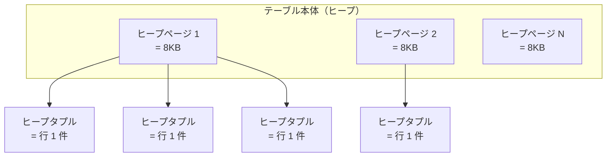
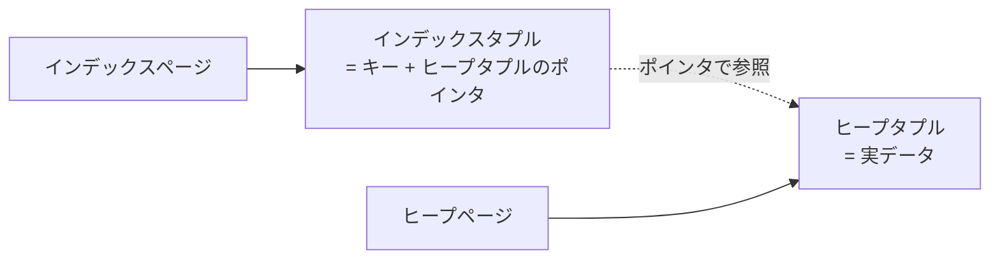

## この章で答える問い

- 1 章で見た Seq Scan のコスト式は、Index Scan ではどう変わるのか？
- 同じテーブルでヒット件数を増やすと、プランナはどうやってノードを選び分けているのか？
- `random_page_cost` が変わると、プランナの選び方はどう変わるのか？

:::message
**この章のゴール**: 同じテーブルでヒット件数を変えるとプランが Index Scan → Bitmap Heap Scan → Seq Scan と切り替わる様子を観察して、`random_page_cost` を動かすとその境目が動くことまで体感する。
:::

## 主役クエリ

同じ articles テーブルで、ヒット件数を変えていく 4 つのクエリ。

```sql
-- ① 1 行ヒット（0.001%）
EXPLAIN SELECT * FROM articles WHERE id = '...uuid...';

-- ② 数十行ヒット（0.05%）
EXPLAIN SELECT * FROM articles WHERE author_id = 1;

-- ③ 数千行ヒット（5%）
EXPLAIN SELECT * FROM articles WHERE author_id BETWEEN 1 AND 100;

-- ④ ほぼ全件ヒット（75%）
EXPLAIN SELECT * FROM articles WHERE published = true;
```

このシリーズを並べると、**プランナがヒット件数に応じて Index Scan / Bitmap Heap Scan / Seq Scan を選び分けている様子**が一覧で見えます。そのあと `random_page_cost` を動かして、選び分けの境目がどう動くかを実機で確かめます。

---

## はじめに

<!--
TODO(human): この章の「つかみ」を 3〜5 行で本人の言葉で書く。
ヒント:
- 1 章で Seq Scan の式は手計算できたが、Index Scan は？という疑問
- 同じテーブルでも WHERE を変えるだけでプランが Index → Bitmap → Seq とコロコロ変わる驚き
- 読者にどんな状態になってほしいか
-->

---

## 3.1 1 章のおさらい

1 章で見た Seq Scan のコスト式はこれでした。

```sql
total_cost = seq_page_cost × ページ数 + cpu_tuple_cost × 行数
```

ページコスト（連続読み）と CPU コスト（1 行処理）を足しただけのシンプルな構造。サンプルアプリの articles では `1.0 × 3951 + 0.01 × 100000 = 4951.00` と、出力の `cost=0.00..4951.00` にぴったり一致しました。

3 章では、この式を土台にしながら、まず Index Scan のコスト式を実機で再現します（3.3）。そのあと**同じテーブルでヒット件数を変えるとプランがどう切り替わるか**を観察し（3.4）、最後に `random_page_cost` を動かすとその境目が動くことを実機で見ます（3.5）。

---

## 3.2 ページとタプルの基本

ここから先のコスト式には「ページ」「ヒープページ」「インデックスタプル」のような PostgreSQL 特有の用語が出てきます。自分も最初は曖昧だったので、整理しておきます。

PostgreSQL はテーブルやインデックスのデータを、ディスク上に**ページ**という単位で並べています。1 ページは標準で **8KB**。テーブル本体のページを**ヒープページ**、インデックスのページを**インデックスページ**と呼びます。

ページの中には**タプル**が並んでいます。タプルは要するに「行 1 件」のこと。ヒープページに入っているのが**ヒープタプル**、インデックスページに入っているのが**インデックスタプル**です。



1 章で見た `relpages = 3951` は「articles テーブルが 3,951 個のヒープページに格納されている」という意味でした。3951 × 8KB ≈ 30 MB という計算も、ここから来ています。

インデックスはこれとは別の構造を持っています。



インデックスタプルが持っているのは「キー（カラム値）と、そのキーに対応するヒープタプルの位置を指すポインタ」だけ。実データ本体は対応するヒープタプルにあるので、インデックスから引いたあとはポインタを辿ってヒープページを読みに行く、という二段構えになります。Index Scan で「インデックスを引いた後にヒープページを訪問する」と説明される構造の正体がこれです。

ページを読む I/O にも 2 種類あります。

- **連続 I/O (sequential I/O)**: ディスクのページを順番に読む読み方。Seq Scan が典型で、物理的にディスクの先頭から後ろへ読み進めます。コスト 1.0（基準）。
- **ランダム I/O (random I/O)**: 飛び飛びのページを読む読み方。Index Scan のように「次はこのページ、その次はあのページ」と跳ねます。HDD ではヘッド移動の分だけ遅くなります。コスト 4.0（HDD 時代の値）。

SSD / NVMe の時代になってランダム I/O のペナルティが小さくなったので、`random_page_cost` を下げるチューニングがよく行われます。これは 3.5 で実際に動かして確かめてみます。

---

## 3.3 1 行を取り出すコスト

まずは、Index Scan が **きれいに** 出るピンポイントなクエリで、コスト式を実機と手計算で突き合わせてみます。

Index Scan は「インデックスを引いて、必要なヒープページだけを読みに行く」読み方です。Seq Scan が**全ページを順に**読むのに対して、Index Scan は**必要なページだけランダムに**読むので、コスト式に登場するページコストが変わります。

Index Scan の完全なコスト式は、公式ドキュメントには明示されていません。一次資料は PostgreSQL のソースコード [`src/backend/optimizer/path/costsize.c`](https://github.com/postgres/postgres/blob/REL_17_STABLE/src/backend/optimizer/path/costsize.c) の `cost_index` 関数で、これを読み解くとざっくり次のような形になります。

```sql
index_scan_cost = random_page_cost × 訪問するヒープページ数
                + cpu_index_tuple_cost × インデックスタプル数
                + cpu_tuple_cost × ヒープタプル数
                + (B-tree 探索の補助コスト)
```

新しく出てきたのは `random_page_cost`（ランダム I/O のページコスト、デフォルト `4.0`）と `cpu_index_tuple_cost`（1 インデックスタプル処理のコスト、デフォルト `0.005`）の 2 つです。

公式ドキュメントにも、これらのパラメータがインデックスアクセスのコスト計算で使われていることは、周辺記述として書かれています。

> インデックスアクセスコストは `src/backend/optimizer/path/costsize.c` で使われる、逐次的なディスクブロックの取り出しには `seq_page_cost` のコストが、順不同の取り出しには `random_page_cost` のコストが、そして、1つのインデックス行の処理には通常 `cpu_index_tuple_cost` というコストがかかる
> ─ [PostgreSQL 17.x 文書 62.6 インデックスコスト推定関数](https://www.postgresql.jp/document/17/html/index-cost-estimation.html)

### 1 行ヒットで実測する

サンプルアプリの articles から、`id`（UUID 主キー）で 1 件ピンポイントに取得してみます。

```sql
SELECT id FROM articles LIMIT 1;
--                  id
-- --------------------------------------
--  ac9f8b3d-6bd0-44ab-86b0-d707efb9d546

EXPLAIN SELECT * FROM articles WHERE id = 'ac9f8b3d-6bd0-44ab-86b0-d707efb9d546';
```

出力:

```sql
                                   QUERY PLAN
--------------------------------------------------------------------------------
 Index Scan using articles_pkey on articles  (cost=0.42..8.44 rows=1 width=269)
   Index Cond: (id = 'ac9f8b3d-6bd0-44ab-86b0-d707efb9d546'::uuid)
```

`rows=1` なので、ヒープタプル数 = 1、インデックスタプル数 = 1、訪問するヒープページ数 = 1 のはず。これを式に当てはめてみます。

```sql
random_page_cost × 1  +  cpu_index_tuple_cost × 1  +  cpu_tuple_cost × 1
= 4.0 × 1 + 0.005 × 1 + 0.01 × 1
= 4.015
```

…ところが実際の `cost=0.42..8.44` のトータルは **8.44**。**約 4.4 ぶん余っています**。

ここで立ち止まって考えたいのが、**1 行を引くために、PostgreSQL はヒープページだけ読んでいるのか？** という点です。

実は違います。B-tree インデックスは、ルートページ → 中間ノードのページ → 葉ノードのページ → ヒープ、と**インデックスのページを何枚かたどってから**ヒープに到達します。`articles_pkey` も B-tree なので、何ページか踏みます。


`cost=0.42..8.44` の内訳を分けて読むと、こう解釈できます。

- **スタートアップ `0.42`**: B-tree のルートから葉までたどる作業（インデックスの高さに依存）
- **トータルから引いた残り `8.02`**: その後の動き。だいたい「インデックス葉ページ 1 枚をランダムに読む（4.0）」+「ヒープページ 1 枚をランダムに読む（4.0）」+「CPU で 1 行処理（0.015）」で 8.015。実値とほぼ一致

手計算するとこうなります。

```sql
0.42 (B-tree 降下)
+ 4.0 (インデックス葉ページのランダム I/O)
+ 4.0 (ヒープページのランダム I/O)
+ 0.01 (cpu_tuple)
+ 0.005 (cpu_index_tuple)
≒ 8.44
```

出力の `cost=0.42..8.44` と一致しました。Index Scan のコストは、Seq Scan のように「ページ数 × seq_page_cost + 行数 × cpu_tuple_cost」ほど単純ではないですが、**B-tree を降りてからインデックス葉ページとヒープページを少しずつランダムに読む**という構造が、数字にそのまま出ています。

---

## 3.4 件数が増えるとプランは Index → Bitmap → Seq と変わる

3.3 で扱ったのは **1 行ヒット** のクエリでした。同じ articles テーブルで、ヒット件数を増やしていくと、プランがどう変わるか観察してみます。

```sql
-- ② 数十行ヒット
EXPLAIN SELECT * FROM articles WHERE author_id = 1;

-- ③ 数千行ヒット
EXPLAIN SELECT * FROM articles WHERE author_id BETWEEN 1 AND 100;

-- ④ ほぼ全件ヒット
EXPLAIN SELECT * FROM articles WHERE published = true;
```

実機の出力をまとめると、こうなります。

| 段階 | クエリ | ヒット件数 | 全体比 | プラン | トータルコスト |
|---|---|---|---|---|---|
| ① | `WHERE id = 'uuid'` | 1 | 0.001% | Index Scan | 8.44 |
| ② | `WHERE author_id = 1` | 49 | 0.05% | Bitmap Heap Scan | 184.91 |
| ③ | `WHERE author_id BETWEEN 1 AND 100` | 4,931 | 5% | Bitmap Heap Scan | 4,312.86 |
| ④ | `WHERE published = true` | 75,250 | 75% | Seq Scan | 4,951.00 |

ストーリーになっていますね。**ヒット件数が増えるにつれて Index Scan → Bitmap Heap Scan → Seq Scan と切り替わっていく**。プランナは「rows がどれくらいか」を見て、その都度安いノードを選んでいる様子が一覧で見えます。

### ② 数十行ヒット ─ Bitmap Heap Scan が顔を出す

`WHERE author_id = 1`（49 行ヒット）の出力:

```sql
 Bitmap Heap Scan on articles  (cost=4.67..184.91 rows=49 width=269)
   Recheck Cond: (author_id = 1)
   ->  Bitmap Index Scan on index_articles_on_author_id  (cost=0.00..4.66 rows=49 width=0)
         Index Cond: (author_id = 1)
```

予想では Index Scan が出ると思っていたのに、Bitmap Heap Scan が選ばれました。なぜか？

49 行を 1 行ずつ Index Scan で引くと、ランダム I/O が 49 回。`random_page_cost × 49 = 4.0 × 49 = 196` くらいのコストになる見込みです。一方、Bitmap でまとめてからヒープを読むと、ビットマップ作成の前処理（スタートアップ `4.67`）が乗るものの、ヒープアクセスは**ソート済み順で読める**ので少し安くなり、トータルが `184.91` で済んでいます。**Bitmap のほうが Index Scan より少し安い**、というのがプランナの判定です。

ちなみに Bitmap Heap Scan のスタートアップコスト `4.67` は、その下の Bitmap Index Scan のトータル `4.66` とほぼ一致しています。「ビットマップが揃ってからヒープを読み始める」というノードの性格が、数字にそのまま出ています。

公式ドキュメントも Bitmap の性格を簡潔にまとめています。

> 行を別々に取り出すことは、シーケンシャルな読み取りに比べ非常に高価です。しかし、テーブルのすべてのページを読み取る必要はありませんので、シーケンシャルスキャンより安価になります。
> ─ [PostgreSQL 17.x 文書 14.1.1 EXPLAINの基本](https://www.postgresql.jp/document/17/html/using-explain.html)

### ③ 数千行ヒット ─ コストはほぼリニアに増える

`WHERE author_id BETWEEN 1 AND 100`（4,931 行ヒット）の出力:

```sql
 Bitmap Heap Scan on articles  (cost=78.84..4312.86 rows=4931 width=269)
   ...
   ->  Bitmap Index Scan ...  (cost=0.00..77.60 rows=4931 width=0)
```

まだ Bitmap Heap Scan です。ヒット件数が 49 → 4,931 と約 100 倍になって、トータルコストも約 100 倍（184.91 → 4,312.86）。**Bitmap Heap Scan のコストはヒット件数にほぼリニア**に乗っています。

スタートアップコストも `4.67 → 78.84` と大きく増えています。これは「ビットマップを作るために読むインデックス葉ページ」が増えたから。インデックスをスキャンする量も、ヒット件数に応じて増えていきます。

### ④ ほぼ全件ヒット ─ Seq Scan に戻る

`WHERE published = true`（75,250 行ヒット = 全体の 75%）の出力:

```sql
 Seq Scan on articles  (cost=0.00..4951.00 rows=75250 width=269)
   Filter: published
```

ヒット件数が増えすぎて、ついに **Seq Scan に戻りました**。

ここで一つ気付きがあります。この `cost=0.00..4951.00` の `4951.00`、どこかで見覚えがありませんか？

1 章で `EXPLAIN SELECT * FROM articles;`（**WHERE なし**）を打ったときと**完全に同じ値**です。なぜか？

答えは「Seq Scan は全ページを順に読むので、WHERE があってもなくても**全件読むという作業量は同じ**」だから。`Filter: published` は読み終わったあとに行ごとに「これは true？」と判定するだけ。だからコストが変わりません。

これがプランナの判断にも効いてきます。④ で Bitmap Heap Scan を選んでも、ヒット件数が多すぎてビットマップ作成のコストが Seq Scan のコストを上回ってしまいます。だったら**最初から Seq Scan で全部読んだほうが安い**、というわけです。

### LIMIT を付けると話が変わる

ここでひとつ寄り道します。② の `WHERE author_id = 1`（49 行ヒット）は Bitmap Heap Scan が選ばれましたが、同じクエリに `LIMIT 5` を付けると何が起きるでしょうか。

```sql
EXPLAIN SELECT * FROM articles WHERE author_id = 1 LIMIT 5;
EXPLAIN SELECT * FROM articles WHERE author_id = 1 LIMIT 1;
```

出力:

```sql
 Limit  (cost=0.29..20.79 rows=5 width=269)
   ->  Index Scan using index_articles_on_author_id on articles  (cost=0.29..201.14 rows=49 width=269)
         Index Cond: (author_id = 1)

 Limit  (cost=0.29..4.39 rows=1 width=269)
   ->  Index Scan using index_articles_on_author_id on articles  (cost=0.29..201.14 rows=49 width=269)
         Index Cond: (author_id = 1)
```

LIMIT 無しのときは Bitmap Heap Scan だったのに、LIMIT を付けたら **Index Scan に切り替わりました**。下の Index Scan のトータルコストは `201.14`（LIMIT 5 でも LIMIT 1 でも同じ）。上の Limit ノードのコストだけが、LIMIT N に応じて動きます（LIMIT 1 で 4.39、LIMIT 5 で 20.79）。

なぜ切り替わるかというと、Index Scan は「インデックスを 1 行ずつ引いて返す」読み方なので、**最初の N 行だけ取れれば早期終了できる**から。一方 Bitmap は「ビットマップを全行ぶん作って、それからヒープを読む」ので、LIMIT があっても前処理が変わらず、結局全行ぶんの作業をしてしまいます。プランナはこの違いを見て「LIMIT があるなら Index Scan のほうが安い」と判断したわけです。

実務でも `WHERE x = ? LIMIT 10` のような並びのクエリはよく書きますが、LIMIT の有無でプランがガラッと変わることがある、というのは覚えておくと役立ちそうです。

### まとめ ─ プランナはヒット件数でノードを選び分けている

実測の 4 段階を並べると、こう読めます。

- **0.001%（1 行）**: Index Scan が最安。B-tree を降りて 1 行ピンポイントで引く
- **0.05%（数十行）**: Bitmap Heap Scan が最安。ランダム I/O が増えてきたのでまとめ読みのほうが得
- **5%（数千行）**: まだ Bitmap Heap Scan。コストはヒット件数にほぼリニアに増える
- **75%（ほぼ全件）**: Seq Scan が最安。もう全件読むなら順に読んだほうが速い

プランナは「何行ヒットしそうか（`rows` の推定）」を見て、毎回コスト最小のノードを選んでいる、という構造が見えました。Index Only Scan（4 章）、Sort（5 章）、JOIN 系のノード（6・7 章）と、別の場面で活躍するノードも次章以降で順に扱っていきます。3 章では「プランナがコストを軸にどう選び分けているか」を体感するのが目的でした。

---

## 3.5 random_page_cost を動かすと何が起きるか

ここが第 3 章の山場です。

1 章の details で「SSD/NVMe 時代には `random_page_cost = 1.1〜2.0` に下げると Index Scan が選ばれやすくなる」と予告しました。実際に手元で動かしてみます。動かす方向は 2 つ。下げる方向と、上げる方向です。

### 実験 1: random_page_cost を下げる

3.4 で Bitmap Heap Scan が選ばれた「`WHERE author_id BETWEEN 1 AND 100`」（5% ヒット）を素材にして、`random_page_cost` をデフォルトの `4.0` から `1.1` に下げてみます。

```sql
SHOW random_page_cost;   -- 4.0（デフォルト）
EXPLAIN SELECT * FROM articles WHERE author_id BETWEEN 1 AND 100;

SET random_page_cost = 1.1;
EXPLAIN SELECT * FROM articles WHERE author_id BETWEEN 1 AND 100;
```

出力の要点だけ並べると:

| `random_page_cost` | プラン | スタートアップ | トータル |
|---|---|---|---|
| 4.0 | Bitmap Heap Scan | 78.84 | **4,312.86** |
| 1.1 | Bitmap Heap Scan | 58.54 | **3,206.94** |

**プラン名は変わりませんでした**。「`random_page_cost` を下げると Index Scan に切り替わる」と思い込んでいたら、現実はもっと地味で、Bitmap のままコストだけが約 26% 減っています。Bitmap Heap Scan はヒープアクセスもインデックス側もランダム I/O が含まれるので、`random_page_cost` を下げると一律で安くなる、という効き方です。

Index Scan に切り替わらなかった理由を逆算してみると、もし Index Scan で 4,931 行を引いたら最低でも `random_page_cost × 4,931 = 1.1 × 4,931 = 5,424` くらいかかる見込み。これは Bitmap の `3,206.94` よりまだ高いので、Bitmap が勝ち続けます。サンプルアプリの 5% ヒットでは、`random_page_cost` を下げてもプランの切り替えは起きない、ということが見えました。

### 実験 2: random_page_cost を上げる

同じクエリで、今度は `random_page_cost` を **上げて** みます。

```sql
SET random_page_cost = 10;
EXPLAIN SELECT * FROM articles WHERE author_id BETWEEN 1 AND 100;

SET random_page_cost = 100;
EXPLAIN SELECT * FROM articles WHERE author_id BETWEEN 1 AND 100;

RESET random_page_cost;
```

出力:

```sql
 Seq Scan on articles  (cost=0.00..5451.00 rows=4931 width=269)
   Filter: ((author_id >= 1) AND (author_id <= 100))
```

`random_page_cost = 10` でも `= 100` でも、出力は **完全に同じ Seq Scan のコスト 5,451.00**。Bitmap → Seq Scan に切り替わりました。

ここでひとつ考えたいのは、なぜ `random_page_cost = 10` と `= 100` で Seq Scan のコストが同じ `5,451.00` なのか、という点です。出てきたプランは Seq Scan ですが、Seq Scan は **連続 I/O** で読む読み方なので、`random_page_cost` はそもそも使われません。だから `random_page_cost` をいくら上げても、Seq Scan のコスト自体は動かないわけです。

これが大事な気付きです。**`random_page_cost` を変えると、Bitmap や Index Scan のコストは動く。でも Seq Scan のコストは動かない**。プランナはこの相対バランスを見て選び直しているので、`random_page_cost` を上げると「ランダム I/O が必要なノードが相対的に不利になる → Seq Scan が勝つ」という形で切り替わります。

### おまけ: 5,451.00 を手計算で再現する

ここで出てきた Seq Scan のコスト `5,451.00`、1 章で見た WHERE なしの Seq Scan のコスト `4,951.00` と微妙に違います。差は **500**。これは何のコストか、手計算で詰められます。

出力の `Filter: ((author_id >= 1) AND (author_id <= 100))` に注目すると、WHERE 条件を行ごとに評価する CPU コストが乗っているはずです。

```sql
cpu_operator_cost × オペレータ数 × 行数
= 0.0025 × 2 (>= と <=) × 100,000
= 500.00
```

Seq Scan の全体コストを、1 章のコスト式に WHERE 句評価ぶんを足して書くと:

```sql
seq_page_cost × ページ数 + cpu_tuple_cost × 行数 + cpu_operator_cost × オペレータ数 × 行数
= 1.0 × 3,951 + 0.01 × 100,000 + 0.0025 × 2 × 100,000
= 3,951 + 1,000 + 500
= 5,451.00
```

実値の `5,451.00` とぴったり一致しました。1 章のコスト式に **WHERE 句評価のコスト** が乗っただけ、というのが見えます。コスト式がそのまま素直に拡張できる、ということでもあります。

### SSD/NVMe 時代のチューニングの話

実機の I/O 性能と `random_page_cost` がズレていると、プランナは「ランダム I/O を避ける」方向に偏ったプランを選びます。SSD/NVMe 上の本番 DB で Seq Scan ばかり選ばれるなら、`random_page_cost` を下げてみると、Bitmap や Index Scan のコストが下がってプランが切り替わる可能性があります。

ただ、今回の実験で見たように、選択率や元のプランによっては、`random_page_cost` を動かしてもプラン名は変わらず、コストだけが地味に動くだけ、ということもあります。「下げれば必ず Index Scan が選ばれる」みたいな単純な話ではなく、コストの相対バランスがどう変わるかを実機で確かめるのが現実的そうです。

なお、`enable_bitmapscan = off` のような **プランナのスイッチ系パラメータ** を使うと、コストとは別の軸で「このプランを選ばせない」と指示できます。これは 11 章「プランナの挙動を制御する」で改めて扱います。

---

## 3.6 プランナはコスト最小を選ぶ

プランナは、複数の候補プランの中から**コスト合計が最も小さい**ものを選びます。これだけ書くと当たり前ですが、ここに 2 章の話と繋がる罠があります。

「コスト最小」は「実時間最小」と必ずしも同じではありません。コストはあくまで `rows` の**推定値**を元に計算されるので、推定が外れているとコストも外れます。2 章で扱った乖離（`rows` と `actual rows` のズレ）が大きいと、プランナは「コスト最小のつもりで、実時間最大のプラン」を選ぶことがあります。

| 推定の状態 | プランナの選択 | 実時間 |
| --- | --- | --- |
| 推定が当たっている | コスト最小 = 実時間最小に近い | 想定通り |
| 推定が大きく外れている | コスト最小（だが推定ベース） | 実時間が爆発することも |

このすれ違いの中身は、9 章「プランナと統計情報」で深掘りします。プランナの見立てを当てるには、統計情報をどう保てばいいのか、というのが 9 章の主題です。

---

## 章のまとめ

<!--
TODO(human): この章で学んだことを 3 行で、本人の言葉で。
ヒント:
- 同じテーブルでヒット件数を変えるとプランがコロコロ変わる
- random_page_cost を動かしたときの驚き
- 次章への期待
-->

---

## 次の章へ

第 3 章では、Seq Scan 以外のノードのコスト式（Index Scan）と、プランナがヒット件数に応じてノードを選び分ける様子を見ました。第 4 章「**Index Only Scan と visibility map**」では、`SELECT id FROM articles WHERE id = ?` のような「インデックスだけで答えが返せるクエリ」を扱います。`Heap Fetches` がゼロになる条件と、その背後にある visibility map のしくみを実機で確かめます。
