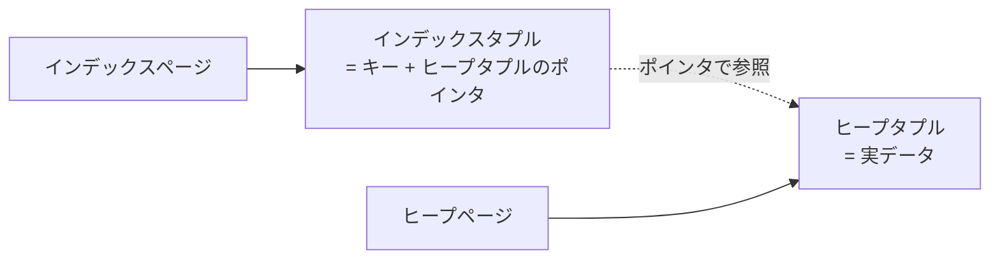
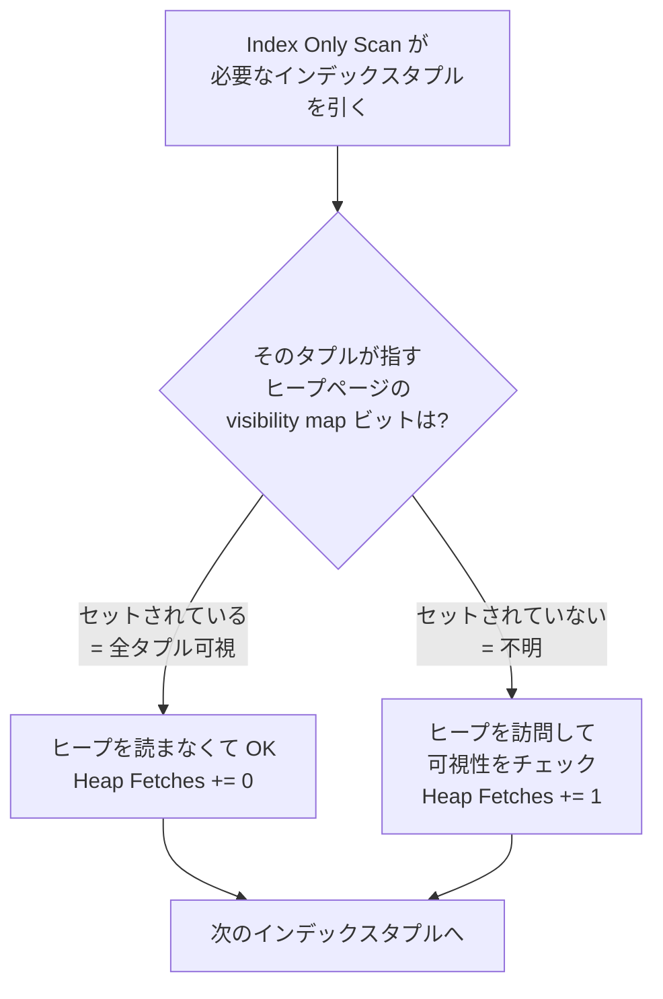

## この章で答える問い

- Index Only Scan は Index Scan と何が違うのか？
- 出力に出てくる `Heap Fetches` とは何で、なぜゼロにできるとうれしいのか？
- visibility map は誰がいつ更新しているのか？

:::message
**この章のゴール**: `SELECT id FROM articles WHERE id = ?` のような「インデックスだけで答えが返せるクエリ」で Index Only Scan が出る条件を実機で確かめ、その背後にある visibility map のしくみまで自分の言葉で説明できるようになる。
:::

## 主役クエリ

```sql
EXPLAIN ANALYZE SELECT id FROM articles WHERE id = '...uuid...';
```

3 章で打った `SELECT * FROM articles WHERE id = '...'`（全カラムを返す）に対して、`SELECT *` を `SELECT id` に書き換えるだけです。たったそれだけで、PostgreSQL の挙動はガラッと変わります。

---

## はじめに

<!--
TODO(human): この章の「つかみ」を 3〜5 行で本人の言葉で書く。
ヒント:
- 3 章で Index Scan の手計算をやったが、SELECT * を SELECT id に変えるだけで何かが変わると気づいた瞬間
- Heap Fetches: 0 を初めて見たときの「これは何？」感
- 読者にどんな状態になってほしいか
-->

---

## 4.1 3 章のおさらい

3 章では、`articles` テーブルから 1 行だけ引くクエリで Index Scan が出ました。

```sql
EXPLAIN SELECT * FROM articles WHERE id = '0b3f973e-20c5-4459-8010-2bc0882d1102';
```

```sql
 Index Scan using articles_pkey on articles  (cost=0.42..8.44 rows=1 width=269)
   Index Cond: (id = '0b3f973e-20c5-4459-8010-2bc0882d1102'::uuid)
```

`cost=0.42..8.44` の内訳を、3 章で次のように分解したのを覚えていますか。

```sql
0.42 (B-tree 降下)
+ 4.0 (インデックス葉ページのランダム I/O)
+ 4.0 (ヒープページのランダム I/O)
+ 0.01 (cpu_tuple)
+ 0.005 (cpu_index_tuple)
≒ 8.44
```

**この内訳のうち、`+ 4.0 (ヒープページのランダム I/O)` が消えたらどうなるか**。それが 4 章のテーマです。

---

## 4.2 SELECT id に変えると Index Only Scan が出る

3 章のクエリの `SELECT *` を `SELECT id` に書き換えて、もう一度打ってみます。

```sql
EXPLAIN ANALYZE SELECT id FROM articles WHERE id = '0b3f973e-20c5-4459-8010-2bc0882d1102';
```

出力（サンプルアプリでの実測）:

```sql
                                                  QUERY PLAN
--------------------------------------------------------------------------------------------------------------
 Index Only Scan using articles_pkey on articles  (cost=0.42..4.44 rows=1 width=16) (actual time=... rows=1 loops=1)
   Index Cond: (id = '0b3f973e-20c5-4459-8010-2bc0882d1102'::uuid)
   Heap Fetches: 0
 Planning Time: ...
 Execution Time: ...
```

<!-- TODO(human): 上の出力の actual time / Planning Time / Execution Time に実機の値を入れる。Heap Fetches の値も実機で確認（0 になるはず、ならない場合は 4.5 で扱う）。 -->

3 章では `Index Scan` だったノードが、`Index Only Scan` に変わりました。それと一緒に出力に **`Heap Fetches: 0`** という見慣れない行が増えています。

そして、トータルコストにも注目してください。3 章では `8.44` だったのが、ここでは **`4.44`**。ぴったり **4.0 が消えています**。3 章の内訳でいう「ヒープページのランダム I/O のコスト `4.0`」がそのまま無くなった形です。

なぜヒープを読まなくていいのか、というのが次の節の話です。

---

## 4.3 なぜヒープを読まなくていいのか

3 章 3.2 で見たインデックスタプルの構造を思い出してください。



インデックスタプルは「キー（カラム値）+ ヒープタプルの位置」を持っています。今回のクエリは `WHERE id = ?` で絞って `SELECT id` を返すだけ。返すべき `id` の値は、**インデックスタプルがもう持っています**。だからヒープページを読みに行く必要が無い。

これが Index Only Scan の正体です。「インデックスだけで答えが返せる」場合、PostgreSQL は Index Scan ではなく Index Only Scan を選びます。

ただし、これだけだと話は単純ではありません。MVCC の問題が残っています。

---

## 4.4 ただし MVCC では「見えない行」がある

ここで「インデックスだけで答えが作れるならいつでもヒープを読まなくていい」と言いたいところですが、実はそう単純ではありません。**MVCC** というしくみが間に挟まるからです。

### MVCC は「上書き」せず「追記」する更新方式

**MVCC** は **Multi-Version Concurrency Control** の略で、日本語に直すと「複数バージョン同時実行制御」。長い名前ですが、やっていることはシンプルで、**行を上書きせず、新しい行を別に作って古い行はそのまま残す** という DB の更新方式です。

公式ドキュメントは MVCC の目的をこう説明しています。

> 内部的に、データ一貫性は多版方式（多版型同時実行制御MVCC）を使用して管理されています。つまり、処理の基礎となっているデータの現在の状態にかかわらず、各SQL文は遡ったある時点におけるスナップショット（データベースバージョン）を参照する、というものです。
> ─ [PostgreSQL 17.x 文書 13.1 はじめに](https://www.postgresql.jp/document/17/html/mvcc-intro.html)

「**スナップショットを参照する**」という挙動を実現するために、PostgreSQL は古い行を残しておく、という設計を採っています。具体的にどう動くかを見てみましょう。

たとえば、あなたのトランザクション（仮に `T100` とします）が `articles` の `id=A` の行を `UPDATE` したとします。普通のプログラムだと、メモリ上の変数を新しい値で上書きすれば終わり。ところが PostgreSQL は、

```
古い行:   id=A, ...   （手付かずでテーブルに残る）
新しい行: id=A, ...   （同じ id の行が、別の場所に追加される）
```

という二行構えにします。テーブルにはこの瞬間、**同じ `id=A` の行が 2 つ並んでいる**状態になります。

この挙動は、VACUUM の解説でも公式に明記されています。

> PostgreSQLでは、行のUPDATEもしくはDELETEは古い行を即座に削除しません。この方法は、多版同時性制御（MVCC。第13章を参照してください）の恩恵を受けるために必要なものです。あるバージョンの行は他のトランザクションから参照される可能性がある場合は削除されてはなりません。
> ─ [PostgreSQL 17.x 文書 24.1 通常のバキューム作業](https://www.postgresql.jp/document/17/html/routine-vacuuming.html)

なぜそんな面倒なことをするのか。それは、別のトランザクション（仮に `T101` とします）が同じ瞬間に `SELECT * FROM articles WHERE id=A` を投げてきたときに、`T101` には古い行を、`T100` には新しい行を、それぞれ別の景色として見せたいから。**書き手と読み手が互いをロックで待たない**、という同時並行を実現する設計が MVCC のご利益です。「他のトランザクションから参照される可能性」を守るために、古い行をすぐに消せない、という公式の言葉そのままの構造になっています。

### 各行に刻まれる xmin と xmax

「同じ id の行が 2 つ並んでいる」と言われても、どっちが「自分から見える行」なのか、どうやって決まるのでしょうか。ここで `xmin` / `xmax` という 2 つのメタ情報が登場します。

- `xmin`: その行を **作った** トランザクションの ID（行の「生年」のようなもの）
- `xmax`: その行を **削除した（または UPDATE で消された）** トランザクションの ID。まだ削除されていなければ `0`（行の「享年」のようなもの）

UPDATE の瞬間にどんな書き込みが起きているか、もう少し細かく追ってみます。

```
UPDATE 前
  古い行: xmin=T50, xmax=0      ← T50 に作られて、まだ生きている

T100 が UPDATE する
  古い行: xmin=T50, xmax=T100   ← T100 が削除マークを付ける
  新しい行: xmin=T100, xmax=0   ← T100 が新しく作る
```


つまり PostgreSQL の UPDATE は「上書き」ではなく、**古い行に削除マーク（`xmax`）を付けて、新しい行を別に追加する** という動きです。削除マークが付いただけで、物理的にはまだテーブル上に残っている、というのが大事なポイント。これが 10 章で出てくる **死んだ行（dead tuple）** の正体でもあります。

### 「自分から見える行」の判定

各行の `xmin` / `xmax` を、自分のトランザクション ID と比較すれば、「この行は今の自分から見える行か」が判定できます。

たとえば、自分のトランザクション ID が `T120` のとき、行 R の状態を見て:

| R の `xmin/xmax` | T120 から見える？ | 理由 |
|---|---|---|
| `xmin=T50, xmax=0` | 見える | T50（過去）に作られて、まだ生きている |
| `xmin=T50, xmax=T80` | 見えない | T80（自分が始まる前）に削除された |
| `xmin=T200, xmax=0` | 見えない | T200（自分より未来）に作られる予定 |


このように、行の `xmin` / `xmax` を覗かないと「今のトランザクションから見える行か」が判定できません。**「見えない行」もテーブル上には物理的に存在している**、というのがミソです。

### インデックスタプルには xmin / xmax がない

ここが章のキモです。3 章 3.2 で見たとおり、**インデックスタプル** は「キー値（カラムの値）+ ヒープへのポインタ」しか持っていません。一方の `xmin` / `xmax` は **ヒープタプル本体だけ** が持っている情報です。

なぜインデックスにもコピーしないのか？ 答えは「コピーすると UPDATE のたびにインデックス側も書き換えなくてはならなくなり、書き込みコストが激増する」から。だから PostgreSQL は「**可視性の情報はヒープにだけ置く**」という設計を採っています。

### つまり本来はインデックスだけでは答えられない

これで話が一周します。`SELECT id FROM articles WHERE id = A` を引くとき、インデックスから「キー A のエントリが見つかった」と分かっても、そのエントリが指している行は、

- 過去に削除された dead tuple かもしれない
- まだコミットされていない他のトランザクションが作った行かもしれない

`xmin` / `xmax` を見ないとどれなのか判別できません。**だから本来はヒープを開いて、行のメタ情報を確認する必要がある**、はずです。これが 3 章で見た Index Scan の「ヒープランダム I/O `+4.0`」の正体の半分でした（残り半分は「id 以外のカラムを返すため」）。

でも、現実には Index Only Scan は **ヒープを読まずに** 答えを返せることがあります。`Heap Fetches: 0` がその証拠です。**なぜそんなことができるのか**。答えは visibility map にあります。

---

## 4.5 visibility map というショートカット

PostgreSQL は **可視性マップ（visibility map、略して VM）** という補助構造を、ヒープテーブルごとに 1 つ持っています。この VM があるおかげで、Index Only Scan は「ヒープを開かなくても見える行か判定できる」という芸当ができます。

### ヒープページに 1 対 1 対応する小さなビット列

可視性マップは、ヒープテーブルとは別ファイルとしてディスク上に置かれている、**小さなビット列** です。ヒープページ 1 つにつき、可視性マップに 2 ビットが対応しています。

このうち Index Only Scan が見るのは **all-visible ビット**（公式ドキュメントの言う「最初のビット」）。意味は **「このヒープページに入っている全行が、すべてのトランザクションから見える」**。言い換えると「このページには、削除マークが付いた行も、まだコミットされていない行も、1 つも入っていない」という状態を表します。

公式ドキュメントから:

> 可視性マップはヒープページ当たり2ビットを保持します。最初のビットがセットされていれば、ページはすべて可視であること、すなわち、そのページにはバキュームが必要なタプルをまったく含んでいないことを示しています。
> ─ [PostgreSQL 17.x 文書 65.4 可視性マップ](https://www.postgresql.jp/document/17/html/storage-vm.html)


ここで「ビット列のサイズ感」をざっと押さえておきます。ヒープページが 11,000 個あるテーブルなら、可視性マップ自体のサイズは `11,000 × 2 bit ÷ 8 = 2,750 バイト` ≒ 約 3KB 程度。ヒープ本体（11,000 × 8KB = 約 88MB）に比べると、桁違いに小さい補助情報です。**「小さいから安く読める」** ことが、後でショートカットとして効いてきます。

### Index Only Scan は visibility map をどう使うか

公式ドキュメントは、可視性マップが Index Only Scan のために使われることに直接言及しています。

> この情報は、インデックスタプルのみを使用して問い合わせに答えるためにインデックスオンリースキャンによっても使用されます。
> ─ [PostgreSQL 17.x 文書 65.4 可視性マップ](https://www.postgresql.jp/document/17/html/storage-vm.html)

判定の流れを言葉に直すと、こうなります。

1. インデックスから、条件に合うエントリを引く
2. そのエントリが指している **ヒープページの番号** を取り出す
3. その番号に対応する **可視性マップの all-visible ビット** を見る
4. **ビットが 1（= 全行可視）** なら、ヒープを開かずに「見える行」と決めて答えを返す → `Heap Fetches += 0`
5. **ビットが 0（= 不明）** なら、ヒープを開いて行の `xmin/xmax` を見て可視性を判定 → `Heap Fetches += 1`



ポイントは **「可視性マップ自体がとても小さい」** ことです。88MB のヒープを開く代わりに、わずか 3KB の可視性マップを読むだけで「ヒープを開く必要があるかどうか」が分かる。これが Index Only Scan が `Heap Fetches: 0` で高速に動ける正体です。

---

## 4.6 Heap Fetches の正体と VACUUM との関係

ここまで来ると、`Heap Fetches: 0` の意味が分かります。**可視性マップのおかげで、結局ヒープを 1 度も読まなかった**、という意味です。

### Heap Fetches の数字を読む

逆に `Heap Fetches: 100` のような大きな値が出る場合、それは「可視性マップでショートカットできず、結局 100 ページぶんヒープを読みに行った」ということ。Index Only Scan として実行はしているものの、ヒープアクセスが発生しているぶん、メリットは薄れます。

実機で `Heap Fetches` の値を見るときの読み方をまとめると、こうなります。

| `Heap Fetches` の値 | 何が起きているか |
|---:|---|
| `0` | ヒープに 1 度も触れず、可視性マップだけで全件可視性判定が済んだ。Index Only Scan の本領発揮 |
| `N`（小さい） | N ページぶんだけヒープを訪問。残りは可視性マップでショートカット |
| `N`（大きい） | ほぼ全ページでショートカットが効かず、Index Scan と変わらない実測になる（Index Only Scan は「名前だけ」）|

**「Index Only Scan が選ばれている」ことと「実機で速い」ことは別の話**、というのが大事なポイントです。`Heap Fetches` の値まで見ないと、本当に速くなっているかは判定できません。

### VACUUM がビットを立て、データ編集がビットをクリアする

ではこの可視性マップ、いつ・誰が更新しているのでしょうか。再び公式ドキュメントから:

> 可視性マップのビットはバキュームによってのみで設定されます。しかしページに対する任意のデータ編集操作によってクリアされます。
> ─ [PostgreSQL 17.x 文書 65.4 可視性マップ](https://www.postgresql.jp/document/17/html/storage-vm.html)

つまり、

- **VACUUM**（手動の `VACUUM` コマンド、または自動で走る **autovacuum**）が「このページは全行可視」と判定して、**all-visible ビットを 1 にセット** する
- **INSERT / UPDATE / DELETE**（データを書き換える操作）が、書き込んだページの **all-visible ビットを 0 にクリア** する

整理すると、可視性マップは「**VACUUM が立てて、データ編集が倒す**」という綱引きを常にやっている状態、ということです。


### 更新の頻度が高いテーブルでは Heap Fetches が増える

更新の頻度が高いテーブルでは、VACUUM が走ったあとも次々と新しい行が追加されたり既存の行が更新されたりして all-visible ビットがクリアされていくので、`Heap Fetches: 0` をずっと維持するのは現実には難しい場面もあります。読み込みワークロード中心のテーブルほど、Index Only Scan の恩恵を受けやすい、という性質があります。

サンプルアプリの `articles` テーブルはビルド直後で更新がないので、`Heap Fetches: 0` がきれいに出ているはずです。実機で確かめてみてください。

autovacuum の挙動については、10 章「**VACUUM と MVCC**」で改めて深掘りします。

---

## 4.7 カバリングインデックス（INCLUDE 句）

ここまでの話は「`SELECT id` のように、インデックスのキーだけを返すクエリ」が前提でした。では、こんなクエリだとどうなるでしょう。

```sql
EXPLAIN SELECT id, title FROM articles WHERE id = 'ac9f8b3d-...-d707efb9d546';
```

`articles_pkey` インデックスは `id` だけを持っているので、`title` を返すには結局ヒープを読まないといけません。Index Only Scan ではなく Index Scan が選ばれるはずです。

ここで使えるのが **カバリングインデックス**（PostgreSQL 11 以降）。インデックス定義に `INCLUDE` 句を付けると、検索用のキーとは別に「ヒープを読まずに返すための追加カラム」をインデックスに格納できます。

```sql
CREATE INDEX articles_pkey_with_title
ON articles (id) INCLUDE (title);
```

このインデックスがあると、`SELECT id, title FROM articles WHERE id = ?` も Index Only Scan で返せるようになります。**「インデックスがクエリ全体をカバーしている」** という意味でカバリングインデックスと呼ばれます。

ただし、INCLUDE で含めるカラムが多すぎるとインデックスが肥大化して、書き込み性能や VACUUM のコストに跳ね返ります。何でも詰めればいいわけではない、というのが現場の感覚です。

---

## 章のまとめ

<!--
TODO(human): この章で学んだことを 3 行で、本人の言葉で。
ヒント:
- SELECT * を SELECT id に変えるだけで `4.0` 軽くなる驚き
- visibility map のビットを意識する習慣
- 次章への期待
-->

---

## 次の章へ

第 4 章では、`SELECT id FROM ...` のように **インデックスだけで答えが返せるクエリ** が Index Only Scan を呼び出し、`Heap Fetches: 0` で動くしくみを見ました。第 5 章「**Sort と top-N heapsort**」では、`ORDER BY title LIMIT 20` のような並べ替えを伴うクエリで Sort ノードが出る場面と、PostgreSQL 独自の `top-N heapsort` の最適化を扱います。
