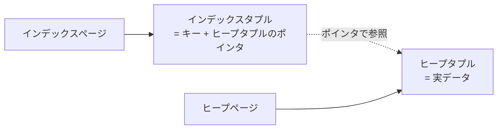
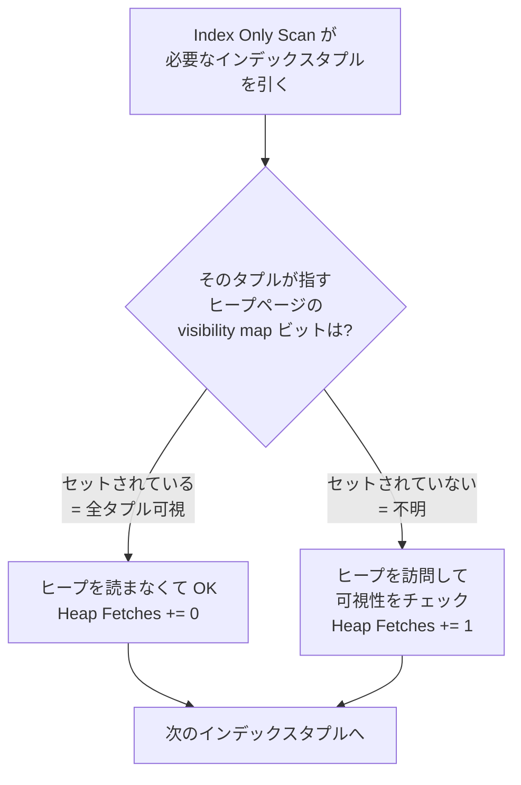

## この章で答える問い

- Index Only Scan は Index Scan と何が違うのか？
- 出力に出てくる `Heap Fetches` とは何で、なぜゼロにできるとうれしいのか？
- visibility map は誰がいつ更新しているのか？

:::message
**この章のゴール**: `SELECT id FROM articles WHERE id = ?` のような「インデックスだけで答えが返せるクエリ」で Index Only Scan が出る条件を実機で確かめ、その背後にある visibility map のしくみまで自分の言葉で説明できるようになる。
:::

## 主役クエリ

```sql
EXPLAIN ANALYZE SELECT id FROM articles WHERE id = '...uuid...';
```

3 章で打った `SELECT * FROM articles WHERE id = '...'`（全カラムを返す）に対して、`SELECT *` を `SELECT id` に書き換えるだけです。たったそれだけで、PostgreSQL の挙動はガラッと変わります。

---

## はじめに

<!--
TODO(human): この章の「つかみ」を 3〜5 行で本人の言葉で書く。
ヒント:
- 3 章で Index Scan の手計算をやったが、SELECT * を SELECT id に変えるだけで何かが変わると気づいた瞬間
- Heap Fetches: 0 を初めて見たときの「これは何？」感
- 読者にどんな状態になってほしいか
-->

---

## 4.1 3 章のおさらい

3 章では、`articles` テーブルから 1 行だけ引くクエリで Index Scan が出ました。

```sql
EXPLAIN SELECT * FROM articles WHERE id = 'ac9f8b3d-6bd0-44ab-86b0-d707efb9d546';
```

```sql
 Index Scan using articles_pkey on articles  (cost=0.42..8.44 rows=1 width=269)
   Index Cond: (id = 'ac9f8b3d-6bd0-44ab-86b0-d707efb9d546'::uuid)
```

`cost=0.42..8.44` の内訳を、3 章で次のように分解したのを覚えていますか。

```sql
0.42 (B-tree 降下)
+ 4.0 (インデックス葉ページのランダム I/O)
+ 4.0 (ヒープページのランダム I/O)
+ 0.01 (cpu_tuple)
+ 0.005 (cpu_index_tuple)
≒ 8.44
```

**この内訳のうち、`+ 4.0 (ヒープページのランダム I/O)` が消えたらどうなるか**。それが 4 章のテーマです。

---

## 4.2 SELECT id に変えると Index Only Scan が出る

3 章のクエリの `SELECT *` を `SELECT id` に書き換えて、もう一度打ってみます。

```sql
EXPLAIN ANALYZE SELECT id FROM articles WHERE id = 'ac9f8b3d-6bd0-44ab-86b0-d707efb9d546';
```

出力（サンプルアプリでの実測）:

```sql
                                                  QUERY PLAN
--------------------------------------------------------------------------------------------------------------
 Index Only Scan using articles_pkey on articles  (cost=0.42..4.44 rows=1 width=16) (actual time=... rows=1 loops=1)
   Index Cond: (id = 'ac9f8b3d-6bd0-44ab-86b0-d707efb9d546'::uuid)
   Heap Fetches: 0
 Planning Time: ...
 Execution Time: ...
```

<!-- TODO(human): 上の出力の actual time / Planning Time / Execution Time に実機の値を入れる。Heap Fetches の値も実機で確認（0 になるはず、ならない場合は 4.5 で扱う）。 -->

3 章では `Index Scan` だったノードが、`Index Only Scan` に変わりました。それと一緒に出力に **`Heap Fetches: 0`** という見慣れない行が増えています。

そして、トータルコストにも注目してください。3 章では `8.44` だったのが、ここでは **`4.44`**。ぴったり **4.0 が消えています**。3 章の内訳でいう「ヒープページのランダム I/O のコスト `4.0`」がそのまま無くなった形です。

なぜヒープを読まなくていいのか、というのが次の節の話です。

---

## 4.3 なぜヒープを読まなくていいのか

3 章 3.2 で見たインデックスタプルの構造を思い出してください。



インデックスタプルは「キー（カラム値）+ ヒープタプルの位置」を持っています。今回のクエリは `WHERE id = ?` で絞って `SELECT id` を返すだけ。返すべき `id` の値は、**インデックスタプルがもう持っています**。だからヒープページを読みに行く必要が無い。

これが Index Only Scan の正体です。「インデックスだけで答えが返せる」場合、PostgreSQL は Index Scan ではなく Index Only Scan を選びます。

ただし、これだけだと話は単純ではありません。MVCC の問題が残っています。

---

## 4.4 ただし MVCC では「見えない行」がある

PostgreSQL は MVCC（複数バージョン同時実行制御）でトランザクションの並列性を担保しています。これは「同じ行の複数バージョンが同時に存在し得る」というしくみで、行が「今のトランザクションから見えるかどうか」は、その行の `xmin` / `xmax` というメタ情報で判定されます。

問題は、**`xmin` / `xmax` はヒープタプルにしかない**ということ。インデックスタプルは持っていません。

つまり、純粋にインデックスだけで答えを返そうとすると、「その行は本当に今のトランザクションから見えるのか？」が判定できない。だからヒープを読まないといけない、はずです。

でも、現実には Index Only Scan は **ヒープを読まずに** 答えを返せることがあります。`Heap Fetches: 0` がその証拠です。**なぜそんなことができるのか**。答えは visibility map にあります。

---

## 4.5 visibility map というショートカット

PostgreSQL は **可視性マップ（visibility map）** という補助構造を持っています。これはヒープテーブルとは別に作られる小さなビット列で、ヒープページ単位で「このページに含まれるタプルは全て可視か」を 1 ビットで表現します。

公式ドキュメントの記述です。

> 可視性マップはヒープページ当たり2ビットを保持します。最初のビットがセットされていれば、ページはすべて可視であること、すなわち、そのページにはバキュームが必要なタプルをまったく含んでいないことを示しています。
> ─ [PostgreSQL 17.x 文書 65.4 可視性マップ](https://www.postgresql.jp/document/17/html/storage-vm.html)

そして visibility map の用途について、公式は Index Only Scan に直接言及しています。

> この情報は、インデックスタプルのみを使用して問い合わせに答えるために[インデックスオンリースキャン]によっても使用されます。
> ─ [PostgreSQL 17.x 文書 65.4 可視性マップ](https://www.postgresql.jp/document/17/html/storage-vm.html)


Index Only Scan の判定はこうなります。



visibility map のビットがセットされているページに対してはヒープを訪問せず、セットされていないページに対してはヒープを訪問する。これが Index Only Scan の実体です。

---

## 4.6 Heap Fetches の正体と VACUUM との関係

ここまで来ると、`Heap Fetches: 0` の意味が分かります。**visibility map のおかげで、結局ヒープを 1 度も読まなかった**、という意味です。

逆に `Heap Fetches: 100` のような大きな値が出る場合、それは「visibility map でショートカットできず、結局 100 ページぶんヒープを読みに行った」ということ。Index Only Scan のメリットが薄れます。

ではこの visibility map、いつ・誰が更新しているのか。再び公式ドキュメントから。

> 可視性マップのビットはバキュームによってのみで設定されます。しかしページに対する任意のデータ編集操作によってクリアされます。
> ─ [PostgreSQL 17.x 文書 65.4 可視性マップ](https://www.postgresql.jp/document/17/html/storage-vm.html)

つまり、

- **VACUUM**（手動 / autovacuum）が visibility map のビットを**セット**する
- **INSERT / UPDATE / DELETE**（データ編集操作）が visibility map のビットを**クリア**する

更新の頻度が高いテーブルでは、VACUUM が走ったあとも次々と新しい行が追加されてビットがクリアされていくので、`Heap Fetches: 0` を維持するのは現実には難しい場面もあります。autovacuum の挙動と一緒に 10 章で深掘ります。

サンプルアプリの articles はビルド直後で更新もないので、`Heap Fetches: 0` がきれいに出ているはずです。実機で確かめてみてください。

---

## 4.7 カバリングインデックス（INCLUDE 句）

ここまでの話は「`SELECT id` のように、インデックスのキーだけを返すクエリ」が前提でした。では、こんなクエリだとどうなるでしょう。

```sql
EXPLAIN SELECT id, title FROM articles WHERE id = 'ac9f8b3d-...-d707efb9d546';
```

`articles_pkey` インデックスは `id` だけを持っているので、`title` を返すには結局ヒープを読まないといけません。Index Only Scan ではなく Index Scan が選ばれるはずです。

ここで使えるのが **カバリングインデックス**（PostgreSQL 11 以降）。インデックス定義に `INCLUDE` 句を付けると、検索用のキーとは別に「ヒープを読まずに返すための追加カラム」をインデックスに格納できます。

```sql
CREATE INDEX articles_pkey_with_title
ON articles (id) INCLUDE (title);
```

このインデックスがあると、`SELECT id, title FROM articles WHERE id = ?` も Index Only Scan で返せるようになります。**「インデックスがクエリ全体をカバーしている」** という意味でカバリングインデックスと呼ばれます。

ただし、INCLUDE で含めるカラムが多すぎるとインデックスが肥大化して、書き込み性能や VACUUM のコストに跳ね返ります。何でも詰めればいいわけではない、というのが現場の感覚です。

---

## 章のまとめ

<!--
TODO(human): この章で学んだことを 3 行で、本人の言葉で。
ヒント:
- SELECT * を SELECT id に変えるだけで `4.0` 軽くなる驚き
- visibility map のビットを意識する習慣
- 次章への期待
-->

---

## 次の章へ

第 4 章では、`SELECT id FROM ...` のように **インデックスだけで答えが返せるクエリ** が Index Only Scan を呼び出し、`Heap Fetches: 0` で動くしくみを見ました。第 5 章「**Sort と top-N heapsort**」では、`ORDER BY title LIMIT 20` のような並べ替えを伴うクエリで Sort ノードが出る場面と、PostgreSQL 独自の `top-N heapsort` の最適化を扱います。
