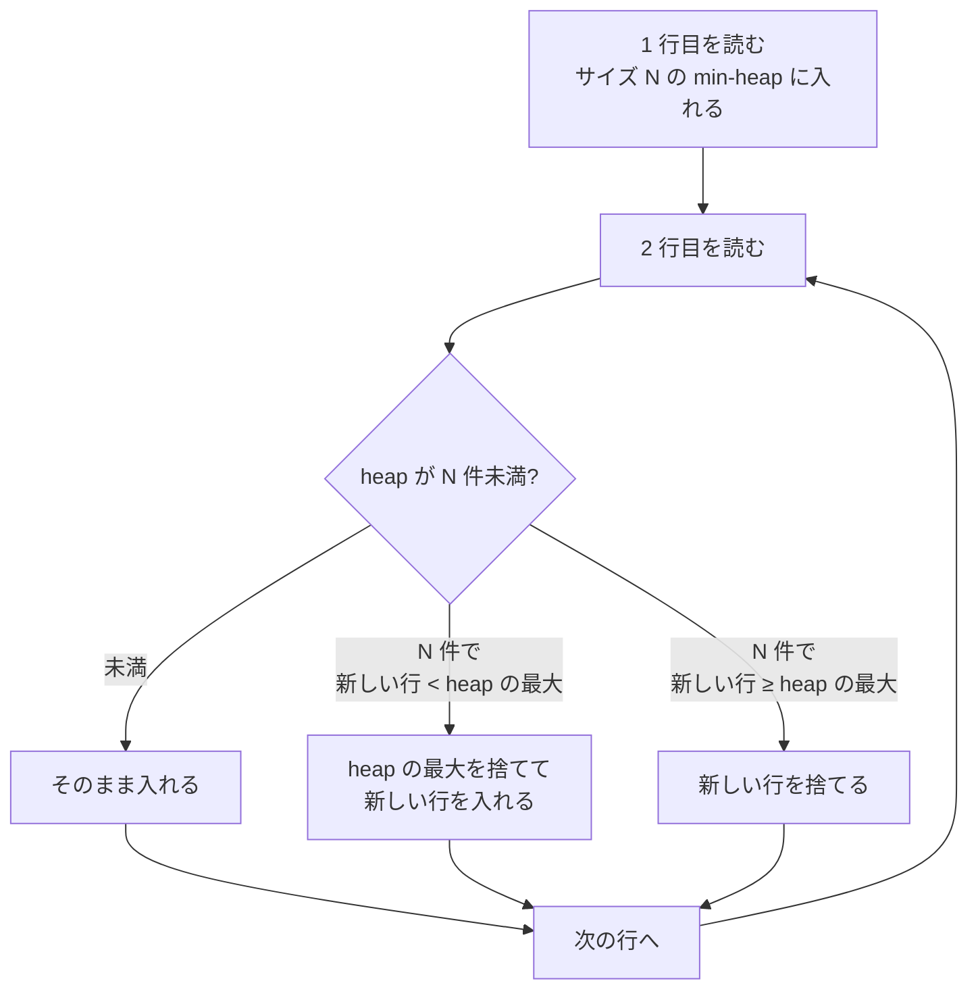

## この章で答える問い

- Sort ノードはどんなときに出るのか？
- Sort のスタートアップコストが大きいのはなぜか？
- `top-N heapsort` とは何で、通常の Sort と何が違うのか？
- `work_mem` を超えると何が起きるのか？

:::message
**この章のゴール**: `ORDER BY ... LIMIT N` のクエリで `top-N heapsort` が選ばれるしくみを実機で観察して、`work_mem` の働きと、Sort を避ける選択肢まで自分の言葉で説明できるようになる。
:::

## 主役クエリ

```sql
EXPLAIN ANALYZE SELECT * FROM articles ORDER BY title LIMIT 20;
```

`ORDER BY` を付けるだけで、これまで見たことのない `Sort` ノードが出てきます。さらに `LIMIT` を付けると、PostgreSQL は通常の Sort をやめて **`top-N heapsort`** という別のアルゴリズムに切り替えます。この切り替わりが見えるのが 5 章のポイントです。

---

## はじめに

<!--
TODO(human): この章の「つかみ」を 3〜5 行で本人の言葉で書く。
ヒント:
- ORDER BY を打ったら Sort ノードが出てきた驚き
- LIMIT を付けたら Sort Method が変わるのを見つけた瞬間
- 読者にどんな状態になってほしいか
-->

---

## 5.1 ORDER BY で Sort ノードが出る

サンプルアプリの articles を `title` で並べてみます。`title` には index がないので、PostgreSQL はテーブルを読んでから自前で並べ替えるしかありません。

```sql
EXPLAIN ANALYZE SELECT * FROM articles ORDER BY title;
```

出力（サンプルアプリでの実測）:

```
                                                       QUERY PLAN
-------------------------------------------------------------------------------------------------------------------------
 Sort  (cost=... rows=100000 width=269) (actual time=... rows=100000 loops=1)
   Sort Key: title
   Sort Method: external merge  Disk: ...kB
   ->  Seq Scan on articles  (cost=0.00..4951.00 rows=100000 width=269) (actual time=... rows=100000 loops=1)
 Planning Time: ...
 Execution Time: ...
```

<!-- TODO(human): 上の出力の数値（Sort のコスト、actual time、Sort Method、Disk のサイズ）を実機で叩いて埋める。 -->

注目してほしいのは 2 段構えになっている点。下の `Seq Scan` が全 100,000 行を読んで、上の `Sort` が読み終わった行を `title` で並べ替えています。下から上に行が流れるパイプの構造です。

そしてもう一つ大事なのが、`Sort` ノードの `actual time=A..B` の A です。2 章で「Sort や Aggregate は A が B に近い大きな値になる」と予告しましたが、その実例です。Sort は **全行揃わないと最初の 1 行が返せない**。だからスタートアップコスト（A）が大きい。

これも公式ドキュメントが裏付けています。

> 出力段階が開始できるようになる前に消費される時間、例えば、SORTノードで実行されるソート処理の時間です。
> ─ [PostgreSQL 17.x 文書 14.1.1 EXPLAINの基本](https://www.postgresql.jp/document/17/html/using-explain.html)

---

## 5.2 Sort のコスト式

3 章で見た Index Scan のコスト式と同じく、Sort のコスト式そのものは公式ドキュメントには明示されていません。ソースコード [`src/backend/optimizer/path/costsize.c`](https://github.com/postgres/postgres/blob/REL_17_STABLE/src/backend/optimizer/path/costsize.c) の `cost_sort` 関数を読み解くと、骨格は次のような形です。

```
sort_cost = 2.0 × cpu_operator_cost × N × log2(N)   # 比較回数
          + (メモリに収まらない場合は一時ファイル I/O コスト)
```

`N × log2(N)` の項が見えるのが特徴。入力行数が増えるとコストが急に膨らみます。10 万行と 100 万行では、Sort のコストはおよそ 12 倍くらいの差が付く計算です（`log2(10^6) / log2(10^5) ≈ 1.2`、それを 10 倍したぶん）。

そして、メモリに収まらない場合の「一時ファイル I/O コスト」が、5.4 で扱う **work_mem 超え** のシナリオに繋がります。

---

## 5.3 LIMIT が付くと top-N heapsort に変わる

ここからが面白いところ。5.1 のクエリに `LIMIT 20` を付けてみます。

```sql
EXPLAIN ANALYZE SELECT * FROM articles ORDER BY title LIMIT 20;
```

出力:

```
                                                       QUERY PLAN
-------------------------------------------------------------------------------------------------------------------------
 Limit  (cost=... rows=20 width=269) (actual time=... rows=20 loops=1)
   ->  Sort  (cost=... rows=100000 width=269) (actual time=... rows=20 loops=1)
         Sort Key: title
         Sort Method: top-N heapsort  Memory: ...kB
         ->  Seq Scan on articles  (cost=0.00..4951.00 rows=100000 width=269) (actual time=... rows=100000 loops=1)
 Planning Time: ...
 Execution Time: ...
```

<!-- TODO(human): 上の出力の数値（actual time、Sort Method の Memory サイズ）を実機で叩いて埋める。 -->

5.1 と比べて 2 つの変化があります。

1. 一番上に `Limit` ノードが追加された
2. Sort の `Sort Method` が `external merge` から **`top-N heapsort`** に変わった

`top-N heapsort` は、PostgreSQL が「LIMIT N があるなら、全部を並べ替える必要はない」と気づいて自動的に選ぶアルゴリズムです。具体的には次のような動きをします。



つまり、**メモリ上に「上位 N 件」だけを保持しながら全行を流し読む**。全 100,000 行を読みますが、メモリには常に 20 件だけ。これが `top-N heapsort` の正体です。

通常の Sort（外部マージソート）と比べて、メモリ使用量が劇的に小さい。`Sort Method: top-N heapsort Memory: 数十 kB` 程度で済みます。実測でメモリサイズを比べてみると、桁が違うことが分かるはずです。

---

## 5.4 work_mem を超えると外部ソート（disk sort）

Sort のメモリには上限があって、それを決めるのが `work_mem` というパラメータです。

```sql
SHOW work_mem;   -- デフォルトは 4MB
```

Sort のサイズが `work_mem` に収まれば、出力には `Sort Method: quicksort` または `top-N heapsort` が出ます。**メモリ内ソート**です。

ところが収まらないと、`Sort Method: external merge Disk: ...kB` のように **外部マージソート** に切り替わります。これは一時ファイルをディスクに書きながら段階的にマージするアルゴリズム。当然メモリ内ソートより遅くなります。


5.1 で `SELECT * FROM articles ORDER BY title;`（10 万行を全部並べる）を打ったときに `external merge` が出たのは、`work_mem` がデフォルトの 4MB だと 10 万行 × width=269 ≒ 26MB の Sort には足りないからです。

`work_mem` を上げると改善する場合があります。

```sql
SET work_mem = '64MB';
EXPLAIN ANALYZE SELECT * FROM articles ORDER BY title;
RESET work_mem;
```

メモリ内ソートに切り替われば、Sort Method が `quicksort` に変わって、disk への書き込みもなくなるはずです。試してみてください。

ただし `work_mem` はクエリの **各 Sort・Hash ノード** ごとに最大量が決まるパラメータです。並列実行や複数 Sort のあるクエリでは、`work_mem × N` のメモリを使う可能性があるので、無闇に大きくするのは危険。詳しくは 11 章で扱います。

---

## 5.5 Sort を避ける ─ Index が並べ順を持つケース

ここまでは「Sort ノードが出るクエリ」の話でしたが、そもそも Sort を避けられる場面もあります。それは **Index が並べ順をすでに持っている** ケース。

サンプルアプリの `articles` は `id`（UUID 主キー）に B-tree インデックス `articles_pkey` を持っています。B-tree インデックスは、キーを **ソート済みの順序** で格納します。つまり `id` でソートしたい場合は、インデックスを「上から N 件」読むだけで済むのです。

```sql
EXPLAIN SELECT id FROM articles ORDER BY id LIMIT 20;
```

出力:

```
 Limit  (cost=0.42..... rows=20 width=16)
   ->  Index Only Scan using articles_pkey on articles  (cost=0.42..... rows=100000 width=16)
```

<!-- TODO(human): 上の出力の数値を実機で叩いて埋める。Sort ノードが出ないことを確認。 -->

Sort ノードが**消えています**。`Index Only Scan` が `articles_pkey` を上から読んでいき、`Limit` ノードが 20 行で止める。Sort の N log N コストが丸ごと不要になります。

これは「ORDER BY するカラムに index があるか」を意識する大事な観点です。`ORDER BY title` は articles.title に index が無いので Sort が必要、`ORDER BY id` は articles_pkey が使えるので Sort 不要。実務でクエリチューニングするときも、「この ORDER BY は index で済むか？」をまず疑うのが鉄則です。

---

## 章のまとめ

<!--
TODO(human): この章で学んだことを 3 行で、本人の言葉で。
ヒント:
- ORDER BY だけで Sort ノードが出てくる
- LIMIT を付けるだけで top-N heapsort に切り替わる驚き
- 次章への期待
-->

---

## 次の章へ

第 5 章では、`ORDER BY` で Sort ノードが出る場面と、`LIMIT` で `top-N heapsort` に切り替わる最適化、`work_mem` の働き、Index でソートを回避する選び方を扱いました。第 6 章「**JOIN ─ Nested Loop と Memoize**」では、複数テーブルを結合するクエリで最も典型的な Nested Loop の挙動と、`loops` の罠を回避する Memoize（PG14+）の働きを実機で見ていきます。
