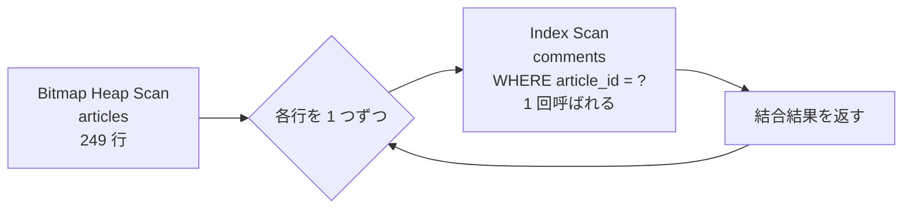
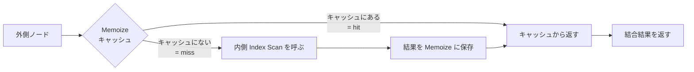

## この章で答える問い

- Nested Loop の中身（外側ループ × 内側ループ）はどう動いているのか？
- 2 章で見た `loops` の罠は、どんなときに致命的になるのか？
- Memoize（PG14+）は何を解決する仕組みか？

:::message
**この章のゴール**: 小さな JOIN で Nested Loop の挙動を実機で読み、`actual rows × loops` の罠と Memoize による最適化の効果を自分の言葉で説明できるようになる。
:::

## 主役クエリ

```sql
EXPLAIN ANALYZE
SELECT a.title, c.body
FROM articles a
JOIN comments c ON c.article_id = a.id
WHERE a.author_id BETWEEN 1 AND 5;
```

2 章で `actual rows × loops` の罠を見せるために打ったクエリと同じものです。2 章では「loops の意味」までで止めましたが、6 章ではもっと深掘って、**Nested Loop が外側と内側のどう組み合わせて動いているのか** までを読み解きます。

---

## はじめに

<!--
TODO(human): この章の「つかみ」を 3〜5 行で本人の言葉で書く。
ヒント:
- 2 章で loops の罠を見て怖くなった瞬間
- Nested Loop の動きを頭の中で動かせるようになると、JOIN のクエリが怖くなくなる
- 読者にどんな状態になってほしいか
-->

---

## 6.1 2 章のおさらい

2 章で打ったクエリと出力を、もう一度ここに置いておきます（並列実行は `SET max_parallel_workers_per_gather = 0;` で抑制）。

```sql
EXPLAIN ANALYZE
SELECT a.title, c.body
FROM articles a
JOIN comments c ON c.article_id = a.id
WHERE a.author_id BETWEEN 1 AND 5;
```

```
 Nested Loop  (cost=7.11..11296.29 rows=2330 width=62) (actual time=0.625..29.985 rows=2469 loops=1)
   ->  Bitmap Heap Scan on articles a  (cost=6.68..754.94 rows=233 width=36) (actual time=0.562..3.537 rows=249 loops=1)
         Recheck Cond: ((author_id >= 1) AND (author_id <= 5))
         Heap Blocks: exact=241
         ->  Bitmap Index Scan on index_articles_on_author_id  (cost=0.00..6.62 rows=233 width=0) (actual time=0.497..0.497 rows=249 loops=1)
               Index Cond: ((author_id >= 1) AND (author_id <= 5))
   ->  Index Scan using index_comments_on_article_id on comments c  (cost=0.42..45.13 rows=11 width=58) (actual time=0.020..0.104 rows=10 loops=249)
         Index Cond: (article_id = a.id)
```

2 章では、内側の `Index Scan on comments` の `rows=10 loops=249` を見て **`actual rows × loops = 2,490`** が総処理行数だ、という読み方を学びました。6 章ではこの構造をもう一度分解し直して、**なぜ Nested Loop はこういう動きをするのか** を考えていきます。

---

## 6.2 Nested Loop の構造を読む

Nested Loop は名前の通り「ネストしたループ」です。プログラム風に書くと、こうなります。

```text
for each row a in 外側ノード:        ← Bitmap Heap Scan on articles
    for each row c in 内側ノード:    ← Index Scan on comments WHERE article_id = a.id
        return (a, c)
```

外側のループが 1 行回るごとに、内側のループ全体が 1 回呼ばれる。これが `loops` の正体です。今回の出力では、外側（articles）が 249 行返したので、内側（comments）が **249 回呼ばれ**ました（`loops=249`）。




つまり Nested Loop は **「外側が出した行 × 内側でその行に合うものを引く」** を繰り返す構造。SQL の世界で最も素朴な結合方式です。

### なぜ「Nested Loop」が選ばれた？

ここで一つ気になるのが、なぜプランナはこの組み合わせで Nested Loop を選んだのか、ということ。理由は **内側が Index Scan で安く済むから** です。

内側のコスト `cost=0.42..45.13`、つまり 1 回呼ぶのに最大 45.13 のコスト。これが 249 回呼ばれるとしても `45.13 × 249 ≒ 11,238` で、上の Nested Loop のトータル `11,296.29` とほぼ一致します。「外側を 1 回スキャンして、内側を 249 回引く」という戦略が、ハッシュテーブルを作るより安い、と判断されたわけです。

これが「外側が小さくて、内側を index で引ける」場面の Nested Loop の強さです。

---

## 6.3 内側が Index Scan のとき

Nested Loop の効率を決定的に左右するのが、**内側ノードが Index Scan で 1 行ずつ安く引けるかどうか** です。

今回のクエリでは、`comments.article_id` に `index_comments_on_article_id` というインデックスがあります。だから内側は `Index Scan on comments WHERE article_id = a.id` を 1 行 0.1 ms 程度で済ませられる。

もしこのインデックスがなかったら、内側は Seq Scan になります。1 回あたり数百 ms かかるとして、それが 249 回呼ばれる…と想像するだけで震えます。**外側 N 行 × 内側 1 回ぶんの Seq Scan = 致命的な遅延** が、N+1 問題の DB 側の正体です。

これが 2 章で「rows=10 のつもりで Nested Loop を選んだら、実は 1,000,000 行あった」と書いた事故の典型パターンです。プランナが内側 1 回を安く見積もりすぎていて、実際は遅い、という構図。

---

## 6.4 Memoize ─ 内側ループをキャッシュする最適化

PostgreSQL 14 で `Memoize` という新しいノードが追加されました。Nested Loop の **内側を毎回呼ばずに、過去の結果をキャッシュして使い回す** 仕組みです。

「同じキーで内側を 2 回引きたくない」というのが Memoize のモチベーション。例えば外側に重複したキーがあれば、最初の 1 回で結果を覚えておいて、2 回目以降はキャッシュから返す、という挙動になります。



Memoize が出る出力の見た目はこんな感じです（パターン例）。

```text
 Nested Loop
   ->  外側ノード
   ->  Memoize
         Cache Key: ...
         Cache Mode: logical
         ->  内側 Index Scan
```

`Cache Hits: N Cache Misses: M Cache Evictions: 0 Cache Overflows: 0 Memory Usage: ...` のような統計が `actual` 側に出ます。Cache Hits が多ければ多いほど、Memoize の節約効果が大きい、という読み方です。

### Memoize が選ばれる条件

Memoize はプランナがメリットを見出したときだけ選ばれます。具体的には：

- `enable_memoize = on`（デフォルト）
- **外側に重複キーが多い** ことが見込まれる（プランナの `n_distinct` 推定が低い）
- 内側のコストが Memoize のオーバーヘッドより十分大きい

サンプルアプリで Memoize が出るかは、外側のクエリ次第。`comments` を外側、`articles` を内側にして「同じ `article_id` が複数ある」状況を作ると、Memoize が出る可能性が高くなります。例えば次のクエリを試してみてください。

```sql
EXPLAIN ANALYZE
SELECT a.title, c.body
FROM comments c
JOIN articles a ON a.id = c.article_id
WHERE c.author_id BETWEEN 1 AND 5;
```

<!-- TODO(human): 上のクエリを実機で叩いて、Memoize ノードが出るかを確認。出る場合は出力を貼る。出ない場合は、SET enable_memoize = off / on で違いを見せる別の例を入れる。 -->

---

## 6.5 Nested Loop が遅くなる典型パターン

Nested Loop は「外側が小さい」場面で輝きますが、その前提が崩れると一気に遅くなります。実務でハマる典型パターンを並べます。

| パターン | 何が起きる | 兆候 |
|---|---|---|
| 外側の rows 推定が小さすぎる | 想定 100 件のつもりが実は 100 万件、Nested Loop が暴走 | `rows` と `actual rows` の乖離（2 章） |
| 内側にインデックスがない | 内側が Seq Scan、loops 回呼ばれて致命的 | `actual time` の内側が大きい × `loops` が大きい |
| 同じ内側を何度も呼ぶ | Memoize がない時代は重複キーで二重作業 | Cache Hits があれば Memoize が効いている |

兆候を見つけるための「3 つの目」を 6 章なりに整理するとこうです。

- **外側の `actual rows`** ─ 大きい？
- **内側の `actual time` の B（トータル）と `loops` の積** ─ 全体時間に占める割合は？
- **`rows` と `actual rows` の乖離** ─ 大きい？

`rows=10` の見積もりで Nested Loop が選ばれているのに、`actual rows=1000000` が出ていたら、それはほぼ確実にプランナの誤推定が事故を起こしています。統計情報を疑うフェーズ（9 章）か、プランナを揺さぶるフェーズ（11 章）に進む合図です。

---

## 章のまとめ

<!--
TODO(human): この章で学んだことを 3 行で、本人の言葉で。
ヒント:
- Nested Loop は素朴な「外側 × 内側」の構造
- 内側 Index Scan があれば速い、なければ事故
- Memoize の効き方
-->

---

## 次の章へ

第 6 章では、Nested Loop の「外側 × 内側」の構造と、Memoize による内側キャッシュの最適化を見ました。第 7 章「**JOIN ─ Hash Join と Merge Join**」では、Nested Loop が苦手な領域、つまり「外側も内側も大きい」JOIN で選ばれる別の結合方式を扱います。`work_mem` がここでも顔を出します。
