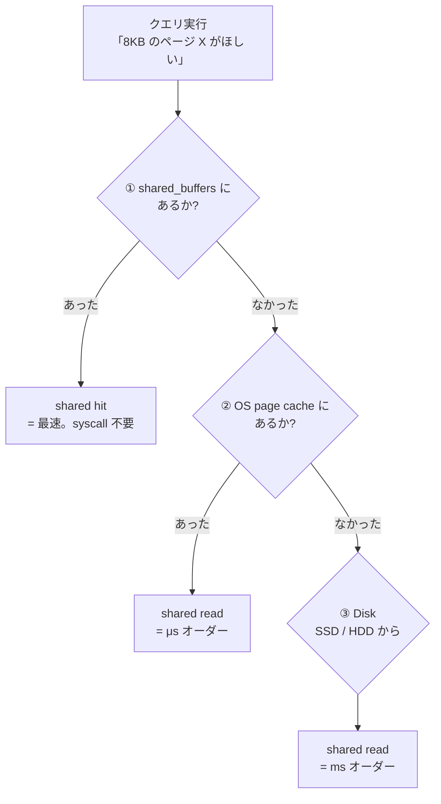

## この章で答える問い

- `Buffers: shared hit=180` の `shared hit / shared read / dirtied / written` のそれぞれの意味は？
- `shared_buffers` と OS page cache はどう違うのか？
- 同じクエリを 2 回打つと、なぜ実行時間が変わるのか？（cold cache と warm cache）
- `EXPLAIN (ANALYZE, BUFFERS)` を実務でデフォルトにすべき理由は？

:::message
**この章のゴール**: `BUFFERS` を読み解き、PostgreSQL のキャッシュ階層（shared_buffers → OS page cache → disk）を実機で観察できるようになる。
:::

## 主役クエリ

```sql
EXPLAIN (ANALYZE, BUFFERS) SELECT * FROM articles;
-- 同じクエリをすぐにもう 1 回
EXPLAIN (ANALYZE, BUFFERS) SELECT * FROM articles;
```

同じクエリを 2 回続けて打つだけ。それだけで `actual time` も `Buffers` も別物に変わります。そこで何が起きているのか、というのが 8 章のテーマです。

---

## はじめに

<!--
TODO(human): この章の「つかみ」を 3〜5 行で本人の言葉で書く。
ヒント:
- 同じクエリを 2 回打ったら 1 回目より速くなって混乱した経験
- Buffers の見方を覚えるとクエリの正体が見えてくる
- 読者にどんな状態になってほしいか
-->

---

## 8.1 EXPLAIN (ANALYZE, BUFFERS) を打ってみる

2 章でちらっと予告した `BUFFERS` オプション、ここで本格的に使います。

```sql
EXPLAIN (ANALYZE, BUFFERS) SELECT * FROM articles;
```

出力（サンプルアプリでの実測、1 回目）:

```
                                                       QUERY PLAN
-------------------------------------------------------------------------------------------------------------------------
 Seq Scan on articles  (cost=0.00..12181.00 rows=100000 width=269) (actual time=... rows=100000 loops=1)
   Buffers: shared hit=... read=...
 Planning Time: ...
 Execution Time: ...
```

<!-- TODO(human): 上の出力の数値（actual time、Buffers の shared hit / read、Planning/Execution Time）を実機で叩いて埋める。1 回目と 2 回目で違うはずなので、両方とも保存しておく。 -->

新しく出てきたのが `Buffers: shared hit=... read=...` の行。これは「このノードがどのページをどう取ってきたか」を表す統計です。

公式ドキュメントの説明はシンプルです。

> `EXPLAIN`には、より多くの実行時統計情報を取り出すために、`ANALYZE`に付与できる`BUFFERS`オプションがあります。
> ─ [PostgreSQL 17.x 文書 14.1.2 EXPLAIN ANALYZE](https://www.postgresql.jp/document/17/html/using-explain.html)

そして用途について：

> `BUFFERS`により提供される数は、問い合わせのどの部分がもっとも大きいI/Oであるかを識別する役に立ちます。
> ─ [PostgreSQL 17.x 文書 14.1.2 EXPLAIN ANALYZE](https://www.postgresql.jp/document/17/html/using-explain.html)

要するに「actual time が長い時、なぜ長いのか？ → I/O が多かったのか CPU が多かったのか？」を切り分けるための情報です。

---

## 8.2 Buffers の 4 つの数字を読み分ける

`Buffers:` 行には主に 4 つの数字が出ます。`shared` という接頭辞が付くのは「shared_buffers から取ったページ」を意味します（他にも `local` `temp` がありますが、ここでは省略）。

| 項目 | 意味 |
|---|---|
| `shared hit=N` | shared_buffers にあったページを **N 枚取った**。最速 |
| `shared read=N` | shared_buffers になく、OS や disk から **N 枚取ってきた** |
| `shared dirtied=N` | このクエリで **書き換えた**（dirty マークが付いた）ページ数。書き込み系クエリで出る |
| `shared written=N` | このクエリで shared_buffers から disk に **書き出した** ページ数。ほとんど出ない |

`SELECT` だけのクエリなら、普通は `shared hit` と `shared read` だけが出ます。`dirtied` / `written` は `UPDATE` / `INSERT` / `DELETE` のときに顔を出します。

8 章で集中して見るのは **`shared hit` と `shared read` の比率** です。これがクエリのキャッシュ効率を表しています。

---

## 8.3 PostgreSQL のキャッシュ階層

`shared hit` と `shared read` の違いを理解するには、PostgreSQL がデータページをどこから取ってくるのかを知る必要があります。実は **3 段階のキャッシュ階層** が存在しています。



- **shared_buffers**: PostgreSQL 専用のメモリキャッシュ。全 backend プロセスで共有。デフォルト 128MB
- **OS page cache**: Linux/macOS の OS が管理するファイルキャッシュ。PostgreSQL からは syscall 越し
- **Disk**: 物理ストレージ（SSD / HDD）

ここで一番大事な誤解です。**`shared read = disk read` ではありません**。`shared read` は「shared_buffers に無かったので、外から取った」を意味するだけで、その「外」が OS page cache なのか disk なのかは PostgreSQL からは区別できないのです。

つまり、`shared read` が出たからといって必ずしも disk を叩いているわけではない。OS page cache から数 μs で返ってきている可能性も高い。**「shared read を見たら遅い」と即断するのは間違い**、というのが現場での落とし穴です。

---

## 8.4 cold cache と warm cache の実験

ここで主役クエリに戻ります。同じクエリを 2 回続けて打つと、何が変わるでしょうか。

**1 回目（cold cache）**: shared_buffers にも OS page cache にもページが乗っていない状態。`shared read` が大きく出ます。

**2 回目（warm cache）**: 1 回目で読んだページが shared_buffers に乗っている。`shared hit` がほぼ全部を占めて、`shared read` はゼロに近づきます。

```sql
-- 1 回目
EXPLAIN (ANALYZE, BUFFERS) SELECT * FROM articles;
-- すぐに 2 回目
EXPLAIN (ANALYZE, BUFFERS) SELECT * FROM articles;
```

実機の出力を比べてみると、こんな感じの違いが出るはずです（数値は環境依存）。

| 回 | Buffers | actual time（B） | 説明 |
|---|---|---|---|
| 1 回目 | `shared read=... hit=少し` | 大きめ | cold cache、ページを外から取ってくる |
| 2 回目 | `shared hit=... read=0` | 小さめ | warm cache、全部 shared_buffers から |

<!-- TODO(human): 1 回目と 2 回目の実測値を貼って、Buffers と actual time の差を観察する表を作る。 -->

これが「同じクエリなのに 2 回目のほうが速い」の正体です。`actual time` だけ見ると「実機がランダムにブレてる」ように見えますが、`Buffers` を見ると **その裏で shared_buffers にページが乗ったから速くなった** ことが明確に分かります。

実務では「ベンチマークを取るときは事前に warm にしてから測る」のが定石。これは次の節 8.5 で扱う `pg_prewarm` の話に繋がります。

---

## 8.5 pg_prewarm で warm にする

「事前にキャッシュを温めたい」というニーズに応えるのが `pg_prewarm` 拡張です。テーブルやインデックスを明示的に shared_buffers に読み込むコマンドを提供します。

```sql
-- 拡張をインストール（一度だけ）
CREATE EXTENSION IF NOT EXISTS pg_prewarm;

-- articles テーブルを shared_buffers に読み込む
SELECT pg_prewarm('articles');

-- これで articles の全ページが shared_buffers に乗った
-- 続けて EXPLAIN を打つと shared hit が大きく出る
EXPLAIN (ANALYZE, BUFFERS) SELECT * FROM articles;
```

<!-- TODO(human): pg_prewarm を実行した直後の出力を貼って、shared hit が大きく出ることを確認する。 -->

本番でのウォームアップ、ベンチマークの前処理、再起動後のキャッシュ復元、などの用途があります。

---

## 8.6 shared_buffers と effective_cache_size

8 章の最後に、関連する 2 つの設定値を確認します。

### shared_buffers

```sql
SHOW shared_buffers;
-- 例: 128MB
```

PostgreSQL 専用のメモリキャッシュのサイズ。デフォルトは 128MB ですが、本番では **物理 RAM の 25% 程度** が推奨されることが多いです。サンプルアプリの articles は 30 MB（3,951 ページ × 8KB）なので、128MB の shared_buffers に対して約 23% の領域を占めます。

ちなみに `1 page = 8KB` なので、128MB の shared_buffers には `128 × 1024 / 8 = 16,384 ページ` が乗ります。articles 全件（3,951 ページ）+ index 含めても余裕で収まる規模です。

### effective_cache_size

```sql
SHOW effective_cache_size;
-- 例: 4GB
```

これは **shared_buffers + OS page cache を含めた、PostgreSQL が「使えそう」と見積もるキャッシュ全体の推定サイズ** です。プランナがコストを計算するときに使うヒントで、**実メモリは確保しません**（注意ポイント）。

`effective_cache_size` が大きいほど、プランナは「ランダム I/O も結局キャッシュから返ってくるだろう」と楽観的に見積もり、Index Scan のコストを少し下げます。実機の OS page cache のサイズと合わせて設定するのが筋です。

---

## 章のまとめ

<!--
TODO(human): この章で学んだことを 3 行で、本人の言葉で。
ヒント:
- shared hit と read の意味
- 同じクエリを 2 回打つと違う理由
- 次章への期待
-->

---

## 次の章へ

第 8 章では、`Buffers` の見方とキャッシュ階層、cold/warm の切り替わりを見ました。第 9 章「**プランナと統計情報**」では、視点を変えて **プランナが `rows` をどう見積もっているか** を覗きにいきます。2 章で見た「rows と actual rows の乖離」の原因が、`pg_class.reltuples` `pg_statistic` `pg_stats` という統計情報の中にあります。
