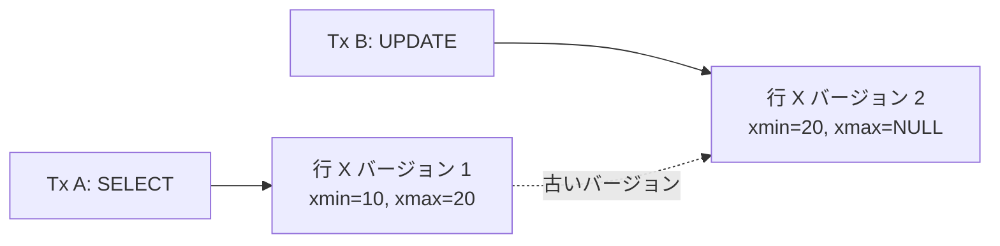
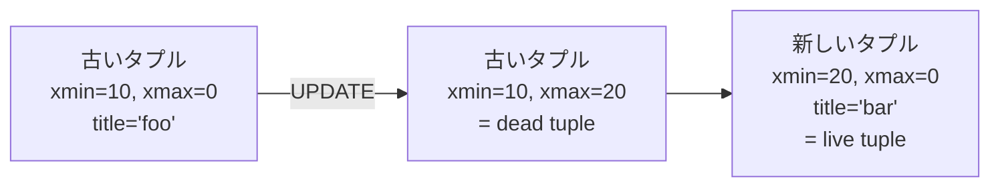

## この章で答える問い

- なぜ `UPDATE` / `DELETE` で dead tuple が生まれるのか？
- MVCC（xmin / xmax）はどんな仕組みで「同じ行の複数バージョン」を扱っているのか？
- VACUUM と autovacuum は何を片付けているのか？
- なぜ `SELECT count(*)` が遅いことがあるのか？

:::message
**この章のゴール**: PostgreSQL の MVCC のしくみと、VACUUM が果たしている役割を理解して、`SELECT count(*)` の挙動を VACUUM 前後で観察できるようになる。
:::

## 主役クエリ

```sql
-- count(*) を打つ
SELECT count(*) FROM articles;
EXPLAIN ANALYZE SELECT count(*) FROM articles;

-- dead tuple を作って観察
BEGIN;
UPDATE articles SET title = title;        -- 全行 UPDATE（dead tuple 生成）
SELECT n_live_tup, n_dead_tup
FROM pg_stat_user_tables
WHERE relname = 'articles';
ROLLBACK;
```

`SELECT count(*)` は単純に見えますが、PostgreSQL では実は **MVCC の事情で全行を確認しないと正確な数が出せない** 重いクエリです。10 章ではその裏側を掘っていきます。

---

## はじめに

<!--
TODO(human): この章の「つかみ」を 3〜5 行で本人の言葉で書く。
ヒント:
- count(*) が遅くて驚いた経験
- dead tuple という存在を知ったときの感想
- 読者にどんな状態になってほしいか
-->

---

## 10.1 MVCC ─ 複数バージョン同時実行制御

PostgreSQL は **MVCC（Multi-Version Concurrency Control）** という方式でトランザクションの並列性を実現しています。

ざっくり言うと「**同じ行の複数バージョンが同時に存在し得る**」しくみ。トランザクション A が行を読んでいる最中に、トランザクション B が同じ行を更新しても、A は古いバージョンを、B は新しいバージョンを見ることで両者が衝突しないようにします。




それぞれのタプルは **どのトランザクションから見えるか** を示す情報を持っています。それが次に出てくる `xmin` / `xmax` です。

---

## 10.2 tuple header と xmin / xmax

PostgreSQL のヒープタプル（行 1 件）は、データ本体の前に **tuple header** という管理情報を持っています。その中に MVCC のための 2 つの重要なフィールドが入っています。

| フィールド | 意味 |
|---|---|
| `xmin` | このタプルを **作成した** トランザクション ID |
| `xmax` | このタプルを **削除した / 更新で無効化した** トランザクション ID（まだ生きていれば 0） |

つまり 1 つのタプルは「Tx xmin で生まれて、Tx xmax で死んだ」という生没情報を持っています。`xmax = 0` なら「まだ生きている」状態。

```sql
-- ctid と一緒に xmin/xmax を覗く
SELECT ctid, xmin, xmax, id
FROM articles
LIMIT 5;
```

<!-- TODO(human): 上のクエリの出力を貼って、xmin が同じトランザクション ID で並んでいることを確認（seed で一括 INSERT されたので、xmin がほぼ同じはず）。 -->

これがあれば、SELECT が走るときに「現在のトランザクションから見て、`xmin` ≦ 現在 < `xmax` を満たすタプル」だけを返せば、MVCC が成立します。

---

## 10.3 UPDATE / DELETE で dead tuple が生まれる

ここまでで重要なのが、**PostgreSQL の `UPDATE` は「上書き」ではない** という事実です。

`UPDATE` を実行すると、PostgreSQL は次の動きをします。

1. 古いタプルの `xmax` に現在のトランザクション ID を書き込む（= 削除マーク）
2. 新しいタプルを **新規追加** する（`xmin` = 現在のトランザクション ID、`xmax` = 0）
3. インデックスにも新しいタプルへのポインタを追加



`xmax` が付いた古いタプルが **dead tuple**（死んだタプル）。SELECT からは見えませんが、まだヒープページ上に物理的に残っています。

`DELETE` も同じで、行を削除するというのは「タプルに `xmax` を立てる」だけ。物理的にはデータがまだ残ります。

これが「dead tuple が生まれる」しくみ。**`UPDATE` / `DELETE` が走るたびにテーブルが太っていく** のがデフォルトの挙動です。

### 実機で dead tuple を作って観察する

```sql
BEGIN;

-- 全行に同じ UPDATE を打つと、全件 dead tuple になる
UPDATE articles SET title = title;

-- live と dead の数を確認
SELECT n_live_tup, n_dead_tup
FROM pg_stat_user_tables
WHERE relname = 'articles';
-- n_live_tup = 100,000, n_dead_tup = 100,000 になるはず

ROLLBACK;
```

<!-- TODO(human): 上の手順を実機で叩いて、n_live_tup と n_dead_tup の値を貼る。 -->

ROLLBACK すれば dead tuple も巻き戻されるので、サンプルアプリは安全です。

---

## 10.4 VACUUM の役割

放っておけば dead tuple は溜まる一方。これを片付けるのが **VACUUM** です。

```sql
VACUUM articles;
```

VACUUM が何をするか、ざっくりこんなところです。

1. **dead tuple の領域を再利用可能にマーク**: 新しい行が書き込まれるときに使えるようにする
2. **visibility map のビットを更新**: 4 章で見たやつ
3. **pg_class.reltuples / relpages を更新**: 統計情報の一部もここで再計算
4. **VACUUM FULL** を使えばテーブルを物理的に縮める（ロックが取られるので本番では慎重に）

通常の VACUUM は **テーブルを縮めない** ことに注意。dead tuple の領域を「再利用 OK」とマークするだけで、ディスク上のサイズは変わりません。それでも shared_buffers のヒット率や `Heap Fetches: 0` の維持には十分効きます。


---

## 10.5 autovacuum

VACUUM を手で打つのは面倒なので、PostgreSQL は autovacuum という常駐プロセスで自動的に走らせています。

```sql
-- autovacuum の設定
SHOW autovacuum;                        -- on（デフォルト）
SHOW autovacuum_vacuum_scale_factor;    -- 0.2（デフォルト）
SHOW autovacuum_vacuum_threshold;       -- 50
```

つまり「(0.2 × n_live_tup) + 50 行が dead tuple になったら autovacuum 起動」。10 万行のテーブルなら 20,050 行の dead tuple で起動します。

autovacuum は本番でも開発でも基本オンのまま使うべき設定。「重そう」と思って `autovacuum = off` にすると、しばらくして dead tuple だらけのテーブルが急にスローになる、というのが本番で起きやすい失敗パターンです。

---

## 10.6 SELECT count(*) が遅い理由

10 章の主役クエリに戻ります。

```sql
EXPLAIN ANALYZE SELECT count(*) FROM articles;
```

出力（サンプルアプリでの実測）:

```
                                                       QUERY PLAN
-------------------------------------------------------------------------------------------------------------------------
 Aggregate  (cost=... rows=1 width=8) (actual time=... rows=1 loops=1)
   ->  Seq Scan on articles  (cost=0.00..4951.00 rows=100000 width=0) (actual time=... rows=100000 loops=1)
 Planning Time: ...
 Execution Time: ...
```

<!-- TODO(human): 上の出力の数値を実機で叩いて埋める。 -->

`Seq Scan on articles` で **全件を読みに行っています**。「count(*) なのに全件読まないと無理？」と思うかもしれませんが、これが MVCC の代償です。

**他の DB（MySQL InnoDB など）と違って、PostgreSQL は「テーブルの正確な行数」を保持していません**。理由は MVCC で、「現在のトランザクションから見える行数」はトランザクションごとに違うからです。**自分のトランザクションから見える行を全部数える** ことでしか正確な count(*) は出せない。

### Index Only Scan で速くするテクニック

4 章で扱った Index Only Scan は、count(*) を速くするのにも使えます。

```sql
EXPLAIN ANALYZE SELECT count(*) FROM articles;
-- Seq Scan on articles → 全件読む

EXPLAIN ANALYZE SELECT count(id) FROM articles;
-- Index Only Scan using articles_pkey → インデックスだけで済む可能性
```

<!-- TODO(human): 上の 2 つを実機で叩いて、`count(*)` と `count(id)` でプランがどう違うかを観察する。Heap Fetches も比較する。 -->

`count(id)` のほうが Index Only Scan を使えるので速くなる可能性が高い、というのが本書なりの締めです（厳密には条件次第なので、実機の結果を貼って分析するのが筋）。

### visibility map と VACUUM の繋がり

4 章で見た visibility map の話と、本章の dead tuple の話が、ここで繋がります。

- `UPDATE` / `DELETE` が走ると、そのページの **visibility map ビットがクリア**される
- VACUUM が dead tuple を片付けて、そのページの **visibility map ビットを再設定** する
- Index Only Scan の `Heap Fetches = 0` を維持するには、VACUUM が定期的に走る必要がある

つまり「**書き込みが多いテーブルでは Index Only Scan の効きが悪くなり、autovacuum が頑張ったタイミングで効きが戻る**」という挙動が、本番では普通に起きます。

---

## 章のまとめ

<!--
TODO(human): この章で学んだことを 3 行で、本人の言葉で。
ヒント:
- MVCC は同じ行の複数バージョンを並べる仕組み
- dead tuple は UPDATE / DELETE の副産物、VACUUM が片付ける
- 次章への期待
-->

---

## 次の章へ

第 10 章では、MVCC と dead tuple、VACUUM と autovacuum の繋がりを見ました。第 11 章「**プランナの挙動を制御する**」では、これまで何度か顔を出した `enable_*` 系のスイッチや `work_mem` などのパラメータを **明示的に動かして、プランナを揺さぶる** 方法を扱います。
