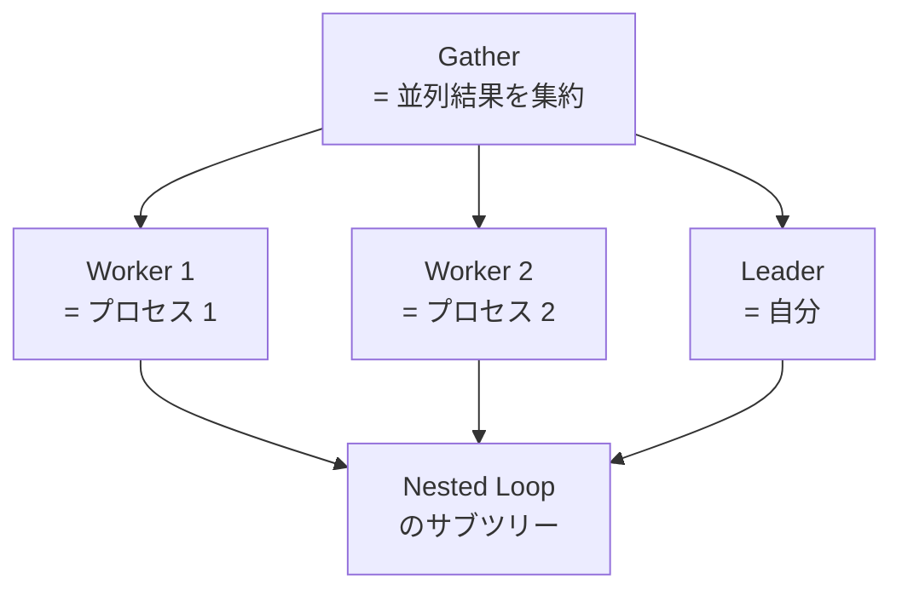

## この章で答える問い

- `enable_seqscan = off` などのスイッチで何ができるのか？
- 「強制」と「無効化」のニュアンス差は？（コストに巨大ペナルティを加えるだけで、絶対に使わないわけではない）
- `work_mem` を変えると何が起きるのか？
- 並列クエリ（`Gather`）はどう発動するのか？
- 本番でプランを固定したいときの選択肢は？（pg_hint_plan など）

:::message
**この章のゴール**: プランナを揺さぶる手段を一通り知って、同じクエリを 3 つの戦略（Seq Scan / Index Scan / Bitmap Scan）で動かして比較できるようになる。
:::

## 主役クエリ

```sql
EXPLAIN ANALYZE SELECT * FROM articles WHERE author_id BETWEEN 1 AND 100;

SET enable_seqscan = off;
EXPLAIN ANALYZE SELECT * FROM articles WHERE author_id BETWEEN 1 AND 100;

SET enable_bitmapscan = off;
EXPLAIN ANALYZE SELECT * FROM articles WHERE author_id BETWEEN 1 AND 100;

RESET enable_seqscan;
RESET enable_bitmapscan;
```

3 章でも見た「中規模ヒット」のクエリを使い回します。**プランナを揺さぶると同じクエリが 3 つの戦略を見せる**、を実機で観察するのが 11 章の主目的です。

---

## はじめに

<!--
TODO(human): この章の「つかみ」を 3〜5 行で本人の言葉で書く。
ヒント:
- 困ったときに enable_* で揺さぶってみる、を覚えると安心する
- 「禁止」が実はコストペナルティだと知ったときの感想
- 読者にどんな状態になってほしいか
-->

---

## 11.1 プランナの裁量と、揺さぶる手段

ここまでで学んできたのは **プランナがコスト最小のプランを選ぶ** という基本動作でした。9 章で見たように、その判断はすべて統計情報の上に建っています。

ただし、現実には次のような場面があります。

- **統計が古くてプランナが外れた選択をしている**: 9 章で見た乖離
- **本番特有の事情で、プランナとは違う判断をさせたい**: 例えば「テストの再現性のため」「pg_hint_plan で意図的に固定したい」
- **プランナの内部動作を学ぶために、わざと別のプランを選ばせて比較したい**: 本章のテーマ

このとき登場するのが「プランナを揺さぶる手段」です。次の 3 種類があります。

| 種類 | 何を変える | 使う場面 |
|---|---|---|
| `enable_*` 系 | あるノードに巨大ペナルティを乗せる | プラン比較、最終手段 |
| `random_page_cost` などのコストパラメータ | コスト計算の単価を変える | チューニング（3 章で扱った） |
| `work_mem` などのリソース上限 | Hash や Sort の挙動を変える | 5 章 / 7 章で扱った |

そして本番では別の選択肢として **`pg_hint_plan`** という拡張があります。詳しくは 11.6 で。

---

## 11.2 enable_* 群の仕組み

`enable_*` で始まる設定値が一連にあります。代表的なものを並べます。

```sql
SHOW enable_seqscan;       -- on（デフォルト）
SHOW enable_indexscan;     -- on
SHOW enable_indexonlyscan; -- on
SHOW enable_bitmapscan;    -- on
SHOW enable_nestloop;      -- on
SHOW enable_hashjoin;      -- on
SHOW enable_mergejoin;     -- on
SHOW enable_sort;          -- on
SHOW enable_memoize;       -- on（PG14+）
```

これらを `off` にすると「該当ノードを使わない」ように指示できます。ただし**完全に禁止するわけではありません**。コストに **`disable_cost`（10 億くらいのペナルティ）** を上乗せして、「現実的にはまず選ばれない」状態を作り出すだけです。

3 章で `enable_bitmapscan = off` を打ったとき、`WHERE author_id BETWEEN 1 AND 100` に対して Index Scan ではなく **Seq Scan** が選ばれた、というのを覚えていますか？ Bitmap が禁止されたら自動的に Index Scan が選ばれそうなのに、選ばれたのは Seq Scan でした。あれは「Bitmap を禁止する → Bitmap のコストに 10 億のペナルティが乗る → 比較した結果、コストの絶対値が高い Index Scan より、ペナルティ込みでも安い Seq Scan が勝った」という構図でした。

つまり「禁止」というよりは「**現実的に使わせない**」という表現が正確です。

---

## 11.3 強制プラン実験

3 章のクエリ「`WHERE author_id BETWEEN 1 AND 100`」（5% ヒット）を使って、3 つのプランを順番に出してみます。

```sql
-- ① デフォルト（Bitmap Heap Scan が選ばれる）
EXPLAIN ANALYZE SELECT * FROM articles WHERE author_id BETWEEN 1 AND 100;

-- ② Seq Scan を禁止する → Index Scan か Bitmap が残る
SET enable_seqscan = off;
EXPLAIN ANALYZE SELECT * FROM articles WHERE author_id BETWEEN 1 AND 100;

-- ③ Seq Scan も Bitmap も禁止する → Index Scan のみ
SET enable_bitmapscan = off;
EXPLAIN ANALYZE SELECT * FROM articles WHERE author_id BETWEEN 1 AND 100;

RESET enable_seqscan;
RESET enable_bitmapscan;
```

<!-- TODO(human): 上の 3 つを実機で叩いて、それぞれのプランとコスト、actual time を表にまとめる。3 つの戦略の優劣が見えるはず。 -->

予想される結果はこんな感じです。

| 段階 | 禁止 | 出るプラン | コスト |
|---|---|---|---|
| ① | なし | Bitmap Heap Scan | 4,312.86 |
| ② | enable_seqscan = off | Bitmap Heap Scan（変わらず） | 4,312.86 |
| ③ | + enable_bitmapscan = off | Index Scan | （高い、たぶん 1.5 万くらい） |

②で Bitmap のままなのは、5% ヒットでは Bitmap が Seq Scan より元々安いから。Seq Scan を禁止しても Bitmap には影響しない。③で Bitmap も禁止すると、ようやく Index Scan に切り替わります。

**3 つのコストを並べて見比べると、プランナが日頃なぜそのプランを選んでいたかが見えてくる**、というのが 11.3 のポイントです。

---

## 11.4 work_mem を動かす

5 章 Sort と 7 章 Hash Join で出てきた `work_mem`。改めて確認しておくと、これは **クエリの 1 つのノードが使えるメモリの上限** です。

```sql
SHOW work_mem;  -- 例: 4MB（デフォルト）
```

これを動かすと何が変わるか、3 つのパターンで確認できます。

```sql
-- パターン 1: Sort
SET work_mem = '64kB';   -- 小さく
EXPLAIN ANALYZE SELECT * FROM articles ORDER BY title;
-- Sort Method: external merge Disk: ...kB が出る

SET work_mem = '64MB';   -- 大きく
EXPLAIN ANALYZE SELECT * FROM articles ORDER BY title;
-- Sort Method: quicksort Memory: ...kB が出る

-- パターン 2: Hash Join の Batches
SET work_mem = '64kB';
EXPLAIN ANALYZE SELECT a.title, au.name FROM articles a JOIN authors au ON a.author_id = au.id;
-- Batches: 2 などが出る

RESET work_mem;
```

<!-- TODO(human): 上の各クエリを実機で叩いて、Sort Method と Batches の変化を観察する。 -->

`work_mem` は **クエリ単位ではなくノード単位** で適用されることに注意。並列実行 + 複数 Sort/Hash があるクエリでは、`work_mem × N` のメモリを使う可能性があります。本番で安易に大きくすると OOM の原因になります。

---

## 11.5 並列クエリと Gather

2 章で予告した「並列実行」も、ここで触れておきます。

```sql
EXPLAIN ANALYZE
SELECT a.title, c.body
FROM articles a
JOIN comments c ON c.article_id = a.id
WHERE a.author_id BETWEEN 1 AND 5;
```

2 章で、このクエリを最初に打ったときに `Gather` ノードと `Workers Planned: 2` が出ました。その後 `SET max_parallel_workers_per_gather = 0;` で抑制して、シンプルな Nested Loop を見ました。



並列クエリは「同じプランを複数のプロセスで分担実行する」しくみ。`loops=3` のような値が出ているのは、worker 2 + leader 1 = 3 並列を意味します（2 章で見たやつ）。

### 並列クエリの設定

```sql
SHOW max_parallel_workers_per_gather;       -- 例: 2
SHOW parallel_setup_cost;                   -- 1000.0
SHOW min_parallel_table_scan_size;          -- 8MB
```

- **max_parallel_workers_per_gather**: 1 つの `Gather` で起動できる worker の最大数
- **parallel_setup_cost**: 並列を起動するオーバーヘッドの推定コスト（1,000）
- **min_parallel_table_scan_size**: これ以下のテーブルでは並列を選ばない

並列を抑制したいときは `max_parallel_workers_per_gather = 0`、強く使わせたいときは `parallel_setup_cost = 0` のような調整があります。

---

## 11.6 本番でプランを固定したい場合の選択肢

開発中の SET は楽ですが、本番で常に SET し続けるのは現実的じゃありません。本番でプランを固定したい場合の選択肢を並べます。

### pg_hint_plan

PostgreSQL 用の拡張で、SQL のコメント内にヒントを書いてプランを指定できます。

```sql
/*+ IndexScan(articles articles_pkey) */
SELECT * FROM articles WHERE id = '...';
```

NTT データが開発・公開している有名な拡張。本番でプランを安定させたい場面で広く使われています。

### CTE / OFFSET 0 のオプティマイザフェンス

`WITH ... AS MATERIALIZED` や `OFFSET 0` を使うと、プランナの最適化を一部止めることができます。これは古典的なハック手法。

```sql
-- OFFSET 0 のテクニック（一時的にプランナを止める）
SELECT * FROM (
  SELECT * FROM articles WHERE author_id = 1 OFFSET 0
) sub;
```

### CREATE STATISTICS の継続運用

9 章で扱った拡張統計を、相関カラムごとに作り込んでおくと、プランナがそもそも正しいプランを選びやすくなります。これは「揺さぶる」というよりは「正しく見せる」アプローチ。長期的にはこちらが筋。

### autovacuum / autoanalyze の調整

10 章 / 9 章で扱った話。「プランが急に変わって遅くなる」の根本原因は統計の古さなので、autovacuum の頻度を上げるのも有効な手段。

---

## 章のまとめ

<!--
TODO(human): この章で学んだことを 3 行で、本人の言葉で。
ヒント:
- enable_* で同じクエリを 3 通り見せられる楽しさ
- 本番で固定するなら pg_hint_plan が一番素直
- 次章への期待
-->

---

## 次の章へ

第 11 章では、プランナを揺さぶる手段（`enable_*` / `work_mem` / 並列）を一通り見ました。第 12 章「**EXPLAIN で見つけるアンチパターン集**」では、ここまで学んだ EXPLAIN の知識を実戦に持ち込み、現場で出くわす 8 つのアンチパターン（WHERE で関数を使う / LIKE '%xxx%' / SELECT * の濫用 / 暗黙の型キャスト / N+1 など）を「悪い例 → 直し方」で並べて読み解きます。
