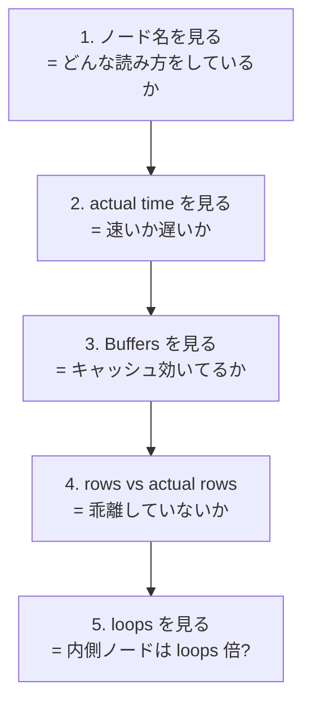
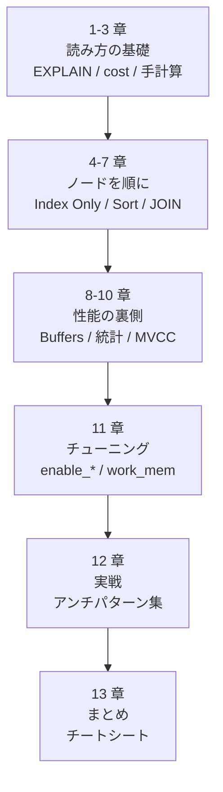

## この章で答える問い

- 1 枚で EXPLAIN を読み切るためのチェックリストは？
- 最初に見るべき 3 つの数字は？
- 推定 vs 実測の乖離をどうやって発見するか？
- ここから先、何を読めばさらに深まるか？

:::message
**この章のゴール**: 12 章まで学んだ内容を 1 枚のチートシートにまとめて、自分の手元で `EXPLAIN ANALYZE` を読むときに即座に参照できる状態にする。
:::

---

## はじめに

<!--
TODO(human): 12 章ぶんを書ききった本人語り。
ヒント:
- 1 章を書き始めたときと今で、EXPLAIN への向き合い方がどう変わったか
- この本を書きながら自分が一番学んだこと
- 読者にどんな状態で本書を閉じてほしいか
-->

---

## 13.1 EXPLAIN チートシート（1 枚版）


開発中に EXPLAIN ANALYZE を眺めるときの、自分の頭の使い方を 1 枚にまとめます。

### 打ち方の定石

```sql
EXPLAIN (ANALYZE, BUFFERS) SELECT ...;
```

- `ANALYZE` で実測値、`BUFFERS` でキャッシュ状況がセットで取れる
- 書き込み系のクエリは `BEGIN; ... ROLLBACK;` で囲む

### 出力の読む順序



### ノードの種類とその性格

| ノード | 動き | 強い場面 | 弱い場面 |
|---|---|---|---|
| Seq Scan | 全ページを順に読む | 全件ヒット、テーブル小 | 一部だけ取りたいとき |
| Index Scan | インデックスを引いてヒープを訪問 | 数行〜数十行のピンポイント | 中規模選択率（Bitmap に負ける） |
| Index Only Scan | インデックスだけで答えを返す | カバリングインデックスがあるとき | visibility map が古いと Heap Fetches が増える |
| Bitmap Heap Scan | インデックスからまとめてヒープを読む | 中規模選択率 | 大規模（Seq Scan に負ける） |
| Nested Loop | 外側 × 内側のループ | 外側小、内側 Index | 外側大、内側 Seq Scan |
| Hash Join | 小さい側を hash 化して大きい側を probe | 両方が大きい | work_mem に収まらないとき |
| Merge Join | 両方ソート済みを並行マージ | 両方の結合キーが index | 事前 Sort が必要なほど重くなる |
| Sort | 全行を並べる | ─ | スタートアップコスト大、work_mem 超えで disk sort |
| Limit | 上から N 行だけ | top-N heapsort や Index Scan と組み合わせて早期終了 | ─ |
| Memoize | 内側ループの結果をキャッシュ | 外側に重複キー | 重複が少ないと無駄 |
| Gather | 並列実行の結果を集約 | テーブルが大きい | 起動コストが乗る |

### コストパラメータの意味

| パラメータ | デフォルト | 意味 |
|---|---|---|
| `seq_page_cost` | 1.0 | ページ連続読み（基準） |
| `random_page_cost` | 4.0 | ページランダム読み（HDD 時代の値、SSD なら 1.1〜2.0） |
| `cpu_tuple_cost` | 0.01 | 1 行を CPU で処理 |
| `cpu_index_tuple_cost` | 0.005 | 1 インデックスタプルを処理 |
| `cpu_operator_cost` | 0.0025 | 1 演算子の評価 |

### コスト式（自分で計算したいとき）

- **Seq Scan**: `seq_page_cost × relpages + cpu_tuple_cost × rows`
- **Seq Scan + WHERE**: 上に `+ cpu_operator_cost × オペレータ数 × rows` を足す
- **Index Scan**: `random_page_cost × 訪問ページ数 + cpu_index_tuple_cost × インデックスタプル + cpu_tuple_cost × ヒープタプル + B-tree 探索コスト`
- **Sort**: `2.0 × cpu_operator_cost × N × log2(N)` + 一時ファイル I/O

---

## 13.2 「最初に見る 3 つの数字」

EXPLAIN ANALYZE の出力は情報量が多いので、最初に見るべき数字を 3 つに絞ると判断が速くなります。

1. **actual time の B（トータル）**: クエリ全体の実時間（Execution Time のほうがより正確）
2. **Buffers: shared hit / read**: キャッシュが効いているか、I/O が多いか
3. **rows × loops（内側ノード）**: 真の処理行数

この 3 つで「速いか遅いか」「I/O が原因か」「ノードが何回呼ばれているか」が見えます。

---

## 13.3 プラン木を読む順序の決まり手

EXPLAIN ANALYZE の出力は木構造になっています。読み方のルールは 3 つだけ。

1. **インデント = 親子関係**: `->` の前のスペース幅が階層を表す
2. **子は親に行を流す**: 下のノードが読んだ行を、上のノードが受け取って処理する
3. **読む順序は「子から先」**: 一番奥（インデントが深い）のノードが先に動き始める

例えば 7 章の Hash Join なら、

```
 Hash Join
   Hash Cond: (a.author_id = au.id)
   ->  Seq Scan on articles a       ← 先に動く
   ->  Hash                          ← その次
         ->  Seq Scan on authors au  ← 最初に動くのは実はこっち（build フェーズ）
```

「Hash Join が動く前に、下の Hash が動く。Hash が動く前に、その下の Seq Scan on authors が動く」と読みます。

---

## 13.4 「推定 1 行・実測 100 万行」を見つける癖

事故るプランの 99% は **推定が大きく外れている**。`rows`（推定）と `actual rows`（実測）の比率を見る癖を付けると、本番で炎上を未然に防げます。

2 章で立てた経験則を再掲します。

| 比率 | 自分が感じる状態 | やってみること |
|---|---|---|
| 2 倍以内 | 普通の誤差 | 何もしない |
| 10 倍以上 | プラン選択を間違えていそう | 統計情報・相関カラム・LIKE を疑う |
| 100 倍以上 | プランが暴走してそう | 統計を取り直す、pg_stats を覗く |

`EXPLAIN ANALYZE` を打って、出力にこの比率の大きいノードがあれば要注意。9 章「プランナと統計情報」で扱った対処に進みます。

---

## 13.5 各章で学べること

13 章を通して、各章で何を学べるのかを整理します。



### 第 1 章 EXPLAIN の基本

- **主役クエリ**: `EXPLAIN SELECT * FROM articles;`
- EXPLAIN コマンドの基本動作（実行せずに計画書だけ返す）
- 出力の 5 つの数字（cost / rows / width）
- Seq Scan のコスト式 `seq_page_cost × ページ数 + cpu_tuple_cost × 行数`
- 手計算で `cost=0.00..12181.00` を再現する体験

### 第 2 章 EXPLAIN ANALYZE

- **主役クエリ**: `EXPLAIN ANALYZE SELECT * FROM articles;`
- `ANALYZE` で実測値（actual time / actual rows / loops）が出る
- 推定（`rows`）と実測（`actual rows`）の乖離の読み方
- `actual rows × loops` で総処理行数を計算する
- 書き込みクエリの `BEGIN; ... ROLLBACK;` 安全策

### 第 3 章 Index Scan / Bitmap Scan / Seq Scan の選び分け

- **主役クエリ**: WHERE で件数を変える 4 つのクエリ（1 行 / 49 行 / 4,931 行 / 75,250 行）
- ヒット件数でプランが切り替わる（Index → Bitmap → Seq）
- Index Scan のコスト式と手計算（`cost=0.42..8.44`）
- `random_page_cost` を動かしたときのプランの動き
- LIMIT を付けると Bitmap → Index に切り替わる

### 第 4 章 Index Only Scan と visibility map

- **主役クエリ**: `SELECT id FROM articles WHERE id = ?`
- Index Only Scan は Index Scan と何が違うのか
- `Heap Fetches` の意味
- visibility map のしくみと VACUUM との関係
- カバリングインデックス（`INCLUDE` 句）

### 第 5 章 Sort と top-N heapsort

- **主役クエリ**: `SELECT * FROM articles ORDER BY title LIMIT 20;`
- `ORDER BY` で Sort ノードが出る場面
- Sort のスタートアップコストの性質（A ≒ B）
- `top-N heapsort`（LIMIT 付き ORDER BY の最適化）
- `work_mem` を超えると外部ソート（disk sort）
- Index でソート済みを使って Sort を避ける

### 第 6 章 JOIN ─ Nested Loop と Memoize

- **主役クエリ**: `articles JOIN comments` の小規模 JOIN
- Nested Loop の外側 × 内側の構造
- 内側が Index Scan のときの強み
- `loops` の罠（`actual time × loops` が真の合計）
- Memoize（PG14+）で内側ループをキャッシュする最適化

### 第 7 章 JOIN ─ Hash Join と Merge Join

- **主役クエリ**: `articles JOIN authors` のフルスキャン JOIN
- Hash Join の build フェーズと probe フェーズ
- `Buckets` と `Batches` の意味
- `work_mem` を超えると Hash が複数 batch に分割される
- Merge Join のソート済み前提
- プランナの 3 つの JOIN 方式の使い分け

### 第 8 章 BUFFERS とキャッシュ階層

- **主役クエリ**: 同じクエリを 2 回打つ
- `Buffers: shared hit / read / dirtied / written` の読み分け
- PostgreSQL のキャッシュ階層（shared_buffers → OS page cache → disk）
- cold cache と warm cache の切り替わり
- `pg_prewarm` で意図的に warm にする
- `shared_buffers` と `effective_cache_size` の違い

### 第 9 章 プランナと統計情報

- **主役クエリ**: ANALYZE 前後で同じクエリを比較
- `pg_class` / `pg_statistic` / `pg_stats` の役割
- ヒストグラムと MCV による選択率の計算
- 統計を古くすると乖離が生まれる実験
- `ANALYZE` と `autoanalyze` の挙動
- 相関カラムと拡張統計（`CREATE STATISTICS`）

### 第 10 章 VACUUM、MVCC、dead tuple

- **主役クエリ**: `SELECT count(*) FROM articles;`
- MVCC（複数バージョン同時実行制御）の基本
- tuple header と `xmin` / `xmax`
- `UPDATE` / `DELETE` で dead tuple が生まれるしくみ
- VACUUM と autovacuum の役割
- `SELECT count(*)` が遅い理由と Index Only Scan で速くするテクニック

### 第 11 章 プランナの挙動を制御する

- **主役クエリ**: `SET enable_*;` で同じクエリの 3 戦略を比較
- `enable_*` 系のスイッチ（コストペナルティ方式）
- `work_mem` を動かして Sort / Hash の挙動を変える
- 並列クエリと `Gather` ノード
- 本番でプランを固定する選択肢（pg_hint_plan）

### 第 12 章 EXPLAIN で見つけるアンチパターン集

- **主役クエリ**: 8 つの「悪い例 → 直し方」を順番に EXPLAIN ANALYZE
- WHERE で関数を使うとインデックスが効かない（式インデックスで救う）
- LIKE '%xxx%' は B-tree が効かない（pg_trgm + GIN で救う）
- SELECT * の濫用で Index Only Scan が活かせない
- ORDER BY が Index を使えない / count(*) の濫用 / OR の多用
- 暗黙の型キャストで Index が効かない
- N+1 を DB 側で見つける（pg_stat_statements の calls）

### 第 13 章 チートシートとふりかえり

- 1 枚で EXPLAIN を読み切るチェックリスト
- 「最初に見る 3 つの数字」
- プラン木の読み順の決まり手
- 「推定 1 行・実測 100 万行」を見つける癖
- 本書で扱った単語集

最初に「EXPLAIN を 1 行ずつ読み切れるようになる」を目標に始めた本書も、ここまで来ると **「クエリを書いた瞬間にプランナが何を考えているか想像できる」** くらいまで踏み込めたはずです。

---

## 13.6 本書で学べる単語集

本書を通して登場する用語を、カテゴリごとに整理します。「初出章」は最初に詳しく扱った章番号です。

### ノード（実行計画の各ステップ）

| 単語 | 初出章 | 一言定義 |
|---|---|---|
| Seq Scan | 1 | テーブルを先頭から末尾まで連続して読む |
| Index Scan | 3 | インデックスを引いて該当ヒープページを訪問する |
| Index Only Scan | 4 | インデックスだけで答えを返す（ヒープを読まない） |
| Bitmap Heap Scan | 3 | ビットマップに従ってヒープページをまとめて読む |
| Bitmap Index Scan | 3 | インデックスからヒープページ位置のビットマップを作る |
| Nested Loop | 6 | 外側 × 内側のループで結合する素朴な JOIN 方式 |
| Hash Join | 7 | 小さい側を hash 化、大きい側を probe する JOIN |
| Hash | 7 | Hash Join の build フェーズで hash テーブルを作るノード |
| Merge Join | 7 | 両方ソート済みを並行マージする JOIN |
| Sort | 5 | 全行を並べ替える |
| Limit | 3 | 上から N 行だけ取って早期終了 |
| Memoize | 6 | Nested Loop の内側結果をキャッシュ（PG14+） |
| Gather | 11 | 並列クエリの結果を集約 |
| Aggregate | 10 | count / sum / avg など集約計算 |
| Filter | 3 | WHERE 句を行ごとに評価 |
| Index Cond | 3 | インデックスに直接渡せる WHERE 条件 |
| Recheck Cond | 3 | Bitmap で取った後に再チェックする WHERE 条件 |

### コスト・実測値

| 単語 | 初出章 | 一言定義 |
|---|---|---|
| cost (startup..total) | 1 | プランナの推定コスト。スタートアップ..トータルの形 |
| rows | 1 | 推定行数。`pg_class.reltuples` などから計算 |
| width | 1 | 1 行あたりの推定バイト数 |
| actual time | 2 | 実測時間（ミリ秒、ループあたり） |
| actual rows | 2 | 実測行数（ループあたりの平均） |
| loops | 2 | このノードが実行された回数 |
| Planning Time | 2 | プランナが実行計画を作るのにかかった時間 |
| Execution Time | 2 | クエリ実行の総時間 |
| seq_page_cost | 1 | ページ連続読みのコスト（基準 1.0） |
| random_page_cost | 3 | ページランダム読みのコスト（HDD 時代の値 4.0） |
| cpu_tuple_cost | 1 | 1 行を CPU で処理するコスト（0.01） |
| cpu_index_tuple_cost | 3 | 1 インデックスタプルを処理するコスト（0.005） |
| cpu_operator_cost | 3 | 1 演算子の評価コスト（0.0025） |

### ストレージ

| 単語 | 初出章 | 一言定義 |
|---|---|---|
| page | 1 | PostgreSQL の I/O 単位（標準 8KB） |
| ヒープページ | 3 | テーブル本体のページ |
| インデックスページ | 3 | インデックスのページ |
| ヒープタプル | 3 | ヒープページに格納された行 1 件 |
| インデックスタプル | 3 | インデックスページに格納される「キー + ヒープへのポインタ」 |
| relpages | 1 | `pg_class` が保持するページ数（推定） |
| reltuples | 1 | `pg_class` が保持する行数（推定） |
| ctid | 10 | タプルの物理位置（page, line pointer index） |
| 連続 I/O | 3 | ディスクのページを順番に読む |
| ランダム I/O | 3 | 飛び飛びのページを読む |
| B-tree | 3 | PostgreSQL のデフォルトインデックス構造 |
| カバリングインデックス | 4 | クエリ全体をカバーするインデックス（`INCLUDE` 句） |

### キャッシュ・I/O

| 単語 | 初出章 | 一言定義 |
|---|---|---|
| BUFFERS オプション | 2 | EXPLAIN にバッファ統計を追加するオプション |
| Buffers: shared hit | 8 | shared_buffers から取れたページ数 |
| Buffers: shared read | 8 | shared_buffers に無くて外から取ったページ数 |
| Buffers: shared dirtied | 8 | このクエリで書き換えたページ数 |
| Buffers: shared written | 8 | shared_buffers から disk に書き出したページ数 |
| shared_buffers | 8 | PostgreSQL 専用のメモリキャッシュ（デフォルト 128MB） |
| OS page cache | 8 | OS が管理するファイルキャッシュ |
| effective_cache_size | 8 | プランナに教えるキャッシュ推定サイズ |
| pg_prewarm | 8 | テーブル / インデックスを shared_buffers に読み込む拡張 |
| cold cache / warm cache | 8 | キャッシュが冷たい状態 / 温まった状態 |

### 統計情報

| 単語 | 初出章 | 一言定義 |
|---|---|---|
| pg_class | 1 | テーブル / インデックスごとの `reltuples` / `relpages` を持つ |
| pg_statistic | 9 | カラムごとの詳細な統計（内部用） |
| pg_stats | 9 | `pg_statistic` を読みやすく整形したビュー |
| ヒストグラム | 9 | 値の分布を区間で示す統計（`histogram_bounds`） |
| MCV | 9 | Most Common Values。よく出る値トップ N |
| most_common_freqs | 9 | 各 MCV の出現頻度 |
| n_distinct | 9 | カラムに出現する異なる値の数 |
| correlation | 9 | カラムの値と物理順序の相関係数 |
| ANALYZE | 2, 9 | 統計情報を更新するコマンド |
| autoanalyze | 9 | autovacuum のサブプロセスとして自動 ANALYZE |
| 拡張統計 | 9 | 複数カラムの組の統計（`CREATE STATISTICS`） |

### MVCC・VACUUM

| 単語 | 初出章 | 一言定義 |
|---|---|---|
| MVCC | 10 | Multi-Version Concurrency Control。複数バージョン同時実行制御 |
| xmin | 10 | タプルを作成したトランザクション ID |
| xmax | 10 | タプルを削除したトランザクション ID |
| tuple header | 10 | ヒープタプルの先頭に付くメタ情報 |
| dead tuple | 10 | `xmax` が立った「死んだ」タプル |
| live tuple | 10 | 現在生きているタプル |
| VACUUM | 10 | dead tuple を回収して再利用可能にするコマンド |
| VACUUM FULL | 10 | テーブルを物理的に縮める（ロック取得） |
| autovacuum | 10 | dead tuple が増えたら自動で VACUUM を走らせる |
| visibility map | 4, 10 | ヒープページ単位で「全タプル可視」を保持するビット列 |
| Heap Fetches | 4 | Index Only Scan で visibility map から判定できずヒープを読んだ回数 |
| n_live_tup / n_dead_tup | 10 | `pg_stat_user_tables` のライブ / デッドタプル数 |

### プランナ制御

| 単語 | 初出章 | 一言定義 |
|---|---|---|
| enable_seqscan | 11 | Seq Scan を選びにくくするスイッチ |
| enable_indexscan | 11 | Index Scan を選びにくくするスイッチ |
| enable_indexonlyscan | 11 | Index Only Scan を選びにくくするスイッチ |
| enable_bitmapscan | 11 | Bitmap Scan を選びにくくするスイッチ |
| enable_nestloop | 11 | Nested Loop を選びにくくするスイッチ |
| enable_hashjoin | 11 | Hash Join を選びにくくするスイッチ |
| enable_mergejoin | 11 | Merge Join を選びにくくするスイッチ |
| enable_memoize | 6, 11 | Memoize を選びにくくするスイッチ |
| disable_cost | 11 | `enable_* = off` のときに乗る巨大ペナルティ |
| work_mem | 5, 7, 11 | Sort / Hash の 1 ノードあたりメモリ上限 |
| max_parallel_workers_per_gather | 11 | 1 `Gather` の最大 worker 数 |
| parallel_setup_cost | 11 | 並列起動のオーバーヘッドコスト |
| pg_hint_plan | 11 | 本番でプランを固定する拡張 |

### EXPLAIN オプション

| 単語 | 初出章 | 一言定義 |
|---|---|---|
| EXPLAIN | 1 | 実行計画だけ返す（クエリは実行しない） |
| ANALYZE | 2 | 実際にクエリを実行して実測値を取る |
| BUFFERS | 8 | バッファ統計（hit / read など）を追加 |
| VERBOSE | 13 | 出力カラムリストなど詳細情報を追加 |
| SETTINGS | 13 | プランに影響したパラメータを表示 |

### アンチパターン関連

| 単語 | 初出章 | 一言定義 |
|---|---|---|
| N+1 問題 | 12 | 1 + N 本の同形 SELECT が連続発行される性能問題 |
| 式インデックス | 12 | `lower(email)` のように関数の結果にインデックスを張る方法 |
| pg_trgm | 12 | トライグラム検索の拡張。中間一致 LIKE で使う |
| 暗黙の型キャスト | 12 | クエリの値の型が違って勝手にキャストが入り、index が効かなくなる落とし穴 |
| pg_stat_statements | 12 | クエリ統計を集める PostgreSQL 拡張。N+1 や重いクエリの発見に使う |

### その他

| 単語 | 初出章 | 一言定義 |
|---|---|---|
| selectivity（選択率） | 3 | 全行のうち WHERE で残る行の割合 |
| top-N heapsort | 5 | LIMIT 付き ORDER BY の最適化（上位 N 件のみ min-heap で保持） |
| external merge sort | 5 | `work_mem` に収まらないときの disk を使う Sort |
| build フェーズ / probe フェーズ | 7 | Hash Join の 2 段階 |
| pull モデル | 6 | 上から下にノードが「次の行をくれ」と引き上げる実行モデル |

---

## 13.7 参考文献・推薦リソース

ここから先さらに深めたい場合の道筋。

### 公式ドキュメント

- [PostgreSQL 17.x 文書 14.1 EXPLAINの利用](https://www.postgresql.jp/document/17/html/using-explain.html) - EXPLAIN の公式入門
- [PostgreSQL 17.x 文書 14.2 プランナで使用される統計情報](https://www.postgresql.jp/document/17/html/planner-stats.html) - 統計情報の話
- [PostgreSQL 17.x 文書 14.3 明示的にJOIN句を制御する](https://www.postgresql.jp/document/17/html/explicit-joins.html) - JOIN の最適化
- [PostgreSQL 17.x 文書 62.6 インデックスコスト推定関数](https://www.postgresql.jp/document/17/html/index-cost-estimation.html) - Index のコスト推定
- [PostgreSQL 17.x 文書 65.4 可視性マップ](https://www.postgresql.jp/document/17/html/storage-vm.html) - visibility map
- [PostgreSQL 17.x 文書 24.1 定常的なバキューム作業](https://www.postgresql.jp/document/17/html/routine-vacuuming.html) - VACUUM の運用

### ソースコード

- [`src/backend/optimizer/path/costsize.c`](https://github.com/postgres/postgres/blob/REL_17_STABLE/src/backend/optimizer/path/costsize.c) - 全ノードのコスト計算の本体

### ツール

- [pev2](https://explain.dalibo.com/) - EXPLAIN 出力を可視化するブラウザツール
- [pg_hint_plan](https://github.com/ossc-db/pg_hint_plan) - 本番でプランを固定する拡張
- [pg_stat_statements](https://www.postgresql.jp/document/17/html/pgstatstatements.html) - クエリ統計

---

## 13.8 おわりに

<!--
TODO(human): 締めくくりの本人語り。
ヒント:
- 本書を最後まで書ききって、自分の中で何が変わったか
- 読者への感謝、メッセージ
- 次に書きたい本があるならその予告でも
-->

EXPLAIN を読む技術は、覚えた瞬間から **毎日のクエリ開発が一段違って見える** ようになります。1 つでも「あ、これは○章のあのパターンだ」と思える瞬間があれば、本書を書いた価値があります。

ここまで読んでくれてありがとう。手元の DB で、いろんな EXPLAIN ANALYZE を打って遊んでみてください。
