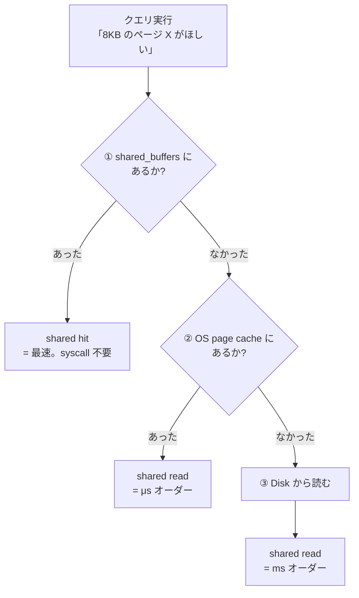

:::message
この物語はフィクションですが、登場する SQL と EXPLAIN の出力はすべて実測値です（数値の一部は環境により変動するため `...` 表記）。技術書版[「PostgreSQL の EXPLAIN と内部のしくみ」](https://zenn.dev/hatsu38/books/cddb89f9abfaca)第 8 章と同じサンプル DB で再現できます。
:::

## 1

午前4時57分。

「湊。今夜ずっと気になってたことを言ってみろ」

「……本番のレイテンシグラフです。同じ /articles のクエリなのに、12 秒のときと 8 秒のときがある。プランが同じなら、時間も同じはずじゃないんですか。それに、サンドボックスでも 2 回目のクエリは必ず速くなる。この揺らぎの正体が分からないままだと、直したとして、**効果測定の数字が信用できない**」

「満点だ。その揺らぎを 1 ページ単位で数える道具を教える。ANALYZE の隣に、もうひとつオプションを足せ」

```sql
EXPLAIN (ANALYZE, BUFFERS) SELECT * FROM articles;
```

```
 Seq Scan on articles  (cost=0.00..12181.00 rows=100000 width=269) (actual time=... rows=100000 loops=1)
   Buffers: shared hit=... read=...
 Planning Time: ...
 Execution Time: ...
```

「`Buffers:` という行が増えた。**このクエリが 8KB のページを、どこから何枚取ってきたか**の帳簿だ。主に 4 種類ある」

| 項目 | 意味 |
|---|---|
| `shared hit=N` | PostgreSQL 自身のキャッシュ（shared_buffers）にあったページを N 枚。**最速** |
| `shared read=N` | キャッシュに無く、**外から**取ってきたページ N 枚 |
| `shared dirtied=N` | このクエリが書き換えたページ数（更新系で出る） |
| `shared written=N` | キャッシュからディスクへ書き出したページ数（めったに出ない） |

「SELECT なら見るのは **hit と read の比率**だ。──さあ、実験だ。同じクエリを**続けて 2 回**打って、Buffers を見比べろ」

言われたとおりに 2 連射した。結果は、はっきり違った。

| 回 | Buffers | actual time (B) |
|---|---|---|
| 1 回目 | `shared read` が大半 | 大きい |
| 2 回目 | `shared hit` がほぼ全部、`read=0` 近く | 小さい |

「2 回目は read がほぼ消えて、全部 hit になってる……そうか、**1 回目に読んだページがキャッシュに乗った**から、2 回目は速い。actual time のブレって、乱数じゃなくて、この帳簿に全部書いてあったんですね」

「そうだ。時間は嘘みたいにブレるが、**ページの枚数はブレない**。だから実務では `EXPLAIN (ANALYZE, BUFFERS)` を癖にしろ。時間だけ見て一喜一憂するのは、体温計を使わずに額に手を当ててるのと同じだ」

## 2

「ここで、hit と read の『どこから』を正確にしておく。PostgreSQL のページの置き場は **3 階建て**だ」

```
① shared_buffers   … PostgreSQL 専用のメモリキャッシュ（デフォルト 128MB）
② OS page cache    … OS が管理するファイルキャッシュ
③ Disk             … SSD / HDD の実体
```


*捜査資料: 3 階建ての捜索順序。② と ③ は帳簿上どちらも同じ `shared read` に計上される──ここが罠*

「クエリがページを欲しがると、まず ① を見る。あれば `shared hit`──システムコールすら要らない最速の取得だ。無ければ外へ取りに行って `shared read` になる。──で、ここが今夜いちばん引っかかりやすい罠だ。**`shared read` はディスクを読んだという意味ではない**」

「え。read って書いてあるのに」

「read の行き先が ② の OS キャッシュなら数マイクロ秒で返る。③ のディスクまで落ちれば数ミリ秒。**PostgreSQL からはこの 2 つが区別できない**。どちらも同じ `shared read` に計上される。だから『read が多い＝遅い』と即断するな。read が多くて*かつ*実時間が長いときに、初めてディスクを疑う」

「3 階建ての 2 階と 3 階が、帳簿上は同じ扱い……」

「そういうことだ。ついでに関連する設定を 2 つ。`shared_buffers` はデフォルト 128MB で、本番では物理 RAM の 25% 程度が定石。もうひとつの `effective_cache_size` は曲者で、**メモリを 1 バイトも確保しない**。『①＋② を合わせて、だいたいこのくらいキャッシュがあるはずだ』とプランナに教える**申告値**だ。大きく申告するほど、プランナは『ランダム I/O もどうせキャッシュから返る』と楽観して Index Scan を安く見積もる。──入札の相場観そのものを動かすパラメータだ、と言えば重みが分かるだろう」

「キャッシュを事前に温めることもできるんですか？ ベンチマークの前とか」

「`pg_prewarm` という拡張がある。`SELECT pg_prewarm('articles');` で、テーブルを丸ごと shared_buffers に積める。再起動直後のウォームアップや、測定前の下ごしらえに使う」

## 3

「──では、本番の帳簿を読むぞ。今夜の 12 秒のプラン、BUFFERS 付きで取り直してある。読んでみろ」

僕はレプリカの出力を開いた。血痕は、二か所に集中していた。

「……まず、暴走してた Nested Loop の内側。loops が十数万だから、インデックスとヒープのページ取得が積み上がって、Buffers が**百万枚単位**になってます。ただ、ほとんど `shared hit` です。同じページを何度も何度も引いてるから、2 回目以降はキャッシュに乗ってる。**速いページ取得でも、枚数が桁違いなら時間は積み上がる**……」

「もう一か所は」

「Sort です。external merge の一時ファイル。これは shared_buffers の外だから……ディスクに実書きしてる。**ここが 12 秒と 8 秒の揺らぎの震源**じゃないですか？ 一時ファイルの書き先のディスクが混んでるかどうかで、同じクエリでも数秒ブレる」

「筋がいい。整理するぞ」

桐生さんの声が、事件簿を閉じる前の検事のトーンになった。

「12 秒の内訳はこうだ。**百万ページ級の取得を強いる Nested Loop の暴走**──キャッシュヒットでも量で殺しに来る。そして**work_mem を溢れた Sort のディスク書き**──これが実行ごとの揺らぎも作る。どちらも第 6 話・第 5 話で特定済みの犯行だ。BUFFERS はそれを**ページ数という動かぬ物証**で裏付けた。──さて」

キーボードの音が止まり、一拍の間があった。

「実行犯 Nested Loop。共犯 Sort。正しいプランの存在証明も済んだ。残るは一人──**プランナに rows=131 という狂った見積もりを渡した黒幕**だ。プランナは何を読んで 131 と言ったのか。答えは統計情報──`pg_class` と `pg_stats`、プランナの目そのものだ。夜が明ける前に、締めるぞ」

午前5時11分。東の空が、灰色から群青に変わり始めていた。

（第9話「黒幕の名 ─ プランナと統計情報」につづく）

---

## 今夜の捜査メモ

- `EXPLAIN (ANALYZE, BUFFERS)` で **ページ取得の帳簿**が出る: `shared hit`（自前キャッシュから）/ `shared read`（外から）/ `dirtied` / `written`
- キャッシュは 3 階建て: **shared_buffers → OS page cache → Disk**。**`shared read` ≠ ディスク読み**──OS キャッシュとディスクは帳簿上区別できない。read が多くて*かつ*遅いときに初めてディスクを疑う
- 「同じクエリなのに 2 回目が速い」の正体は cold → warm: 1 回目の `shared read` が 2 回目に `shared hit` へ変わる。**時間はブレるが、ページ枚数はブレない**──効果測定は Buffers で
- `shared_buffers` はデフォルト 128MB（本番は RAM の 25% 目安）。`effective_cache_size` は**実メモリを確保しない申告値**で、プランナの Index Scan の見積もりを楽観／悲観に振る
- `pg_prewarm` 拡張でテーブルを事前に shared_buffers へ積める（ベンチ前・再起動後の定石）
- キャッシュヒットでも**枚数が桁違いなら遅い**。Nested Loop 暴走は「速い取得 × 百万回」で殺しに来る。Sort の一時ファイルはディスク実書きなので、実行ごとの揺らぎの震源になる

:::message
キャッシュ 3 階層の判定フロー図、cold/warm 実験の実測表、pg_prewarm の使い方は技術書版の[第 8 章](https://zenn.dev/hatsu38/books/cddb89f9abfaca)にあります。
:::
