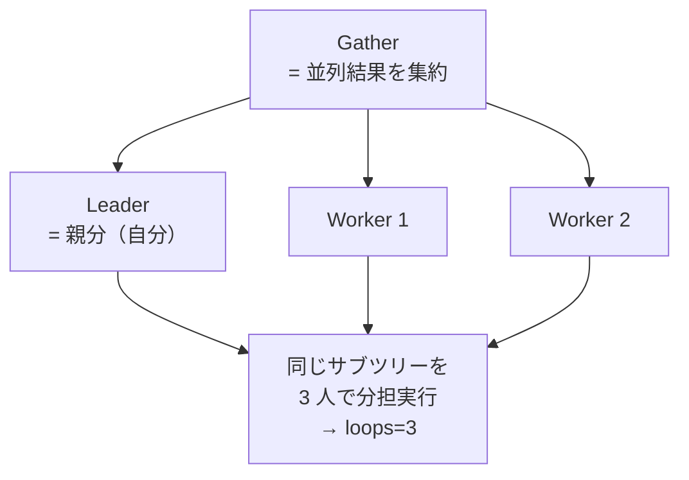

:::message
この物語はフィクションですが、登場する SQL と EXPLAIN の出力はすべて実測値です（数値の一部は環境により変動するため `...` 表記）。技術書版[「PostgreSQL の EXPLAIN と内部のしくみ」](https://zenn.dev/hatsu38/books/postgres-explain-internals)第 11 章と同じサンプル DB で再現できます。
:::

## 1

同じ日の夕方、17時30分。

4 時間の仮眠と 2 度のコーヒーを経て、僕はオフィスの会議室にいた。ホワイトボードの前には桐生さん。昨夜じゅう電話の向こうにいた人が目の前にいるのは、少し不思議な感じがした。

「ポストモーテムは明日だ。今日はその前に、渡しそびれた道具を渡す。──湊、昨夜 ANALYZE で直ったのは、正直に言えば**運がいい部類**だ。統計を直してもプランナが言うことを聞かない夜もある。そのときに使う、*交渉*の道具一式だ」

ホワイトボードに、スイッチの一覧が書き出された。

```sql
SHOW enable_seqscan;        -- on
SHOW enable_indexscan;      -- on
SHOW enable_indexonlyscan;  -- on
SHOW enable_bitmapscan;     -- on
SHOW enable_nestloop;       -- on
SHOW enable_hashjoin;       -- on
SHOW enable_mergejoin;      -- on
SHOW enable_sort;           -- on
SHOW enable_memoize;        -- on (PG14+)
```

「第 7 話で 2 つ触ったな。全ノードぶんある。──ここで、正確に理解しておくべきことがある。`off` は**禁止ではない**」

「え。off なのに？」

「実装を言うと、off にしたノードのコストに **`disable_cost`──約 10 億のペナルティ**を上乗せするだけだ。入札制度は生きている。10 億を積まれた入札者は現実的にまず勝てない、というだけで、**他の全候補も 10 億超えなら、平気で選ばれる**。だから『禁止』ではなく『**現実的に使わせない**』が正確な理解だ」

「入札額に 10 億上乗せ……ここでもコストの世界なんですね。プランナには『使うな』という命令文が存在しない」

「そうだ。あるのはコストだけ。それを体で覚える実験をやる」

## 2

「第 3 話の 5% ヒットのクエリで、スイッチを 1 枚ずつ切っていけ」

```sql
-- ① デフォルト
EXPLAIN ANALYZE SELECT * FROM articles WHERE author_id BETWEEN 1 AND 100;

-- ② Seq Scan を切る
SET enable_seqscan = off;
EXPLAIN ANALYZE SELECT * FROM articles WHERE author_id BETWEEN 1 AND 100;

-- ③ さらに Bitmap も切る
SET enable_bitmapscan = off;
EXPLAIN ANALYZE SELECT * FROM articles WHERE author_id BETWEEN 1 AND 100;

RESET enable_seqscan;
RESET enable_bitmapscan;
```

| 段階 | 切ったもの | 出たプラン | コスト |
|---|---|---|---:|
| ① | なし | Bitmap Heap Scan | 4,312.86 |
| ② | seqscan | **Bitmap Heap Scan（変わらず）** | 4,312.86 |
| ③ | + bitmapscan | Index Scan | ①よりずっと高い |

「② が面白いですね。Seq Scan を切ったのに、何も変わらない」

「当然だ。5% ヒットでは元々 Bitmap が最安で、Seq Scan は入札で負けてた。**負けてる奴に 10 億積んでも順位は変わらない**。③ で Bitmap まで切って、初めて Index Scan が繰り上がる。そしてそのコストを見ろ──①よりはるかに高い。**プランナが日頃こいつを選ばない理由が、数字で見える**」

「あ……この 3 段の表、逆向きに読むと『プランナの頭の中のランキング』なんですね。普段は見えない 2 位以下が、スイッチで炙り出せる」

「それが enable スイッチの正しい用途だ。**本番の応急処置じゃない。診断器具だ**。『プランナは他にどんな手を持っていて、なぜそれを選ばなかったのか』を尋問する道具──昨夜レプリカでやった `enable_nestloop = off` も、あれは治療じゃなく『正しいプランの存在証明』という診断だった」

## 3

「もうひとつ、昨夜は封印してた話をする。並列クエリだ。EXPLAIN にこんな顔が出ることがある」

```text
 Gather  (cost=... rows=... width=...)
   Workers Planned: 2
   Workers Launched: 2
   ->  (並列で分担されるサブツリー)
```

「**Gather** は『複数プロセスで分担した結果を集約する』ノードだ。Workers 2 + 親分 1 の 3 プロセスが同じサブツリーを手分けして走る。だから並列プランでは、ノードに `loops=3` が付いたりする──**Nested Loop でもないのに loops が付いてたら、並列の分担数を疑え**」


*捜査資料: 並列捜査の組織図。3 人が同じ現場を手分けするので、ノードの loops に分担数が付く*

「昨夜のプランには出てませんでしたね」

「サンドボックスの稽古では `SET max_parallel_workers_per_gather = 0` で黙らせてたからな。プランが素直になって読みやすい。関連パラメータは 3 つ押さえておけ──Gather 1 個あたりの最大ワーカー数 `max_parallel_workers_per_gather`、並列の起動オーバーヘッド `parallel_setup_cost`（1,000）、これ未満のテーブルでは並列にしない `min_parallel_table_scan_size`（8MB）。並列も結局、**起動コスト 1,000 を払ってでも得か、という入札**で決まってる」

## 4

「最後だ。『本番でプランを固定したい』と言い出す日が、いずれ来る。選択肢を並べておく」

ホワイトボードに、4 段のリストが並んだ。

「一段目、**pg_hint_plan**。SQL のコメントにヒントを書いて、プランを名指しできる拡張だ」

```sql
/*+ IndexScan(articles articles_pkey) */
SELECT * FROM articles WHERE id = '...';
```

「二段目、古典ハック。`WITH ... AS MATERIALIZED` や `OFFSET 0` でサブクエリを**最適化の壁**にして、プランナの手出しを部分的に止める。三段目、第 9 話の **`CREATE STATISTICS`**──相関カラムの組をプランナに正しく見せる。四段目、**autovacuum / autoanalyze の頻度調整**──統計が古くなる隙間そのものを狭める」

「どれを選べばいいんですか」

「順番が逆だ、湊。**下から検討しろ**」

桐生さんはリストの下半分を丸で囲った。

「三段目と四段目は『プランナに**正しく見せる**』アプローチ。上二つは『プランナを**黙らせる**』アプローチだ。黙らせた瞬間、お前はプランナの代わりに未来永劫その判断に責任を持つことになる。データ分布が変わっても、PostgreSQL がバージョンアップしても、ヒントは古い判断を強制し続ける──**固定したプランは、いつか必ず新しい事件の黒幕になる**。まず正しく見せる。それでも駄目な例外にだけ、ヒントで蓋をする」

耳が痛い話だった。昨夜の僕は、最初の 5 分で「インデックスを足せば」と口走ったのだ。

「──よし。道具は全部渡した。明日のポストモーテム、再発防止のところはお前が書け。それと」

桐生さんは、少しだけ間を置いた。

「コードベースに、今回と同じ型の*余罪*が眠ってるはずだ。EXPLAIN が読めるようになった目で、明日いっしょに洗う。**遅いクエリには、人相書きにできるくらい典型的な顔つき**があるんだ」

（第12話「余罪の捜査 ─ アンチパターン人相書き」につづく）

---

## 今夜の捜査メモ

- `enable_*` スイッチは**禁止ではなくコストペナルティ**: off にすると `disable_cost`（約 10 億）が入札額に上乗せされるだけ。全候補がペナルティ持ちなら off のノードも選ばれ得る
- スイッチを 1 枚ずつ切ると「プランナの頭の中のランキング」（2 位以下の候補とそのコスト）が炙り出せる──**応急処置ではなく診断器具**として使う
- すでに入札で負けているノードを off にしても何も変わらない（② Bitmap 残留の理由）
- **Gather** = 並列クエリの集約ノード。Workers + 親分で同じサブツリーを分担し、ノードに `loops=並列数` が付く。`max_parallel_workers_per_gather = 0` で黙らせるとプランが読みやすい。並列も `parallel_setup_cost`(1,000) を払う価値があるかの入札で決まる
- `work_mem` は Sort（quicksort / external merge）と Hash（Batches）の両方を動かせる万能ダイヤル。ただしノード単位×同時接続数で化ける
- 本番でプランを固定する選択肢は**下から検討**: ④autovacuum/autoanalyze 調整 → ③CREATE STATISTICS（正しく見せる）→ ②MATERIALIZED / OFFSET 0 → ①pg_hint_plan（黙らせる）。**固定したプランは将来の事件の黒幕候補**
- 静的な `SET` での応急処置はセッション全体に効く劇薬（第 7 話の教訓）。恒久対応は必ず「見積もりを正す」側から

:::message
enable スイッチ 3 段実験の実測表、並列クエリの図解、pg_hint_plan の導入は技術書版の[第 11 章](https://zenn.dev/hatsu38/books/postgres-explain-internals)にあります。
:::
