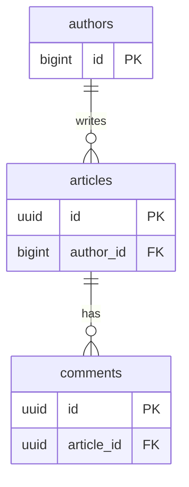

## この章で答える問い

- `EXPLAIN ANALYZE` をつけると、出力に何が増えるのか？
- 増えた `actual time=A..B rows=N loops=M` の 4 つの数字をどう読むのか？
- 推定（`rows`）と実測（`actual rows`）がズレているとき、どこまでが許容で、どこからが「直さないとマズい」のか？

:::message
**この章のゴール**: `EXPLAIN ANALYZE` の出力を見て、「プランナの見立てが当たっているか／外れているか」をその場で判断できるようになる。
:::

## 主役クエリ

```sql
EXPLAIN ANALYZE SELECT * FROM articles;
```

1 章で扱ったクエリの頭に `ANALYZE` を付けただけ。これだけで出力が劇的に増えて、**推定値（cost / rows）** の隣に **実測値（actual time / actual rows / loops）** が並びます。この実測値と推定値の左右をどう読み比べるかが、本章の主題です。

途中で Nested Loop を出す JOIN クエリも 1 つ扱います。

```sql
EXPLAIN ANALYZE
SELECT a.title, c.body
FROM articles a
JOIN comments c ON c.article_id = a.id
WHERE a.author_id BETWEEN 1 AND 5;
```

ここで `actual rows × loops` の罠を実機で観察します。

---

## はじめに

<!--
TODO(human): この章の「つかみ」を 3〜5 行で本人の言葉で書く。
ヒント:
- 1 章の EXPLAIN だけだと困った瞬間
- 自分が actual rows のズレで初めて気づいたバグ・遅延の話
- 読者にどんな状態になってほしいか
-->

---

## 2.1 ANALYZE をつけると何が増えるか

1 章で打った `EXPLAIN SELECT * FROM articles;` の頭に、`ANALYZE` を付け足してもう一度打ってみます。

```sql
EXPLAIN ANALYZE SELECT * FROM articles;
```

出力（サンプルアプリでの実測）:

```sql
 EXPLAIN ANALYZE SELECT * FROM articles;
                                                     QUERY PLAN
--------------------------------------------------------------------------------------------------------------------
 Seq Scan on articles  (cost=0.00..12181.00 rows=100000 width=852) (actual time=0.033..386.444 rows=100000 loops=1)
 Planning Time: 0.125 ms
 Execution Time: 390.524 ms
(3 rows)
```

増えたのは次の 3 か所です。

- ノード行の右側に `(actual time=... rows=... loops=...)` が付いた
- 末尾に `Planning Time: ...` が出た
- 末尾に `Execution Time: ...` が出た

`cost=...` `rows=...` `width=...` は前章と同じ**推定値**です。新しく増えた `actual time` / `actual rows` / `loops` が**実測値**で、`EXPLAIN` のときには出ていなかった「実際に走らせたらどうなったか」が、推定の右隣に並んで表示されると考えてください。

公式ドキュメントを読んでみると、こう書かれていました。

> このオプションを付けると `EXPLAIN` は実際にその問い合わせを実行し、計画ノードごとに実際の行数と要した実際の実行時間を表示します。
> ─ [PostgreSQL 17.x 文書 14.1.2 EXPLAIN ANALYZE](https://www.postgresql.jp/document/17/html/using-explain.html)

:::message alert
**注意**: `EXPLAIN ANALYZE` はクエリを**実際に実行します**。`SELECT` なら問題ありませんが、`INSERT` / `UPDATE` / `DELETE` に打つと**本当に書き込みが走ります**。プランだけ見たいときは `BEGIN; EXPLAIN ANALYZE ...; ROLLBACK;` で囲んでおけば、変更はロールバックされて記録だけ残せます。公式ドキュメントもこの使い方を推奨しています。
:::

---

## 2.2 actual time の A..B

`actual time=A..B` の意味は、1 章の `cost=A..B` と同じ「スタートアップ..トータル」です。

- **A = スタートアップ時間**: 最初の 1 行が返るまでにかかった実測ミリ秒
- **B = トータル時間**: 全行を返し切るまでにかかった実測ミリ秒

ただし単位は**ミリ秒**。1 章の `cost` が無単位の相対値だったのに対して、こちらは本物の時間です。1 章の `cost=0.00..12181.00` の `12181` は「秒でもミリ秒でもない」と注意書きしましたが、`actual time` の数字はそのままミリ秒として読めます。

Seq Scan は「先頭ページを読んで 1 行目を返す」までが早いので、A はほぼ 0 に近い値になります。2.1 の実測でも `actual time=0.033..386.444` で、A=0.033 ms はほぼゼロ、全行返し終わるまでに B=386.444 ms。一方、Sort や Aggregate のように**全行読み終わらないと 1 行目が返せない**タイプのノードは、A が B に近い大きな値になります。

この A と B の差はノードの性格を表していて、A ≪ B なら「最初の 1 行は早く返るが、全行返すには時間がかかる」タイプ、A ≒ B なら「全行揃わないと先頭が返らない」タイプです。`LIMIT 1` の最適化が効くかどうかも、ここを見れば見当が付きます。


実測値は毎回少しブレます。同じクエリを 3 回打ってみると、`actual time` の数字は毎回違うはずです。これは OS のページキャッシュやバッファプールの「温まり具合」が毎回違うからで、8 章で BUFFERS を読むときに改めて触れます。

### Planning Time と Execution Time

ノード行の `actual time` とは別に、出力末尾には `Planning Time` と `Execution Time` の 2 行が付きます。

- **Planning Time**: プランナが実行計画を組み立てるのにかかった時間
- **Execution Time**: 実際にクエリを走らせるのにかかった時間

2.1 の実測だと `Planning Time: 0.125 ms` / `Execution Time: 390.524 ms`。プランを作る作業そのものは 0.125 ms と無視できるほど小さく、ほとんどの時間は実際にデータを読む側にかかっています。普段のシンプルなクエリではこのように Planning Time が小さく済むことが多いですが、テーブル数の多い JOIN や、prepared statement のキャッシュが効かない状況だと、Planning Time が無視できない大きさになることもあります（11 章で扱います）。

Execution Time はノード全体の `actual time` の合計に、結果を返すオーバーヘッドなどを少し加えたものです。クエリ全体の実時間を知りたいときは、各ノードの `actual time` ではなくこちらを見ます。

---

## 2.3 actual rows と loops

`actual rows=N` と `loops=M` はセットで読みます。理由はひとつ。**`actual rows` は「1 ループあたりの平均行数」だから**です。

この点は公式ドキュメントにも明記されています。

> `loops` 値はそのノードを実行する総回数を報告し、表示される実際の時間と行数は1実行当たりの平均です。
> ─ [PostgreSQL 17.x 文書 14.1.2 EXPLAIN ANALYZE](https://www.postgresql.jp/document/17/html/using-explain.html)

今回扱うクエリは `articles` と `comments` を結合します。両者は `articles.id` と `comments.article_id` で繋がっていて、`WHERE` で絞り込むのは `articles.author_id` です。関係する 3 テーブルだけを抜き出したのが下の図です。



サンプルアプリで articles と comments を結合して、Nested Loop が出るクエリを打ってみます。

```sql
EXPLAIN ANALYZE
SELECT a.title, c.body
FROM articles a
JOIN comments c ON c.article_id = a.id
WHERE a.author_id BETWEEN 1 AND 5;
```

出力（並列実行は事前に `SET max_parallel_workers_per_gather = 0;` で抑制）:

```sql
 Nested Loop  (cost=7.11..11296.29 rows=2330 width=62) (actual time=0.625..29.985 rows=2469 loops=1)
   ->  Bitmap Heap Scan on articles a  (cost=6.68..754.94 rows=233 width=36) (actual time=0.562..3.537 rows=249 loops=1)
         Recheck Cond: ((author_id >= 1) AND (author_id <= 5))
         Heap Blocks: exact=241
         ->  Bitmap Index Scan on index_articles_on_author_id  (cost=0.00..6.62 rows=233 width=0) (actual time=0.497..0.497 rows=249 loops=1)
               Index Cond: ((author_id >= 1) AND (author_id <= 5))
   ->  Index Scan using index_comments_on_article_id on comments c  (cost=0.42..45.13 rows=11 width=58) (actual time=0.020..0.104 rows=10 loops=249)
         Index Cond: (article_id = a.id)
 Planning Time: 1.787 ms
 Execution Time: 30.337 ms
```

注目するのは Nested Loop の内側、`Index Scan on comments` の行です。

```sql
->  Index Scan using index_comments_on_article_id on comments c  ... (actual time=0.020..0.104 rows=10 loops=249)
```

`rows=10 loops=249` を見て「10 行しか処理してない」と読むのは間違いです。正しくは「**1 つの article ごとに 10 件の comments を返す Index Scan が、249 回呼ばれた**」。総処理行数を出したいなら掛け算します。

```sql
総処理行数 = actual rows × loops
         = 10 × 249
         = 2,490 行
```

Nested Loop 上端の `actual rows=2469` とほぼ一致します。`actual rows` は平均値で四捨五入されているので、掛け算の結果は厳密にぴったりにはならず、近い値になる、と覚えておけば十分です。

`actual time` も同じ罠を持っています。`actual time=0.020..0.104` は**1 ループあたりの時間**なので、Index Scan ノード全体の処理時間は `0.104 ms × 249 ≈ 26 ms`。一見「1 回 0.1 ms の Index Scan は速い」と思っても、249 回呼ばれれば 26 ms 近くかかります。これが典型的なハマりポイントです。

なお、外側の `Bitmap Heap Scan` は `loops=1` なので、こちらは素直に「249 行取れた」と読んで構いません。

1 章で見た Seq Scan も `loops=1` だったので、`actual rows` と `loops` の罠を気にせず読めました。しかし Nested Loop の内側のように `loops` が増えるノードでは、必ず「1 ループあたり」を意識する必要があります。`Bitmap Heap Scan` や `Bitmap Index Scan` は 3 章で、`Nested Loop` 自体の挙動は 6 章「JOIN ─ Nested Loop と Memoize」で深掘りします。

---

## 2.4 推定と実測の乖離を読む
TODO: ここが必要かは後で検討する

ここが第 2 章の山場です。

`EXPLAIN ANALYZE` の出力には、**推定**（`rows=N`）と**実測**（`actual rows=M`）が必ず左右に並びます。この 2 つの数字を見比べるだけで、プランナの見立てが当たっているかどうかが分かります。

2.1 と同じクエリの出力を、今度は推定と実測のペアという視点で見直します。

```sql
EXPLAIN ANALYZE SELECT * FROM articles;
```

```sql
 Seq Scan on articles  (cost=0.00..12181.00 rows=100000 width=852)
                                            ^^^^^^^^^^^
                                            推定: 100,000 行
                       (actual time=...     rows=100000 loops=1)
                                            ^^^^^^^^^^^
                                            実測: 100,000 行
```

このケースは WHERE なしの Seq Scan で、`reltuples` がそのまま `rows` の推定として使われるため、`ANALYZE` 直後なら**推定と実測がピッタリ一致**します。問題はここから**大きくズレた**ときです。


「どのくらいズレたら直したほうがいいのか？」というのは自分も明確な閾値が持てていません。とりあえず今の自分の中の感覚を表にしてみました。現場や対象テーブルによって幅は変わると思うので、ひとつの目安として読んでもらえれば。

| 乖離の比率 | 自分が感じる状態 | やってみること |
| --- | --- | --- |
| 2 倍以内 | 普通の誤差。 | 特に何もしない。 |
| 10 倍以上 | プラン選択を間違えていそう。 | 統計情報・相関カラム・LIKE あたりを疑ってみる。 |
| 100 倍以上 | プランが暴走してそう。Nested Loop が暴れている疑いも。 | 統計を取り直す。`pg_stats` で内訳を見る。 |

なぜ乖離を気にしたいかというと、プランナはこの `rows` の見積もりを使って**次にどの結合方式（Nested Loop / Hash Join / Merge Join）を選ぶか**を決めているからです。「`rows=10` のつもりで Nested Loop を選んだら、実は 1,000,000 行あった」みたいなパターンに踏んだ話は周りでもよく聞きます（6 章で深掘り予定）。

<!-- TODO(human): 自分が rows と actual rows のズレで実際に困った経験を 3〜5 行で。読者が「あ、これウチでもあるやつ」と思える具体的なエピソードを。 -->

---

## 2.5 乖離の典型パターン

公式ドキュメントを読んだり、手元のサンプルアプリでクエリを試したりしながら整理した範囲では、乖離は次のような場面で起きやすそうです。

1. **統計情報が古い**: 大量 INSERT / UPDATE 直後に `ANALYZE` が走っていないと、プランナは古い統計でプランを立てます。これが乖離の一番多い原因です。詳しくは 9 章で扱います。
2. **相関のあるカラムの AND**: 例えば `WHERE country = 'JP' AND lang = 'ja'` のように、相関が強いカラム同士を AND で繋ぐと、プランナは「カラムは独立」と仮定して両者を掛け算してしまいます。`country='JP'` の選択率 5% と `lang='ja'` の選択率 5% を独立に推定すると、合成の選択率は 0.25% になりますが、実際には 5% に近いままです。対策は**拡張統計**（9 章）。
3. **LIKE 検索**: `WHERE title LIKE 'A%'` のような前方一致や、`LIKE '%foo%'` の中間一致は、プランナが見積もりにくい代表例です。
4. **関数の中身**: `WHERE lower(title) = 'foo'` のように関数を挟むと、プランナは関数内部の統計を持っていないので、推定が大きく外れます。式インデックスや拡張統計で改善できます（9 章）。

特に 2 番目の相関カラムについては、公式ドキュメントでもはっきり警告されています。

> 問い合わせ句で使われている複数列に相関性があることにより、悪い実行計画を実行する遅いクエリがしばしば観察されます。プランナは通常複数の条件がお互いに独立であるとみなしますが、列の値に相関性がある場合はそれは成り立ちません。
> ─ [PostgreSQL 17.x 文書 14.2.2 拡張統計](https://www.postgresql.jp/document/17/html/planner-stats.html)

`EXPLAIN ANALYZE` を打って `rows` と `actual rows` の比率を見れば、このうちどのパターンに該当するか、当たりが付けられるようになります。

---

## 2.6 演習

### 演習 1: actual と loops=1 の基本（JOIN なし）

1.7 で扱った `tags` に `ANALYZE` を足すだけ。新しく増える `actual time` / `actual rows` / `loops` / `Planning Time` / `Execution Time` をひととおり読む。

```sql
EXPLAIN ANALYZE SELECT * FROM tags;
```

出力（サンプルアプリでの実測）:

```sql
 EXPLAIN ANALYZE SELECT * FROM tags;
                                            QUERY PLAN
---------------------------------------------------------------------------------------------------
 Seq Scan on tags  (cost=0.00..4.00 rows=200 width=33) (actual time=2.157..2.267 rows=200 loops=1)
 Planning Time: 0.216 ms
 Execution Time: 2.370 ms
(3 rows)
```

確認すること:

- ノード行の右側に `(actual time=A..B rows=N loops=1)` が出る
- 推定 `rows=200` と実測 `actual rows=200` が一致する
- 末尾に `Planning Time: ... ms` と `Execution Time: ... ms` が並ぶ
- もう一度同じクエリを打つと `actual time` の数字が前回と微妙に違う（キャッシュの温まり具合の差）

:::details 答え合わせ
WHERE がないので推定と実測は完全一致する (200 行)。`loops=1` なのでこのノードは「200 行取れた」と素直に読める。`Execution Time` はノードの `actual time` の B（トータル）と近い値で、両者の差は結果をクライアントへ返すオーバーヘッドぶん。

2 回目実行で `actual time` が小さくなれば、それは OS のページキャッシュにテーブルが乗ったから（8 章 BUFFERS で詳しく扱う）。
:::

### 演習 2: loops > 1 を最小限の JOIN で観察する

`authors` と `articles` を `au.id < 4` で結合する。外側が 3 行ぴったりに絞られるので、内側ノードに `loops=3` が現れるはず。

```sql
SET max_parallel_workers_per_gather = 0;

EXPLAIN ANALYZE
SELECT au.name, a.title
FROM authors au
JOIN articles a ON a.author_id = au.id
WHERE au.id < 4;
```

確認すること:

- 内側（`articles` 側）のノードに `loops=3` が出る（`au.id` が 1, 2, 3 の 3 人ぶん）
- 内側の `actual rows × loops` が、Nested Loop 上端の `actual rows` と概ね一致する
- 2.3 で扱った「`actual rows` は 1 ループあたりの平均」が、別の経路でも同じく成り立つこと

:::details 答え合わせ
たとえば内側 `Index Scan on articles` が `actual rows=40 loops=3` なら、内側ノードが処理した行数の合計は約 120 行。これが Nested Loop 上端の `actual rows` と一致する（端数は平均値の四捨五入による）。

ポイントは「内側の `actual rows` を 3 倍するまでは、このノードの本当の仕事量が見えない」こと。本文の `BETWEEN 1 AND 5` で見た罠が、`< 4` という最小条件でも同じパターンで現れる。
:::

---

## 章のまとめ

<!--
TODO(human): この章で学んだことを 3 行で、本人の言葉で。
ヒント:
- EXPLAIN ANALYZE の何が嬉しいか
- rows と actual rows のズレを見たときに何を思うか
- 次章への期待
-->

---

## 次の章へ

第 2 章では `actual time` `actual rows` `loops` の読み方と、推定と実測の乖離をどう読むかを扱いました。第 3 章「**コスト推定のしくみ**」では、1 章で式だけ紹介した `seq_page_cost` `cpu_tuple_cost` などのパラメータが、Seq Scan 以外（Index Scan / Bitmap Heap Scan / Sort / Hash Join）でどう計算に効いてくるかを見ます。
