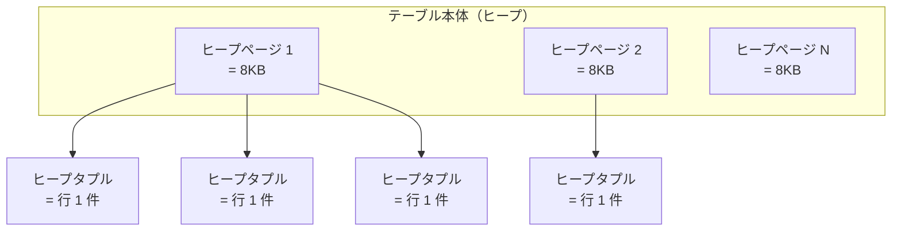
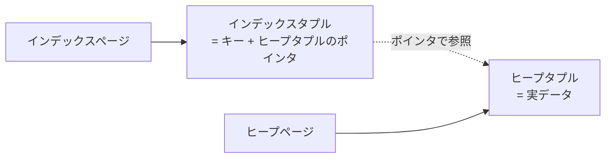
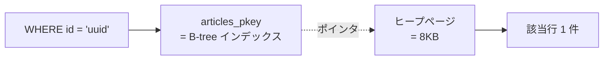
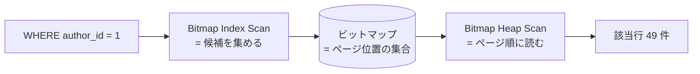

## この章で答える問い

- 1 章で見た Seq Scan のコスト式は、Index Scan ではどう変わるのか？
- 同じテーブルでヒット件数を増やすと、プランナはどうやってノードを選び分けているのか？
- 同じクエリに `LIMIT` を付けると、プラン選択はどう変わるのか？

:::message
**この章のゴール**: 同じテーブルでヒット件数を変えるとプランが Index Scan → Bitmap Heap Scan → Seq Scan と切り替わる様子を観察して、`LIMIT` を付けるとその境目が startup 重視の Index Scan に倒れることまで体感する。
:::

## 主役クエリ

同じ articles テーブルで、ヒット件数を変えていく 4 つのクエリ。

```sql
-- ① 1 行ヒット（0.001%）
EXPLAIN SELECT * FROM articles WHERE id = '...uuid...';

-- ② 数十行ヒット（0.05%）
EXPLAIN SELECT * FROM articles WHERE author_id = 1;

-- ③ 数千行ヒット（5%）
EXPLAIN SELECT * FROM articles WHERE author_id BETWEEN 1 AND 100;

-- ④ ほぼ全件ヒット（75%）
EXPLAIN SELECT * FROM articles WHERE published = true;
```

このシリーズを並べると、**プランナがヒット件数に応じて Index Scan / Bitmap Heap Scan / Seq Scan を選び分けている様子**が一覧で見えます。そのあと、同じクエリに `LIMIT` を付けるとプラン選択がどう曲がるかを実機で確かめます。

---

## はじめに

1 章で Seq Scan のコスト式を手計算したとき、足し算 1 行で実機の値にぴたり当たる感覚がありました。では Index Scan や Bitmap Heap Scan ではどうなるのか。式の前に、まずプランナが**この 3 つをどうやって選び分けているのか**が気になります。

実機で試してみると、同じ articles テーブルでも WHERE の書き方を変えるだけでプランが Index → Bitmap → Seq とコロコロ変わります。さらに、同じクエリに `LIMIT` を付けただけで今度は逆方向にも切り替わる。境目は単純な線形交点では説明できず、PostgreSQL のソースに隠れているある定数まで遡って初めて辻褄が合いました。

3 章は、その「選び分けの境目」を 2 章で身につけた `EXPLAIN ANALYZE` の読み方を武器に、実機で詰めていく章です。

---

## 3.1 1 章のおさらい

おさらいから。**Seq Scan (Sequential Scan)** は、インデックスを経由せずにテーブルのヒープページを先頭から末尾まで順に舐めていく読み方です。WHERE で絞り込まないクエリや、絞り込んでも結果が大量に出るクエリで自然に選ばれます。

1 章で見たそのコスト式はこれでした。

```sql
total_cost = seq_page_cost × ページ数 + cpu_tuple_cost × 行数
```

ページコスト（連続読み）と CPU コスト（1 行処理）を足しただけのシンプルな構造。サンプルアプリの articles では `1.0 × 11181 + 0.01 × 100000 = 12181.00` と、出力の `cost=0.00..12181.00` にぴったり一致しました。


3 章では、まず Seq / Index / Bitmap の動きを並べて押さえ（3.3）、そのあと**同じテーブルでヒット件数を変えるとプランがどう切り替わるか**を観察し（3.4）、最後に **`LIMIT` を付けるとプランが Index Scan に倒れる現象**を実機で詰めます（3.5）。

---

## 3.2 ページとタプルの基本

ここから先のコスト式には「ページ」「ヒープページ」「インデックスタプル」のような PostgreSQL 特有の用語が出てきます。自分も最初は曖昧だったので、整理しておきます。

PostgreSQL はテーブルやインデックスのデータを、ディスク上に**ページ**という単位で並べています。1 ページは標準で **8KB**。テーブル本体のページを**ヒープページ**、インデックスのページを**インデックスページ**と呼びます。

ページの中には**タプル**が並んでいます。タプルは要するに「行 1 件」のこと。ヒープページに入っているのが**ヒープタプル**、インデックスページに入っているのが**インデックスタプル**です。



1 章で見た `relpages = 11181` は「articles テーブルが 11,181 個のヒープページに格納されている」という意味でした。11,181 × 8KB ≈ 87 MB という計算も、ここから来ています。

インデックスはこれとは別の構造を持っています。



インデックスタプルが持っているのは「キー（カラム値）と、そのキーに対応するヒープタプルの位置を指すポインタ」だけ。実データ本体は対応するヒープタプルにあるので、インデックスから引いたあとはポインタを辿ってヒープページを読みに行く、という二段構えになります。Index Scan で「インデックスを引いた後にヒープページを訪問する」と説明される構造の正体がこれです。


ページを読む I/O にも 2 種類あります。

- **連続 I/O (sequential I/O)**: ディスクのページを順番に読む読み方。Seq Scan が典型で、物理的にディスクの先頭から後ろへ読み進めます。コスト 1.0（基準）。
- **ランダム I/O (random I/O)**: 飛び飛びのページを読む読み方。Index Scan のように「次はこのページ、その次はあのページ」と跳ねます。HDD ではヘッド移動の分だけ遅くなります。コスト 4.0（HDD 時代の値）。

ここで言う「コスト 1.0 / 4.0」はそれぞれ `seq_page_cost` / `random_page_cost` のデフォルト値で、公式ドキュメントの「プランナコスト定数」に正式な定義があります。

参考: https://www.postgresql.jp/document/17/html/runtime-config-query.html#RUNTIME-CONFIG-QUERY-CONSTANTS

SSD / NVMe の時代になってランダム I/O のペナルティが小さくなったので、`random_page_cost` を下げるチューニングがよく行われます。実機で動かしてプラン選択がどう曲がるかは、11 章「プランナの挙動を制御する」で改めて扱います。

---

## 3.3 Seq / Index / Bitmap の読み方の違い

3 章で扱う 3 つのスキャン、Seq Scan / Index Scan / Bitmap Heap Scan は、それぞれ「ヒープとインデックスをどう読むか」が違います。コスト式に入る前に、3 つの動きを実機の EXPLAIN 出力と並べて見ておきます。

### 3 つを並べると

| スキャン | ひと言で | I/O の特徴 | 得意な場面 |
| --- | --- | --- | --- |
| **Seq Scan** | ヒープを先頭から最後まで順に読む | 連続 I/O | ほぼ全件取るとき |
| **Index Scan** | インデックスから 1 件ずつ引いて、ヒープに飛ぶ | 1 件ごとにランダム I/O | ヒット件数が少ないとき |
| **Bitmap Heap Scan** | 候補をいったんまとめてから、ヒープをまとめ読みする | ランダム I/O を集約 | ヒット件数が中くらいのとき |

3.2 で見た「ヒープページ」「インデックスタプル」「連続 I/O」「ランダム I/O」が、ここで 3 つの読み方に姿を変えて出てきます。

### 件数階段で 5 例試す

同じ articles テーブルに、ヒット件数だけを変えた 5 つの `EXPLAIN SELECT * FROM articles WHERE ...` を投げます。件数の少ない順に並べると、プランナが選ぶスキャンが Index Scan → Bitmap → Seq と段階的に切り替わる様子が一直線に見えます。

#### ① `WHERE id = 'uuid'` → 1 行 → Index Scan

```sql
EXPLAIN SELECT * FROM articles WHERE id = '0b3f973e-20c5-4459-8010-2bc0882d1102';
```

出力:

```sql
 Index Scan using articles_pkey on articles  (cost=0.42..8.44 rows=1 width=852)
   Index Cond: (id = '0b3f973e-20c5-4459-8010-2bc0882d1102'::uuid)
```

`articles_pkey` は `id` カラム (PK) に張られた B-tree インデックス。PK の一致を引いて、ポインタが指すヒープページに飛んで 1 行取り出します。本の巻末索引で「この単語は 142 ページ」と引いてから本文の 142 ページを開く動きとほぼ同じ。




#### ② `WHERE author_id = 1` → 49 行 → Bitmap Heap Scan

```sql
EXPLAIN SELECT * FROM articles WHERE author_id = 1;
```

出力:

```sql
 Bitmap Heap Scan on articles  (cost=4.67..191.55 rows=49 width=852)
   Recheck Cond: (author_id = 1)
   ->  Bitmap Index Scan on index_articles_on_author_id  (cost=0.00..4.66 rows=49 width=0)
         Index Cond: (author_id = 1)
```

EXPLAIN 出力が 2 段になります。下の **Bitmap Index Scan** で、インデックスから該当する行の「ヒープページ上の位置」を集めて**ビットマップ**（=「どのページに該当行があるか」を 0/1 で表した小さな表のようなもの）を作り、上の **Bitmap Heap Scan** がそのビットマップをページ順に並べ替えてからヒープを読みます。



ポイントは **ヒープをページ順に並べて読む** こと。Index Scan が 1 件ずつ飛び飛びに読むのに対して、Bitmap はランダム I/O を **ページ単位にまとめて** 回数を減らせます。

`Recheck Cond` は「ビットマップが粗い精度（ページ単位）になることがあるので、ヒープ側でもう一度 WHERE を評価し直す」という保険です。ここでは深入りせず、9 章「プランナと統計情報」で再度触れます。


ビットマップ自体をもう一段ズームすると、こうなっています。ヒープページごとに「該当行が **ある = 1** / **無い = 0**」の 1 ビットを持つだけのシンプルな構造です。ページ内に何行マッチしていても、ビットは 1 つだけ。


#### ③ `WHERE author_id BETWEEN 1 AND 100` → 4,699 行 → まだ Bitmap

```sql
EXPLAIN SELECT * FROM articles WHERE author_id BETWEEN 1 AND 100;
```

出力:

```sql
 Bitmap Heap Scan on articles  (cost=72.46..8811.42 rows=4699 width=852)
   Recheck Cond: ((author_id >= 1) AND (author_id <= 100))
   ->  Bitmap Index Scan on index_articles_on_author_id  (cost=0.00..71.28 rows=4699 width=0)
         Index Cond: ((author_id >= 1) AND (author_id <= 100))
```

件数が ② の 49 → 4,699 と約 100 倍に増えても、まだ Bitmap Heap Scan のまま。コストは 191.55 → 8,811.42 と件数におおむね比例して伸びますが、Seq Scan の固定コスト 12,181 はまだ下回っています。**Bitmap は意外に広いレンジを守る**、というのが実機で見える発見です。

#### ④ `WHERE author_id BETWEEN 1 AND 1500` → 74,647 行 → Seq に切り替わる

```sql
EXPLAIN SELECT * FROM articles WHERE author_id BETWEEN 1 AND 1500;
```

出力:

```sql
 Seq Scan on articles  (cost=0.00..12681.00 rows=74647 width=852)
   Filter: ((author_id >= 1) AND (author_id <= 1500))
```

ヒット件数が 75% に達したところで、ついに Seq Scan が選ばれました。**Bitmap を作るコストが Seq Scan を上回る**ので、それなら最初から全部読む方が安い、というプランナの判断です。

ヒープの 11,181 ページを 1 ページずつ先頭から読み、各行に Filter で `author_id >= 1 AND author_id <= 1500` を当てる流れ。WHERE は読み取り量を減らせず、結果件数だけ絞り込まれます。


#### ⑤ `WHERE published = true` → 74,643 行 → 別カラムでも同じ Seq Scan

```sql
EXPLAIN SELECT * FROM articles WHERE published = true;
```

出力:

```sql
 Seq Scan on articles  (cost=0.00..12181.00 rows=74643 width=852)
   Filter: published
```

別のカラムでも、ヒット件数がほぼ同じ (74,643 行 ≒ 75%) なら選ばれるプランも同じ Seq Scan。**プラン選択は「どのカラムか」より「何件ヒットするか」で決まる** ことが、④ と ⑤ の対比で見えます。

ついでに ④ との **コスト差 500** にも目を向けてみてください。④ は `author_id BETWEEN 1 AND 1500` で Filter の式が 2 条件 (`>= 1 AND <= 1500`)、⑤ は `published` で 1 条件。`cpu_operator_cost (0.0025) × 条件数 × 100,000 行` の差で説明できます。Filter にも小さなコストがある、という副産物です。

### 件数 vs プラン vs コスト 一覧

| クエリ | ヒット件数 | プラン | total_cost |
|---|---:|---|---:|
| `WHERE id = 'uuid'` | 1 | Index Scan | 8.44 |
| `WHERE author_id = 1` | 49 | Bitmap Heap Scan | 191.55 |
| `WHERE author_id BETWEEN 1 AND 100` | 4,699 | Bitmap Heap Scan | 8,811.42 |
| `WHERE author_id BETWEEN 1 AND 1500` | 74,647 | Seq Scan | 12,681.00 |
| `WHERE published = true` | 74,643 | Seq Scan | 12,181.00 |

件数が増えるほど Index → Bitmap → Seq と切り替わる流れが一目で見えます。Bitmap が 0.05% から 5% まで広いレンジを守り、5% から 75% の間のどこかで Seq への切り替えが起きます。正確な境目は次節以降のコスト式で詰めます。

### 直感で覚える 1 行

ヒット件数を横軸にとると、3 つはこう並びます。

```
  少ない  ←─────────  ヒット件数  ─────────→  多い
    │                       │                      │
   Index Scan          Bitmap Heap Scan       Seq Scan
   (1 件ずつ飛ぶ)        (まとめて読む)       (全部順に読む)
```

**少なければ飛ぶ、中くらいならまとめ読み、多ければ全部読む**。これが次節以降の話の土台になります。

:::message
**コスト式の細部は本書では割愛します**

1 章で Seq Scan のコスト式 (`seq_page_cost × ページ数 + cpu_tuple_cost × 行数`) を手計算しました。Index Scan / Bitmap Heap Scan の式は B-tree 探索やビットマップ作成のぶん項が多く、深堀りすると 1 節分使います。本書ではコスト計算の細部より **プランの選び分け** に焦点を絞るので割愛します。式の正体に興味があれば、PostgreSQL ソース [`src/backend/optimizer/path/costsize.c`](https://github.com/postgres/postgres/blob/REL_17_STABLE/src/backend/optimizer/path/costsize.c) の `cost_index` 関数を覗いてみてください。
:::

---

## 3.4 件数が増えるとプランは Index → Bitmap → Seq と変わる

3.3 ① で扱ったのは **1 行ヒット** のクエリでした。同じ articles テーブルで、ヒット件数を増やしていくと、プランがどう変わるか観察してみます。

```sql
-- ② 数十行ヒット
EXPLAIN SELECT * FROM articles WHERE author_id = 1;

-- ③ 数千行ヒット
EXPLAIN SELECT * FROM articles WHERE author_id BETWEEN 1 AND 100;

-- ④ ほぼ全件ヒット
EXPLAIN SELECT * FROM articles WHERE published = true;
```

実機の出力をまとめると、こうなります。

| 段階 | クエリ | ヒット件数 | 全体比 | プラン | トータルコスト |
|---|---|---|---|---|---|
| ① | `WHERE id = 'uuid'` | 1 | 0.001% | Index Scan | 8.44 |
| ② | `WHERE author_id = 1` | 49 | 0.05% | Bitmap Heap Scan | 184.91 |
| ③ | `WHERE author_id BETWEEN 1 AND 100` | 4,931 | 5% | Bitmap Heap Scan | 4,312.86 |
| ④ | `WHERE published = true` | 75,250 | 75% | Seq Scan | 4,951.00 |

ストーリーになっていますね。**ヒット件数が増えるにつれて Index Scan → Bitmap Heap Scan → Seq Scan と切り替わっていく**。プランナは「rows がどれくらいか」を見て、その都度安いノードを選んでいる様子が一覧で見えます。


### ② 数十行ヒット ─ Bitmap Heap Scan が顔を出す

`WHERE author_id = 1`（49 行ヒット）の出力:

```sql
 Bitmap Heap Scan on articles  (cost=4.67..184.91 rows=49 width=269)
   Recheck Cond: (author_id = 1)
   ->  Bitmap Index Scan on index_articles_on_author_id  (cost=0.00..4.66 rows=49 width=0)
         Index Cond: (author_id = 1)
```

予想では Index Scan が出ると思っていたのに、Bitmap Heap Scan が選ばれました。なぜか？

49 行を 1 行ずつ Index Scan で引くと、ランダム I/O が 49 回。`random_page_cost × 49 = 4.0 × 49 = 196` くらいのコストになる見込みです。一方、Bitmap でまとめてからヒープを読むと、ビットマップ作成の前処理（スタートアップ `4.67`）が乗るものの、ヒープアクセスは**ソート済み順で読める**ので少し安くなり、トータルが `184.91` で済んでいます。**Bitmap のほうが Index Scan より少し安い**、というのがプランナの判定です。

ちなみに Bitmap Heap Scan のスタートアップコスト `4.67` は、その下の Bitmap Index Scan のトータル `4.66` とほぼ一致しています。「ビットマップが揃ってからヒープを読み始める」というノードの性格が、数字にそのまま出ています。

公式ドキュメントも Bitmap の性格を簡潔にまとめています。

> 行を別々に取り出すことは、シーケンシャルな読み取りに比べ非常に高価です。しかし、テーブルのすべてのページを読み取る必要はありませんので、シーケンシャルスキャンより安価になります。
> ─ [PostgreSQL 17.x 文書 14.1.1 EXPLAINの基本](https://www.postgresql.jp/document/17/html/using-explain.html)

### ③ 数千行ヒット ─ コストは件数にほぼ比例して増える

`WHERE author_id BETWEEN 1 AND 100`（4,931 行ヒット）の出力:

```sql
 Bitmap Heap Scan on articles  (cost=78.84..4312.86 rows=4931 width=269)
   ...
   ->  Bitmap Index Scan ...  (cost=0.00..77.60 rows=4931 width=0)
```

まだ Bitmap Heap Scan です。ヒット件数が 49 → 4,931 と約 100 倍になって、トータルコストも約 100 倍（184.91 → 4,312.86）。**Bitmap Heap Scan のコストはヒット件数にほぼ比例**しています。

スタートアップコストも `4.67 → 78.84` と大きく増えています。これは「ビットマップを作るために読むインデックス葉ページ」が増えたから。インデックスをスキャンする量も、ヒット件数に応じて増えていきます。

### ④ ほぼ全件ヒット ─ Seq Scan に戻る

`WHERE published = true`（75,250 行ヒット = 全体の 75%）の出力:

```sql
 Seq Scan on articles  (cost=0.00..12181.00 rows=75250 width=269)
   Filter: published
```

ヒット件数が増えすぎて、ついに **Seq Scan に戻りました**。

ここで一つ気付きがあります。この `cost=0.00..12181.00` の `12181.00`、どこかで見覚えがありませんか？

1 章で `EXPLAIN SELECT * FROM articles;`（**WHERE なし**）を打ったときと**完全に同じ値**です。なぜか？

答えは「Seq Scan は全ページを順に読むので、WHERE があってもなくても**全件読むという作業量は同じ**」だから。`Filter: published` は読み終わったあとに行ごとに「これは true？」と判定するだけ。だからコストが変わりません。

これがプランナの判断にも効いてきます。④ で Bitmap Heap Scan を選んでも、ヒット件数が多すぎてビットマップ作成のコストが Seq Scan のコストを上回ってしまいます。だったら**最初から Seq Scan で全部読んだほうが安い**、というわけです。

### まとめ ─ プランナはヒット件数でノードを選び分けている

実測の 4 段階を並べると、こう読めます。

- **0.001%（1 行）**: Index Scan が最安。B-tree を降りて 1 行ピンポイントで引く
- **0.05%（数十行）**: Bitmap Heap Scan が最安。ランダム I/O が増えてきたのでまとめ読みのほうが得
- **5%（数千行）**: まだ Bitmap Heap Scan。コストはヒット件数にほぼ比例して増える
- **75%（ほぼ全件）**: Seq Scan が最安。もう全件読むなら順に読んだほうが速い

プランナは「何行ヒットしそうか（`rows` の推定）」を見て、毎回コスト最小のノードを選んでいる、という構造が見えました。Index Only Scan（4 章）、Sort（5 章）、JOIN 系のノード（6・7 章）と、別の場面で活躍するノードも次章以降で順に扱っていきます。3 章では「プランナがコストを軸にどう選び分けているか」を体感するのが目的でした。

---

## 3.5 LIMIT を付けるとプランは Bitmap → Index と変わる

3.4 まではプラン選択を「ヒット件数」という軸で見てきました。同じテーブルでも WHERE のヒット件数が変わるとプランが Index Scan → Bitmap Heap Scan → Seq Scan と切り替わる、というのが本筋でした。

ここで視点を一つ増やします。**ヒット件数が同じでも、`LIMIT` を付けただけでプランが切り替わる**ことがあります。3.4 の ② で Bitmap Heap Scan が選ばれた `WHERE author_id = 1`（49 行ヒット）に、`LIMIT 5` を付けてみるとどうなるか試してみます。

### LIMIT を付けると Index Scan に戻る

```sql
EXPLAIN SELECT * FROM articles WHERE author_id = 1 LIMIT 5;
EXPLAIN SELECT * FROM articles WHERE author_id = 1 LIMIT 1;
```

出力:

```sql
 Limit  (cost=0.29..20.79 rows=5 width=852)
   ->  Index Scan using index_articles_on_author_id on articles  (cost=0.29..201.14 rows=49 width=852)
         Index Cond: (author_id = 1)

 Limit  (cost=0.29..4.39 rows=1 width=852)
   ->  Index Scan using index_articles_on_author_id on articles  (cost=0.29..201.14 rows=49 width=852)
         Index Cond: (author_id = 1)
```

3.4 の ② では Bitmap Heap Scan だったのに、LIMIT を付けたら **Index Scan に切り替わりました**。下の Index Scan のトータルコストは `201.14`（LIMIT 1 でも 5 でも同じ）。上の Limit ノードのコストだけが LIMIT N に応じて動きます。LIMIT 1 で `4.39`、LIMIT 5 で `20.79`。

なぜ切り替わるのか。Index Scan は「インデックスを 1 件ずつ引いて、ポインタが指すヒープに飛ぶ」読み方なので、**最初の N 行だけ取れれば途中で終われる**。一方 Bitmap Heap Scan は「全行ぶんのビットマップを作ってからヒープを読む」ので、LIMIT があっても前処理の量は変わりません。プランナはこの差を見て「LIMIT が小さいなら Index Scan の方が安い」と判断したわけです。

Limit ノードのコストの式自体はシンプルで、ソースプランのトータルコストを `LIMIT / 推定行数` の比率で按分しています。LIMIT 5 のときの `20.79` は、

```
0.29 + (201.14 - 0.29) × 5/49 = 0.29 + 20.50 = 20.79
```

と手計算でぴたり出ます。ソースの Index Scan のスタートアップ `0.29` はそのまま残し、トータルとの差を `5/49` で按分する、という素直な式です。

### LIMIT をどこまで増やすと Bitmap に戻る？

LIMIT が小さいうちは Index Scan、LIMIT が無いと Bitmap Heap Scan。両者の間のどこかで切り替わるはずです。LIMIT 値を 1 から 49（推定行数）まで階段状に振ってみます。

```sql
EXPLAIN SELECT * FROM articles WHERE author_id = 1 LIMIT 15;
EXPLAIN SELECT * FROM articles WHERE author_id = 1 LIMIT 16;
EXPLAIN SELECT * FROM articles WHERE author_id = 1 LIMIT 17;
EXPLAIN SELECT * FROM articles WHERE author_id = 1 LIMIT 18;
EXPLAIN SELECT * FROM articles WHERE author_id = 1 LIMIT 19;
EXPLAIN SELECT * FROM articles WHERE author_id = 1 LIMIT 20;
```

結果を一覧にすると:

| LIMIT | プラン | Limit total_cost |
|---:|---|---:|
| 1 | Index Scan | 4.39 |
| 5 | Index Scan | 20.79 |
| 15 | Index Scan | 61.78 |
| 16 | Index Scan | 65.87 |
| 17 | Index Scan | 69.97 |
| **18** | **Bitmap Heap Scan** | **73.32** |
| 19 | Bitmap Heap Scan | 77.14 |
| 20 | Bitmap Heap Scan | 80.95 |
| 49 | Bitmap Heap Scan | 191.55 |
| なし | Bitmap Heap Scan | 191.55 |

**切り替えは LIMIT 17 → 18 で起きました**。17 までは Index Scan、18 から Bitmap Heap Scan です。境目はピンポイントで存在している、というのが目に見えました。

### 理論交点は L=15.36 ─ でも実測は L=18

切り替えの境目を式から出してみます。Index Scan と Bitmap Heap Scan それぞれの、LIMIT L のときの Limit total_cost は、按分式から:

```
Index Scan:        0.29 + (201.14 - 0.29) × L/49
Bitmap Heap Scan:  4.67 + (191.55 - 4.67) × L/49
```

両者が等しくなる L を解くと:

```
0.29 + 200.85 × L/49 = 4.67 + 186.88 × L/49
(200.85 - 186.88) × L/49 = 4.67 - 0.29
13.97 × L/49 = 4.38
L = 4.38 × 49 / 13.97 ≈ 15.36
```

理論上は **L = 15.36** で両者のコストが交わります。L が 16 以上なら Bitmap Heap Scan のコストが安いはず。なのに実測では L=17 まで Index Scan が居座り、L=18 でやっと切り替わっています。**1.5 ぶんのズレ** が残ります。

このズレは数式の間違いではありません。実機で見えた `Limit total_cost` の値は、上の式と小数第二位までぴったり一致します。コスト計算は正しい。なのにプランナは「コスト最小のプラン」を選んでいない、ということになります。

### ズレの正体は STD_FUZZ_FACTOR

ズレの正体は PostgreSQL のプランナ内部にあります。プランナは複数の候補プランを比較するとき、**コスト差が約 1% 以内なら同等とみなして、別の基準（startup コストの安さなど）でタイブレークする**、というルールを持っています。

ソースコードを読むと、`src/backend/optimizer/util/pathnode.c` の中に `STD_FUZZ_FACTOR` という定数が `1.01` で定義され、`compare_path_costs_fuzzily()` という関数で使われています。

引用元: https://github.com/postgres/postgres/blob/REL_17_STABLE/src/backend/optimizer/util/pathnode.c

> ```c
> #define STD_FUZZ_FACTOR 1.01
> ```

つまり「片方のコストが、もう片方のコストを `1.01` で割った値より小さければ、有意に安い」というルール。差が 1% 未満なら同等扱いで、startup の安いプランが残ります。

このルールを今回の境界付近に当てはめると:

| LIMIT | IS の Limit total | BHS の Limit total | (IS - BHS) / IS | プランナの判定 |
|---:|---:|---:|---:|---|
| 16 | 65.87 | 65.69 | 0.27% | fuzz 内 → IS 維持（startup が安い）|
| 17 | 69.97 | 69.51 | 0.66% | fuzz 内 → IS 維持 |
| **18** | **74.07** | **73.32** | **1.01%** | **fuzz 超え → BHS に切替** |
| 19 | 78.16 | 77.14 | 1.30% | BHS |
| 20 | 82.27 | 80.95 | 1.63% | BHS |

L=18 でちょうど 1% 境界に乗った瞬間に切り替わっています。**理論交点 15.36 と実測の切替点 18 のあいだに残る 1.5 のズレは、fuzz factor 1% で説明がつく**ということです。

### 実務での含意

3.5 で見えたことを並べると、こうなります。

- **LIMIT を付けると、プランは Bitmap Heap Scan → Index Scan に倒れやすい**。Index Scan は「途中で終われる」読み方なので、最初の N 行を返すのが得意
- **切り替えの境目は単純な線形交点ではない**。コスト差が 1% 以内の領域では `fuzz factor` が効いて、プランナはあえてプランを変えない。startup の安い Index Scan が保守的に残る
- **`WHERE x = ? LIMIT N` の N 値ごとにプランが変わる可能性がある**。ページネーションや「先頭 N 件取得」を書くときは、LIMIT 値を変えながら `EXPLAIN` を取ると、思わぬところで Bitmap → Index、Index → Bitmap が起きていることに気付けます

3.4 で「ヒット件数」軸、3.5 で「LIMIT」軸、と 2 つの軸でプラン選択を観察しました。プランナはこの 2 軸を組み合わせて、その都度コストの低いプランを選んでいる、という構造が見えました。

---

## 章のまとめ

3 章では、プランナが**コスト最小のプランを選ぶ**という単純な原則が、実機ではどう働いているのかを 2 つの軸で観察しました。

- **ヒット件数の軸**（3.4）: Index Scan → Bitmap Heap Scan → Seq Scan と切り替わる。境目はそれぞれのコストが入れ替わるところ
- **LIMIT の軸**（3.5）: LIMIT を付けると startup の安い Index Scan に倒れやすい。切り替えはコスト差が 1% を超えるまで `fuzz factor` で遅れる

ここで忘れたくないのが、**「コスト最小」と「実時間最小」は必ずしも一致しない**という点です。コストは `rows` の**推定値**を元に計算されるので、2 章で扱った推定の乖離（`rows` と `actual rows` のズレ）が大きいと、プランナは「コスト最小のつもりで実時間最大のプラン」を選ぶことがあります。このすれ違いを統計情報側からどう抑えるかは、9 章「プランナと統計情報」で深掘りします。

3.5 の終盤、LIMIT を 1 ずつずらしながら `EXPLAIN` を撃ち続けたときが、3 章で一番手応えのあった瞬間でした。理論で出した交点 `L=15.36` と実測の切替点 `L=18` の間に残った 1.5 のズレを追いかけていったら、PostgreSQL のソースに置かれた `STD_FUZZ_FACTOR = 1.01` というたった 1 行の定数にぶつかりました。EXPLAIN の数字の動きから、ソースコードに書かれた具体的な値まで一本の線で繋がる経験は、本書を書いていて一番おもしろかった瞬間かもしれません。

---

## 次の章へ

第 3 章では、プランナがヒット件数と LIMIT という 2 つの軸でスキャンノードを選び分けている様子を観察し、コストが拮抗する領域では `fuzz factor` 1% で切り替えが少し遅れることまで確認しました。第 4 章「**Index Only Scan と visibility map**」では、`SELECT id FROM articles WHERE id = ?` のような「インデックスだけで答えが返せるクエリ」を扱います。`Heap Fetches` がゼロになる条件と、その背後にある visibility map のしくみを実機で確かめます。
