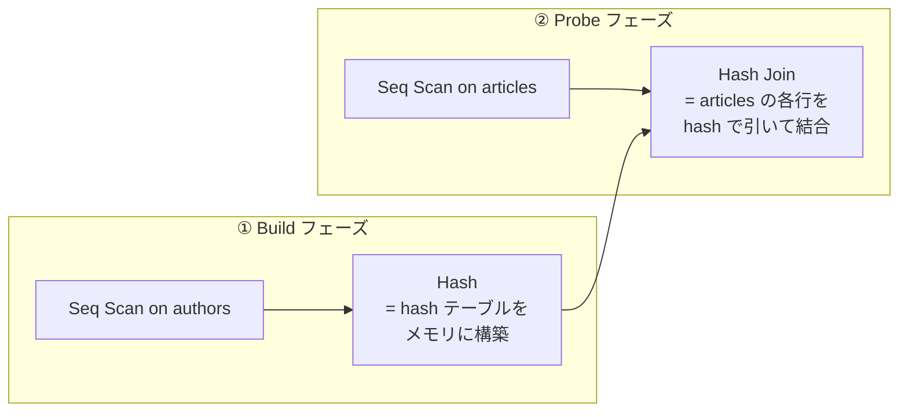
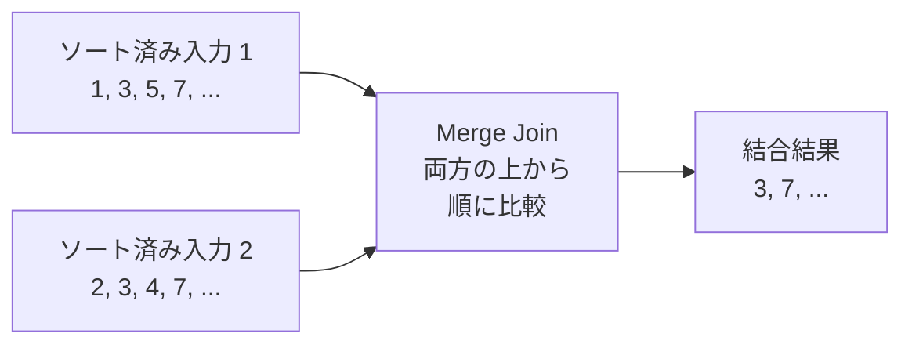

## この章で答える問い

- Hash Join はどんなときに選ばれるのか？
- Hash テーブルはどこに作られて、`work_mem` を超えると何が起きるのか？
- Merge Join はどんなときに勝つのか？
- プランナは Nested Loop / Hash Join / Merge Join をどう選び分けているのか？

:::message
**この章のゴール**: 大きめの JOIN で Hash Join と Merge Join が選ばれる条件を実機で観察して、3 つの結合方式の使い分けを自分の言葉で説明できるようになる。
:::

## 主役クエリ

```sql
EXPLAIN ANALYZE
SELECT a.title, au.name
FROM articles a
JOIN authors au ON a.author_id = au.id;
```

6 章では `WHERE` で絞った小さな JOIN を扱いましたが、今回は **WHERE なしで全件 JOIN** します。articles 100,000 行 × authors 2,000 行を全部結合するので、外側が大きい。Nested Loop は不利な領域に入ります。

---

## はじめに

<!--
TODO(human): この章の「つかみ」を 3〜5 行で本人の言葉で書く。
ヒント:
- 6 章で Nested Loop の「外側 × 内側」を見たあと、もっと大きい JOIN を打ったら別のノードが出てくる驚き
- Hash Join と Merge Join、どっちがどっち？を初めて見たときの混乱
- 読者にどんな状態になってほしいか
-->

---

## 7.1 Nested Loop が苦手な領域

6 章で見た Nested Loop は、**外側が小さくて、内側を Index Scan で安く引ける** ときに強い結合方式でした。逆に言えば、それ以外の場面では苦しい。

具体的に「Nested Loop が苦しい」のはこんな場面です。

- **外側が大きい**: 外側 100,000 行に対して内側を 100,000 回呼ぶと、内側が 0.1 ms でも全体で 10 秒
- **内側にインデックスがない**: 内側を毎回 Seq Scan しないといけない
- **両方とも大きい**: 上の 2 つが同時に起きると最悪

こういう場面では、別の結合方式が勝ちます。Hash Join と Merge Join です。

---

## 7.2 Hash Join の仕組み

サンプルアプリで全件 JOIN を打ってみます。

```sql
EXPLAIN ANALYZE
SELECT a.title, au.name
FROM articles a
JOIN authors au ON a.author_id = au.id;
```

出力（サンプルアプリでの実測）:

```
                                                       QUERY PLAN
-------------------------------------------------------------------------------------------------------------------------
 Hash Join  (cost=... rows=100000 width=...) (actual time=... rows=100000 loops=1)
   Hash Cond: (a.author_id = au.id)
   ->  Seq Scan on articles a  (cost=0.00..12181.00 rows=100000 width=...) (actual time=... rows=100000 loops=1)
   ->  Hash  (cost=... rows=2000 width=...) (actual time=... rows=2000 loops=1)
         Buckets: ... Batches: 1 Memory Usage: ...kB
         ->  Seq Scan on authors au  (cost=... rows=2000 width=...) (actual time=... rows=2000 loops=1)
 Planning Time: ...
 Execution Time: ...
```

<!-- TODO(human): 上の出力の数値（コスト、actual time、Buckets、Batches、Memory Usage）を実機で叩いて埋める。 -->

新しいノードが 2 つ出ました。**`Hash Join`** と、その下の **`Hash`** ノードです。Hash Join は次の 2 フェーズで動きます。




1. **Build フェーズ**: 小さいほうのテーブル（authors）を全部読んで、hash テーブルをメモリに作る
2. **Probe フェーズ**: 大きいほうのテーブル（articles）を 1 行ずつ読みながら、hash テーブルを引いて結合する

ポイントは「**内側は 1 回しか読まない**」こと。Nested Loop なら内側を loops 回呼ぶところを、Hash Join なら 1 回読んで hash テーブルにしてしまう。あとは大きいほうのテーブルを 1 度 Seq Scan するだけで結合できます。

外側 100,000 行 + 内側 2,000 行 = 計 102,000 行を読むだけで終わる、というのが Hash Join の効率の良さです。

### `Buckets` と `Batches`

出力に `Buckets: ... Batches: 1` のような値が出ます。

- **Buckets**: hash テーブルのバケット数。大きいほど衝突が少ない
- **Batches**: 1 なら hash テーブルが `work_mem` に収まっている。2 以上だと溢れている

`Batches: 1` の間は健全。これが 2 以上に増えたら、次の節「`work_mem` 超え」の世界に入ります。

---

## 7.3 work_mem と Hash の溢れ

5 章でも顔を出した `work_mem` が、Hash Join でも効きます。今回の build 側の authors は 2,000 行と小さいので楽勝でメモリに収まりますが、もし build 側が 100 万行・1 GB を超えるテーブルだったらどうなるか。

`work_mem` に収まらない場合、PostgreSQL は **複数の batch に分割** します。具体的には：

- hash 値で N 個に分割
- 1 batch ずつ work_mem に収めて probe する
- batch 数だけテーブルをスキャンし直す

これが `Batches: 2` `Batches: 4` `Batches: 8` のような出力の意味です。Batch 数が増えるほど、disk への一時書き込み + 再スキャンが発生して遅くなります。

実機で `work_mem` を絞って試してみると、Batches が増える様子が見られます。

```sql
SET work_mem = '64kB';   -- 極端に小さく
EXPLAIN ANALYZE SELECT a.title, au.name FROM articles a JOIN authors au ON a.author_id = au.id;
RESET work_mem;
```

<!-- TODO(human): 上のクエリで Batches が増えるかを実機で確認。出力を貼る。 -->

「Hash テーブルが work_mem に収まる前提」が Hash Join の強さの源泉なので、本番でこのパラメータを意識するのは大事です。

---

## 7.4 Merge Join の仕組み

もうひとつの結合方式が Merge Join。これは **両方の入力がソート済み** であることを前提に、両方を並行に読み進めながらマージする方式です。



両方を 1 回ずつ読むだけで済むのは Hash Join と同じですが、**事前にソート済みである必要がある** のが Merge Join の特徴です。

Merge Join が選ばれる場面は、ざっくり次のどれかです。

- 両方の結合キーに B-tree index がある（インデックスがソート済みを保証してくれる）
- 一方を Sort してでもメリットがある（巨大すぎて Hash がメモリに収まらないとき）
- ORDER BY と組み合わせて、Merge Join の出力もソート済みで使える

サンプルアプリで Merge Join を出すのは少しトリッキーです。次のような場面で出やすい：

```sql
-- 両方の結合キーに index があると Merge Join が候補に入る
EXPLAIN ANALYZE
SELECT *
FROM article_tags at
JOIN tags t ON at.tag_id = t.id
ORDER BY at.tag_id;
```

<!-- TODO(human): 上のクエリで Merge Join が選ばれるかを実機で確認。Hash Join が選ばれた場合は SET enable_hashjoin = off; を試して Merge Join を強制してみる。 -->

---

## 7.5 プランナはどう選び分けるか

ここまで Nested Loop / Hash Join / Merge Join の 3 つを見ました。プランナがどう選び分けているか、自分の中で整理するとこうなります。

| 結合方式 | 強い場面 | 弱い場面 |
|---|---|---|
| Nested Loop | 外側が小さい × 内側に index | 外側が大きい / 内側に index なし |
| Hash Join | 両方の入力が大きくても OK、build 側が work_mem に収まる | 両方が巨大で work_mem を大きく超える |
| Merge Join | 両方が結合キーでソート済み（index あり） | 事前ソートが必要なほどコストが乗る |

プランナはこの 3 つのコストを全部見積もって、最小のものを選びます。3 章で見た「コスト最小を選ぶ」の話が、JOIN の世界でも同じように動いています。

実機で 3 つを切り替えて見ることもできます。

```sql
-- 通常: 多くは Hash Join
EXPLAIN ANALYZE SELECT a.title, au.name FROM articles a JOIN authors au ON a.author_id = au.id;

-- Hash を禁止すると Merge Join か Nested Loop に
SET enable_hashjoin = off;
EXPLAIN ANALYZE SELECT a.title, au.name FROM articles a JOIN authors au ON a.author_id = au.id;

-- Merge も禁止すると Nested Loop に
SET enable_mergejoin = off;
EXPLAIN ANALYZE SELECT a.title, au.name FROM articles a JOIN authors au ON a.author_id = au.id;

RESET enable_hashjoin;
RESET enable_mergejoin;
```

<!-- TODO(human): 上の 3 つを実機で叩いて、プラン名とコストを比較する表を作る。 -->

`enable_hashjoin = off` / `enable_mergejoin = off` のようなスイッチ系パラメータは、コストに巨大ペナルティを乗せて「そのプランを選ばせない」と指示する仕組みです。これは 11 章「プランナの挙動を制御する」のメインテーマでもあります。

---

## 章のまとめ

<!--
TODO(human): この章で学んだことを 3 行で、本人の言葉で。
ヒント:
- Nested Loop / Hash Join / Merge Join の使い分けが見えてきた
- work_mem は Sort でも JOIN でも顔を出す
- 次章への期待
-->

---

## 次の章へ

第 7 章では、Nested Loop が苦しい場面で Hash Join と Merge Join が選ばれる仕組みと、`work_mem` の働きを見ました。第 8 章「**BUFFERS とキャッシュ階層**」では視点を切り替えて、**同じクエリを 2 回打つと実行時間が変わる** 現象を `Buffers: shared hit/read` から読み解きます。
