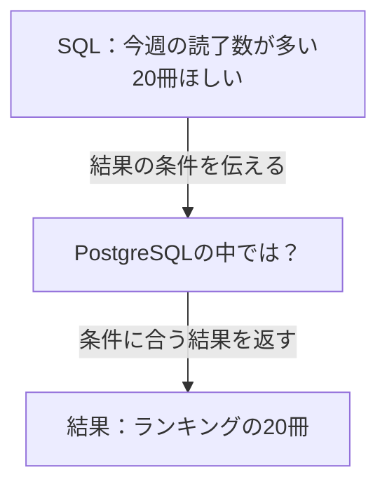

## はじめに

`SELECT` でデータを取り出す。`ORDER BY` で並べる。必要な件数だけ欲しければ `LIMIT` を付ける。

普段の開発で書いているSQLです。けれど、結果が返ってくるまでにデータベースが何をしているか、と聞かれると、少し言葉に詰まるかもしれません。

この本では、一つの読書記録サイトを育てながら、いつものSQLの向こう側をたどります。登場人物と一緒に予想し、手元でSQLを動かし、その結果を説明するためにデータ構造やアルゴリズムを学んでいきます。

最初の困りごとは、たった20冊を表示するランキング画面で起きました。

:::message
サービスと会話は架空です。以下の件数とSQLの処理時間は、サンプルデータを使って実際に計測した値です。画面全体の応答時間や本番障害の記録ではありません。
:::

## 「今週よく読まれた本」が、なかなか出てこない

自分が読んだ本を記録するために作ったサイトを、友人にも使ってもらうことにした。

本を探して「読みたい」に入れる。読み終わったら記録を残す。開発している二人は、届いた要望を見ながら少しずつ機能を増やしていた。

「次に読む本を探したいから、今週よく読まれた本を見たい」

それなら、今週の読了記録を本ごとに数え、多い順に20冊並べればよさそうだ。二人は、画面を開くたびにランキングを集計することにした。

開発用の少量のデータでは、すぐに表示された。ところが、利用が広がり読書記録が積み重なると、ランキングを開いてから待たされるようになった。

「本の詳細は見られるのに、ランキングだけなかなか出ないね」

二人は、まずランキングを取得するSQLを単独で測ってみた。

### 20冊を返すまで、約4.6秒

次の表は、この場面をサンプルデータで再現した実測です。1冊について複数の読了記録があり、ランキングではその記録数を数えます。同じ人の再読も別の記録として扱う想定で、読者の人数ランキングではありません。

| 条件 | 開発時を想定したデータ | 利用が広がった状態を想定したデータ |
| --- | --- | --- |
| 登録されている本 | 1,000冊 | 1,000,000冊 |
| 4週間分の読了記録 | 20,000件 | 20,000,000件 |
| ランキングとして返す本 | 20冊 | 20冊 |
| SQLの処理時間（3回の中央値） | 2.140 ms | **4,553.647 ms（約4.6秒）** |

**画面に必要なのは20冊なのに、SQLの結果を受け取るまで約4.6秒かかっている。**

「返す件数は変わってないのに、こんなに待つんだ」

「本のデータだけじゃなくて、みんなの読書記録が増えてるからかな」

これはSQL単体をローカルで測った時間です。画面全体の応答時間を測ったものではありませんが、ランキングをその都度集計する設計では、この処理が終わるまで表示する結果がそろいません。

### ランキングを作っているSQL

本は `books`、読了記録は `reading_records` に入っている。読了記録の `book_id` が本を指し、`finished_at` に読み終わった日時が入る。

```sql
SELECT b.id, b.title, count(*) AS read_count
FROM books AS b
JOIN reading_records AS r ON r.book_id = b.id
WHERE r.finished_at >= timestamp '2026-09-14'
  AND r.finished_at < timestamp '2026-09-21'
GROUP BY b.id, b.title
ORDER BY read_count DESC, b.id ASC
LIMIT 20;
```

実験を再現できるよう、対象週は9月14日から20日までに固定しています。本番の「今週」なら、この期間を対象の週に置き換えます。

いまはSQLを一行ずつ理解できなくても大丈夫です。**期間内の読了記録を本ごとに数えて、多い順に20冊返す**という意図だけ押さえてください。同数なら、本の `id` が小さい方を先にします。

`books.id` の主キーはありますが、読了記録の日時や本の番号には、まだインデックスを作っていません。

:::details 計測条件と生の時間
2026年9月21日、Apple M1 Pro・メモリ32GiBのローカル環境で、PostgreSQL 18.3（Homebrew）を使用しました。

- 本と読了記録は一時テーブルに生成した架空データ。読了日時は4週間にほぼ均等に分布しています。
- 大きい方のデータでは、全2,000万件のうち対象週の記録は4,999,999件です。本のテーブルは約57MB、読了記録は約845MBでした。
- インデックスは `books.id` の主キーのみ。`reading_records` にはありません。
- `work_mem = 64MB`、並列実行とJITは無効。処理を観察しやすくするための実験用設定です。一時テーブルを用いた結果で、本番環境の性能を代表する値ではありません。
- データ生成・`ANALYZE`・件数確認後、同じSQLを3回連続実行しました。キャッシュを空にした測定や、同時アクセスの負荷試験ではありません。
- 時間は `psql` の `\timing` によるクライアント側の経過時間です。`EXPLAIN ANALYZE` の `Execution Time` とは別に計測しています。

| 実行 | 2万件の読了記録 | 2,000万件の読了記録 |
| --- | --- | --- |
| 1回目 | 2.466 ms | 4,630.241 ms |
| 2回目 | 2.140 ms | 4,553.647 ms |
| 3回目 | 2.017 ms | 4,531.875 ms |

再現用SQLは原稿リポジトリの `_drafts/sql-data-structures/experiments/weekly-ranking.sql`、生ログは同じディレクトリの `results/weekly-ranking-*-pg18.3-20260921.txt` に保存しています。
:::

## 時間は測れた。でも、直し方が分からない

「返す本を10冊に減らしたら？」

「それで数える読書記録も半分になるのかな。表示が減るだけかもしれない」

「インデックスを追加するのは？」

「読了日時？ 本の番号？ どこで時間を使っているか、まだ分からないよね」

毎回数える代わりに、集計した結果を保存する案も出た。けれど、その場合は新しい読了記録をいつ反映するかも考えなければならない。

案は出てくる。でも、どれから試すかを選ぶ根拠がない。まずは、いまの処理が何をしているのかを知りたかった。

ここで一度、あなたも考えてみてください。

**「今週よく読まれた上位20冊」を決めるには、何件の読了記録を調べればよいでしょうか。**

今週の記録を探すところ、本ごとに数えるところ、結果を順位順に並べるところ。どこに時間がかかっていると思いますか。

二人が知りたいことも、そこだった。約4.6秒という合計の時間だけでは、どの仕事を減らせばよいのかまでは分からない。

## SQLに書いたことと、まだ見えていないこと

先ほどのSQLには「どの列を、どの順番で、何件返してほしいか」を書きました。では、その結果をどう作るのでしょう。

次の図の中央が、この本で少しずつ見ていく部分です。矢印は、SQLを渡して結果を受け取る流れを表しています。



「かかった時間は分かった。次は、中で何をしているかを見たい」

調べていくと、PostgreSQLには **`EXPLAIN`** というコマンドがあると分かった。SQLをどんな手順で処理する予定なのかを、「実行計画」として見せてくれる。さらに `EXPLAIN ANALYZE` では、実際に実行したときの行数や時間も観察できる。

「これなら、20冊を返す前に何をしているか、確かめられそう」

ただ、実行計画を見るのは二人とも初めてだ。出力を眺めるだけで終わらないように、まずは簡単なSQLで、どこに何が書かれているのかを調べることにした。

**困っていることから観察する場所を決め、仕組みを学んで、改善を試す。** この本では、その過程を一緒にたどっていきます。

## このサービスで、これから出会うこと

ランキングだけでなく、本を探したり、感想を表示したりする機能でも、SQLの裏側を知りたくなる場面が出てきます。

| サービスで作りたいもの | 一緒に考える問い | つながる学び |
| --- | --- | --- |
| 本を探す検索機能 | 本が増えたとき、探す仕事をどう減らせる？ | 全件探索・木構造・インデックス |
| 今週よく読まれた本のランキング | 記録を数える仕事と、上位を選ぶ仕事をどう進める？ | 集計・ハッシュ・ソート・ヒープ |
| 本と感想を組み合わせた一覧 | 二つのデータを、どんな手順で組み合わせる？ | ループ・ハッシュ・JOIN |

木構造やハッシュという言葉を、いま説明できなくても大丈夫です。「この仕事には、どんな仕組みがあると助かるだろう」と考えたところで出会えるように進めます。

## この本の読み方

各章では、まずサービス開発の中で困りごとに出会います。解説へ進む前に、自分ならどうするかを少しだけ考えてみてください。

次に、SQLを動かして予想と結果を比べます。データの量や条件を一つ変えると、何が変わるのか。図で構造や動きを追いながら、その理由を考えます。

予想が外れても、その違いが次の問いになります。仕組みが分かったら、改善案を試して、どんな条件で使える考え方なのかを振り返りましょう。

文章だけでは追いにくいところは図解し、テーブル同士の関係はER図、データの流れやアルゴリズムの動きは具体例で示します。図とSQLを見比べながら読み進められる本にしていきます。

:::message
**この本で身につけたいこと**：SQLの動きについて仮説を立て、実験で確かめ、改善前後の違いを理由とともに説明できること。
:::

### 読み始める前に

想定しているのは、普段の開発でSQLを書いているけれど、データベース内部やコンピュータサイエンスを体系的には学んでこなかった人です。`SELECT`・`WHERE`・`ORDER BY`・`LIMIT` の基本が分かれば読み始められます。

舞台のサービスと会話は架空です。実験にはサンプルデータを使い、実測した結果と仕組みを説明するための模型を区別して示します。

手元で試すための環境構築は、次の第1章で案内します。Webアプリケーションを一式作る必要はありません。まずはPostgreSQLを起動し、SQLを入力できるところから始めます。

## 次の章へ：SQLの動きを観察する道具を手に入れる

ランキングを直すために、まず知りたいのは「PostgreSQLは、どんな手順で本を取り出しているのか」です。

第1章では、実験環境を準備し、並べ替えのない簡単なSQLから `EXPLAIN` と `EXPLAIN ANALYZE` を使ってみます。予定していた処理と、実際の処理をどう見比べるのか。出力の中で、まずどこを見ればよいのかを確かめます。

その道具を使いながら、本を探す仕組み、並べる仕組みへと進み、集計やデータを組み合わせる仕組みも学んで、ランキングの問題を順に解き明かします。先ほど考えた「どこに時間がかかるのか」という予想を、実際の動きと比べてみましょう。
