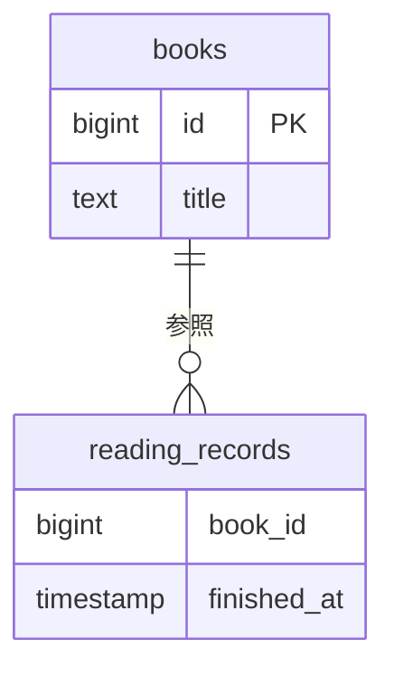
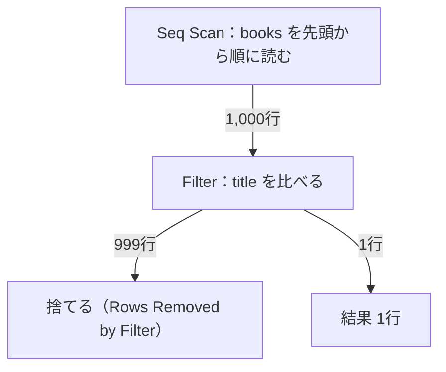
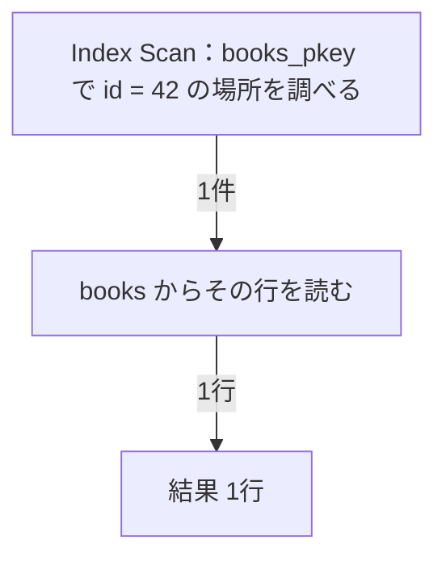

## はじめに

序章のランキングは、20冊を返すまでに約4.6秒かかりました。時間を測っただけでは、その4.6秒のうちどの作業に時間がかかっているのかまでは分かりません。

PostgreSQLには、SQLをどんな手順で処理するつもりかを見せてくれる `EXPLAIN` という機能があります。実行計画（PostgreSQLが結果を作るための手順書）と呼ばれるこの出力を見れば、表をどんな順番で読むつもりなのかが分かります。実際に実行したときの行数や時間まで知りたいときは、`EXPLAIN ANALYZE` を使います。

この章では、1冊の本を取り出すだけの簡単なSQLで、`EXPLAIN` と `EXPLAIN ANALYZE` の読み方を覚えます。出力には見慣れない英単語がいくつも並びますが、まず見るのは `cost` と `rows` です。この2つを手がかりにすれば、ランキングのSQLに `EXPLAIN` を付けたときも読み始められます。読み方が分かれば、時間のかかっている場所を絞り込みやすくなります。

:::message
サービスと会話は架空です。以下の出力と数値は、サンプルデータを使って実際に計測した値です。
:::

## ランキングの前に、1冊を探すSQLで試す

序章で、二人は「本の詳細は見られるのに、ランキングだけなかなか出ないね」と話していました。

「本の詳細画面はもともと速いから、比べるのはあとにしよう」

「検索機能のSQLならどうかな。あれもランキングよりずっと簡単だし」

「うん、まずそっちで `EXPLAIN` の使い方を覚えよう」

題名をそのまま打ち込んで探す検索欄があります。入れた題名と同じ本を1冊取り出すのが、この検索機能のSQLです。これを動かすための環境を、まず用意します。

## 実験環境を用意する

手元でDockerが動いていれば、次のコマンドでPostgreSQL 18のコンテナを起動できます。

```bash
docker run --name reading-log-lab \
  -e POSTGRES_PASSWORD=reading-log-local \
  -e POSTGRES_DB=reading_log \
  -d postgres:18
docker exec reading-log-lab pg_isready -U postgres -d reading_log
docker exec -it reading-log-lab psql -X -U postgres -d reading_log
```

`-e` で渡している `POSTGRES_PASSWORD` と `POSTGRES_DB` は、初期のパスワードとデータベース名です。初回はイメージの取得に少し時間がかかります。`pg_isready` は、PostgreSQLが接続を受け付けられる状態かどうかを確認するコマンドです。`no response` と出たら、まだ起動の途中なので、数秒待ってもう一度実行します。

起動を確認できたら、`-it` を付けたキーボード入力ができる接続で、`psql` からデータベースに入ります。`-X` は、手元の `psql` の設定ファイルを読まない指定です。続けて、次のSQLを貼り付けて、本と読了記録のテーブルを作り、データを入れて件数を確かめます。

```sql
CREATE TABLE books (
  id bigint PRIMARY KEY,
  title text NOT NULL
);

CREATE TABLE reading_records (
  book_id bigint NOT NULL,
  finished_at timestamp NOT NULL
);

INSERT INTO books
SELECT n, '実験用の本 ' || n
FROM generate_series(1, 1000) AS n;

INSERT INTO reading_records
SELECT ((n::bigint * 7919) % 1000) + 1,
       timestamp '2026-08-24' + ((n::bigint * 104729) % 2419200) * interval '1 second'
FROM generate_series(1, 20000) AS n;

ANALYZE books;
ANALYZE reading_records;

SELECT count(*) AS book_count FROM books;
SELECT count(*) AS record_count FROM reading_records;
```

`generate_series(1, 1000)` は、1から1000までの連番をその場で作る関数です。この連番を使って、`実験用の本 1` から `実験用の本 1000` までの1,000冊を一度に入れています。読了記録も同じやり方で2万件作ります。

```text
 book_count 
------------
       1000
(1 row)

 record_count 
--------------
        20000
(1 row)
```

件数はそろいました。これは序章で見た「開発時を想定したデータ」と同じ規模です。データが序章の「利用が広がった状態を想定したデータ」のように大きくなったときの話は、後の章で扱います。

途中で実行した `ANALYZE` は、テーブルの行数や値の分布についての統計情報を集めるコマンドです。これから使う `EXPLAIN ANALYZE` の `ANALYZE` とは、名前が同じだけで別の機能なので、ここで区別しておきます。

読了記録は、序章のランキングと同じデータを、後の章でこのまま使うために作っておきます。この章では読了記録そのものは扱いません。この章と序章で使う2つのテーブルの関係を、図で確認しておきます。



読了記録の `book_id` は本を指していますが、まだインデックス（探したい行をすぐ見つけるための目録のようなもの）も外部キー制約も付けていません。

## 題名で1冊探すとき、PostgreSQLは何冊調べるか

検索欄に題名を入れて探す機能では、こんなSQLで1冊を取り出しています。

```sql
SELECT * FROM books WHERE title = '実験用の本 42';
```

結果は1行です。では、この1行を返すために、PostgreSQLは何冊の本を調べたでしょうか。序章で考えた、20冊を返すのに何件の読了記録を調べるかという問いを、1冊に縮めたものです。

あなたなら、どれだと予想しますか。

- 1冊だけ見て終わる
- 1,000冊を全部見る
- 見つかったところで止まる

3つとも、それぞれ理屈が立ちそうです。

「`id` の主キーがあるから、1冊だけ見て終わりそう」

「でも探しているのは `title` だよね。主キーは `id` だから」

「じゃあ、見つかるまで順番に見ていくのかな」

正しいかどうかは、次の `EXPLAIN` で確かめます。

## EXPLAINで実行する予定を見る

SQLの前に `EXPLAIN` を付けて実行します。

```sql
EXPLAIN SELECT * FROM books WHERE title = '実験用の本 42';
```

```text
                      QUERY PLAN                       
-------------------------------------------------------
 Seq Scan on books  (cost=0.00..20.50 rows=1 width=27)
   Filter: (title = '実験用の本 42'::text)
(2 rows)
```

実行計画は、ノード（処理の単位）を積み上げた形で表示されます。1行目を、項目ごとに分けてみます。

| 項目 | 値 | 意味 |
| --- | --- | --- |
| ノード | Seq Scan | 表を先頭から順に読む処理 |
| 対象テーブル | books | 読む表の名前 |
| cost | 0.00..20.50 | 開始までと全部読み終えるまでの相対コスト |
| rows | 1 | 返すと見込んだ行数 |
| width | 27 | 1行あたりの推定バイト数 |

**`Seq Scan`** は、表を先頭から順に読む処理です。2行目の `Filter` は、読んだ行のうち `title = '実験用の本 42'` に合うものだけを残す条件です。

`cost` は秒でもミリ秒でもありません。プランナ（PostgreSQLの中で実行計画を作る部品）が、いくつかの処理方法を比べて選ぶための目安です。

> コストはプランナのコストパラメータ（19.7.2参照）によって決まる任意の単位で測定されます。取り出すディスクページ単位でコストを測定することが、伝統的な方式です。つまり、seq_page_costを慣習的に1.0に設定し、他のコストパラメータを相対的に設定します。
> ─ [PostgreSQL 18 文書 14.1.1 EXPLAINの基本](https://www.postgresql.jp/document/18/html/using-explain.html)

プランナは、見積もったコストがいちばん小さい計画を選びます。

:::details コスト20.50はどこから来るか
`books` は8ページ、1,000行という統計情報を持っています（`pg_class` の `relpages` と `reltuples`）。

コストの合計は、ページを読む分と行を調べる分を足して見積もります。`seq_page_cost × relpages + cpu_tuple_cost × reltuples` に、`seq_page_cost = 1.0`、`cpu_tuple_cost = 0.01` を当てはめると、1.0 × 8 + 0.01 × 1000 = 18.00です。

`EXPLAIN` が表示した `cost` は20.50なので、差が2.50あります。この2.50は、`WHERE` の条件を1,000行それぞれに当てるCPUコスト（`cpu_operator_cost` の既定値0.0025 × 1000行）が乗っている分です。
:::

`rows=1` は、**返すと見込んだ行数**です。実際に何行を調べたかは、この `rows` には表れません。調べた行数を見るには、あとで出てくる `Rows Removed by Filter` と合わせて読む必要があります。この区別が、この章でいちばん確かめたいことです。

残った `width` は、1行がおおよそ何バイトになりそうかという見積もりです。この章では深く使わないので、値があることだけ覚えておけば大丈夫です。

`EXPLAIN` は、SQLを実際には実行しません。試しに、本を1冊追加するINSERTに `EXPLAIN` を付けて実行しても、件数は増えませんでした。

## EXPLAIN ANALYZEで実際の行数と時間を見る

`EXPLAIN` を `EXPLAIN ANALYZE` に変えて、同じSQLを実行します。

```sql
EXPLAIN ANALYZE SELECT * FROM books WHERE title = '実験用の本 42';
```

```text
                                             QUERY PLAN                                             
----------------------------------------------------------------------------------------------------
 Seq Scan on books  (cost=0.00..20.50 rows=1 width=27) (actual time=0.014..0.081 rows=1.00 loops=1)
   Filter: (title = '実験用の本 42'::text)
   Rows Removed by Filter: 999
   Buffers: shared hit=8
 Planning Time: 0.042 ms
 Execution Time: 0.090 ms
(6 rows)
```

見慣れない項目が増えました。

- `actual time=0.014..0.081`：最初の1行までと、全行を返すまでにかかった実測のミリ秒
- `actual rows=1.00`：実際に返した行数。PostgreSQL 18では小数で表示されます
- `loops=1`：このノードを実行した回数
- `Rows Removed by Filter: 999`：条件に合わず、捨てた行数
- `Buffers`：読んだページ数の行です。この章では読み飛ばし、後の章で扱います
- `Planning Time` と `Execution Time`：計画を作る時間と、実行にかかった時間

さきほどの問いの答えは、`Rows Removed by Filter` に出ています。返した行は1行、捨てた行は999です。1,000冊のうち999冊を調べて捨て、残り1冊を返していました。予想した3つの案のうち、「見つかったところで止まる」ではなく、1,000冊を最後まで調べていたことになります。

`EXPLAIN` に付けた `ANALYZE` が何をしているかは、公式文書にこう書かれています。

> EXPLAINのANALYZEオプションを使用して、プランナが推定するコストの精度を点検することができます。このオプションを付けるとEXPLAINは実際にその問い合わせを実行し、計画ノードごとに実際の行数と要した実際の実行時間を、普通のEXPLAINが示すものと同じ推定値と一緒に表示します。
> ─ [PostgreSQL 18 文書 14.1.2 EXPLAIN ANALYZE](https://www.postgresql.jp/document/18/html/using-explain.html)

推定と実測をどう見比べればよいかも、公式文書に書かれています。

> 「actual time」値は実時間をミリ秒単位で表されていること、cost推定値は何らかの単位で表されていることに注意してください。ですからそのまま比較することはできません。注目すべきもっとも重要な点は通常、推定行数が実際の値と合理的に近いかどうかです。
> ─ [PostgreSQL 18 文書 14.1.2 EXPLAIN ANALYZE](https://www.postgresql.jp/document/18/html/using-explain.html)

`cost` と `actual time` は単位が違うので比べられませんが、`rows` と `actual rows` はどちらも行数なので比べられます。今回は推定1、実測1.00で一致しています。

`EXPLAIN ANALYZE` は実際にSQLを実行するので、`INSERT` や `UPDATE` に付けるとデータが変わってしまいます。データを変えずに試したいときの手順を、公式文書は次のように示しています。

> INSERT、UPDATE、DELETE、MERGE、CREATE TABLE AS、EXECUTE文に対して、データに影響を与えないようにEXPLAIN ANALYZEを実行したい場合は、以下の方法を使用してください。
> BEGIN;
> EXPLAIN ANALYZE ...;
> ROLLBACK;
> ─ [PostgreSQL 18 文書 EXPLAIN コマンド](https://www.postgresql.jp/document/18/html/sql-explain.html)

`BEGIN` で始めた作業を `ROLLBACK` で取り消せば、`EXPLAIN ANALYZE` が実行した変更は残りません。

同じSQLを続けて3回実行すると、`Execution Time` は毎回少し違う値になりました。3回分の記録は、次の節の終わりにまとめて置きます。

## 番号で探すと計画が変わる

本の詳細画面は、番号（`id`）を使って同じ1冊を探しています。

```sql
SELECT * FROM books WHERE id = 42;
```

これに `EXPLAIN ANALYZE` を付けて実行します。

```sql
EXPLAIN ANALYZE SELECT * FROM books WHERE id = 42;
```

```text
                                                      QUERY PLAN                                                      
----------------------------------------------------------------------------------------------------------------------
 Index Scan using books_pkey on books  (cost=0.28..8.29 rows=1 width=27) (actual time=0.107..0.108 rows=1.00 loops=1)
   Index Cond: (id = 42)
   Index Searches: 1
   Buffers: shared hit=6
 Planning Time: 0.323 ms
 Execution Time: 0.147 ms
(6 rows)
```

ノードの名前が `Seq Scan` から `Index Scan using books_pkey` に変わりました。`Filter` の代わりに `Index Cond: (id = 42)` が付き、`Rows Removed by Filter` の行はありません。`Index Cond` は、インデックスを使って絞り込む条件です。`Index Searches` の行も、この章では読み飛ばします。

`Index Scan` は、目録で `id = 42` の行がある場所を調べてから、`books` からその1行を読む、という2段の処理です。`books` に `id` の主キーを付けたとき、PostgreSQLは `books_pkey` という名前のインデックスを自動で作っていました。

題名で探すときの行の流れを図にします。



1,000行を読んで999行を捨て、残り1行を返しています。番号で探すときの行の流れも、同じように図にします。



場所を調べてから、その1行だけを読んで返しています。

同じ `books` のテーブルを読んでいますが、調べた行の数がまったく違います。題名では1,000行、番号では1行です。なぜインデックスがあると調べる行が減るのかは、第3章で木構造の仕組みとして確かめます。

:::details 計測条件と生の時間
2026年9月21日、Apple SiliconのmacOSで、Dockerの `postgres:18`（PostgreSQL 18.6）を使用しました。

設定はDockerの既定値のままです。`work_mem` は4MB、`max_parallel_workers_per_gather` は2、`jit` はonでした。

| 実行 | 題名で1冊 | 番号で1冊 |
| --- | --- | --- |
| 1回目 | 0.090 ms | 0.147 ms |
| 2回目 | 0.049 ms | 0.272 ms |
| 3回目 | 0.385 ms | 0.041 ms |

生ログは `_drafts/sql-data-structures/experiments/results/ch01-explain-basics-docker-pg18-20260921.txt` に保存しています。
:::

## この章で持ち帰ること

1冊を取り出すだけの実験でしたが、確かめられたことは多くありました。

- `EXPLAIN` は予定を見せるだけで実行しません。`EXPLAIN ANALYZE` は実行して、実測を並べて見せます
- `rows` は返す行数です。調べた行数は `Rows Removed by Filter` と合わせて見ます
- 推定と実測を並べて読みます。今回は推定1行、実測1行で一致しました
- 同じ結果を返すSQLでも、計画が違えば仕事の量が違います

次にランキングのSQLを見るときも、この4つを手がかりにします。

### 実験の中断と再開

実験を中断するときは、`psql` のプロンプトで `\q` と打って抜けてから、次のコマンドでコンテナを止めます。

```bash
docker stop reading-log-lab
```

再開するときは、コンテナを起動してから、もう一度 `psql` に入ります。

```bash
docker start reading-log-lab
docker exec -it reading-log-lab psql -X -U postgres -d reading_log
```

削除するのは、本を読み終えてからで構いません。後の章でも同じデータを使います。

## 次の章へ

1冊を取り出すだけなら、`EXPLAIN` の読み方はもう十分に使えます。いまの本は1,000冊です。これが10万冊、100万冊になったとき、題名で探すSQLが読む冊数はどう増えるでしょうか。

題名で探すSQLのように表を全部見る探し方（全件探索）を、第2章では計算量から考えます。序章のランキングの実行計画は、まだ読みません。

まずは、探す仕事の量を数える見方を身につけます。その見方があれば、ランキングのSQLがどこで時間を使っているかも、同じ手順で確かめられます。
