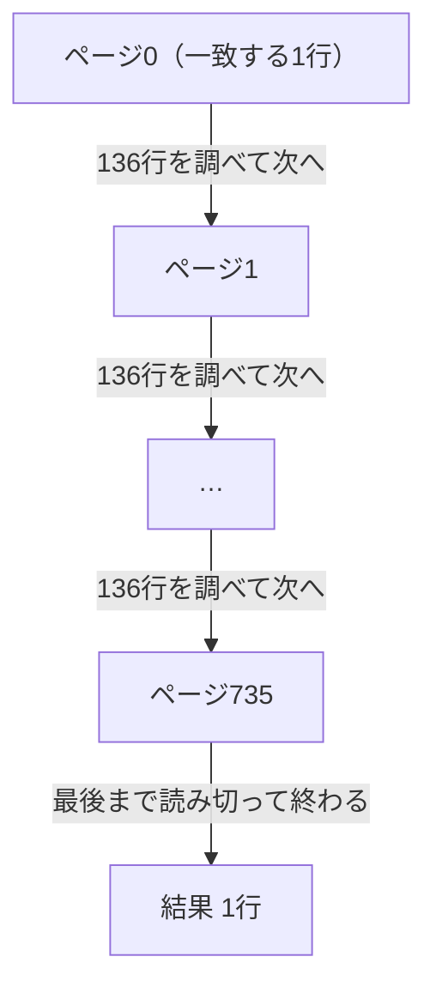

## はじめに

第1章では、`実験用の本 42` を題名で探すSQLを `EXPLAIN ANALYZE` で読みました。本は1,000冊なのに、PostgreSQLは999冊を調べて捨て、残り1冊を返していました。

サービスはこれから、友人たちの書誌データを取り込んで冊数を増やしていきます。1,000冊が10万冊、100万冊になったとき、同じ題名検索の仕事はどれくらい増えるのでしょうか。この章では実際に本を増やしながら測り、仕事量を時間ではなく、ページ（PostgreSQLが表を保存する単位）の数で数える見方を手に入れます。時間は実行するたびに少しずつ変わりますが、読んだページの数は、PostgreSQLが同じ手順を踏む限り同じ値になるからです。

序章では何件の読了記録を調べるか、第1章では返す行数と調べた行数と、ここまでは行を数えて仕事量を考えてきました。この章では、PostgreSQLが表を実際に読む単位であるページで数えます。

:::message
サービスと会話は架空です。以下の出力と数値は、サンプルデータを使って実際に計測した値です。
:::

## 本が増える前に、探す仕事の増え方を知りたい

友人たちの間で、それぞれの蔵書を登録できるようにしようという話が持ち上がりました。読みたい本を探すときに、自分の本だけでなく友人の本も検索できると便利だという声も出ています。実現するには、出版社が公開している書誌データをまとめて取り込む計画が要ります。

題名検索は、第1章で試したのと同じ機能です。いまは1,000冊しかないので、すぐに終わります。序章で見た「利用が広がった状態を想定したデータ」では、本は100万冊という規模でした。書誌データの取り込みも、行き着く先は同じ100万冊です。読了記録もいずれ2,000万件規模になりますが、その集計は今回は扱いません。

「書誌データを入れたら、本がざっと10万冊くらいになりそうだよね」

「今のSQLのまま、そんなに調べて大丈夫かな」

「増やす前に、手元で試して確かめておこう」

二人は実験環境で試すことにしました。`books` を段階的に増やしながら、同じ題名検索がどう変わるかを確かめていきます。

## 実験用の設定を序章に揃える

冊数を増やす前に、実験用の設定を序章に揃えます。条件を同じにして、本の数だけを変えて比べられるようにします。`psql` に接続したまま、次の3行を実行します。

```sql
ALTER DATABASE reading_log SET max_parallel_workers_per_gather = 0;
ALTER DATABASE reading_log SET jit = off;
ALTER DATABASE reading_log SET work_mem = '64MB';
```

```text
ALTER DATABASE
ALTER DATABASE
ALTER DATABASE
```

`ALTER DATABASE` で設定した値は、次に新しく接続したセッションから有効になります。`reading_log` に接続するセッションならどれでも同じ値になりますが、いま開いているセッションにはまだ反映されていません。`\q` で一度抜け、もう一度 `psql` に入り直します。

```bash
docker exec -it reading-log-lab psql -X -U postgres -d reading_log
```

再接続できたら、`SHOW` で3つとも反映されているか確かめます。

```sql
SHOW max_parallel_workers_per_gather;
SHOW jit;
SHOW work_mem;
```

```text
 max_parallel_workers_per_gather 
---------------------------------
 0
(1 row)

 jit 
-----
 off
(1 row)

 work_mem 
----------
 64MB
(1 row)
```

100万冊まで増やすと、PostgreSQLが自動で作業を手分けする並列読みに切り替わり、実行計画の形が変わることがあります。この章では一人分の仕事量をそのまま数えたいので止めておきます。`jit` は式の計算を機械語に翻訳して速くする仕組み、`work_mem` は並べ替えなどの作業に使えるメモリの上限です。この章の検索には効きませんが、序章と同じ条件にしておきます。3つとも実験用の値で、本番のデータベースに使う値ではありません。並列読みの仕組みは、発展として後で扱います。

## 本が100倍になったら、捨てる行数と時間はどう変わるか

設定を変えたあとも、1,000冊のときの数字が変わっていないか、念のため確かめておきます。

```sql
EXPLAIN ANALYZE SELECT * FROM books WHERE title = '実験用の本 42';
```

```text
                                             QUERY PLAN                                             
----------------------------------------------------------------------------------------------------
 Seq Scan on books  (cost=0.00..20.50 rows=1 width=27) (actual time=0.005..0.036 rows=1.00 loops=1)
   Filter: (title = '実験用の本 42'::text)
   Rows Removed by Filter: 999
   Buffers: shared hit=8
 Planning:
   Buffers: shared hit=11
 Planning Time: 0.035 ms
 Execution Time: 0.041 ms
(8 rows)
```

`Rows Removed by Filter` は999、`Execution Time` は0.041 msです。第1章で見た結果とほぼ同じで、設定を変えても1,000冊での仕事量は変わっていません。

本を100倍の10万冊に増やしたら、捨てる行数と時間はそれぞれどう変わるでしょうか。

- ほとんど変わらない
- だいたい100倍になる
- 100倍よりずっと大きくなる

「本の数が100倍になるだけだから、捨てる数も100倍くらいじゃないかな」

「時間も同じだけ増えるなら、まだ我慢できる範囲かも」

「本当にそうなるかは、測ってみないと分からないよね」

三択のどれに近いか、次の節で確かめます。

## 本を10万冊に増やして測る

10万冊に増やします。最後の行では、PostgreSQL自身が記録している表のページ数、行数、大きさを見ます。

```sql
INSERT INTO books
SELECT n, '実験用の本 ' || n
FROM generate_series(1001, 100000) AS n;
ANALYZE books;
SELECT count(*) AS book_count FROM books;
SELECT relpages, reltuples::bigint AS reltuples, pg_size_pretty(pg_relation_size('books')) AS size FROM pg_class WHERE relname = 'books';
```

```text
INSERT 0 99000
ANALYZE
 book_count 
------------
     100000
(1 row)

 relpages | reltuples |  size   
----------+-----------+---------
      736 |    100000 | 5888 kB
(1 row)
```

99,000冊を追加して10万冊になり、`relpages` は8から736に増えました。同じ題名検索を `EXPLAIN ANALYZE` で実行します。

```sql
EXPLAIN ANALYZE SELECT * FROM books WHERE title = '実験用の本 42';
```

```text
                                              QUERY PLAN                                              
------------------------------------------------------------------------------------------------------
 Seq Scan on books  (cost=0.00..1986.00 rows=1 width=29) (actual time=0.016..3.222 rows=1.00 loops=1)
   Filter: (title = '実験用の本 42'::text)
   Rows Removed by Filter: 99999
   Buffers: shared hit=736
 Planning:
   Buffers: shared hit=3
 Planning Time: 0.028 ms
 Execution Time: 3.230 ms
(8 rows)
```

`Rows Removed by Filter` は99,999、`Execution Time` は3.230 msです。捨てた行数はほぼ100倍、時間もおよそ80倍まで増えていて、「だいたい100倍になる」という予想に近い結果になりました。

第1章では読み飛ばしていた `Buffers: shared hit=736` の行を、ここで読みます。PostgreSQLは表を1行ずつ保存しているわけではなく、決まった大きさの単位でまとめて保存しています。公式文書はこの単位をこう説明しています。

> テーブルとインデックスはすべて、固定サイズ（通常8キロバイト。サーバのコンパイル時に異なるサイズを設定可能）のページの集まりとして格納されます。テーブルでは、すべてのページは論理上等価です。したがって、あるアイテム（行）はどのページにでも格納することができます。
> ─ [PostgreSQL 18 文書 66.6 データベースページのレイアウト](https://www.postgresql.jp/document/18/html/storage-page-layout.html)

**ページ**は、8キロバイトの箱だと考えられます。`books` という表は、この箱の集まりとして保存されています。さきほどの `relpages` は、この箱がいくつあるかを示す数で、1,000冊のときの8から736に増えていました。10万冊が736ページに入っているので、1ページにはおよそ136冊が入っている計算です。

`Buffers` の行にある `shared hit=736` は、736ページ全部をメモリにあった状態で読めたという意味です。`shared hit` はメモリにあったページの数、`read` はメモリになかったので外から読み込んだページの数で、この2つを足した数が実際に読んだページ数、つまりこの検索が抱えた仕事量になります。`read` の中身は後の章で扱います。`Planning:` の下にある `Buffers` は計画を作るときに読んだ分で、この章では数えません。公式文書は `Buffers` オプションをこう説明しています。

> EXPLAINには、与えられた問い合わせのプランニング中と実行中に行われるI/O操作に関して追加の詳細情報を提供するBUFFERSオプションがあります。表示されるバッファ数は、与えられたノードとその全ての子ノードについて、ヒット、読み取り、ダーティ化、そして書き込みが行われた個別のバッファの数を示します。ANALYZEオプションは暗黙的にBUFFERSオプションを有効化します。これが望ましくない場合は、BUFFERSを明示的に無効化できます。
> ─ [PostgreSQL 18 文書 14.1.2 EXPLAIN ANALYZE](https://www.postgresql.jp/document/18/html/using-explain.html)

引用の最後にあるとおり、`ANALYZE` を付けると `BUFFERS` は既定でオンになります。これはPostgreSQL 18の話です。17以前では `EXPLAIN (ANALYZE, BUFFERS)` と明示する必要があります。同じ `EXPLAIN ANALYZE` でも、使っているバージョンによって出力に含まれる行が違うことになります。

同じ検索をもう2回実行しても、`Buffers` は736のまま変わりませんでした。`Execution Time` は実行するたびに少しずつ変わります。同じマシンで同じSQLを実行しても、そのときのキャッシュの状態や他のプロセスの動き次第で時間は前後します。ページ数は、PostgreSQLが同じ手順を踏む限り同じ値になるので、仕事量を比べる物差しとして時間より頼りになります。3回分の記録は、この章の後半にまとめて置きます。

## 見つかったところで止まれるか

第1章では、題名検索が1,000冊を最後まで調べていて、「見つかったところで止まる」という予想は外れていました。`LIMIT 1` を付ければ、1行見つかったところで本当に止まれるのか、10万冊で確かめます。

先頭に近い本から試します。

```sql
EXPLAIN ANALYZE SELECT * FROM books WHERE title = '実験用の本 42' LIMIT 1;
```

```text
                                                 QUERY PLAN                                                 
------------------------------------------------------------------------------------------------------------
 Limit  (cost=0.00..1986.00 rows=1 width=29) (actual time=0.012..0.013 rows=1.00 loops=1)
   Buffers: shared hit=2
   ->  Seq Scan on books  (cost=0.00..1986.00 rows=1 width=29) (actual time=0.011..0.011 rows=1.00 loops=1)
         Filter: (title = '実験用の本 42'::text)
         Rows Removed by Filter: 41
         Buffers: shared hit=2
 Planning Time: 0.050 ms
 Execution Time: 0.020 ms
(8 rows)
```

今回は `Limit` というノードが `Seq Scan` の上に積まれています。下の `Seq Scan` が読んだ行を、上の `Limit` が1行で打ち切ります。`Buffers` は両方の行に出ますが、上のノードの数は下のノードの分を含めた合計です。

読んだページは2、捨てた行は41だけです。見つかったところで止まっています。1ページで済みそうですが2ページと出ました。この差はこの本では追いません。真ん中あたりの本ではどうでしょうか。

```sql
EXPLAIN ANALYZE SELECT * FROM books WHERE title = '実験用の本 50000' LIMIT 1;
```

```text
                                                 QUERY PLAN                                                 
------------------------------------------------------------------------------------------------------------
 Limit  (cost=0.00..1986.00 rows=1 width=29) (actual time=2.043..2.044 rows=1.00 loops=1)
   Buffers: shared hit=369
   ->  Seq Scan on books  (cost=0.00..1986.00 rows=1 width=29) (actual time=2.042..2.042 rows=1.00 loops=1)
         Filter: (title = '実験用の本 50000'::text)
         Rows Removed by Filter: 49999
         Buffers: shared hit=369
 Planning Time: 0.016 ms
 Execution Time: 2.053 ms
(8 rows)
```

読んだページは369、捨てた行は49,999に増えました。本の位置がおよそ半分なら、仕事もおよそ半分です。末尾に近い本も試します。

```sql
EXPLAIN ANALYZE SELECT * FROM books WHERE title = '実験用の本 99958' LIMIT 1;
```

```text
                                                 QUERY PLAN                                                 
------------------------------------------------------------------------------------------------------------
 Limit  (cost=0.00..1986.00 rows=1 width=29) (actual time=3.747..3.748 rows=1.00 loops=1)
   Buffers: shared hit=736
   ->  Seq Scan on books  (cost=0.00..1986.00 rows=1 width=29) (actual time=3.746..3.747 rows=1.00 loops=1)
         Filter: (title = '実験用の本 99958'::text)
         Rows Removed by Filter: 99957
         Buffers: shared hit=736
 Planning Time: 0.049 ms
 Execution Time: 3.760 ms
(8 rows)
```

読んだページは736、`LIMIT` なしのときと同じ数まで増えています。先頭、真ん中、末尾で2、369、736ページと、本の位置に応じて仕事が増えていました。`LIMIT 1` は見つかったところで止まりますが、探している本がどこにあるかで仕事の量が変わり、最悪の場合は表を全部読むのと変わりません。

同じ末尾に近い本を、今度は `LIMIT` を付けずに検索します。

```sql
EXPLAIN ANALYZE SELECT * FROM books WHERE title = '実験用の本 99958';
```

`Buffers` と `Rows Removed by Filter` は次のようになりました。

| 実行 | 読んだページ | 捨てた行 |
| --- | --- | --- |
| `LIMIT 1`（末尾近く） | 736 | 99,957 |
| `LIMIT` なし（末尾近く） | 736 | 99,999 |

読んだページの数は同じでも、捨てた行は42増えています。`LIMIT` がなければ、条件に合う行が他にもあるかもしれないので、PostgreSQLは見つけたあとも最後まで見て確かめます。この検索で見つかったところで止まれたのは `LIMIT` を付けたときで、それも本の位置次第で仕事量が変わります。どれだけ運がよいかに関わらず、最悪の場合にどれだけの仕事が必要かを考えておくと、仕事量の見積もりに役立ちます。最悪の場合の仕事量は、本の数を使って表せます。

## 100万冊でも測る

100万冊まで増やします。今回は数秒かかります。

```sql
INSERT INTO books
SELECT n, '実験用の本 ' || n
FROM generate_series(100001, 1000000) AS n;
ANALYZE books;
SELECT count(*) AS book_count FROM books;
SELECT relpages, reltuples::bigint AS reltuples, pg_size_pretty(pg_relation_size('books')) AS size FROM pg_class WHERE relname = 'books';
```

```text
INSERT 0 900000
ANALYZE
 book_count 
------------
    1000000
(1 row)

 relpages | reltuples | size  
----------+-----------+-------
     7353 |   1000000 | 57 MB
(1 row)
```

100万冊になり、`relpages` は736から7,353に増えました。`EXPLAIN` だけを実行して、予定のコストも見ておきます。

```sql
EXPLAIN SELECT * FROM books WHERE title = '実験用の本 42';
```

```text
                        QUERY PLAN                        
----------------------------------------------------------
 Seq Scan on books  (cost=0.00..19853.00 rows=1 width=30)
   Filter: (title = '実験用の本 42'::text)
(2 rows)
```

10万冊のときの `cost=0.00..1986.00` から `cost=0.00..19853.00` まで増えました。冊数が10倍になり、`cost` もおよそ10倍になっています。実際に実行して確かめます。

```sql
EXPLAIN ANALYZE SELECT * FROM books WHERE title = '実験用の本 42';
```

```text
                                               QUERY PLAN                                               
--------------------------------------------------------------------------------------------------------
 Seq Scan on books  (cost=0.00..19853.00 rows=1 width=30) (actual time=0.010..33.250 rows=1.00 loops=1)
   Filter: (title = '実験用の本 42'::text)
   Rows Removed by Filter: 999999
   Buffers: shared hit=7353
 Planning Time: 0.014 ms
 Execution Time: 33.259 ms
(6 rows)
```

3段階の結果を並べます。

| 本の冊数 | 読んだページ | 捨てた行 | Execution Time |
| --- | --- | --- | --- |
| 1,000 | 8 | 999 | 0.041 ms |
| 100,000 | 736 | 99,999 | 3.230 ms |
| 1,000,000 | 7,353 | 999,999 | 33.259 ms |

冊数が100倍、さらに10倍と増えるのに合わせて、読んだページと捨てた行も同じ割合で増えています。捨てる行数や時間が本の数にほぼ比例して増えるという、10万冊のときに見えたパターンは、100万冊まで増やしても崩れませんでした。仕事の量が入力の大きさに応じてどれだけ増えるかを表す考え方を**計算量**と言います。本の数をnとしたとき、仕事がnに比例して増える探し方を**O(n)**と書きます。オーダーエヌと読みます。nが1,000倍なら仕事もおよそ1,000倍になるという意味です。この全部を見る探し方（全件探索）は、O(n)の探し方です。1,000冊から100万冊へ、ちょうど1,000倍に増えた今回の実験でも、読んだページは8から7,353へと、およそ920倍に増えていました[^pages]。

:::details 100万冊で LIMIT 1 を試すと
10万冊のときと同じように、100万冊でも `LIMIT 1` を付けた題名検索を試しました。PostgreSQLは大きな表を読むとき、複数のスキャンが同じ場所を読むように足並みをそろえる工夫（同期スキャン）を持っています。この工夫が働くと、スキャンが表の途中から始まることがあります。手元で一度、先頭に近い本を探す `LIMIT 1` が3,691ページを読んだことがあります。直前に同じ表を全部読む `EXPLAIN ANALYZE` を3回実行した直後だったので、その影響を受けた可能性があります。同じ検索を再現しようとしたときは、3回とも2ページでした。

公式文書は、この工夫を次のように説明しています。

> これにより、同時実行スキャンがほぼ同じ時間に同じブロックを読み取り、I/Oへの負荷を分散できるように、互いに同期して、大規模テーブルをシーケンシャルスキャンすることができます。これが有効な場合、スキャンはテーブルの途中から始まり、進行中のスキャンの活動と同期するように、行全体を覆うように終端を「巻き上げる」可能性があります。これにより、ORDER BY句を持たない問い合わせが返す行の順序は予想できない程変わってしまいます。このパラメータをoffにすることで、シーケンシャルスキャンが常にテーブルの先頭から始まるという、8.3より前の動作を保証します。デフォルトはonです。
> ─ [PostgreSQL 18 文書 19.13.1 以前のPostgreSQLバージョン](https://www.postgresql.jp/document/18/html/runtime-config-compatible.html)

読み始める位置は、直前にどんな検索が行われていたかという状況で変わります。再現を試みても同じ結果になるとは限らないので、この本では `LIMIT 1` の実験を100万冊ではなく10万冊で行いました。
:::

:::details 計測条件と生の時間
2026年9月21日、Apple SiliconのmacOSで、Dockerの `postgres:18`（PostgreSQL 18.6）を使用しました。

設定は `max_parallel_workers_per_gather = 0`、`jit = off`、`work_mem = '64MB'` です。

| 実行 | 10万冊 | 100万冊 |
| --- | --- | --- |
| 1回目 | 3.230 ms | 33.259 ms |
| 2回目 | 5.601 ms | 32.160 ms |
| 3回目 | 3.380 ms | 32.632 ms |

生ログは `_drafts/sql-data-structures/experiments/results/ch02-linear-search-docker-pg18-20260921.txt` に保存しています。
:::

## 表はページの集まりとして並んでいる

ここまでの実測を、模型の図で確認します。10万冊の `books` は736ページあり、`実験用の本 42` は先頭近くのページにあります。Seq Scanがこの736ページをどう読み進めるかを見ます。実測ではなく、仕組みを理解するための単純化した図です。



一致した本が先頭近くのページにあっても、`LIMIT` がなければ最後のページを読み切るまで検索が終わらないことが図から分かります。1ページ読むたびに136行ほどをFilterで確かめ、次のページへ進むという同じ作業を繰り返しています。ページ数が増えれば、この繰り返しの回数もそのまま増えるので、仕事量がページ数に比例するという関係も見て取れます。実際には736ページありましたが、図では途中を省略しています。

## この章で持ち帰ること

本を100倍、1,000倍に増やしながら測った結果、確かめられたことをまとめます。

- 全部を見る探し方の仕事は、本の数に比例して増えます（**O(n)**）
- 仕事量は時間ではなくページ数で数えます。時間はブレますが、ページ数はPostgreSQLが同じ手順を踏む限り再現します
- 探し物の位置によって仕事の量は変わりますが、最悪の場合は表を全部読みます
- `LIMIT` がなければ、条件に合う行が他にもあるかもしれないので、PostgreSQLは最後まで見ます

同じ手がかりは、次にどんな検索の実行計画を読むときにも使えます。

## 次の章へ

ここまで、題名検索は本の数に比例して仕事が増えることを確かめてきました。100万冊まで増えても、`id` を条件にした検索なら話は変わります。

```sql
EXPLAIN ANALYZE SELECT * FROM books WHERE id = 42;
```

```text
                                                      QUERY PLAN                                                      
----------------------------------------------------------------------------------------------------------------------
 Index Scan using books_pkey on books  (cost=0.42..8.44 rows=1 width=30) (actual time=0.014..0.015 rows=1.00 loops=1)
   Index Cond: (id = 42)
   Index Searches: 1
   Buffers: shared hit=7
 Planning:
   Buffers: shared hit=5
 Planning Time: 0.078 ms
 Execution Time: 0.024 ms
(8 rows)
```

読んだページは7です。末尾に近い999,958番の本を探しても4ページでした。第1章の出力にあった `Buffers: shared hit=6` と比べても、1,000倍に増えたのに、読んだページはほとんど増えていません。同じ `books` という表を読んでいるのに、題名検索と番号検索とでは、読むページの数がこれほど違います。なぜこんなことが起きるのかは、第3章で `books_pkey` というインデックスの中身を見て確かめます。

[^pages]: 1,000倍ちょうどにならないのは、1,000冊のときのページ数が端数のぶん少し多くなるためです。1ページに136冊として、7ページに952冊が入り、残り48冊のために8ページ目を使います。10万冊の736ページと100万冊の7,353ページは、本の数をおよそ136で割った値にほぼ一致します。
