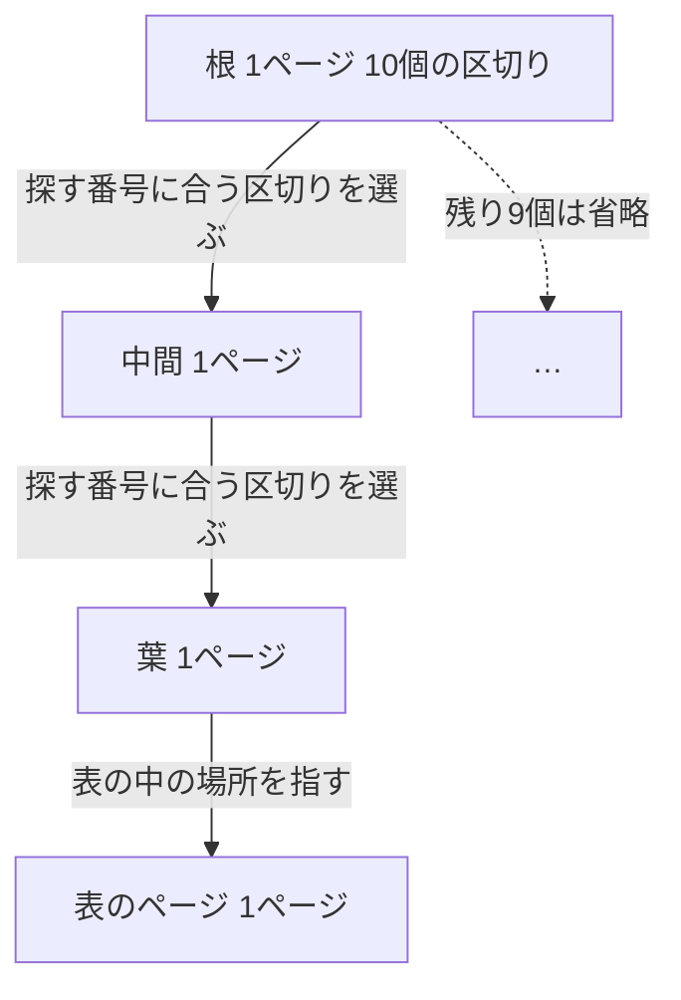

## はじめに

第2章の最後に、`id` を条件にした番号検索を試しました。本が100万冊に増えても、読んだページは7でした。末尾に近い999,958番の本を探しても4ページで、同じ題名検索が7,353ページを読んでいたのとはけた違いの差でした。検索欄に入れる条件が `title` か `id` かだけで、読むページの数はここまで変わっていました。同じ `books` という表を読んでいるのに、なぜこれほど差がつくのかはまだ確かめていません。

この章では、`id` の主キーを作ったときに自動でできる目録 `books_pkey` の中を実際にのぞき、なぜこれほど少ないページ数で済むのかを確かめます。目録は根から枝分かれして葉へ広がる木構造をしていて、探す番号は根から葉まで一直線に降りるだけで見つかります。本の数が1,000倍に増えても、この降りる段数はわずかしか増えません。後半では題名にも同じ仕組みの目録を作り、検索機能が本の数に左右されなくなることと、目録を持つことの代償を見ます。`pageinspect` という拡張機能を使い、実際のページを直接確かめながら進めます。

序章では何件の読了記録を調べるか、第1章では返す行数と調べた行数、第2章ではページ数で、と仕事量を数える見方を積み重ねてきました。この章では、そのページ数を目録の中に踏み込んで数えます。仕事量を数える場所が、表そのものから、表を支える目録の中身へと移ります。

:::message
サービスと会話は架空です。以下の出力と数値は、サンプルデータを使って実際に計測した値です。
:::

## 目録の中を見たい

第2章で題名検索が7,353ページを読むのを見た二人は、番号検索がなぜ4ページで済むのか気になっています。第1章では、この目録を「探したい行をすぐ見つけるための目録のようなもの」と説明していました。`id bigint PRIMARY KEY` と決めたとき、PostgreSQLは `books_pkey` という目録を自動で作っていました。この目録は `CREATE TABLE` で `PRIMARY KEY` を指定した時点で作られていて、読者が個別に作成の指示を出した覚えはありません。この目録がどれくらいの大きさなのか、`pg_class` で確かめます。

```sql
SELECT count(*) AS book_count FROM books;
SELECT relname, relpages, pg_size_pretty(pg_relation_size(oid)) AS size
FROM pg_class WHERE relname IN ('books', 'books_pkey');
```

```text
 book_count 
------------
    1000000
(1 row)

  relname   | relpages | size  
------------+----------+-------
 books      |     7353 | 59 MB
 books_pkey |     2745 | 22 MB
(2 rows)
```

`books_pkey` は2,745ページ、22MBありました。表 `books` 本体の7,353ページよりは小さいものの、それでも2,745ページという大きさです。4ページという結果と比べると、まだ大きな差があります。

「目録が2,745ページもあるのに、4ページで見つかるのはなぜ」

「目録の中身、一度ちゃんと見てみたいね」

「pg_classの数字だけだと、中がどうなっているかまでは分からないし」

## 2,745ページの目録から1冊の場所を見つけるのに、何ページ読むか

目録の中を実際に見る前に、予想してみます。2,745ページある `books_pkey` の中から、探している番号の場所を見つけるのに、何ページ読むことになるでしょうか。

- 目録を全部読む
- 半分くらい読む
- 数ページで済む

3つとも、それぞれ理屈が立ちそうです。

「第2章の `LIMIT 1` のとき、本の位置によって読むページが2、369、736と変わったよね」

「目録の中も、探す番号の場所によって読む量が変わるのかな」

「全部読むよりはましだろうけど、実際どうなんだろう」

実際に目録の中をのぞいて確かめます。

## 目録の中身をのぞく

PostgreSQLの公式文書は、目録があるときの検索についてこう説明しています。

> システムがインデックスをid列上で維持するように指示されていれば、一致する行を検出するのにより効率の良い方法を使うことができます。例えば、検索ツリーを数層分検索するだけで済む可能性もあります。
> ─ [PostgreSQL 18 文書 11.1 序文](https://www.postgresql.jp/document/18/html/indexes-intro.html)

「数層分」というのが、まさにこれから確かめる段数のことです。目録の中身がどんな木を組んでいるのか、`pageinspect` という拡張機能を使って実際に確かめます。`pageinspect` は、目録や表のページの中身を直接のぞくための拡張機能です。アプリケーションのコードから使うことはなく、今回のように仕組みを確かめる用途で使います。Dockerの `postgres:18` にはこの拡張が同梱されていて、`CREATE EXTENSION` で有効にするだけで使えます。

```sql
CREATE EXTENSION IF NOT EXISTS pageinspect;
```

```text
CREATE EXTENSION
```

目録の先頭には、根がどこにあるかという案内が書かれたページがあります。このページを `bt_metap` という関数で見ます。

```sql
SELECT root, level FROM bt_metap('books_pkey');
```

```text
 root | level 
------+-------
  412 |     2
(1 row)
```

`root` は412、`level` は2でした。412という数字は、目録の中の412番目のページが根だという意味です。目録の中でページの位置が固定されているわけではなく、この案内ページを頼りに根の場所を探し当てています。目録の階層は葉が0番目で、根に近づくほど数が大きくなります。根から葉まで降りるときに読むページの数を**段数**と呼ぶことにすると、段数は `level` に1を足した数になります。

目録は、根から枝分かれして葉へ広がる**木構造**をしています。いちばん上のページを根、根と葉のあいだにあるページを中間、いちばん下のページを葉と呼びます。PostgreSQLの主キーが自動で作るこの種類の目録は**B-tree**(ビーツリー)という木構造です。公式文書はB-treeインデックスをこう説明しています。

> B-treeインデックスは、ある順番でソート可能なデータに対する等価性や範囲を問い合わせることを扱うことができます。
> ─ [PostgreSQL 18 文書 11.2.1 B-Tree](https://www.postgresql.jp/document/18/html/indexes-types.html)

根のページの中身を `bt_page_stats` で見ます。

```sql
SELECT type, live_items, btpo_level FROM bt_page_stats('books_pkey', (SELECT root FROM bt_metap('books_pkey')));
```

```text
 type | live_items | btpo_level 
------+------------+------------
 r    |         10 |          2
(1 row)
```

`live_items` は10でした。根のページには10個の区切りの値が書かれていて、探す番号がどの区切りに入るかによって、10個の子のうち1つに降りていきます。中間のページも同じ仕組みで、次の1つを選んで下の段へ進みます。葉のページには本の番号と、表の中でその行がどこにあるかという場所が書いてあります。表のページには本の行そのものが入っていますが、目録のページに入っているのは値と場所への案内だけです。

各段に何ページあるかを数えます。

```sql
SELECT btpo_level AS level, count(*) AS pages
FROM (
  SELECT (bt_page_stats('books_pkey', g)).btpo_level
  FROM generate_series(1, (SELECT relpages FROM pg_class WHERE relname = 'books_pkey') - 1) AS g
) AS s
GROUP BY btpo_level;
```

```text
 level | pages 
-------+-------
     2 |     1
     1 |    10
     0 |  2733
(3 rows)
```

根が1ページ、中間が10ページ、葉が2,733ページでした。根の10個の区切りが、ちょうど中間の10ページに対応しています。中間から葉へは、1ページあたり200ページを超える数に枝分かれしていることになります。根から中間へは10分の1に絞り込み、中間から葉へはさらに200分の1以上に絞り込んでいることになります。

葉のページの数2,733は、表のページ数7,353よりも少なく済んでいます。1つの葉のページに、複数の本の場所がまとめて書かれているためです。

ここまでの構造を図にします。根から中間、葉、表のページへと降りていく流れを示します。



実測ではなく、仕組みを理解するための単純化した模型です。根は10個の子を持ちますが、図では選んだ1つ以外を「…」でまとめています。降りるたびに1つの区切りを選ぶだけで、根から表のページまで一直線にたどり着けることが図から分かります。

## 根から葉へ降りると、読むページは4枚

目録を根から葉へ降りて `id = 42` の本を探すSQLを、もう一度 `EXPLAIN ANALYZE` で実行します。

```sql
EXPLAIN ANALYZE SELECT * FROM books WHERE id = 42;
```

```text
                                                      QUERY PLAN                                                      
----------------------------------------------------------------------------------------------------------------------
 Index Scan using books_pkey on books  (cost=0.42..8.44 rows=1 width=30) (actual time=0.041..0.041 rows=1.00 loops=1)
   Index Cond: (id = 42)
   Index Searches: 1
   Buffers: shared hit=7
 Planning:
   Buffers: shared hit=8
 Planning Time: 0.091 ms
 Execution Time: 0.070 ms
(8 rows)
```

`Buffers: shared hit=7` でした。第2章の末尾で見た数と同じです。段数3(根、中間、葉)に表の1ページを足すと4のはずですが、7という数はそれより多いままです。同じSQLをもう一度実行してみます。

```sql
EXPLAIN ANALYZE SELECT * FROM books WHERE id = 42;
```

```text
                                                      QUERY PLAN                                                      
----------------------------------------------------------------------------------------------------------------------
 Index Scan using books_pkey on books  (cost=0.42..8.44 rows=1 width=30) (actual time=0.005..0.005 rows=1.00 loops=1)
   Index Cond: (id = 42)
   Index Searches: 1
   Buffers: shared hit=4
 Planning Time: 0.017 ms
 Execution Time: 0.009 ms
(6 rows)
```

2回目は `shared hit=4` でした。段数3に表の1ページを足した4と一致します。4ページの内訳は、根が1、中間が1、葉が1、そして目録が指す表のページが1です。1回目に7だったのは、目録の案内ページなど、探している本と直接関係のないページを余分に読んだ分です。余分の内訳をすべて特定してはいませんが、2回目以降は4に落ち着きます。

ページ数は同じ手順を踏む限り再現すると第2章で確かめましたが、今回のように1回目だけ違う数になることもあります。末尾に近い999,958番の本でも試します。

```sql
EXPLAIN ANALYZE SELECT * FROM books WHERE id = 999958;
```

```text
                                                      QUERY PLAN                                                      
----------------------------------------------------------------------------------------------------------------------
 Index Scan using books_pkey on books  (cost=0.42..8.44 rows=1 width=30) (actual time=0.024..0.026 rows=1.00 loops=1)
   Index Cond: (id = 999958)
   Index Searches: 1
   Buffers: shared hit=4
 Planning Time: 0.072 ms
 Execution Time: 0.043 ms
(6 rows)
```

こちらも4ページでした。第2章の `LIMIT 1` では、本の位置によって読むページが2、369、736と変わりましたが、目録を根から葉へ降りる探し方では、探す番号がどこにあっても仕事の量は変わりません。

## 本が増えても、段数はほとんど増えない

目録の段数が本の数によってどう変わるかを確かめます。第1章の1,000冊、第2章の10万冊と100万冊という、これまで使ってきた3つの規模で比べます。1,000冊と10万冊の一時テーブルを作り、それぞれの主キーの目録の段数を比べます。

```sql
CREATE TEMP TABLE books_small AS SELECT * FROM books WHERE id <= 1000;
ALTER TABLE books_small ADD PRIMARY KEY (id);
CREATE TEMP TABLE books_mid AS SELECT * FROM books WHERE id <= 100000;
ALTER TABLE books_mid ADD PRIMARY KEY (id);
SELECT 'books_small_pkey' AS index_name, level, (SELECT relpages FROM pg_class WHERE relname = 'books_small_pkey') AS relpages FROM bt_metap('books_small_pkey')
UNION ALL
SELECT 'books_mid_pkey', level, (SELECT relpages FROM pg_class WHERE relname = 'books_mid_pkey') FROM bt_metap('books_mid_pkey')
UNION ALL
SELECT 'books_pkey', level, (SELECT relpages FROM pg_class WHERE relname = 'books_pkey') FROM bt_metap('books_pkey');
```

```text
    index_name    | level | relpages 
------------------+-------+----------
 books_small_pkey |     1 |        5
 books_mid_pkey   |     1 |      276
 books_pkey       |     2 |     2745
(3 rows)
```

結果をまとめます。

| 冊数 | 目録のページ数 | 段数 | 全件探索で読むページ(第2章) |
| --- | --- | --- | --- |
| 1,000 | 5 | 2 | 8 |
| 100,000 | 276 | 2 | 736 |
| 1,000,000 | 2,745 | 3 | 7,353 |

全件探索で読むページは、本の数にほぼ比例して8から7,353まで増えていました。これが第2章で見たO(n)です。目録の段数は、本の数が1,000倍になっても2から3へ、1しか増えていません。1段のページが10から数百に枝分かれするので、下の段に進むたびに扱える冊数が掛け算で増えていくからです。

このように、仕事の増え方が枝分かれの回数、つまり何回枝分かれをたどれば1冊に届くかという**対数**で表される探し方を**O(log n)**と書きます。オーダー ログ エヌと読みます。全部を見るO(n)とは対照的に、O(log n)では本の数が1,000倍になっても段数はわずかしか増えません。この先も本が増えるにつれて、段数はこのゆるやかな伸び方をたどると見込めます。

## 題名にも目録を作る

番号検索と同じB-treeの目録を、題名にも作ります。検索欄に入れる題名も、等号で本を1冊に絞り込む点は番号検索と同じです。`CREATE INDEX` で `books` の `title` 列に目録を作ります。

```sql
CREATE INDEX books_title_idx ON books (title);
```

実行には14,113.892ミリ秒、約14秒かかりました。100万行ある表に新しく目録を作るのは、それ自体が軽くない作業です。`id` の目録は表を作った時点、本がまだ1,000冊しかないうちに自動でできていたので、作成にかかる時間を意識する場面はありませんでした。目録の作成は1回きりの作業で、検索のたびに繰り返すわけではありません。

できあがった目録の大きさを確認します。

```sql
SELECT relname, relpages, pg_size_pretty(pg_relation_size(oid)) AS size
FROM pg_class WHERE relname IN ('books', 'books_pkey', 'books_title_idx');
```

```text
     relname     | relpages | size  
-----------------+----------+-------
 books           |     7721 | 60 MB
 books_pkey      |     2745 | 22 MB
 books_title_idx |     4961 | 39 MB
(3 rows)
```

`books` のページ数が7,353から増えているのは、あとの目録の代償の節で見る追加実験の跡です。注目したいのは `books_title_idx` の4,961ページ、39MBという大きさです。

```sql
SELECT root, level FROM bt_metap('books_title_idx');
```

```text
 root | level 
------+-------
  164 |     2
(1 row)
```

段数は `books_pkey` と同じ3でした。`title = '実験用の本 42'` という同じ題名検索を、目録ができた状態で `EXPLAIN ANALYZE` で実行します。

```sql
EXPLAIN ANALYZE SELECT * FROM books WHERE title = '実験用の本 42';
```

```text
                                                        QUERY PLAN                                                         
---------------------------------------------------------------------------------------------------------------------------
 Index Scan using books_title_idx on books  (cost=0.42..8.44 rows=1 width=30) (actual time=0.138..0.138 rows=1.00 loops=1)
   Index Cond: (title = '実験用の本 42'::text)
   Index Searches: 1
   Buffers: shared hit=1 read=3
 Planning:
   Buffers: shared hit=17
 Planning Time: 0.197 ms
 Execution Time: 0.146 ms
(8 rows)
```

`Buffers: shared hit=1 read=3` でした。`read` は第2章で見た、メモリになかったので外から読み込んだページの数です。hitとreadを合わせると4で、番号検索とちょうど同じ4ページでした。真ん中と末尾近くの本でも試します。

```sql
EXPLAIN ANALYZE SELECT * FROM books WHERE title = '実験用の本 500000';
```

```text
                                                        QUERY PLAN                                                         
---------------------------------------------------------------------------------------------------------------------------
 Index Scan using books_title_idx on books  (cost=0.42..8.44 rows=1 width=30) (actual time=0.083..0.084 rows=1.00 loops=1)
   Index Cond: (title = '実験用の本 500000'::text)
   Index Searches: 1
   Buffers: shared hit=2 read=2
 Planning Time: 0.020 ms
 Execution Time: 0.089 ms
(6 rows)
```

```sql
EXPLAIN ANALYZE SELECT * FROM books WHERE title = '実験用の本 999958';
```

```text
                                                        QUERY PLAN                                                         
---------------------------------------------------------------------------------------------------------------------------
 Index Scan using books_title_idx on books  (cost=0.42..8.44 rows=1 width=30) (actual time=0.071..0.072 rows=1.00 loops=1)
   Index Cond: (title = '実験用の本 999958'::text)
   Index Searches: 1
   Buffers: shared hit=2 read=2
 Planning Time: 0.017 ms
 Execution Time: 0.076 ms
(6 rows)
```

どちらも `hit=2 read=2` で合計4ページでした。番号検索と同じように、探す本の位置によって仕事の量は変わりません。第2章で、この題名検索が全件探索で読んでいたページ数と比べます。

| | 読んだページ | Execution Time |
| --- | --- | --- |
| 目録なし(第2章、全件探索) | 7,353 | 33.259 ms |
| 目録あり(この章) | 4 | 0.146 ms |

題名検索も、本の数がどれだけ増えても数ページで済む検索に変わりました。友人たちの書誌データをこの先どれだけ取り込んでも、検索欄の応答が遅くなる心配は当面なさそうです。

## 目録の代償

目録には代償もあります。まず大きさを確かめます。`books_title_idx` は39MBで、片付けたあとの `books` 本体57MBの3分の2ほどの大きさでした。目録を1つ増やしただけで、表そのものに近い容量を使うことになります。

`books_pkey` の22MBと合わせると、2つの目録だけで61MBになり、片付けたあとの `books` 本体57MBを上回ります。作成には約14秒かかっています。大きな表に目録を作る作業は、それ自体がまとまった時間を必要とします。

目録を作ったあとは、本を追加するたびに何が起きるでしょうか。目録は表が変更されるたびに自動で更新されます。追加だけでなく、値を書き換える更新でも同じことが起きます。実際に1万冊の追加を `BEGIN` と `ROLLBACK` で試し、データを元に戻しながら時間を測りました。目録を作る前と、目録を作ったあとのそれぞれで、同じSQLを3回ずつ実行しています。

```sql
BEGIN;
INSERT INTO books SELECT n, '実験用の本 ' || n FROM generate_series(1000001, 1010000) AS n;
ROLLBACK;
```

`\timing on` で測った `INSERT` の `Time:` を3回分まとめます。

| | 1回目 | 2回目 | 3回目 |
| --- | --- | --- | --- |
| 目録なし | 19.624 ms | 18.688 ms | 21.346 ms |
| 目録あり | 287.795 ms | 245.557 ms | 240.274 ms |

目録がないときは約20ミリ秒だった追加が、目録があるときは約250ミリ秒までのびています。これは1万冊をまとめて追加したときの時間で、日常の1冊ずつの追加では体感しにくい差かもしれません。本を1冊増やすたびに目録も書き直されるので、目録を持つ列が増えるほど、追加や更新は遅くなります。目録はどの列にも作れますが、大きさと更新の代償を考えると、必要な列にだけ作る判断が要ります。

:::details 前方一致では目録が使われなかった
題名の前方一致で本を探す `LIKE` 検索も試しました。

```sql
EXPLAIN ANALYZE SELECT * FROM books WHERE title LIKE '実験用の本 4295%';
```

```text
                                                 QUERY PLAN                                                 
------------------------------------------------------------------------------------------------------------
 Seq Scan on books  (cost=0.00..20799.79 rows=103 width=30) (actual time=0.259..57.955 rows=111.00 loops=1)
   Filter: (title ~~ '実験用の本 4295%'::text)
   Rows Removed by Filter: 999889
   Buffers: shared hit=2078 read=5864
 Planning:
   Buffers: shared hit=6
 Planning Time: 0.113 ms
 Execution Time: 57.976 ms
(8 rows)
```

実行計画は `Seq Scan` で、目録は使われませんでした。`Rows Removed by Filter` は999,889で、100万冊のほとんどを読んで捨てていたことになります。公式文書はLIKEでの目録利用についてこう説明しています。

> オプティマイザは、パターンマッチ演算子LIKE、~を含む問い合わせでも、そのパターンが定数であり、先頭文字列を指定しているのであればB-treeインデックスを使用することができます。例えば、col LIKE 'foo%'またはcol ~ '^foo'では使用されますが、col LIKE '%bar'では使用されません。しかし、データベースがCロケールを使用していない場合、パターンマッチ問い合わせのインデックス付けをサポートする特別な演算子クラスでインデックスを作成しなければなりません。
> ─ [PostgreSQL 18 文書 11.2.1 B-Tree](https://www.postgresql.jp/document/18/html/indexes-types.html)

今回使っているデータベースの照合順序(文字の並び順を決める規則)は `en_US.utf8` で、Cロケールではありませんでした。前方一致の検索で目録を使うには、この特別な演算子クラスで目録を作り直す必要がありますが、この本では扱いません。
:::

実験で1万冊の追加と取り消しを何度か繰り返したので、`books` には取り消した跡が残っています。`VACUUM` で片付けます。仕組みは発展として扱います。

```sql
VACUUM books;
```

片付ける前後の大きさを比べます。

```sql
SELECT relname, relpages, pg_size_pretty(pg_relation_size(oid)) AS size FROM pg_class WHERE relname IN ('books', 'books_pkey', 'books_title_idx');
```

```text
     relname     | relpages | size  
-----------------+----------+-------
 books           |     7721 | 62 MB
 books_pkey      |     2745 | 22 MB
 books_title_idx |     4961 | 40 MB
(3 rows)
```

```sql
SELECT relname, relpages, pg_size_pretty(pg_relation_size(oid)) AS size FROM pg_class WHERE relname IN ('books', 'books_pkey', 'books_title_idx');
```

```text
     relname     | relpages | size  
-----------------+----------+-------
 books           |     7353 | 57 MB
 books_pkey      |     2772 | 22 MB
 books_title_idx |     5056 | 40 MB
(3 rows)
```

片付けたあと、`books` は7,353ページ、57MBに戻りました。第2章の末尾と同じ大きさです。

## この章で持ち帰ること

- 目録は木の形をしていて、根から葉へ降ります。読むページの数は段数と表の1ページを合わせた数です
- 本が1,000倍になっても段数は1増えるだけです(O(log n))。全部を見る探し方(O(n))とは対照的です
- 目録は等しいものを探すのに強い一方、大きさと更新という代償があります
- 第1章の `rows` と調べた行数、第2章のページ数で数える見方は、目録の中でもそのまま使えます

## 次の章へ

目録は根から葉へ降りる以外に、もう一つの性質を持っています。中身がもともと並び順を持っているということです。目録の話はここで終わりではなく、並べ替えでも形を変えて登場します。

「本を題名順に一覧したい」という要望が出たとき、この並び順は使えるのでしょうか。使えないときは何が起きるのでしょうか。第4章では、並べ替えの実行計画を読みながら確かめます。
