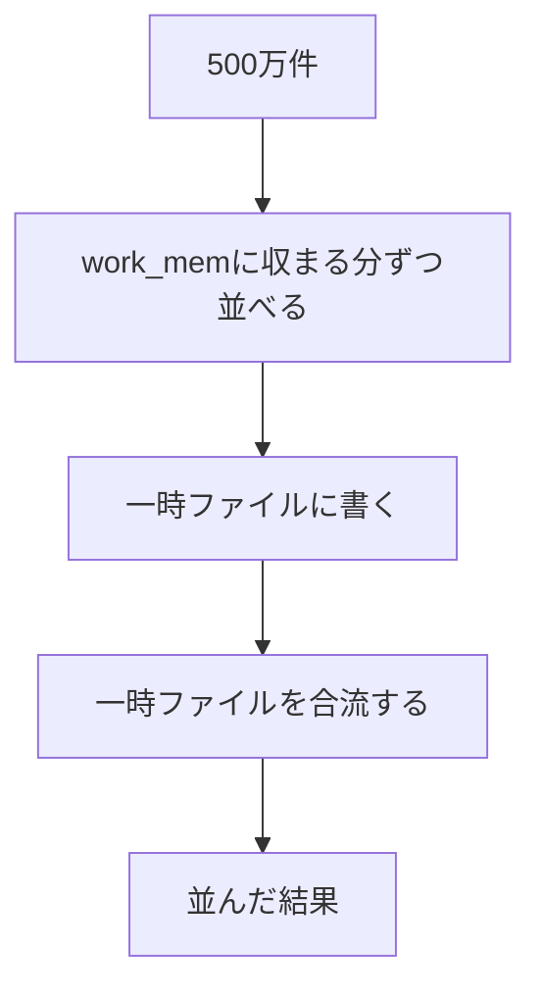

## はじめに

第3章では、目録の中をのぞいて、番号検索が数ページで済む理由を確かめました。目録があれば、検索は本の数に左右されません。今度は並べ替えです。

友人たちの利用がさらに広がり、読了記録は序章で見た「利用が広がった状態」と同じ2,000万件に届きます。サービスには、読み終えた本を新しい順に振り返れる一覧画面が欲しいという声が出ていました。この章では、その一覧を題材に、並べ替えの仕事量がどう増えるか、そしてメモリに収まらないときに何が起きるかを測ります。

序章では、20冊を返すランキングに何件の読了記録が関わり、どこに時間がかかるかを問いました。第1章で `EXPLAIN` の読み方を、第2章でページ数を数える見方を、第3章で目録が仕事を減らす仕組みを確かめてきました。この章ではその手がかりを使って、並べ替えという新しい処理を読みます。

:::message
サービスと会話は架空です。以下の出力と数値は、サンプルデータを使って実際に計測した値です。
:::

## 読了記録が2,000万件になった

友人たちの間で使う人がさらに増え、読了記録は序章の「利用が広がった状態」と同じ規模に近づいてきました。実験でもこの規模を再現します。

`TRUNCATE` は表の行を全部消す命令です。実験用に入れていた2万件をいったん空にしてから、序章と同じ式で2,000万件を作り直します。

```sql
TRUNCATE reading_records;
INSERT INTO reading_records
SELECT ((n::bigint * 7919) % 1000000) + 1,
       timestamp '2026-08-24' + ((n::bigint * 104729) % 2419200) * interval '1 second'
FROM generate_series(1, 20000000) AS n;
ANALYZE reading_records;
SELECT count(*) AS record_count FROM reading_records;
SELECT relpages, reltuples::bigint AS reltuples, pg_size_pretty(pg_relation_size('reading_records')) AS size
FROM pg_class WHERE relname = 'reading_records';
```

```text
TRUNCATE TABLE
INSERT 0 20000000
ANALYZE
 record_count 
--------------
     20000000
(1 row)

 relpages | reltuples |  size  
----------+-----------+--------
   108109 |  20000164 | 845 MB
(1 row)
```

2,000万件になり、 `reading_records` は845MB、108,109ページになりました。第2章で見た100万冊の `books` が57MBだったのに比べ、ずっと大きな表です。この規模で、新しい順の一覧がちゃんと動くかを確かめます。

「読み終えた本を新しい順に並べる一覧を作ろうか」

「今のままのSQLで、2,000万件からちゃんと並べられるのかな」

「まずは短い期間から試してみよう」

## 件数が増えると、並べ替えの仕事はどう増えるか

新しい順に並べる一覧を、まず短い期間で試します。1時間分はおよそ3万件、1日分はおよそ71万件、1週間分はおよそ500万件になる見込みです。序章のランキングでも、読了記録を集計する処理に時間がかかっていました。並べ替えも件数が増えるほど重くなるとしたら、一覧画面が表示する期間をどこまで広げられるかに関わってきます。件数が増えると、並べ替えにかかる時間はどう変わるでしょうか。

- 件数に比例して増える
- 比例より少し多く増える
- 件数の2乗くらいに増える

「検索のときは冊数にほぼ比例してたよね。並べ替えも同じ感じになるのかな」

「500万件を全部メモリで並べられるのかも気になるよね」

「まずは短い期間から試して、増え方を見てみよう」

## 並べ替えの時間だけを取り出す

1時間分の一覧を `EXPLAIN ANALYZE` で読みます。

```sql
EXPLAIN ANALYZE SELECT * FROM reading_records WHERE finished_at >= timestamp '2026-09-20 12:00' AND finished_at < timestamp '2026-09-20 13:00' ORDER BY finished_at DESC;
```

```text
                                                                          QUERY PLAN                                                                          
--------------------------------------------------------------------------------------------------------------------------------------------------------------
 Sort  (cost=410257.16..410329.55 rows=28954 width=16) (actual time=692.040..693.841 rows=29762.00 loops=1)
   Sort Key: finished_at DESC
   Sort Method: quicksort  Memory: 1699kB
   Buffers: shared hit=16227 read=91882 written=69
   ->  Seq Scan on reading_records  (cost=0.00..408111.46 rows=28954 width=16) (actual time=0.092..684.700 rows=29762.00 loops=1)
         Filter: ((finished_at >= '2026-09-20 12:00:00'::timestamp without time zone) AND (finished_at < '2026-09-20 13:00:00'::timestamp without time zone))
         Rows Removed by Filter: 19970238
         Buffers: shared hit=16227 read=91882 written=69
 Planning:
   Buffers: shared hit=13 read=10 dirtied=2 written=7
 Planning Time: 0.779 ms
 Execution Time: 694.680 ms
(12 rows)
```

`Sort` というノードが `Seq Scan` の上に積まれています。第2章で見た `Limit` と `Seq Scan` の関係と同じ形で、下のノードが読んだ行を上のノードが受け取ります。 `Rows Removed by Filter: 19970238` のとおり、対象は3万件足らずでも `Seq Scan` は2,000万件の表を毎回すべて読んでいます。

第1章では、 `actual time=A..B` のAを最初の1行を返すまでの時間、Bを全行を返すまでの時間と読みました。 `Seq Scan` は読んだ行から順にそのまま返せるので、Aは小さな値になります。 `Sort` は違います。何番目の行が最初に来るかは、対象の行を全部集めて並べ終えるまで決まりません。

だから並べ替えは、全部の行がそろわないと1行目を返せません。 `Sort` のactual timeの最初の値692.040msは、並べ終えて1行目を返せた時刻だと読めます。

この692.040msには、子の `Seq Scan` が読み終えるまでの時間も含まれています。 `Seq Scan` のactual timeは `0.092..684.700` で、684.700msで読み終えています。692.040から684.700を引いた約7.3msが、並べ替えそのものにかかった時間、おおよその並べ替えの時間です。

> 初期処理の推定コスト。出力段階が開始できるようになる前に消費される時間、例えば、SORTノードで実行されるソート処理の時間です。
> ─ [PostgreSQL 18 文書 14.1.1 EXPLAINの基本](https://www.postgresql.jp/document/18/html/using-explain.html)

推定コストの世界でも、 `SORT` ノードの起動コストの例として同じ考え方が使われています。実測でのSortとSeq Scanの差は、この考え方の実測版です。厳密には行の受け渡しにかかる時間も含むので、おおよその値として扱います。

`Sort Method: quicksort  Memory: 1699kB` は、メモリの中で並べたこと、使ったメモリが1.7MB程度だったことを示しています。

## 件数を増やして測る

1日分と1週間分も同じように読みます。

```sql
EXPLAIN ANALYZE SELECT * FROM reading_records WHERE finished_at >= timestamp '2026-09-20' AND finished_at < timestamp '2026-09-21' ORDER BY finished_at DESC;
```

```text
                                                                          QUERY PLAN                                                                          
--------------------------------------------------------------------------------------------------------------------------------------------------------------
 Sort  (cost=477581.95..479368.14 rows=714477 width=16) (actual time=809.759..899.203 rows=714284.00 loops=1)
   Sort Key: finished_at DESC
   Sort Method: quicksort  Memory: 46898kB
   Buffers: shared hit=16270 read=91839
   ->  Seq Scan on reading_records  (cost=0.00..408111.46 rows=714477 width=16) (actual time=0.283..691.965 rows=714284.00 loops=1)
         Filter: ((finished_at >= '2026-09-20 00:00:00'::timestamp without time zone) AND (finished_at < '2026-09-21 00:00:00'::timestamp without time zone))
         Rows Removed by Filter: 19285716
         Buffers: shared hit=16270 read=91839
 Planning Time: 0.055 ms
 Execution Time: 920.314 ms
(10 rows)
```

件数がさらに増える1週間分では、 `Sort Method` はどうなるでしょうか。

```sql
EXPLAIN ANALYZE SELECT * FROM reading_records WHERE finished_at >= timestamp '2026-09-14' AND finished_at < timestamp '2026-09-21' ORDER BY finished_at DESC;
```

```text
                                                                          QUERY PLAN                                                                          
--------------------------------------------------------------------------------------------------------------------------------------------------------------
 Sort  (cost=1055334.70..1067934.92 rows=5040088 width=16) (actual time=2023.881..2384.148 rows=4999999.00 loops=1)
   Sort Key: finished_at DESC
   Sort Method: external merge  Disk: 127216kB
   Buffers: shared hit=16252 read=91857, temp read=15902 written=15906
   ->  Seq Scan on reading_records  (cost=0.00..408111.46 rows=5040088 width=16) (actual time=0.281..837.601 rows=4999999.00 loops=1)
         Filter: ((finished_at >= '2026-09-14 00:00:00'::timestamp without time zone) AND (finished_at < '2026-09-21 00:00:00'::timestamp without time zone))
         Rows Removed by Filter: 15000001
         Buffers: shared hit=16252 read=91857
 Planning Time: 0.053 ms
 Execution Time: 2532.636 ms
(10 rows)
```

1週間分だけ `Sort Method` が `external merge` に変わっていました。並べ替えの時間を、1時間分と同じように取り出すと次のようになります。「全体」の列は、それぞれの `Execution Time` です。

| 期間 | 件数 | Sort Method | メモリまたはディスク | 並べ替えの時間 | 全体 |
| --- | --- | --- | --- | --- | --- |
| 1時間 | 29,762 | quicksort | Memory 1699kB | 約7.3 ms | 694.680 ms |
| 1日 | 714,284 | quicksort | Memory 46898kB | 約117.8 ms | 920.314 ms |
| 1週間 | 4,999,999 | external merge | Disk 127216kB | 約1186.3 ms | 2532.636 ms |

件数は1時間分から1日分でおよそ24倍に増え、並べ替えの時間はおよそ16倍に増えています。1日分から1週間分では件数がおよそ7倍、並べ替えの時間はおよそ8倍から10倍です。どちらも、件数の増え方より少しだけ多く時間が増えていて、比例よりわずかに大きい増え方をしています。

:::details 計測条件と生の時間
2026年9月21日、Apple SiliconのmacOSで、Dockerの `postgres:18`（PostgreSQL 18.6）を使用しました。

設定は `max_parallel_workers_per_gather = 0`、 `jit = off`、 `work_mem = '64MB'` です。 `shared_buffers` は既定の128MBのままです。

| 期間 | 並べ替えの時間（1〜3回目） | Execution Time（1〜3回目） |
| --- | --- | --- |
| 1時間 | 約7.3 / 4.4 / 4.4 ms | 694.680 / 667.902 / 666.100 ms |
| 1日 | 約117.8 / 106.1 / 116.4 ms | 920.314 / 846.071 / 853.726 ms |
| 1週間 | 約1186.3 / 941.1 / 922.7 ms | 2532.636 / 2296.817 / 2267.419 ms |

生ログは `_drafts/sql-data-structures/experiments/results/ch04-sort-docker-pg18-20260921.txt` に保存しています。
:::

この増え方には名前があります。第2章では、仕事が件数に比例して増える探し方をO(n)と呼びました。第3章では、目録をたどるときの仕事が段数に比例することをO(log n)と呼び、対数を根から葉まで「何回枝分かれをたどれば1冊に届くか」と言い換えました。

並べ替えでは、n件を並べるのに、n件それぞれについてlog n回くらい比べる作業が必要になります。仕事全体はおよそn×log nに比例し、これを**O(n log n)**（オーダー エヌ ログ エヌ）と書きます。件数が100倍になっても、log nの部分は少しだけしか増えないので、仕事は100倍より少し多い程度で済みます。今回の実験で件数が24倍、7倍になったときに、時間がそれぞれ16倍、8倍から10倍になっていたのは、このO(n log n)の増え方に近い結果です。

| 記法 | どの章で見た仕事か | 件数や冊数が1,000倍になると |
| --- | --- | --- |
| O(n) | 第2章、全件探索 | 仕事もおよそ1,000倍 |
| O(log n) | 第3章、目録をたどる | 仕事は1つか2つ増えるだけ |
| O(n log n) | 第4章、並べ替え | 仕事は1,000倍より少し多い程度 |

`Sort Method` に出てきた `quicksort` や、この後見る `external merge` は、並べ替えの具体的な手順の名前です。手順そのものはこの本では扱いません。

## メモリに収まらないときに何が起きるか

1週間分だけ、件数が増えるとともに `Sort Method` が `quicksort` から `external merge` に変わりました。並べ替える件数が多くなると、全部をメモリに載せて並べる方法が使えなくなることがあります。そのときPostgreSQLは、 `work_mem` に収まる分ずつメモリで並べていったん一時ファイルに書き出し、あとでそれらを合流させます。メモリの中だけで完結せず、ディスク上の一時ファイルも使うことから、この方法を**外部ソート**と呼びます。

> 一時ディスクファイルに書き込む前に、問い合わせ操作（ソートやハッシュなど）で使用される最大メモリ量を設定します。この値が単位なしで指定された場合は、キロバイト単位であるとみなします。デフォルト値は4MB(4MB)です。複雑な問い合わせでは、同時に複数のソート操作とハッシュ操作が実行される可能性があります。各操作は通常、データを一時ファイルに書き込む前にこの値で指定された量のメモリを使用できます。
> ─ [PostgreSQL 18 文書 19.4.1 メモリ](https://www.postgresql.jp/document/18/html/runtime-config-resource.html)

この章の実験では `work_mem` を64MBに設定しています。1週間分、約500万件を並べるにはこれでは足りず、外部ソートに切り替わりました。1週間分の出力にある `Buffers` の行を見ると、 `temp read=15902 written=15906` とあります。一時ファイルに書いたページが15,906、あとで合流のために読み戻したページが15,902です。



500万件を一度にメモリへ載せず、収まる分ずつ並べて一時ファイルに書き、あとで合流して1つの並んだ結果にします。全部をメモリで並べる `quicksort` とは違う道筋です。

外部ソートは一時ファイルへの書き込みと読み込みを伴います。 `work_mem` を増やしてメモリだけで並べられれば、その分速くなるように思えます。実際に効くのか、 `SET` で試します。 `SET` は今のセッションだけに効く一時的な変更です。他の接続や、次に `psql` につなぎ直したときには影響しません。

```sql
SET work_mem = '1GB';
SHOW work_mem;
```

```text
SET
 work_mem 
----------
 1GB
(1 row)
```

```sql
EXPLAIN ANALYZE SELECT * FROM reading_records WHERE finished_at >= timestamp '2026-09-14' AND finished_at < timestamp '2026-09-21' ORDER BY finished_at DESC;
```

```text
                                                                          QUERY PLAN                                                                          
--------------------------------------------------------------------------------------------------------------------------------------------------------------
 Sort  (cost=969199.70..981799.92 rows=5040088 width=16) (actual time=1641.665..3018.784 rows=4999999.00 loops=1)
   Sort Key: finished_at DESC
   Sort Method: quicksort  Memory: 352858kB
   Buffers: shared hit=16283 read=91826
   ->  Seq Scan on reading_records  (cost=0.00..408111.46 rows=5040088 width=16) (actual time=0.327..848.246 rows=4999999.00 loops=1)
         Filter: ((finished_at >= '2026-09-14 00:00:00'::timestamp without time zone) AND (finished_at < '2026-09-21 00:00:00'::timestamp without time zone))
         Rows Removed by Filter: 15000001
         Buffers: shared hit=16283 read=91826
 Planning Time: 0.054 ms
 Execution Time: 3169.100 ms
(10 rows)
```

`Sort Method` は `quicksort` に変わり、使ったメモリは352858kB、約353MBでした。外部ソートを使わずにメモリだけで並べています。

| work_mem | Sort Method | メモリまたはディスク | Execution Time |
| --- | --- | --- | --- |
| 64MB | external merge | Disk 127216kB | 2532.636 / 2296.817 / 2267.419 ms |
| 1GB | quicksort | Memory 352858kB | 3169.100 / 3125.177 ms |

メモリの中で並べられるようになったのに、全体の時間はかえって遅くなっています。理由はこの本では追いません。ここで持ち帰れるのは、メモリを増やせば速くなる、とは限らないという事実です。

確かめ終えたら `work_mem` を元に戻します。

```sql
RESET work_mem;
```

`RESET` で、このセッションの `work_mem` は64MBに戻ります。以降の章もこの設定のまま進めます。

## 読んだページのhitとread

845MBの `reading_records` を読むとき、 `Buffers` のhitとreadはどうなっているでしょうか。第2章では、 `shared hit` はメモリにあったページの数、 `read` はメモリになかったので外から読み込んだページの数と定義しました。あのときは `shared hit` しか出ておらず、 `read` の中身は後の章で扱うと保留にしていました。ここで回収します。

1時間分の出力を見直すと、 `Buffers: shared hit=16227 read=91882` とあります。足すと108,109で、 `pg_class` で見た `reading_records` のページ数とちょうど一致します。他の期間で実行しても、hitとreadの内訳は多少変わりますが、合計は変わりません。

> データベースサーバが共有メモリバッファのために使用するメモリ量を設定します。デフォルトは一般的に128メガバイト(128MB)です。
> ─ [PostgreSQL 18 文書 19.4.1 メモリ](https://www.postgresql.jp/document/18/html/runtime-config-resource.html)

この章の実験でも `shared_buffers` は128MBのままです。845MBの表はこの128MBには収まらないので、 `Seq Scan` はどの期間で実行しても、毎回ほとんどのページを `read` として外から読み込みます。

参考として、並べ替えをせずに1週間分の件数を数えるだけの `Seq Scan` でも、845MB全体を読むのに851.705ms、約0.85秒しかかかっていません。ディスクから毎回読んでいるならこの速さは考えにくく、OSのメモリ上のキャッシュから来ていると考えられます。 `shared_buffers` に収まらなくても、極端に遅くなっているわけではありません。仕事量を時間ではなくページ数で数えるという第2章からの方針は、845MBの表でも変わりません。

## 目録は並び順を持っている

並べ替えの仕事は、いつも必要というわけではありません。 `books` には第3章で作った目録があります。

```sql
EXPLAIN ANALYZE SELECT * FROM books ORDER BY id LIMIT 20;
```

```text
                                                              QUERY PLAN                                                               
---------------------------------------------------------------------------------------------------------------------------------------
 Limit  (cost=0.42..1.09 rows=20 width=30) (actual time=0.987..0.990 rows=20.00 loops=1)
   Buffers: shared read=4
   ->  Index Scan using books_pkey on books  (cost=0.42..33444.43 rows=1000000 width=30) (actual time=0.986..0.988 rows=20.00 loops=1)
         Index Searches: 1
         Buffers: shared read=4
 Planning:
   Buffers: shared hit=46 read=20
 Planning Time: 1.220 ms
 Execution Time: 0.999 ms
(9 rows)
```

```sql
EXPLAIN ANALYZE SELECT * FROM books ORDER BY title LIMIT 20;
```

```text
                                                                 QUERY PLAN                                                                 
--------------------------------------------------------------------------------------------------------------------------------------------
 Limit  (cost=0.42..1.42 rows=20 width=30) (actual time=0.072..1.215 rows=20.00 loops=1)
   Buffers: shared hit=4 read=8
   ->  Index Scan using books_title_idx on books  (cost=0.42..49924.16 rows=1000000 width=30) (actual time=0.071..1.213 rows=20.00 loops=1)
         Index Searches: 1
         Buffers: shared hit=4 read=8
 Planning:
   Buffers: shared hit=4 read=1
 Planning Time: 0.031 ms
 Execution Time: 1.219 ms
(9 rows)
```

どちらの出力にも `Sort` ノードがありません。 `Index Scan` が `books_pkey` や `books_title_idx` を使って、すでに並んだ順に20冊を返しています。第3章で見たように、目録の葉のページは値の小さい順に並んでいます。葉を順にたどるだけで、並べ替えなしに並んだ結果が得られます。目録は作ったときから並び順を持っていて、並べ替える手間がかかりません。

読了記録の `finished_at` には、まだこのような目録がありません。だからここまでの実験では、新しい順に並べるたびに `Sort` が必要でした。

## この章で持ち帰ること

- 並べ替えの仕事は件数に比例より少し多く増えます（O(n log n)）。全件探索のO(n)、目録をたどるO(log n)との違いも確かめました
- `work_mem` に収まらなければ一時ファイルに書いて合流します。メモリを増やせば速くなるとは限りません
- 大きな表は `shared_buffers` に収まらず、毎回 `read` が出ます。それでも0.85秒ほどで読めており、ページ数で数える方針は変わりません
- 目録は並び順を持っていて、並べ替えの仕事を消せることがあります

## 次の章へ

一覧の画面は、新しい順に20件しか表示しません。500万件を並べ終えてから先頭の20件だけを見せているとしたら、残り499万件あまりを並べる仕事は、表示に使われないまま終わっています。

`LIMIT 20` を付けて同じSQLを実行すると、 `Sort Method` に、ここまでとは違う名前が出てきます。20件だけを求めているときに、PostgreSQLが本当に500万件全部を並べているのかどうかを、第5章で確かめます。
