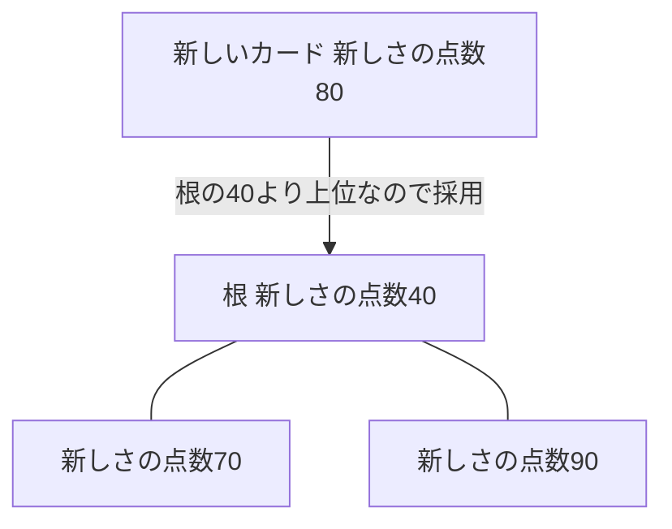
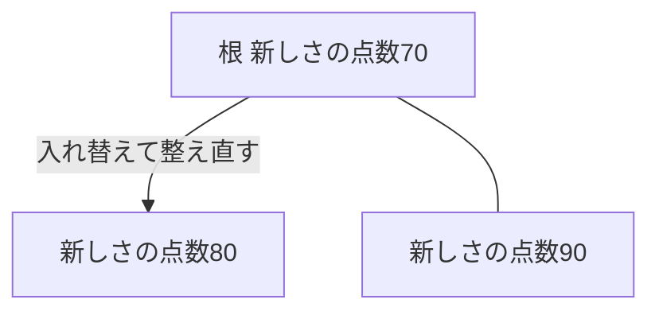

## はじめに

第4章では、読了記録を新しい順に並べる一覧を題材に、並べ替えの仕事が件数に比例するより少し多く増えること、`work_mem` に収まらないときは外部ソートに切り替わることを確かめました。一覧の画面は、実際には500万件ぜんぶを表示するわけではありません。新しい順に20件だけを表示する一覧なら、その並べ替えは本当に500万件ぜんぶを対象にする必要があるのでしょうか。

この章では、`LIMIT` を付けたときの並べ替えの仕事を測り、上位k件だけを残す仕組みとしてヒープというデータ構造を確かめます。そのあと、読了日時に目録を作って並べ替えそのものを消し、目録を作ったことで起きる副作用も見ます。副作用は、目録を作れば一方的に得をするわけではないことを教えてくれます。

序章では、20冊を返すランキングに何件の読了記録を調べる必要があるかを問いました。この章で見る一覧も同じ形の問いを持っていて、20件を返すために500万件を見ることになります。

:::message
サービスと会話は架空です。以下の出力と数値は、サンプルデータを使って実際に計測した値です。
:::

## 一覧は20件しか表示しない

友人たちの読書記録サービスに、最近読み終えた本を新しい順に並べるタイムライン画面を作ることになりました。読み終えた本を新着順にざっと眺められる画面で、表示するのは新しい順の20件だけです。

「500万件を全部並べて、そこから20件だけ取り出すのは無駄じゃないかな」

「でも上位の20件を決めるには、結局全部を見ないといけない気がする」

「第4章のSQLに `LIMIT 20` を付けるだけで試せるから、まず測ってみよう」

## 上位20件だけが欲しいとき、並べ替えの仕事はどこまで減るか

第4章では、対象の期間を1時間、1日、1週間と広げながら並べ替えの時間を測りました。今回は同じ1週間分のデータに `LIMIT 20` を付けて実行したら、並べ替えの仕事はどう変わるでしょうか。

- 変わらない（全部並べる）
- 全部は見るが、全部は並べない
- 20件だけ見て終わる

あわせて、この20件を残すために、PostgreSQL は手元に何を置いておけばよいのでしょうか。

「検索のときは `LIMIT 1` を付けても、本の位置によっては最後まで調べていたよね」

「並べ替えでも同じように、結局全部調べることになりそうな気がする」

「手元に何を残しておけば20件を決められるのか、というのも気になるね」

## LIMITを付けて測る

1週間分の一覧に `LIMIT 20` を付けて実行します。

```sql
EXPLAIN ANALYZE SELECT * FROM reading_records WHERE finished_at >= timestamp '2026-09-14' AND finished_at < timestamp '2026-09-21' ORDER BY finished_at DESC LIMIT 20;
```

```text
                                                                             QUERY PLAN                                                                             
--------------------------------------------------------------------------------------------------------------------------------------------------------------------
 Limit  (cost=542222.84..542222.89 rows=20 width=16) (actual time=1248.492..1248.526 rows=20.00 loops=1)
   Buffers: shared hit=16044 read=92068
   ->  Sort  (cost=542222.84..554822.96 rows=5040047 width=16) (actual time=1248.488..1248.489 rows=20.00 loops=1)
         Sort Key: finished_at DESC
         Sort Method: top-N heapsort  Memory: 26kB
         Buffers: shared hit=16044 read=92068
         ->  Seq Scan on reading_records  (cost=0.00..408109.00 rows=5040047 width=16) (actual time=0.032..896.251 rows=4999999.00 loops=1)
               Filter: ((finished_at >= '2026-09-14 00:00:00'::timestamp without time zone) AND (finished_at < '2026-09-21 00:00:00'::timestamp without time zone))
               Rows Removed by Filter: 15000001
               Buffers: shared hit=16041 read=92068
 Planning:
   Buffers: shared hit=50 read=10
 Planning Time: 0.557 ms
 Execution Time: 1248.554 ms
(14 rows)
```

`Sort Method: top-N heapsort  Memory: 26kB` という見慣れない名前が出てきました。第4章で1週間分を並べたときの `Sort Method` は `external merge` で、127MBのディスクを使っていました。今回はメモリの26kBだけで済んでいます。

`Buffers` は `shared hit=16041 read=92068` で、合計108,109ページです。第4章で1週間分を並べたときと同じ、`reading_records` の全ページ数です。`LIMIT 20` を付けても、条件に合う行が他にまだあるかもしれないので、`Seq Scan` は表を最後まで読んでいます。

並べ替えにかかった時間だけを取り出すと、様子が変わります。第4章と同じ数え方で、`Sort` のactual timeの最初の値から、子の `Seq Scan` の全体時間を引きます。1248.488から896.251を引くと、約0.35秒です。第4章で1週間分を並べたときの約1秒と比べて、3分の1ほどに縮んでいます。

読む行数は変わらないのに、並べ替えの時間だけが縮んでいました。「全部は見るが、全部は並べない」という予想に近い結果でした。「20件だけ見て終わる」という予想は外れています。`WHERE` 条件に合う行が他にないかを確かめるため、`Seq Scan` は毎回表の全ページを読み切っています。

`LIMIT` の大きさを変えて、同じSQLをもう少し測ります。

| LIMIT | 対象 | Sort Method | メモリまたはディスク | Execution Time |
| --- | --- | --- | --- | --- |
| 1,000 | 1週間分 | top-N heapsort | Memory 115kB | 1064.456 ms |
| 100,000 | 1週間分 | top-N heapsort | Memory 12758kB | 1298.460 ms |
| 1,000,000 | 1週間分 | external merge | Disk 127232kB | 2218.816 ms |
| 20 | 全2,000万件 | top-N heapsort | Memory 26kB | 2333.433 ms |

上位k件が `work_mem` に収まるうちは `top-N heapsort` が使われます。LIMIT が100万になると上位100万件をメモリに保持しきれず、`external merge` に切り替わっています。このときの `Buffers` には `temp read=7965 written=15908` も記録されていて、第4章で見た外部ソートと同じように、一時ファイルへの書き込みと読み戻しが発生しています。全2,000万件から `LIMIT 20` を取り出しても `Sort Method` は `top-N heapsort` のままでメモリはわずか26kBで、対象の件数ではなく `LIMIT` の大きさで仕事の重さが決まっています。

:::details 計測条件と生の時間
2026年9月21日、Apple SiliconのmacOSで、Dockerの `postgres:18`（PostgreSQL 18.6）を使用しました。

設定は `max_parallel_workers_per_gather = 0`、`jit = off`、`work_mem = '64MB'` です。`shared_buffers` は既定の128MBのままです。

| 実行 | 並べ替えの時間 | Execution Time |
| --- | --- | --- |
| 1回目 | 約352.2 ms | 1248.554 ms |
| 2回目 | 約309.6 ms | 1056.143 ms |
| 3回目 | 約317.3 ms | 1094.697 ms |

生ログは `_drafts/sql-data-structures/experiments/results/ch05-top-n-docker-pg18-20260921.txt` に保存しています。
:::

## 20枚のカードだけ残すなら

`top-N heapsort` は、なぜ20件だけを残しながら、500万件を並べ替えたときよりずっと少ないメモリで済むのでしょうか。

本の情報が一枚ずつカードになって届く場面を考えます。手元に置いておける候補は20枚だけです。21枚目のカードが届いたら、何と比べて残すかを決めなければなりません。

比べる相手は、いちばん新しい候補ではありません。手元にある候補の中で、いちばん順位が低い、いちばん古いカードです。新しいカードがそれより上位なら入れ替え、それより下位ならそのまま捨てます。

ここで必要なのは、候補全体をいつも並べ直すことではなく、候補の中でいちばん順位が低いカードだけをすぐ取り出せることです。この条件を満たすデータ構造を**ヒープ**と呼びます。ヒープは木の形をしていて、親の順位が子以下になるという条件を保ちます。この条件があると、根には候補の中でいちばん順位が低いカードが来ます。根より下位のカードは、根と比べるまでもなく候補から外れます。

新しいカードが根の値より上位なら、根と入れ替えてから、木の高さの分だけ子と比べて位置を整え直します。20枚の候補なら、木の高さはおよそ5段です。並べ替え全体でかかる仕事は、n件それぞれについてlog k回くらい比べる作業になり、**O(n log k)**（オーダー エヌ ログ ケー）と書けます。第4章のO(n log n)は、n件全部を並べ直す仕事でした。kがnよりずっと小さいとき、log kはlog nより小さいので、上位k件だけを残す仕事は全部を並べる仕事より軽くなります。

新しいカードが届いたときの入れ替えを、3枚の候補で確かめます。ここでの数字は、実際の `finished_at` の値ではなく、新しさの順位を表す模型上の点数（新しさの点数）です。

まず、入れ替え前の候補で、根にいちばん順位が低いカードが来ていることを確かめます。



根の40点がいちばん順位が低く、新しく届いた80点と比べる相手になっていることが分かります。

次に、入れ替えたあと木の条件がどう整え直されるかを見ます。



80点がそのまま根に残るのではなく、70点が新しい根になり、80点は子の位置に収まっていることが分かります。候補として残す枚数が増えるほど、木の高さも整え直す手間も少しずつ増えます。LIMITを1,000や100,000に変えたときにメモリの使用量が増えていたのも、残す候補の数が多くなっていたためです。

:::message
20枚のカードは仕組みを理解するための模型です。PostgreSQL が最初から厳密に20行だけを保持しているという意味ではありません。
:::

:::message
「ヒープ」は、PostgreSQL が表の格納先を指して使うこともある語です。この本ではここまでも、ここから先も、データ構造としてのヒープの意味で使います。
:::

`top-N heapsort` という名前は、この「上位N件だけを候補として残しながら並べる」という考え方につながっています。

## 順位順の目録があれば、先頭から20件で終われる

「最初から新しい順の目録があれば、末尾から20件読むだけで終わるんじゃないかな」

「読了日時には、まだ目録がなかったよね」

読了日時 `finished_at` に目録を作って確かめます。

```sql
CREATE INDEX reading_records_finished_at_idx ON reading_records (finished_at);
SELECT relname, relpages, pg_size_pretty(pg_relation_size(oid)) AS size
FROM pg_class WHERE relname IN ('reading_records', 'reading_records_finished_at_idx') ORDER BY relname;
SELECT root, level FROM bt_metap('reading_records_finished_at_idx');
```

```text
CREATE INDEX
             relname             | relpages |  size  
---------------------------------+----------+--------
 reading_records                 |   108109 | 845 MB
 reading_records_finished_at_idx |    23124 | 181 MB
(2 rows)

 root | level 
------+-------
  290 |     2
(1 row)
```

目録の作成には約4.7秒かかり、大きさは181MBで、`reading_records` の845MBの5分の1ほどです。`level` は2なので、第3章の数え方（根から葉まで降りるときに読むページの数、level + 1）で段数は3段です。第3章で見た目録と同じように、この目録にも大きさと作成時間という代償があります。181MBは無視できる大きさではありませんが、この先の観察で見返りがあるかを確かめます。

同じ `LIMIT 20` の一覧を、目録ができた状態でもう一度実行します。

```sql
EXPLAIN ANALYZE SELECT * FROM reading_records ORDER BY finished_at DESC LIMIT 20;
```

1回目の実行では、目録を作った直後でまだメモリに載っていないページがあり、`Buffers` に `read=21` が混じりました。2回目の出力を見ます。

```text
                                                                                   QUERY PLAN                                                                                    
---------------------------------------------------------------------------------------------------------------------------------------------------------------------------------
 Limit  (cost=0.44..1.26 rows=20 width=16) (actual time=0.006..0.013 rows=20.00 loops=1)
   Buffers: shared hit=23
   ->  Index Scan Backward using reading_records_finished_at_idx on reading_records  (cost=0.44..824929.60 rows=20000000 width=16) (actual time=0.005..0.011 rows=20.00 loops=1)
         Index Searches: 1
         Buffers: shared hit=23
 Planning Time: 0.011 ms
 Execution Time: 0.016 ms
(7 rows)
```

`Sort` ノードが消え、`Index Scan Backward` というノードだけが残りました。`Buffers` は `shared hit=23`、23ページだけです。第4章で見たとき、108,109ページを読んで並べ替えていたのと比べると、大きな差です。

`Backward` は、目録を末尾から逆向きに読むという意味です。`CREATE INDEX` に指定した列の並びは既定で昇順なので、`reading_records_finished_at_idx` は `finished_at` の小さい順に並んでいます。末尾から読めば新しい順になり、`ORDER BY finished_at DESC` にそのまま合います。

23ページの内訳は、目録の3段と、20行ぶんの表のページをおよそ合わせたものだと考えられます。正確な内訳は突き止めていません。

期間を絞った1週間分の `LIMIT 20` でも、同じように試します。

```sql
EXPLAIN ANALYZE SELECT * FROM reading_records WHERE finished_at >= timestamp '2026-09-14' AND finished_at < timestamp '2026-09-21' ORDER BY finished_at DESC LIMIT 20;
```

```text
                                                                                   QUERY PLAN                                                                                   
--------------------------------------------------------------------------------------------------------------------------------------------------------------------------------
 Limit  (cost=0.44..2.65 rows=20 width=16) (actual time=0.007..0.023 rows=20.00 loops=1)
   Buffers: shared hit=23
   ->  Index Scan Backward using reading_records_finished_at_idx on reading_records  (cost=0.44..556593.83 rows=5042047 width=16) (actual time=0.007..0.020 rows=20.00 loops=1)
         Index Cond: ((finished_at >= '2026-09-14 00:00:00'::timestamp without time zone) AND (finished_at < '2026-09-21 00:00:00'::timestamp without time zone))
         Index Searches: 1
         Buffers: shared hit=23
 Planning:
   Buffers: shared hit=4
 Planning Time: 0.075 ms
 Execution Time: 0.031 ms
(10 rows)
```

`Index Cond` に期間の条件が付いていますが、読んだページはやはり23ページです。目録があれば、範囲を絞っても絞らなくても、先頭から20件を読むだけで終わります。

> B-treeインデックスをソートされた順序でデータを受けとるために使用することもできます。これは常に単純なスキャンとソート処理より高速になるものではありませんが、よく役に立つことがあります。
> ─ [PostgreSQL 18 文書 11.2.1 B-Tree](https://www.postgresql.jp/document/18/html/indexes-types.html)

第4章で見たように、`books` の目録も並び順を持っていて、`Sort` なしに並んだ結果を返していました。`reading_records` の目録も、同じ性質を持っています。これで、新しい順の一覧は目録の力だけで20件を返せるようになりました。

## 目録が仕事を増やすとき

目録があれば並べ替えが消えることが分かりました。都合の良いことばかりなのか、確かめておきます。第4章で使った「1週間分を全部並べる」SQLを、目録がある状態でもう一度実行するとどうなるでしょうか。

```sql
EXPLAIN ANALYZE SELECT * FROM reading_records WHERE finished_at >= timestamp '2026-09-14' AND finished_at < timestamp '2026-09-21' ORDER BY finished_at DESC;
```

```text
                                                                                    QUERY PLAN                                                                                     
-----------------------------------------------------------------------------------------------------------------------------------------------------------------------------------
 Index Scan Backward using reading_records_finished_at_idx on reading_records  (cost=0.44..556593.83 rows=5042047 width=16) (actual time=0.005..28129.250 rows=4999999.00 loops=1)
   Index Cond: ((finished_at >= '2026-09-14 00:00:00'::timestamp without time zone) AND (finished_at < '2026-09-21 00:00:00'::timestamp without time zone))
   Index Searches: 1
   Buffers: shared hit=1305 read=5004457 written=9
 Planning:
   Buffers: shared hit=4
 Planning Time: 0.030 ms
 Execution Time: 28297.474 ms
(8 rows)
```

`Index Scan Backward` が選ばれ、`Execution Time` は28,297.474ms、約28秒です。第4章で目録がなかったときと比べます。

| 目録 | ノード | 読んだページ | Execution Time |
| --- | --- | --- | --- |
| なし（第4章） | Seq Scan + Sort | 108,109 | 約2.3秒 |
| あり | Index Scan Backward | 1,305 + 5,004,457 | 28,297.474 ms |

目録があるときの方が、目録がないときのおよそ12倍の時間がかかっています。`Buffers` の `read=5004457` は、およそ500万ページです。目録から1行ぶんの場所を見つけるたびに表のページへ飛んでその1行だけを読む、という動きを500万回近く繰り返したことになります。第3章で、番号検索の4ページが根、中間、葉、表の1ページという内訳だったことを思い出すと、これは1行ごとに表のページへ飛ぶ動きを500万行ぶん重ねたことに近い動きです。第4章の `Seq Scan` は表を先頭から順に読んでいたので、同じ845MBでもページの並び順どおりに読み進められていました。

> （多くの行をソートする場合、インデックススキャンでは非シーケンシャルなディスクアクセスが必要となるため、シーケンシャルスキャンとソートの方がインデックススキャンより優ります。）
> ─ [PostgreSQL 18 文書 14.1.1 EXPLAINの基本](https://www.postgresql.jp/document/18/html/using-explain.html)

今回はこの読み方の方が安いとプランナが見積もり、`Index Scan Backward` を選びました。実測では目録なしの方が速かったので、見積もりと実測はずれています。このずれがなぜ起きるのかは、第7章で扱います。

一覧の画面は新しい順に20件しか表示しません。20件を取り出すだけなら目録は23ページで済み、108,109ページ全部を読んでいたときより大きく減ります。この一覧の画面は20件しか出さないので、目録は残すことにします。

1時間分を同じように並べ替えると、`Sort Method` は `quicksort`（Memory 1699kB）のままでしたが、その下のノードが `Bitmap Heap Scan` と `Bitmap Index Scan` に変わりました。目録で該当する場所をいったん集めてから、表をまとめて読む読み方です。詳しい仕組みはこの本では扱いません。

## この章で持ち帰ること

- 結果の件数（20）と、結果を作るために見た件数（500万）と、並べ替えた件数は別です。`LIMIT` を付けても `Seq Scan` は表を最後まで読みます
- 上位k件だけを残すなら、候補の中でいちばん順位が低いものをすぐ取り出せる構造（ヒープ）があれば、全部を並べ直さずに済みます。kが `work_mem` に収まるうちは `top-N heapsort` が使われます
- 順位順の目録があれば並べ替えは消えます。ただし目録を経由して大量の行を読むと、表のページへ飛び飛びにアクセスすることになり、かえって遅くなることがあります
- 目録は作ると、その列を使う他のSQLの計画も変わります。作ったあとは、他のSQLも測っておく必要があります

## 次の章へ

一覧に本の題名も表示したくなりました。いまの `reading_records` には `book_id` しかなく、`books` の `title` を合わせて表示するには、`reading_records` と `books`、2つの表を組み合わせる必要があります。

20件を返すときと、500万件を対象にするときとでは、2つの表の組み合わせ方はどう変わるのでしょうか。第6章では、3つの方法を見ます。
