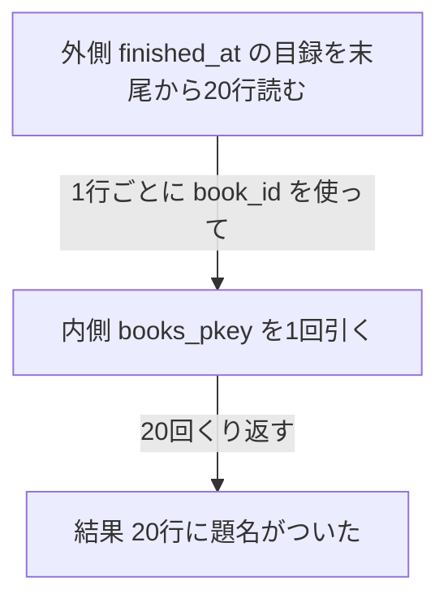
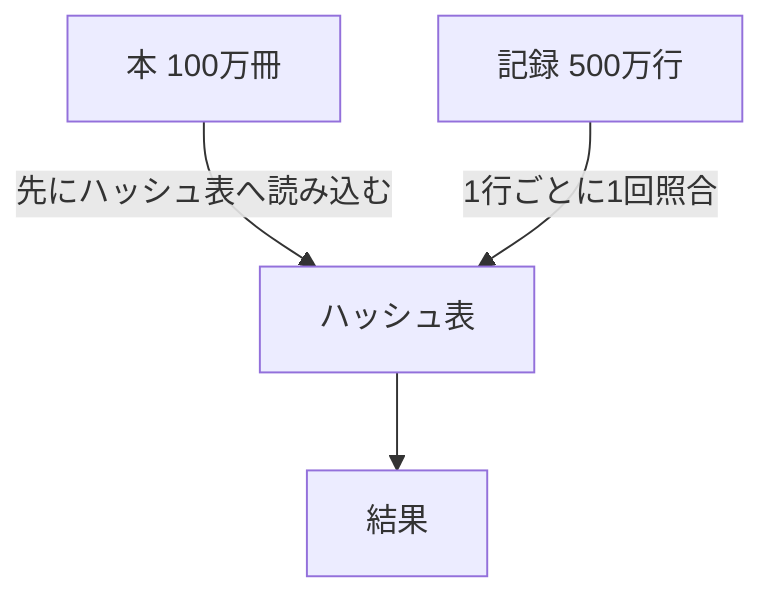

## はじめに

第5章で、最近読み終えた20件を `finished_at` の目録の末尾から読み出せるようになりました。`Index Scan Backward` が目録の末尾からそのまま20行を返すので、並べ替えはもう必要ありません。

ただし、いまの一覧が返しているのは `book_id` と `finished_at` だけです。画面に出したいのは本の題名で、それは `reading_records` ではなく `books` という別の表に入っています。

この章では、読了記録と本という二つの表を組み合わせる `JOIN` の仕組みを、20件と500万件で見比べます。20件のときと500万件のときで、PostgreSQLが同じやり方を選ぶとは限りません。前処理と繰り返し、どちらの仕事に時間がかかるかを実測で確かめます。

:::message
サービスと会話は架空です。以下の出力と数値は、サンプルデータを使って実際に計測した値です。
:::

## 一覧に本の題名を付けたい

一覧の各行にあるのは `book_id` という番号だけで、`実験用の本 42` のような題名はどこにも書かれていません。読了記録の `book_id` と本の `id` が一致する行を探し、両方の列を1つの行にまとめる操作が**JOIN**です。二つの表を組み合わせるという意味で使われます。

序章で見たランキングのSQLにも、同じ組み合わせがありました。読了記録の `book_id` を手がかりに `books` と結びつけて、題名を含む1行を作っていたのです。`books` の `id` と `reading_records` の `book_id` を条件にする形も、これから見るSQLと同じでした。

「2,000万件と100万冊を組み合わせるって、何をするの」

「一致する行を探して、くっつけるってことだよね」

「その探し方が1通りだとは限らなさそうだけど、どうやるんだろう」

一覧のSQLを、実際に書いてみます。

```sql
SELECT r.finished_at, b.title FROM reading_records AS r JOIN books AS b ON b.id = r.book_id ORDER BY r.finished_at DESC LIMIT 20;
```

`books` と `reading_records` を、`id` と `book_id` が一致する行でつなげています。一致する本が見つからない読了記録は、結果に出てきません。

## 20件に題名を付けるのに、本の表を何回引くか

20件の読了記録それぞれに題名を付けるとき、PostgreSQLは `books` を何回読みに行くのでしょうか。

- 20回、1件ごとに1回だけ読みに行く
- `books` を1回、全部読んでしまう
- 読了記録と本の組み合わせをすべて試す、2,000万かける100万回

あなたなら、どれに近いと予想しますか。

「1件ずつ読み終えた本の番号は分かっているから、その番号で探しに行けばいいんじゃない」

「でも100万冊を毎回全部読み直すのは、さすがに無駄が多い気がする」

「読了記録の件数と本の冊数、どっちに引きずられるんだろう」

予想が近いかどうかは、次の節で実際に確かめます。

## 20件なら20回引く

先ほどのSQLに `EXPLAIN ANALYZE` を付けて実行します。1回目は48.582ミリ秒(`hit=42 read=61`)で、まだキャッシュに乗っていないページの分だけ `read` が混じっていました。もう一度実行すると、次のようになります。

```sql
EXPLAIN ANALYZE SELECT r.finished_at, b.title FROM reading_records AS r JOIN books AS b ON b.id = r.book_id ORDER BY r.finished_at DESC LIMIT 20;
```

```text
                                                                                       QUERY PLAN                                                                                        
-----------------------------------------------------------------------------------------------------------------------------------------------------------------------------------------
 Limit  (cost=0.87..2.65 rows=20 width=30) (actual time=9.619..9.697 rows=20.00 loops=1)
   Buffers: shared hit=103
   ->  Nested Loop  (cost=0.87..1770731.82 rows=19942705 width=30) (actual time=9.619..9.695 rows=20.00 loops=1)
         Buffers: shared hit=103
         ->  Index Scan Backward using reading_records_finished_at_idx on reading_records r  (cost=0.44..824929.60 rows=20000000 width=16) (actual time=0.007..0.023 rows=20.00 loops=1)
               Index Searches: 1
               Buffers: shared hit=23
         ->  Memoize  (cost=0.43..0.45 rows=1 width=30) (actual time=0.483..0.483 rows=1.00 loops=20)
               Cache Key: r.book_id
               Cache Mode: logical
               Hits: 0  Misses: 20  Evictions: 0  Overflows: 0  Memory Usage: 3kB
               Buffers: shared hit=80
               ->  Index Scan using books_pkey on books b  (cost=0.42..0.44 rows=1 width=30) (actual time=0.003..0.003 rows=1.00 loops=20)
                     Index Cond: (id = r.book_id)
                     Index Searches: 20
                     Buffers: shared hit=80
 Planning:
   Buffers: shared hit=9
 Planning Time: 0.128 ms
 Execution Time: 10.691 ms
(20 rows)
```

`Nested Loop` というノードが `Limit` の下に現れました。子は2つあります。**外側**は `Index Scan Backward using reading_records_finished_at_idx` で、第5章と同じように目録を末尾から読んで20行を取り出しています。**内側**は `Index Scan using books_pkey` で、外側の1行が読まれるたびに、その `book_id` を使って `books_pkey` を1回引いています。

> ネステッドループ結合ノードは、外部の子から得られた行毎に、その２番目または「内部の」子を一回実行します。現在の外部の行からの列の値は内部スキャンに組み込まれます。
> ─ [PostgreSQL 18 文書 14.1.1 EXPLAINの基本](https://www.postgresql.jp/document/18/html/using-explain.html)

内側の `Index Scan using books_pkey` には `loops=20` とあります。外側の20行それぞれについて、内側を1回ずつ実行したという意味です。

> 例えば、上述のネステッドループの計画では、内部インデックススキャンは外部の行ごとに一度行われます。このような場合、loops値はそのノードを実行する総回数を報告し、表示される実際の時間と行数は1実行当たりの平均です。
> ─ [PostgreSQL 18 文書 14.1.2 EXPLAIN ANALYZE](https://www.postgresql.jp/document/18/html/using-explain.html)

内側の直前には `Memoize` というノードも挟まっています。同じ本を二度引かないための覚え書きです。`Hits: 0  Misses: 20` とあり、今回は20回とも初めて見る本だったため、実際に `books_pkey` を引いています。この覚え書きの仕組みそのものには、この本では踏み込みません。

この二重ループを、模型の図で確認します。



外側の1行ごとに、内側の目録を1回だけ引いていることが分かります。

読んだページの数でも確かめます。`Buffers: shared hit=103` とあり、内訳は外側が23ページ、内側が80ページです。内側は1回の検索で4ページ読むので、20回で20 × 4 = 80ページ、外側の23ページと合わせて23 + 80 = 103ページになります。この4ページは、第3章で見た根、中間、葉、表の1ページという内訳と同じです。

## 500万件に題名を付けるなら

20件ではなく、1週間分すべての読了記録に題名を付けると、様子は変わるのでしょうか。対象は499万9999件、20件のおよそ25万倍です。

```sql
EXPLAIN ANALYZE SELECT r.finished_at, b.title FROM reading_records AS r JOIN books AS b ON b.id = r.book_id WHERE r.finished_at >= timestamp '2026-09-14' AND r.finished_at < timestamp '2026-09-21';
```

```text
                                                                               QUERY PLAN                                                                               
------------------------------------------------------------------------------------------------------------------------------------------------------------------------
 Hash Join  (cost=104854.42..301829.55 rows=5027603 width=30) (actual time=564.724..3795.846 rows=4999999.00 loops=1)
   Hash Cond: (r.book_id = b.id)
   Buffers: shared hit=28 read=121196
   ->  Bitmap Heap Scan on reading_records r  (cost=75001.42..258741.12 rows=5042047 width=16) (actual time=259.432..813.360 rows=4999999.00 loops=1)
         Recheck Cond: ((finished_at >= '2026-09-14 00:00:00'::timestamp without time zone) AND (finished_at < '2026-09-21 00:00:00'::timestamp without time zone))
         Heap Blocks: exact=108109
         Buffers: shared hit=8 read=113863
         ->  Bitmap Index Scan on reading_records_finished_at_idx  (cost=0.00..73740.91 rows=5042047 width=0) (actual time=246.031..246.032 rows=4999999.00 loops=1)
               Index Cond: ((finished_at >= '2026-09-14 00:00:00'::timestamp without time zone) AND (finished_at < '2026-09-21 00:00:00'::timestamp without time zone))
               Index Searches: 1
               Buffers: shared hit=2 read=5760
   ->  Hash  (cost=17353.00..17353.00 rows=1000000 width=30) (actual time=304.833..304.835 rows=1000000.00 loops=1)
         Buckets: 1048576  Batches: 1  Memory Usage: 70692kB
         Buffers: shared hit=20 read=7333
         ->  Seq Scan on books b  (cost=0.00..17353.00 rows=1000000 width=30) (actual time=0.143..71.541 rows=1000000.00 loops=1)
               Buffers: shared hit=20 read=7333
 Planning:
   Buffers: shared hit=19 read=1
 Planning Time: 0.112 ms
 Execution Time: 3944.234 ms
(20 rows)
```

計画のノード名が `Nested Loop` から `Hash Join` に変わりました。外側の `reading_records` は `Bitmap Heap Scan` で、第5章で見た読み方です。`Hash` ノードを見ると、`books` を100万冊まるごと読み込み(`Seq Scan on books`)、あらかじめハッシュ表に載せています。`Buckets: 1048576  Batches: 1  Memory Usage: 70692kB` とあり、104万個の置き場所を持つハッシュ表に、本を約70MBぶん収めたことが分かります。ハッシュ表を作るのにかかった時間は、`Hash` ノードの `actual time` の最初の値から、304.833ミリ秒、約0.30秒です。

**ハッシュ表**は、値から置き場所(バケット)を直接計算して取り出せる箱です。並んでいなくても1回で見つかります。本の `id` から計算した置き場所へ、その本をあらかじめしまっておくので、外側の行が来るたびに探すのは、計算した1つのバケットだけで済みます。

> ここでプランナはハッシュ結合の使用を選択しました。片方のテーブルの行がメモリ内のハッシュテーブルに格納され、もう片方のテーブルがスキャンされた後、各行に対して一致するかどうかハッシュテーブルを探索します。
> ─ [PostgreSQL 18 文書 14.1.1 EXPLAINの基本](https://www.postgresql.jp/document/18/html/using-explain.html)

ハッシュ表ができたあとは、外側の `reading_records` が500万行を1行ずつ流れ、そのたびにハッシュ表を1回だけ探索して一致する本を見つけます。20件のときのように、行が来るたびに `books_pkey` を引きには行きません。`books` を読みに行くのは、ハッシュ表を作るときの1回だけです。

ハッシュ表を使った組み合わせも、模型の図で確認します。



外側の500万行は、あらかじめ作られたハッシュ表を1回ずつ照合するだけで済んでいることが分かります。

組み合わせる件数を変えて、ハッシュ表を作る時間と全体の時間を比べます。

```sql
EXPLAIN ANALYZE SELECT r.finished_at, b.title FROM reading_records AS r JOIN books AS b ON b.id = r.book_id WHERE r.finished_at >= timestamp '2026-09-20' AND r.finished_at < timestamp '2026-09-21';
```

```text
   ->  Hash  (cost=17353.00..17353.00 rows=1000000 width=30) (actual time=242.429..242.430 rows=1000000.00 loops=1)
         Buckets: 1048576  Batches: 1  Memory Usage: 70692kB
```

```sql
EXPLAIN ANALYZE SELECT r.finished_at, b.title FROM reading_records AS r JOIN books AS b ON b.id = r.book_id WHERE r.finished_at >= timestamp '2026-09-20 12:00' AND r.finished_at < timestamp '2026-09-20 13:00';
```

```text
   ->  Hash  (cost=17353.00..17353.00 rows=1000000 width=30) (actual time=250.522..250.523 rows=1000000.00 loops=1)
         Buckets: 1048576  Batches: 1  Memory Usage: 70692kB
```

| 期間 | 件数 | Hash作成の時間 | 全体の時間 |
| --- | --- | --- | --- |
| 1週間分 | 4,999,999 | 0.30秒 | 3944.234 ms |
| 1日分 | 714,284 | 0.24秒 | 932.658 ms |
| 1時間分 | 29,762 | 0.25秒 | 336.760 ms |

件数が1週間分から1時間分までおよそ168分の1に減っても、ハッシュ表を作る時間はほとんど変わりません。`books` を100万冊まるごと読んでハッシュ表に載せる作業は、組み合わせる読了記録が何件であっても同じだけの前処理が要るからです。1時間分では、この前処理だけで全体の時間の7割ほどを占めています。少ない件数を組み合わせるときほど、前処理の比重は重くなります。

## 並んでいれば合流できる

Hash Joinだけが組み合わせの方法ではありません。両方を本の番号順に並べてから、先頭から順に照合していく方法もあります。この方法は、あらかじめ本の表をハッシュ表に作り変える必要がありません。Hash Joinを封じて、この方法を確かめます。

`enable_hashjoin` というプランナの設定をオフにすると、PostgreSQLはHash Join以外の計画を探します。`enable_hashjoin` は、PostgreSQLに計画を選ばせないための実験用の設定です。本番で使うものではありません。

> 問い合わせプランナがハッシュ結合計画型を選択することを有効もしくは無効にします。デフォルトはonです。
> ─ [PostgreSQL 18 文書 19.7.1 プランナメソッド設定](https://www.postgresql.jp/document/18/html/runtime-config-query.html)

```sql
SET enable_hashjoin = off;
```

```text
SET
```

1日分の組み合わせを、もう一度実行します。

```sql
EXPLAIN ANALYZE SELECT r.finished_at, b.title FROM reading_records AS r JOIN books AS b ON b.id = r.book_id WHERE r.finished_at >= timestamp '2026-09-20' AND r.finished_at < timestamp '2026-09-21';
```

```text
                                                                                  QUERY PLAN                                                                                  
------------------------------------------------------------------------------------------------------------------------------------------------------------------------------
 Merge Join  (cost=199196.02..245865.85 rows=714419 width=30) (actual time=355.755..795.700 rows=714284.00 loops=1)
   Merge Cond: (b.id = r.book_id)
   Buffers: shared hit=5 read=119018
   ->  Index Scan using books_pkey on books b  (cost=0.42..33444.43 rows=1000000 width=30) (actual time=0.010..152.271 rows=1000000.00 loops=1)
         Index Searches: 1
         Buffers: shared hit=3 read=10086
   ->  Sort  (cost=199195.23..200986.41 rows=716472 width=16) (actual time=355.724..497.556 rows=714284.00 loops=1)
         Sort Key: r.book_id
         Sort Method: quicksort  Memory: 46898kB
         Buffers: shared hit=2 read=108932
         ->  Bitmap Heap Scan on reading_records r  (cost=10660.28..129516.36 rows=716472 width=16) (actual time=49.217..239.682 rows=714284.00 loops=1)
               Recheck Cond: ((finished_at >= '2026-09-20 00:00:00'::timestamp without time zone) AND (finished_at < '2026-09-21 00:00:00'::timestamp without time zone))
               Heap Blocks: exact=108109
               Buffers: shared hit=2 read=108932
               ->  Bitmap Index Scan on reading_records_finished_at_idx  (cost=0.00..10481.16 rows=716472 width=0) (actual time=35.821..35.822 rows=714284.00 loops=1)
                     Index Cond: ((finished_at >= '2026-09-20 00:00:00'::timestamp without time zone) AND (finished_at < '2026-09-21 00:00:00'::timestamp without time zone))
                     Index Searches: 1
                     Buffers: shared hit=2 read=823
 Planning:
   Buffers: shared hit=3 read=10
 Planning Time: 0.243 ms
 Execution Time: 817.604 ms
(22 rows)
```

ノード名は **`Merge Join`** です。`books` は `Index Scan using books_pkey` で主キー順に読んでいて、並べ替えは要りません。152.271ミリ秒、約0.15秒かかっています。`reading_records` の側は `Sort`(`quicksort`、46,898kB)で `book_id` 順に並べ替えてから合流しています。第4章で見た、収まる分を並べて一時ファイルに書き、あとで合流するという考え方と同じ言葉です。

> マージ結合は、結合キーでソートされる入力データを必要とします。この例では、各入力がインデックススキャンを使用して正しい順序で行にアクセスすることでソートされますが、シーケンシャルスキャンとソートも使用できます。
> ─ [PostgreSQL 18 文書 14.1.1 EXPLAINの基本](https://www.postgresql.jp/document/18/html/using-explain.html)

両方が同じ順に並んでいれば、先頭同士を比べて小さい方を結果に出し、次へ進むという手順を、どちらかが尽きるまで繰り返すだけで合流できます。

`enable_mergejoin` もオフにすると、どうなるでしょうか。

```sql
SET enable_mergejoin = off;
```

```text
SET
```

```sql
EXPLAIN ANALYZE SELECT r.finished_at, b.title FROM reading_records AS r JOIN books AS b ON b.id = r.book_id WHERE r.finished_at >= timestamp '2026-09-20' AND r.finished_at < timestamp '2026-09-21';
```

```text
                                                                               QUERY PLAN                                                                               
------------------------------------------------------------------------------------------------------------------------------------------------------------------------
 Nested Loop  (cost=10660.71..406115.82 rows=714419 width=30) (actual time=47.749..2140.222 rows=714284.00 loops=1)
   Buffers: shared hit=2433849 read=108945
   ->  Bitmap Heap Scan on reading_records r  (cost=10660.28..129516.36 rows=716472 width=16) (actual time=43.914..264.916 rows=714284.00 loops=1)
         Recheck Cond: ((finished_at >= '2026-09-20 00:00:00'::timestamp without time zone) AND (finished_at < '2026-09-21 00:00:00'::timestamp without time zone))
         Heap Blocks: exact=108109
         Buffers: shared hit=2 read=108932
         ->  Bitmap Index Scan on reading_records_finished_at_idx  (cost=0.00..10481.16 rows=716472 width=0) (actual time=30.837..30.841 rows=714284.00 loops=1)
               Index Cond: ((finished_at >= '2026-09-20 00:00:00'::timestamp without time zone) AND (finished_at < '2026-09-21 00:00:00'::timestamp without time zone))
               Index Searches: 1
               Buffers: shared hit=2 read=823
   ->  Memoize  (cost=0.43..0.51 rows=1 width=30) (actual time=0.002..0.002 rows=1.00 loops=714284)
         Cache Key: r.book_id
         Cache Mode: logical
         Hits: 105819  Misses: 608465  Evictions: 0  Overflows: 0  Memory Usage: 80812kB
         Buffers: shared hit=2433847 read=13
         ->  Index Scan using books_pkey on books b  (cost=0.42..0.50 rows=1 width=30) (actual time=0.002..0.002 rows=1.00 loops=608465)
               Index Cond: (id = r.book_id)
               Index Searches: 608465
               Buffers: shared hit=2433847 read=13
 Planning:
   Buffers: shared read=4
 Planning Time: 0.144 ms
 Execution Time: 2164.903 ms
(23 rows)
```

`Nested Loop` に戻り、`Memoize` は `loops=714284`、約71万回実行されています。`books_pkey` への `Index Scan` はキャッシュのおかげで `loops=608465` に抑えられていますが、それでも読んだページの合計は `shared hit=2433849` です。実行時間は2164.903ミリ秒、約2.16秒で、この章で試した中でいちばん遅くなりました。

確かめ終えたら、設定を元に戻します。

```sql
RESET enable_hashjoin;
RESET enable_mergejoin;
SHOW enable_hashjoin;
SHOW enable_mergejoin;
```

```text
RESET
RESET
 enable_hashjoin 
-----------------
 on
(1 row)

 enable_mergejoin 
------------------
 on
(1 row)
```

## 三つの方法の使い分け

20件、1週間分、1日分と見てきた三つの方法を、表で整理します。

| 方法 | 前処理 | 1行あたりの仕事 | 向く場面 | 1日分の実測 |
| --- | --- | --- | --- | --- |
| Nested Loop | なし | 内側の目録を1回引く | 外側が少なく、内側に目録があるとき | 2164.9 ms |
| Hash Join | 片方をハッシュ表に載せる | ハッシュ表を1回探索する | 片方をメモリに載せられる大量の組み合わせ | 932.7 ms |
| Merge Join | 両方を並べる、または並んでいる | 並んだ順に1回照合する | 両方が並んでいる、または並べる価値があるとき | 817.6 ms |

実際に1日分の組み合わせを測ると、プランナが選んだHash Joinの932.7ミリ秒より、Merge Joinの817.6ミリ秒の方がわずかに速く、Nested Loopの2164.9ミリ秒がいちばん遅い結果になりました。プランナは見積もりに基づいてHash Joinを選びましたが、実測ではMerge Joinがそれを上回っています。なぜその見積もりになったのかは、この本では追いません。

Nested Loopの前処理が「なし」なのは、内側にあらかじめ `books_pkey` という目録があるからです。目録がなければ、外側の1行ごとに `books` を全部読み直すことになります。Merge Joinの前処理にある「並べる」は、目録がない側をその場で `Sort` する仕事を指しています。

ハッシュ表にも、収まる大きさには限りがあります。`work_mem` を8MBに絞って同じHash Joinを試すと、Hashノードは次のようになりました。

```sql
SET work_mem = '8MB';
EXPLAIN ANALYZE SELECT r.finished_at, b.title FROM reading_records AS r JOIN books AS b ON b.id = r.book_id WHERE r.finished_at >= timestamp '2026-09-20' AND r.finished_at < timestamp '2026-09-21';
```

```text
   ->  Hash  (cost=17353.00..17353.00 rows=1000000 width=30) (actual time=210.076..210.077 rows=1000000.00 loops=1)
         Buckets: 262144  Batches: 8  Memory Usage: 9866kB
```

`Batches` が1から8に増えました。ハッシュ表も収まらなければ、第4章の外部ソートと同じく一時ファイルに分けます。

```sql
RESET work_mem;
SHOW work_mem;
```

```text
RESET
 work_mem 
----------
 64MB
(1 row)
```

## 数えるときもハッシュ表を使う

組み合わせだけでなく、数えるときにもハッシュ表が使われます。1週間分の読了記録を `book_id` ごとに数えるGROUP BYを試します。

```sql
EXPLAIN ANALYZE SELECT book_id, count(*) AS read_count FROM reading_records WHERE finished_at >= timestamp '2026-09-14' AND finished_at < timestamp '2026-09-21' GROUP BY book_id;
```

```text
                                                                               QUERY PLAN                                                                               
------------------------------------------------------------------------------------------------------------------------------------------------------------------------
 HashAggregate  (cost=283951.36..293949.52 rows=999816 width=16) (actual time=2007.104..2098.833 rows=1000000.00 loops=1)
   Group Key: book_id
   Batches: 1  Memory Usage: 73753kB
   Buffers: shared hit=2 read=113869
   ->  Bitmap Heap Scan on reading_records  (cost=75001.42..258741.12 rows=5042047 width=8) (actual time=211.829..704.204 rows=4999999.00 loops=1)
         Recheck Cond: ((finished_at >= '2026-09-14 00:00:00'::timestamp without time zone) AND (finished_at < '2026-09-21 00:00:00'::timestamp without time zone))
         Heap Blocks: exact=108109
         Buffers: shared hit=2 read=113869
         ->  Bitmap Index Scan on reading_records_finished_at_idx  (cost=0.00..73740.91 rows=5042047 width=0) (actual time=198.450..198.450 rows=4999999.00 loops=1)
               Index Cond: ((finished_at >= '2026-09-14 00:00:00'::timestamp without time zone) AND (finished_at < '2026-09-21 00:00:00'::timestamp without time zone))
               Index Searches: 1
               Buffers: shared hit=2 read=5760
 Planning:
   Buffers: shared hit=1 read=6
 Planning Time: 0.142 ms
 Execution Time: 2130.516 ms
(16 rows)
```

**`HashAggregate`** は、`book_id` ごとにハッシュ表の箱を1つ用意し、該当する行が来るたびにその箱の数を1増やします。`book_id` の値ごとに `books_pkey` を引き直すのではなく、同じハッシュ表の箱を使い回して数えています。100万冊ぶんの箱がすべてメモリに収まり(`Memory Usage: 73753kB`、約73MB)、`Batches` は1のままでした。実行時間は2130.516ミリ秒、約2.13秒です。

序章のランキングのSQLにあった `JOIN`、`GROUP BY`、`ORDER BY` と `LIMIT` の部品が、これで全部そろいました。

## 一冊の本の読了記録

本の詳細画面には「この本の読了記録」も出したくなります。これまでは読了記録を起点に本を探していましたが、今度は逆に、1冊の本を起点に読了記録を集める組み合わせです。

```sql
EXPLAIN ANALYZE SELECT r.finished_at FROM reading_records AS r JOIN books AS b ON b.id = r.book_id WHERE b.title = '実験用の本 42' ORDER BY r.finished_at DESC;
```

```text
                                                                   QUERY PLAN                                                                    
-------------------------------------------------------------------------------------------------------------------------------------------------
 Sort  (cost=360618.11..360618.16 rows=20 width=8) (actual time=2056.035..2056.042 rows=20.00 loops=1)
   Sort Key: r.finished_at DESC
   Sort Method: quicksort  Memory: 25kB
   Buffers: shared hit=16265 read=91851
   ->  Hash Join  (cost=8.46..360617.68 rows=20 width=8) (actual time=18.389..2055.982 rows=20.00 loops=1)
         Hash Cond: (r.book_id = b.id)
         Buffers: shared hit=16265 read=91848
         ->  Seq Scan on reading_records r  (cost=0.00..308109.00 rows=20000000 width=16) (actual time=0.007..1084.516 rows=20000000.00 loops=1)
               Buffers: shared hit=16265 read=91844
         ->  Hash  (cost=8.44..8.44 rows=1 width=8) (actual time=0.139..0.140 rows=1.00 loops=1)
               Buckets: 1024  Batches: 1  Memory Usage: 9kB
               Buffers: shared read=4
               ->  Index Scan using books_title_idx on books b  (cost=0.42..8.44 rows=1 width=8) (actual time=0.135..0.136 rows=1.00 loops=1)
                     Index Cond: (title = '実験用の本 42'::text)
                     Index Searches: 1
                     Buffers: shared read=4
 Planning:
   Buffers: shared hit=2 read=10
 Planning Time: 0.179 ms
 Execution Time: 2056.071 ms
(20 rows)
```

`book_id` に目録がないので、`reading_records` は `Seq Scan` で2,000万行をすべて読んでいます(`rows=20000000.00`)。実行時間は2056.071ミリ秒、約2.06秒でした。絞り込みの起点が本1冊でも、目録がなければ読了記録の全体を読むことになります。

`book_id` にも目録を作ります。

```sql
CREATE INDEX reading_records_book_id_idx ON reading_records (book_id);
```

実行には5340.918ミリ秒、約5.3秒かかりました。できあがった目録の大きさを確認します。

```sql
SELECT relname, relpages, pg_size_pretty(pg_relation_size(oid)) AS size
FROM pg_class WHERE relname LIKE 'reading_records%' ORDER BY relname;
```

```text
             relname             | relpages |  size  
---------------------------------+----------+--------
 reading_records                 |   108109 | 845 MB
 reading_records_book_id_idx     |    18937 | 148 MB
 reading_records_finished_at_idx |    23124 | 181 MB
(3 rows)
```

`reading_records_book_id_idx` は18,937ページ、148MBです。目録を作ったあとで、同じSQLをもう一度実行します。1回目は0.254ミリ秒(`hit=6 read=21`)でした。

```sql
EXPLAIN ANALYZE SELECT r.finished_at FROM reading_records AS r JOIN books AS b ON b.id = r.book_id WHERE b.title = '実験用の本 42' ORDER BY r.finished_at DESC;
```

```text
                                                                            QUERY PLAN                                                                            
------------------------------------------------------------------------------------------------------------------------------------------------------------------
 Sort  (cost=93.86..93.91 rows=20 width=8) (actual time=0.040..0.042 rows=20.00 loops=1)
   Sort Key: r.finished_at DESC
   Sort Method: quicksort  Memory: 25kB
   Buffers: shared hit=27
   ->  Nested Loop  (cost=0.86..93.43 rows=20 width=8) (actual time=0.030..0.038 rows=20.00 loops=1)
         Buffers: shared hit=27
         ->  Index Scan using books_title_idx on books b  (cost=0.42..8.44 rows=1 width=8) (actual time=0.027..0.027 rows=1.00 loops=1)
               Index Cond: (title = '実験用の本 42'::text)
               Index Searches: 1
               Buffers: shared hit=4
         ->  Index Scan using reading_records_book_id_idx on reading_records r  (cost=0.44..84.79 rows=20 width=16) (actual time=0.002..0.007 rows=20.00 loops=1)
               Index Cond: (book_id = b.id)
               Index Searches: 1
               Buffers: shared hit=23
 Planning:
   Buffers: shared hit=17
 Planning Time: 0.073 ms
 Execution Time: 0.049 ms
(18 rows)
```

`Nested Loop` に変わりました。`books_title_idx` で本を1冊に絞り、`reading_records_book_id_idx` でその本の読了記録20行を引いています。読んだページは27(`hit=27`)、実行時間は0.049ミリ秒です。目録は、組み合わせの内側になったときにも効きます。

ただし、第3章で見た目録の代償はここでも同じです。大きさと作成にかかる時間、本を1冊増やすたびに目録も書き直す遅さは、`reading_records_book_id_idx` にもそのまま当てはまります。

:::details 計測条件と生の時間
2026年9月21日、Apple SiliconのmacOSで、Dockerの `postgres:18`(PostgreSQL 18.6)を使用しました。

設定は `max_parallel_workers_per_gather = 0`、`jit = off`、`work_mem = '64MB'` です。`hash_mem_multiplier` は既定の2のままでした。

| 実行 | 20件に題名 |
| --- | --- |
| 1回目 | 48.582 ms |
| 2回目 | 10.691 ms |
| 3回目 | 7.993 ms |

生ログは `_drafts/sql-data-structures/experiments/results/ch06-join-docker-pg18-20260921.txt` に保存しています。

`SET` で変更した `enable_hashjoin`、`enable_mergejoin`、`work_mem` は、いずれもこのセッションだけに効く実験用の設定です。節の最後に `RESET` で元に戻しています。
:::

## この章で持ち帰ること

この章で確かめられたことをまとめます。

- 組み合わせには3つの方法があり、前処理と1行あたりの仕事のトレードオフで選ばれます
- 20件なら目録を20回引きます。500万件なら片方をハッシュ表にして1回ずつ照合します。並んでいれば合流します
- ハッシュ表は、数える(GROUP BY)ときにも使われます
- 目録は組み合わせの内側にも効きます。ただし作る前に、そのSQLが何行を扱うかを見ます

組み合わせの実測が示す前処理と繰り返しのトレードオフは、次の章でも判断の手がかりになります。

## 次の章へ

序章のランキングのSQLには、探す、数える、組み合わせる、並べる、上位20件を残す、という部品がすべて入っています。第7章では、その実行計画を最初から最後まで読み、どこに時間がかかっているかを確かめて、実際に直します。
