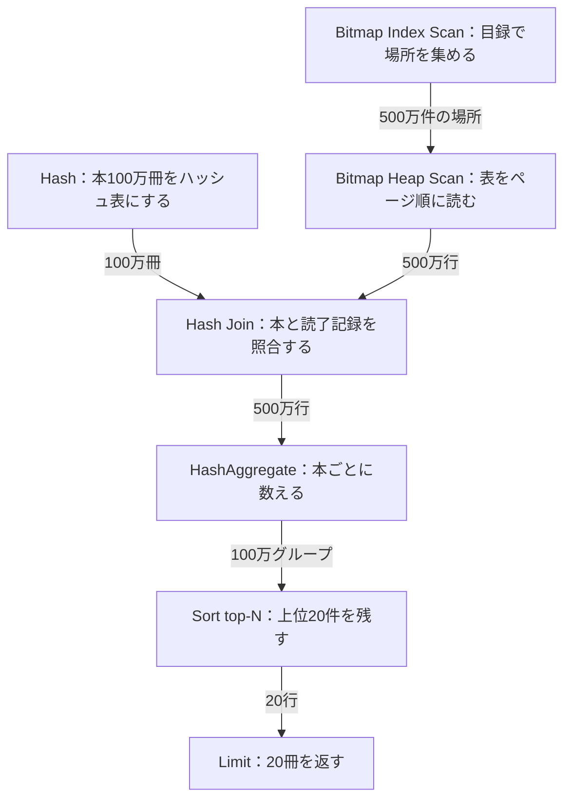
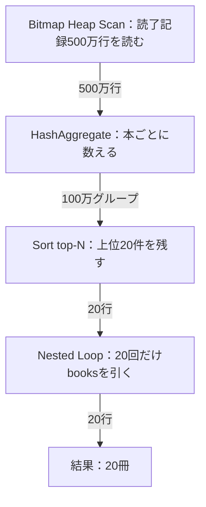

## はじめに

序章のランキングは、20冊を返すまでに約4.6秒かかっていました。
本を探す仕組み、目録の中身、並べ替え、上位k件だけを残す並べ方、二つの表を組み合わせる仕組み、数える仕組み。
第1章から第6章で、この部品を一つずつ確かめてきました。

この章では、序章のランキングのSQLに戻ります。
7段に積み重なった実行計画を、下から上まで最初から最後まで読み、どの段に何秒かかっているかを出します。
今週の記録を探すところ、本ごとに数えるところ、結果を順位順に並べるところ、どこに時間がかかっているかという序章の問いに、ここで答えます。

内訳が分かったら、3つの改善案を予想してから測ります。
目録を足す、SQLを書き直す、集計結果を保存する。
序章で二人が挙げていた案を実測で確かめ、どれを選ぶかを判断します。
最後に、本全体で身につけたことと、この先の学びをまとめます。

:::message
サービスと会話は架空です。以下の出力と数値は、サンプルデータを使って実際に計測した値です。序章の4.6秒はHomebrew版PostgreSQL 18.3、読了記録に目録がない環境で測った値でした。この章はDockerのPostgreSQL 18.6、`finished_at` の目録がある環境で測っていて、条件が違います。
:::

## 序章のランキングをもう一度測る

友人たちのサービスは、この6章のあいだにいくつも目録が増えました。
読了記録は序章と同じ2,000万件で、`finished_at` と `book_id` にはそれぞれ目録があります。
二人は、序章で見た「今週よく読まれた本」のランキングSQLに、もう一度 `EXPLAIN ANALYZE` を付けて実行してみることにしました。

```sql
EXPLAIN ANALYZE
SELECT b.id, b.title, count(*) AS read_count
FROM books AS b
JOIN reading_records AS r ON r.book_id = b.id
WHERE r.finished_at >= timestamp '2026-09-14'
  AND r.finished_at < timestamp '2026-09-21'
GROUP BY b.id, b.title
ORDER BY read_count DESC, b.id ASC
LIMIT 20;
```

3回実行した2回目の出力です。

```text
 Limit  (cost=364257.74..364257.79 rows=20 width=38) (actual time=5390.015..5390.020 rows=20.00 loops=1)
   Buffers: shared hit=2 read=121222
   ->  Sort  (cost=364257.74..366757.74 rows=1000000 width=38) (actual time=5390.013..5390.017 rows=20.00 loops=1)
         Sort Key: (count(*)) DESC, b.id
         Sort Method: top-N heapsort  Memory: 26kB
         Buffers: shared hit=2 read=121222
         ->  HashAggregate  (cost=327648.10..337648.10 rows=1000000 width=38) (actual time=5067.508..5303.584 rows=1000000.00 loops=1)
               Group Key: b.id
               Batches: 1  Memory Usage: 98329kB
               Buffers: shared hit=2 read=121222
               ->  Hash Join  (cost=105096.39..302356.91 rows=5058239 width=30) (actual time=434.021..3681.418 rows=4999999.00 loops=1)
                     Hash Cond: (r.book_id = b.id)
                     Buffers: shared hit=2 read=121222
                     ->  Bitmap Heap Scan on reading_records r  (cost=75243.39..259225.97 rows=5058239 width=8) (actual time=235.873..778.474 rows=4999999.00 loops=1)
                           Recheck Cond: ((finished_at >= '2026-09-14 00:00:00'::timestamp without time zone) AND (finished_at < '2026-09-21 00:00:00'::timestamp without time zone))
                           Heap Blocks: exact=108109
                           Buffers: shared hit=2 read=113869
                           ->  Bitmap Index Scan on reading_records_finished_at_idx  (cost=0.00..73978.83 rows=5058239 width=0) (actual time=222.883..222.884 rows=4999999.00 loops=1)
                                 Index Cond: ((finished_at >= '2026-09-14 00:00:00'::timestamp without time zone) AND (finished_at < '2026-09-21 00:00:00'::timestamp without time zone))
                                 Index Searches: 1
                                 Buffers: shared hit=2 read=5760
                     ->  Hash  (cost=17353.00..17353.00 rows=1000000 width=30) (actual time=198.015..198.015 rows=1000000.00 loops=1)
                           Buckets: 1048576  Batches: 1  Memory Usage: 69607kB
                           Buffers: shared read=7353
                           ->  Seq Scan on books b  (cost=0.00..17353.00 rows=1000000 width=30) (actual time=0.138..55.447 rows=1000000.00 loops=1)
                                 Buffers: shared read=7353
 Planning:
   Buffers: shared hit=5 read=16
 Planning Time: 0.361 ms
 Execution Time: 5392.609 ms
(30 rows)
```

「7段も積み重なってる」

「Limitから下のSeq Scanまで、下から順に読んでいけばいいんだよね」

「時間はさっきより少し縮んで、5.4秒くらいか」

`Execution Time` は5392.609ms、約5.4秒でした。
Limitの下にSort、その下にHashAggregate、Hash Join、Bitmap Heap Scan(とBitmap Index Scan)、Hash(とSeq Scan on books)と、7つのノードが積み重なっています。
この7段を、下から順に読んでいきます。

:::details 計測条件と生の時間
2026年9月21日、Apple SiliconのmacOSで、Dockerの `postgres:18`(PostgreSQL 18.6)を使用しました。

設定は `max_parallel_workers_per_gather = 0`、`jit = off`、`work_mem = '64MB'` です。`shared_buffers` は既定の128MBのままです。

| 実行 | Execution Time |
| --- | --- |
| 1回目 | 5863.603 ms |
| 2回目 | 5392.609 ms |
| 3回目 | 5340.072 ms |

生ログは `_drafts/sql-data-structures/experiments/results/ch07-ranking-docker-pg18-20260921.txt` に保存しています。
:::

## 実行計画を下から上へ読む

いちばん下のノードから見ていきます。

`Bitmap Index Scan on reading_records_finished_at_idx` は、`finished_at` の目録を使って、条件に合う行がどこにあるかをまとめて集めるノードです。
2回目の実行では222.884msで終わっています。

その上の `Bitmap Heap Scan` は、目録で行の場所を集めてから、表のページ順に読む読み方です。
第5章では名前だけ触れていましたが、ここで実際の動きを見ます。
778.474msで終わり、`rows=4999999.00` と、対象週の4,999,999件をすべて読んでいます。

次は `Hash` です。
`Seq Scan on books` で読んだ100万冊を、ハッシュ表に積みます。
Buckets 1,048,576、Memory Usage 69,607kB、198.015msで終わります。
`Bitmap Heap Scan` と `Hash` は、どちらも `Hash Join` への二つの入力で、並行して進む作業です。

`Hash Join` は、読了記録500万行を、`Hash` に積んだ本と1行ずつ照合します。
`rows=4999999.00` のまま、`b.id` の列が付いて出てきます。
3681.418msで終わります。

`HashAggregate` は `b.id` ごとに `count(*)` を数えます。
Memory Usage 98,329kBで100万グループに集約され、`rows=1000000.00` になります。
5303.584msで終わります。

最後の2段、`Sort` と `Limit` です。
`Sort Method: top-N heapsort  Memory: 26kB` と、第5章で見た並べ方で上位20件だけを残します。
5390.017msで終わり、`Limit` がその20行をそのまま返して5390.020ms、全体の `Execution Time` は5392.609msです。

各ノードの2つ目の `actual time`(そのノードが終わった時刻)から、直前に終わった仕事の時刻を引くと、そのノードだけにかかった、おおよその時間が分かります。
たとえば数える仕事は、`HashAggregate` が終わった5303.584msから、`Hash Join` が終わった3681.418msを引いた、約1.62秒です。
探す(`Bitmap Heap Scan`)とハッシュ表を作る(`Hash`)は、どちらも `Hash Join` への入力で、0ミリ秒から並行して始まるので、終わった時刻がそのままおおよその時間になります。

| 仕事 | ノード | 終わった時刻 | 内訳(おおよそ) |
| --- | --- | --- | --- |
| 探す | Bitmap Heap Scan | 778.474 ms | 約0.78秒 |
| ハッシュ表を作る | Hash | 198.015 ms | 約0.20秒 |
| 組み合わせる | Hash Join | 3681.418 ms | 約2.90秒 |
| 数える | HashAggregate | 5303.584 ms | 約1.62秒 |
| 並べる | Sort | 5390.017 ms | 約0.09秒 |

内訳を単純に足すと約5.59秒になり、`Execution Time` の5.39秒より多くなります。
探すとハッシュ表を作る仕事は並行して進むので、そのまま足すと重複するためです。

行の流れを図にします。



500万行がHash Joinで本と組み合わされ、HashAggregateで100万グループに集約され、Sortで20件に絞られてから返っていることが図から分かります。

序章では、今週の記録を探すところ、本ごとに数えるところ、結果を順位順に並べるところの、どこに時間がかかっているかを尋ねました。
組み合わせると数えるを合わせると約4.5秒で、全体のおよそ8割を占めています。
探す時間は約0.8秒、並べる時間は約0.1秒でした。
二人が予想していた探す・数える・並べるの3つに加えて、本と読了記録を組み合わせる仕事も、大きな部分を占めていました。

## どの案がいちばん効くか

「組み合わせと数えるだけで8割か」

「序章で出てた案、目録を足す、SQLを書き直す、集計結果を保存する、のどれが効くと思う」

「内訳を見たいまなら、目録より書き直しの方が効きそうな気がするけど」

「集計結果を保存する案は、鮮度の心配があったよね」

序章で二人が挙げていた3つの案を、この章で順番に試します。
`finished_at` と `book_id` の両方に目録を足す案、先に数えてから本と組み合わせるようSQLを書き直す案、週ごとの集計結果を表に保存しておく案です。
内訳を見たいま、どれがいちばん効くと思いますか。

## 案1 目録を足す

まず、目録がどれだけ効いているかを確かめます。
`enable_bitmapscan` と `enable_indexscan` を `off` にすると、目録を使わせずに、序章のときと同じ `Seq Scan` の形を再現できます。
第6章の `enable_hashjoin` と同じく、PostgreSQLに計画を選ばせないための実験用の設定です。

```sql
SET enable_bitmapscan = off;
SET enable_indexscan = off;
EXPLAIN ANALYZE
SELECT b.id, b.title, count(*) AS read_count
FROM books AS b
JOIN reading_records AS r ON r.book_id = b.id
WHERE r.finished_at >= timestamp '2026-09-14'
  AND r.finished_at < timestamp '2026-09-21'
GROUP BY b.id, b.title
ORDER BY read_count DESC, b.id ASC
LIMIT 20;
```

```text
SET
SET
                                                                                   QUERY PLAN                                                                                   
--------------------------------------------------------------------------------------------------------------------------------------------------------------------------------
 Limit  (cost=513140.77..513140.82 rows=20 width=38) (actual time=5454.608..5454.614 rows=20.00 loops=1)
   Buffers: shared hit=16180 read=99282
   ->  Sort  (cost=513140.77..515640.77 rows=1000000 width=38) (actual time=5454.607..5454.611 rows=20.00 loops=1)
         Sort Key: (count(*)) DESC, b.id
         Sort Method: top-N heapsort  Memory: 26kB
         Buffers: shared hit=16180 read=99282
         ->  HashAggregate  (cost=476531.13..486531.13 rows=1000000 width=38) (actual time=5128.300..5366.477 rows=1000000.00 loops=1)
               Group Key: b.id
               Batches: 1  Memory Usage: 98329kB
               Buffers: shared hit=16180 read=99282
               ->  Hash Join  (cost=29853.00..451239.93 rows=5058239 width=30) (actual time=198.719..3737.320 rows=4999999.00 loops=1)
                     Hash Cond: (r.book_id = b.id)
                     Buffers: shared hit=16180 read=99282
                     ->  Seq Scan on reading_records r  (cost=0.00..408109.00 rows=5058239 width=8) (actual time=0.009..855.916 rows=4999999.00 loops=1)
                           Filter: ((finished_at >= '2026-09-14 00:00:00'::timestamp without time zone) AND (finished_at < '2026-09-21 00:00:00'::timestamp without time zone))
                           Rows Removed by Filter: 15000001
                           Buffers: shared hit=16180 read=91929
                     ->  Hash  (cost=17353.00..17353.00 rows=1000000 width=30) (actual time=198.570..198.571 rows=1000000.00 loops=1)
                           Buckets: 1048576  Batches: 1  Memory Usage: 69607kB
                           Buffers: shared read=7353
                           ->  Seq Scan on books b  (cost=0.00..17353.00 rows=1000000 width=30) (actual time=0.108..55.417 rows=1000000.00 loops=1)
                                 Buffers: shared read=7353
 Planning:
   Buffers: shared hit=5 read=16
 Planning Time: 0.298 ms
 Execution Time: 5456.854 ms
(26 rows)
```

```sql
RESET enable_bitmapscan;
RESET enable_indexscan;
```

```text
RESET
RESET
```

`Seq Scan on reading_records` が855.916msで終わり、`Execution Time` は5456.854ms、約5.46秒です。
`finished_at` の目録がある、いまの状態の5.39秒と比べても、差は0.1秒足らずでした。

もう一段進めて、`finished_at` と `book_id` をまとめた目録を作ったらどうなるでしょうか。
`VACUUM ANALYZE` で統計情報と可視性マップを整えてから、`BEGIN` と `ROLLBACK` で挟んで試し、目録は残しません。

```sql
VACUUM ANALYZE reading_records;
BEGIN;
CREATE INDEX reading_records_finished_at_book_id_idx ON reading_records (finished_at, book_id);
EXPLAIN ANALYZE
SELECT b.id, b.title, count(*) AS read_count
FROM books AS b
JOIN reading_records AS r ON r.book_id = b.id
WHERE r.finished_at >= timestamp '2026-09-14'
  AND r.finished_at < timestamp '2026-09-21'
GROUP BY b.id, b.title
ORDER BY read_count DESC, b.id ASC
LIMIT 20;
SELECT relname, relpages, pg_size_pretty(pg_relation_size(oid)) AS size FROM pg_class WHERE relname = 'reading_records_finished_at_book_id_idx';
ROLLBACK;
```

```text
VACUUM
BEGIN
CREATE INDEX
                                                                                                  QUERY PLAN                                                                                                  
--------------------------------------------------------------------------------------------------------------------------------------------------------------------------------------------------------------
 Limit  (cost=283973.76..283973.81 rows=20 width=38) (actual time=5540.840..5540.846 rows=20.00 loops=1)
   Buffers: shared hit=4944075 read=26512
   ->  Sort  (cost=283973.76..286473.76 rows=1000000 width=38) (actual time=5540.838..5540.842 rows=20.00 loops=1)
         Sort Key: (count(*)) DESC, b.id
         Sort Method: top-N heapsort  Memory: 26kB
         Buffers: shared hit=4944075 read=26512
         ->  HashAggregate  (cost=247364.12..257364.12 rows=1000000 width=38) (actual time=5222.496..5453.063 rows=1000000.00 loops=1)
               Group Key: b.id
               Batches: 1  Memory Usage: 98329kB
               Buffers: shared hit=4944075 read=26512
               ->  Hash Join  (cost=29853.56..222921.79 rows=4888466 width=30) (actual time=213.881..3821.783 rows=4999999.00 loops=1)
                     Hash Cond: (r.book_id = b.id)
                     Buffers: shared hit=4944075 read=26512
                     ->  Index Only Scan using reading_records_finished_at_book_id_idx on reading_records r  (cost=0.56..179740.56 rows=5077400 width=8) (actual time=0.028..870.407 rows=4999999.00 loops=1)
                           Index Cond: ((finished_at >= '2026-09-14 00:00:00'::timestamp without time zone) AND (finished_at < '2026-09-21 00:00:00'::timestamp without time zone))
                           Heap Fetches: 0
                           Index Searches: 1
                           Buffers: shared hit=4944075 read=19159
                     ->  Hash  (cost=17353.00..17353.00 rows=1000000 width=30) (actual time=213.695..213.696 rows=1000000.00 loops=1)
                           Buckets: 1048576  Batches: 1  Memory Usage: 69607kB
                           Buffers: shared read=7353
                           ->  Seq Scan on books b  (cost=0.00..17353.00 rows=1000000 width=30) (actual time=0.114..57.022 rows=1000000.00 loops=1)
                                 Buffers: shared read=7353
 Planning:
   Buffers: shared hit=20 read=16 dirtied=2
 Planning Time: 8.112 ms
 Execution Time: 5542.512 ms
(27 rows)

                 relname                 | relpages |  size  
-----------------------------------------+----------+--------
 reading_records_finished_at_book_id_idx |    76998 | 602 MB
(1 row)

ROLLBACK
```

目録は76,998ページ、602MBになりました。
`reading_records` 本体の845MBに迫る大きさです。
`Index Only Scan using reading_records_finished_at_book_id_idx` と、`Heap Fetches: 0` が出ています。
目録の列だけで条件と行を確認でき、表のページを読みに行かずに済んだという意味です。

> PostgreSQLではテーブルのヒープの各ページについて、そのページに格納されているすべての行が、十分に古く、すべての現在および将来のトランザクションに対して可視であるかどうかを追跡しています。この情報はテーブルの可視性マップのビットに格納されます。インデックスオンリースキャンでは、候補となるインデックスのエントリを見つけた後、対応するヒープページの可視性マップのビットを検査します。それがセットされていれば、行が可視であることがわかるので、それ以上の作業をすることなく、データを返すことができます。
> ─ [PostgreSQL 18 文書 11.9 インデックスオンリースキャンとカバリングインデックス](https://www.postgresql.jp/document/18/html/indexes-index-only-scans.html)

先に実行した `VACUUM ANALYZE` が、この可視性マップを整えていました。
`Heap Fetches: 0` になったのはそのおかげです。
それでも `Execution Time` は5542.512ms、約5.54秒で、目録なしのときとほとんど変わりません。
`Hash Join` は3821.783ms、`HashAggregate` は5453.063msで終わっていて、組み合わせと数えるにかかる時間は目録があってもなくても同じです。

目録が効くのは、探す約0.8秒の部分だけです。
時間の大半を占める組み合わせと数えるには、目録は効きません。

## 案2 数えてから組み合わせる

目録では時間の大半に届かないなら、SQLの形そのものを変えられないでしょうか。
いまのSQLは、500万件の読了記録と100万冊の本をすべて組み合わせてから、本ごとに数えています。
先に読了記録だけを本ごとに数え、上位20冊を選んでから、その20冊だけ本と組み合わせれば、組み合わせる行を大きく減らせるはずです。

```sql
EXPLAIN ANALYZE
SELECT b.id, b.title, c.read_count
FROM (
  SELECT book_id, count(*) AS read_count
  FROM reading_records
  WHERE finished_at >= timestamp '2026-09-14'
    AND finished_at < timestamp '2026-09-21'
  GROUP BY book_id
  ORDER BY read_count DESC, book_id ASC
  LIMIT 20
) AS c
JOIN books AS b ON b.id = c.book_id
ORDER BY c.read_count DESC, b.id ASC;
```

2回目の出力です。

```text
 Nested Loop  (cost=323074.58..323243.25 rows=20 width=38) (actual time=2123.108..2123.136 rows=20.00 loops=1)
   Buffers: shared hit=77 read=113874
   ->  Limit  (cost=323074.15..323074.20 rows=20 width=16) (actual time=2123.037..2123.041 rows=20.00 loops=1)
         Buffers: shared hit=2 read=113869
         ->  Sort  (cost=323074.15..325661.54 rows=1034956 width=16) (actual time=2123.036..2123.038 rows=20.00 loops=1)
               Sort Key: (count(*)) DESC, reading_records.book_id
               Sort Method: top-N heapsort  Memory: 26kB
               Buffers: shared hit=2 read=113869
               ->  HashAggregate  (cost=285184.79..295534.35 rows=1034956 width=16) (actual time=1962.637..2061.429 rows=1000000.00 loops=1)
                     Group Key: reading_records.book_id
                     Batches: 1  Memory Usage: 73753kB
                     Buffers: shared hit=2 read=113869
                     ->  Bitmap Heap Scan on reading_records  (cost=75527.79..259797.79 rows=5077400 width=8) (actual time=187.598..695.253 rows=4999999.00 loops=1)
                           Recheck Cond: ((finished_at >= '2026-09-14 00:00:00'::timestamp without time zone) AND (finished_at < '2026-09-21 00:00:00'::timestamp without time zone))
                           Heap Blocks: exact=108109
                           Buffers: shared hit=2 read=113869
                           ->  Bitmap Index Scan on reading_records_finished_at_idx  (cost=0.00..74258.44 rows=5077400 width=0) (actual time=173.785..173.785 rows=4999999.00 loops=1)
                                 Index Cond: ((finished_at >= '2026-09-14 00:00:00'::timestamp without time zone) AND (finished_at < '2026-09-21 00:00:00'::timestamp without time zone))
                                 Index Searches: 1
                                 Buffers: shared hit=2 read=5760
   ->  Index Scan using books_pkey on books b  (cost=0.42..8.44 rows=1 width=30) (actual time=0.004..0.004 rows=1.00 loops=20)
         Index Cond: (id = reading_records.book_id)
         Index Searches: 20
         Buffers: shared hit=75 read=5
 Planning:
   Buffers: shared read=4
 Planning Time: 0.174 ms
 Execution Time: 2123.680 ms
(28 rows)
```

計画の形が変わりました。
いちばん下は `Bitmap Heap Scan` で、ここまでと同じく読了記録500万行を読みます。
その上の `HashAggregate` は、本とはまだ組み合わせず、`reading_records.book_id` だけで数えます。
Memory Usage 73,753kBで、100万グループに集約されます。
`Sort` は `top-N heapsort` で上位20件を選び、いちばん上の `Nested Loop` が、その20件だけ `books_pkey` を使って本を引きます。
`Index Searches: 20`、`loops=20` です。



本を組み合わせる相手が、100万冊のハッシュ表から、20回のIndex Scanに変わったことが図から分かります。

`Execution Time` は2123.680ms、約2.1秒です。
第6章で見たとおり、組み合わせる行が少なければNested Loopが選ばれ、100万冊分のハッシュ表を作る仕事も要りません。
組み合わせる行を500万から20に減らしたことで、時間はおよそ5.4秒から2.1秒に縮みました。
このSQLが返す20冊が元のランキングと同じかどうかは、案3と合わせて確認します。

## 案3 集計結果を保存する

序章で二人が挙げていたもう一つの案は、集計した結果をあらかじめ保存しておくことでした。
そのときは、新しい読了記録をいつ反映するかが決まらず、保留にしていました。
ここでその案を試します。

```sql
CREATE TABLE weekly_read_counts AS
SELECT book_id, count(*) AS read_count
FROM reading_records
WHERE finished_at >= timestamp '2026-09-14'
  AND finished_at < timestamp '2026-09-21'
GROUP BY book_id;
CREATE INDEX weekly_read_counts_idx ON weekly_read_counts (read_count DESC, book_id ASC);
ANALYZE weekly_read_counts;
```

```text
SELECT 1000000
CREATE INDEX
ANALYZE
```

作成には1,982.816ミリ秒、約2秒かかりました。
続く目録の作成は329.790ミリ秒、`ANALYZE` は30.993ミリ秒です。

```sql
SELECT count(*) AS book_rows, pg_size_pretty(pg_relation_size('weekly_read_counts')) AS size FROM weekly_read_counts;
```

```text
 book_rows | size  
-----------+-------
   1000000 | 43 MB
(1 row)
```

`weekly_read_counts` は100万行、43MBです。
本1冊につき1行、その週の `read_count` を持つだけの小さな表です。
この表からランキングを引きます。

```sql
EXPLAIN ANALYZE
SELECT b.id, b.title, c.read_count
FROM weekly_read_counts AS c
JOIN books AS b ON b.id = c.book_id
ORDER BY c.read_count DESC, b.id ASC
LIMIT 20;
```

2回目の出力です。

```text
 Limit  (cost=0.85..11.48 rows=20 width=38) (actual time=0.007..0.035 rows=20.00 loops=1)
   Buffers: shared hit=103
   ->  Nested Loop  (cost=0.85..531390.56 rows=1000000 width=38) (actual time=0.006..0.033 rows=20.00 loops=1)
         Buffers: shared hit=103
         ->  Index Only Scan using weekly_read_counts_idx on weekly_read_counts c  (cost=0.42..48390.62 rows=1000000 width=16) (actual time=0.004..0.010 rows=20.00 loops=1)
               Heap Fetches: 20
               Index Searches: 1
               Buffers: shared hit=23
         ->  Index Scan using books_pkey on books b  (cost=0.42..0.48 rows=1 width=30) (actual time=0.001..0.001 rows=1.00 loops=20)
               Index Cond: (id = c.book_id)
               Index Searches: 20
               Buffers: shared hit=80
 Planning:
   Buffers: shared hit=9
 Planning Time: 0.060 ms
 Execution Time: 0.042 ms
(16 rows)
```

`Index Only Scan using weekly_read_counts_idx` が、`read_count DESC, book_id ASC` の順に並んだ目録から先頭20件を読み、`Nested Loop` が `books_pkey` で20回だけ題名を引きます。
`Execution Time` は0.042ms、ミリ秒に満たない速さです。

実際に返ってきた20冊を見ておきます。

```sql
SELECT b.id, b.title, c.read_count
FROM weekly_read_counts AS c
JOIN books AS b ON b.id = c.book_id
ORDER BY c.read_count DESC, b.id ASC
LIMIT 20;
```

```text
 id  |     title      | read_count 
-----+----------------+------------
  17 | 実験用の本 17  |          6
  23 | 実験用の本 23  |          6
  32 | 実験用の本 32  |          6
  38 | 実験用の本 38  |          6
  40 | 実験用の本 40  |          6
  46 | 実験用の本 46  |          6
  54 | 実験用の本 54  |          6
  61 | 実験用の本 61  |          6
  63 | 実験用の本 63  |          6
  69 | 実験用の本 69  |          6
  77 | 実験用の本 77  |          6
  84 | 実験用の本 84  |          6
  92 | 実験用の本 92  |          6
 107 | 実験用の本 107 |          6
 115 | 実験用の本 115 |          6
 130 | 実験用の本 130 |          6
 146 | 実験用の本 146 |          6
 161 | 実験用の本 161 |          6
 169 | 実験用の本 169 |          6
 184 | 実験用の本 184 |          6
(20 rows)
```

id17から184まで、`read_count` 6の20冊です。
案2で書き直したSQLも、同じ `reading_records` を `book_id` ごとに数えているので、この20冊と一致します。

3つの案の時間をまとめます。

| 案 | やったこと | 時間 |
| --- | --- | --- |
| 案1 目録を足す | `(finished_at, book_id)` の目録、Index Only Scan | 約5.54秒 |
| 案2 書き直す | 先に数えてから20冊だけ組み合わせる | 約2.1秒 |
| 案3 保存する | `weekly_read_counts` を作って引く | 0.042ミリ秒 |

案3は突出して速い一方、代償もあります。
`weekly_read_counts` は作った瞬間の集計で止まっていて、新しい読了記録が増えても自動では更新されません。
いつ作り直すか、誰がその作り直しの仕事を負うかを、案2にはなかった形で設計する必要があります。
速さの代わりに、いつ計算するかを設計する案です。

## 推定と実測を見比べる

ここまでの計画には、`rows` という見積もりも並んでいました。
実測とどれだけ近かったかを見ます。

```sql
EXPLAIN SELECT count(*) FROM reading_records WHERE finished_at >= timestamp '2026-09-14' AND finished_at < timestamp '2026-09-21';
SELECT count(*) AS actual_rows FROM reading_records WHERE finished_at >= timestamp '2026-09-14' AND finished_at < timestamp '2026-09-21';
```

```text
 Aggregate  (cost=137725.94..137725.95 rows=1 width=8)
   ->  Index Only Scan using reading_records_finished_at_idx on reading_records  (cost=0.44..125032.44 rows=5077400 width=0)
         Index Cond: ((finished_at >= '2026-09-14 00:00:00'::timestamp without time zone) AND (finished_at < '2026-09-21 00:00:00'::timestamp without time zone))
(3 rows)

 actual_rows 
-------------
     4999999
(1 row)
```

1週間分の読了記録は、`rows=5077400` という見積もりに対し、実測は4,999,999件でした。
最初のランキングの `HashAggregate` も、見積もり `rows=1000000` に対し、実測は `rows=1000000.00` で一致しています。

> 「actual time」値は実時間をミリ秒単位で表されていること、cost推定値は何らかの単位で表されていることに注意してください。ですからそのまま比較することはできません。注目すべきもっとも重要な点は通常、推定行数が実際の値と合理的に近いかどうかです。
> ─ [PostgreSQL 18 文書 14.1.2 EXPLAIN ANALYZE](https://www.postgresql.jp/document/18/html/using-explain.html)

第1章でも読んだこの基準に照らすと、今回の見積もりはどちらもほぼ合っていたことになります。
見積もりの元になる統計情報は、`ANALYZE` が集めています。

> ほとんどの問い合わせは、検証される行を制限するWHERE句によって、テーブル内の行の一部のみを取り出します。したがって、プランナはWHERE句の選択性、つまりWHERE句の各条件にどれだけの行が一致するかを推定する必要があります。この処理に使用される情報はpg_statisticシステムカタログ内に格納されます。pg_statistic内の項目は、ANALYZEとVACUUM ANALYZEコマンドによって更新され、また１から更新がかかったとしても常に概算値になります。
> ─ [PostgreSQL 18 文書 14.2 プランナで使用される統計情報](https://www.postgresql.jp/document/18/html/planner-stats.html)

統計情報は概算なので、見積もりが実測とずれることもあります。
第5章では、目録を使った並べ替えの実行時間が28,297.474ms、約28秒になり、見積もりよりずっと長くかかっていました。
あのときは行数の見積もりがずれていたのではなく、目録経由で表をランダムに読むコストを、プランナが実際より低く見積もっていたことになります。
今回のように行数の見積もりが近いときでも、コストの見積もりまで正しいとは限りません。

序章から続けてきたのは、仮説を立て、条件を一つ変えて測り、見積もりと実測を比べるという手順です。
`ANALYZE` で統計情報を更新し、`EXPLAIN ANALYZE` で見積もりと実測を並べて読む。
この2つがそろって、初めて実行計画を読んだと言えます。

## 二人の判断

「案2なら2.1秒、案3なら0.04ミリ秒か」

「でも案3は、新しい読了記録をいつ反映するかを別に考えないといけない」

「まずは案2を入れて、利用がもっと増えたら案3を検討しよう」

二人はそう決めました。
20件を表示する画面に2.1秒をどう感じるかは、サービスの規模や使われ方によって変わります。
あなたなら、案2で十分だと考えますか。
それとも、鮮度の設計まで踏み込んで案3を選びますか。

## この本で身につけたこと

序章では、SQLの動きについて仮説を立て、実験で確かめ、改善前後の違いを理由とともに説明できることを、この本で身につけたいこととして挙げていました。
第1章から第7章までの積み重ねをまとめます。

- 結果として返る件数と、結果を作るために調べる件数は別で、ページ数で仕事量を数える(第2章)
- 目録は根から葉へ降りる木構造で、本が1,000倍になっても段数はわずかしか増えない、O(log n)(第3章)
- 並べ替えの仕事は件数に比例より少し多く増え、`work_mem` に収まらなければ一時ファイルで合流する、O(n log n)(第4章)
- 上位k件だけを残す並べ方なら、全部を並べ直さずに済む(第5章)
- 組み合わせる行数に応じてNested Loop、Hash Join、Merge Joinが選ばれ、数えるときもハッシュ表が使われる(第6章)
- 見積もりと実測を比べ、ずれがあれば理由を確かめる(第7章)

## これからの学び

この本で扱わなかった話題も残っています。

- 並列読み: 第2章で保留にした、複数の作業者で1つの表を手分けして読む仕組み
- VACUUMとMVCC: 削除や更新をした行がいつ片付き、可視性マップがいつ整うかという仕組み
- Memoize: 第6章のNested Loopで、同じ値の内側を二度引かないための覚え書き
- 照合順序と前方一致: 第3章で目録が使われなかったLIKE検索を、目録で速くする方法
- 統計情報と拡張統計: 複数の列にまたがる分布まで統計情報に含める仕組み
- Index Only Scanと可視性マップ: 案1で一言だけ触れた、表を読まずに目録だけで答える条件

公式文書の[14章「性能に関するヒント」](https://www.postgresql.jp/document/18/html/performance-tips.html)にも、実行計画の読み方や、この先の学びにつながる話題がまとまっています。

実験環境を片付けるときは、コンテナを止めます。

```bash
docker stop reading-log-lab
```

もう使わないなら、削除して構いません。

```bash
docker rm -v reading-log-lab
```
